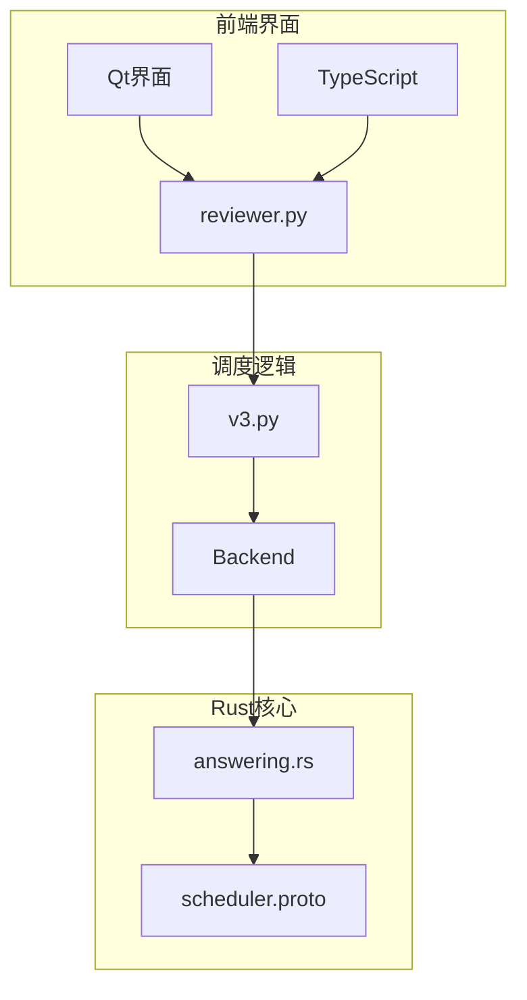
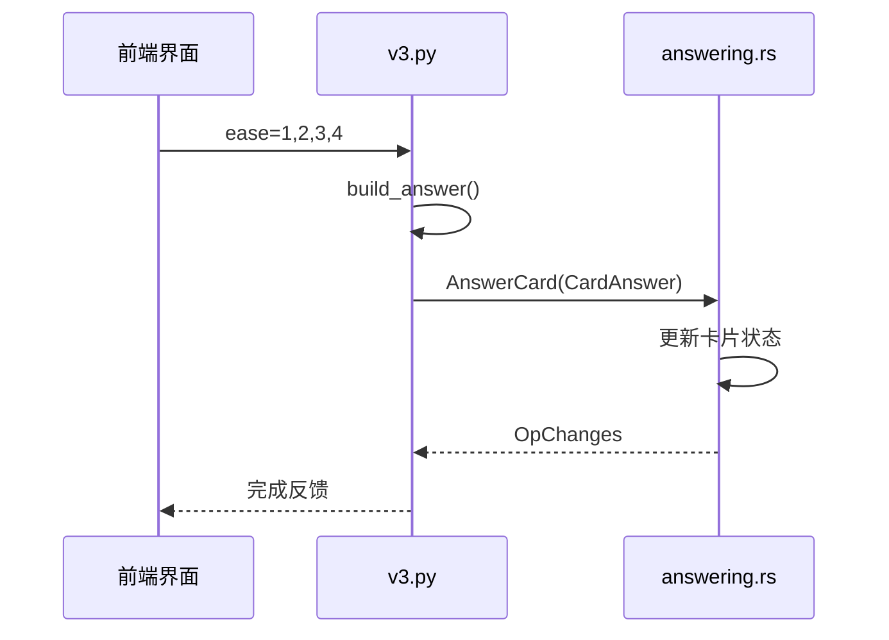
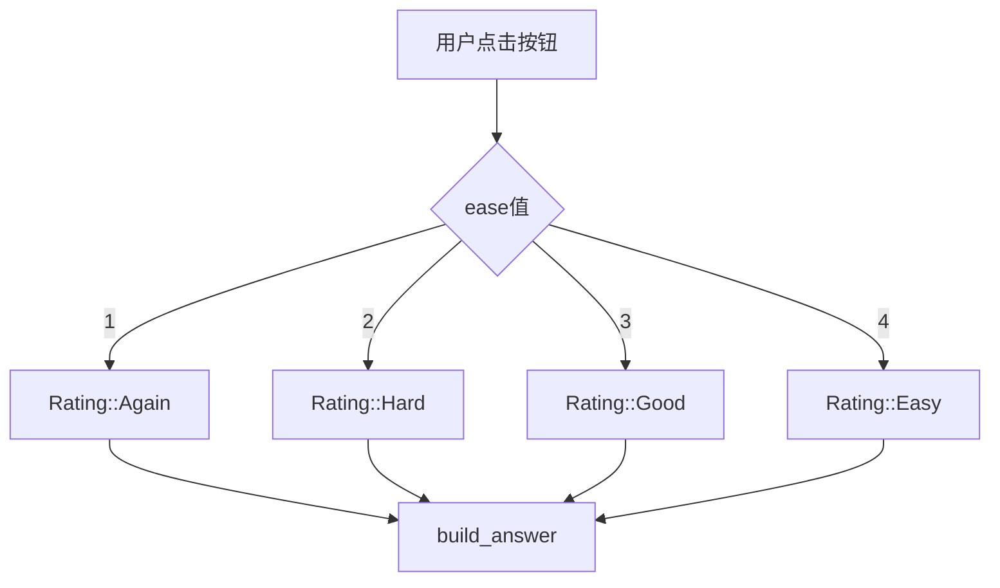
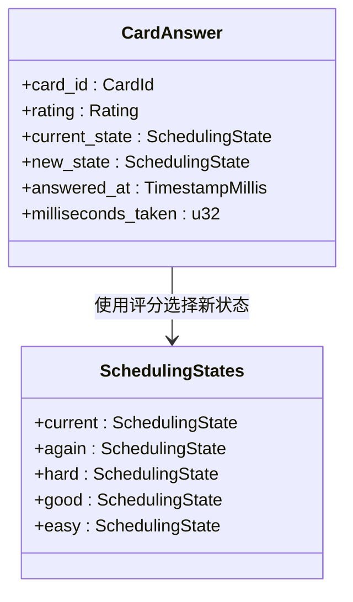
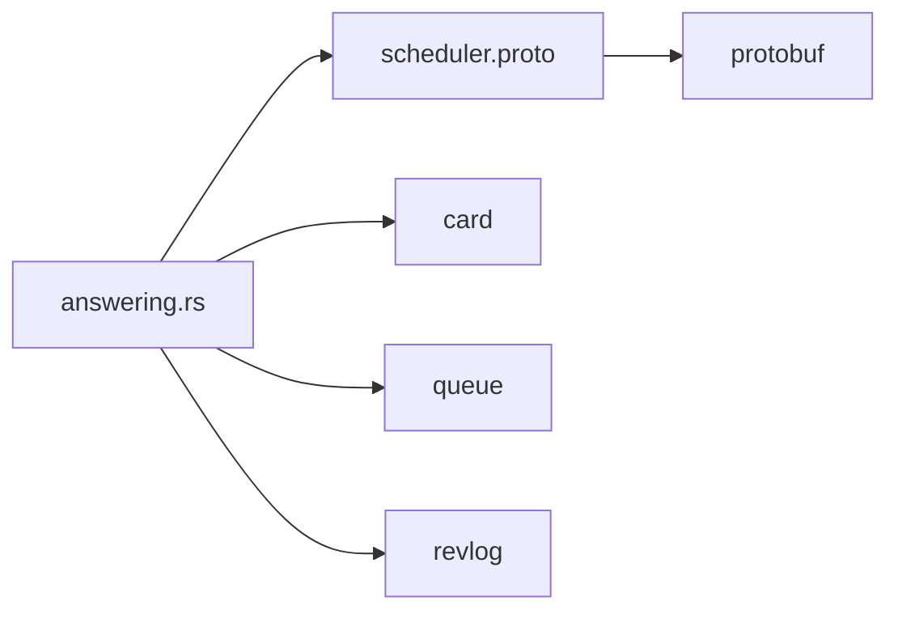

# 答案处理

<cite>
**本文档中引用的文件**  
- [answering.rs](file://rslib/src/scheduler/service/answering.rs)
- [scheduler.proto](file://proto/anki/scheduler.proto)
- [v3.py](file://pylib/anki/scheduler/v3.py)
- [reviewer.py](file://qt/aqt/reviewer.py)
</cite>

## 目录
1. [简介](#简介)
2. [项目结构](#项目结构)
3. [核心组件](#核心组件)
4. [架构概述](#架构概述)
5. [详细组件分析](#详细组件分析)
6. [依赖分析](#依赖分析)
7. [性能考虑](#性能考虑)
8. [故障排除指南](#故障排除指南)
9. [结论](#结论)

## 简介
Anki 是一款基于间隔重复算法的记忆辅助工具，其调度服务中的答案处理模块负责接收用户对卡片的反馈（如“再次”、“困难”、“良好”、“简单”），并据此更新卡片的调度状态。本文件深入解析 `answering` 模块的工作机制，涵盖评分逻辑、间隔调整、易度更新等核心流程，并说明其与调度服务其他部分的集成方式。

## 项目结构
Anki 的调度服务主要由 Rust 实现的核心逻辑与 Python/TypeScript 编写的前端交互层构成。答案处理功能分布在多个模块中，核心调度逻辑位于 `rslib/src/scheduler`，协议定义在 `proto/anki/scheduler.proto`，而用户界面交互则通过 `qt/aqt/reviewer.py` 和 `pylib/anki/scheduler/v3.py` 实现。

**图示来源**  
- [answering.rs](file://rslib/src/scheduler/service/answering.rs)
- [scheduler.proto](file://proto/anki/scheduler.proto)
- [v3.py](file://pylib/anki/scheduler/v3.py)
- [reviewer.py](file://qt/aqt/reviewer.py)

**章节来源**  
- [answering.rs](file://rslib/src/scheduler/service/answering.rs)
- [scheduler.proto](file://proto/anki/scheduler.proto)

## 核心组件
`answering` 模块是 Anki 调度服务中处理用户答案的核心部分。它接收用户选择的评分（Again, Hard, Good, Easy），结合当前卡片状态，计算出新的调度建议，包括下次复习时间、易度因子和学习步骤等。

该模块通过 `CardAnswer` 消息结构传递评分信息，并利用 `SchedulingStates` 预先计算四种评分对应的新状态，从而实现高效响应。

**章节来源**  
- [answering.rs](file://rslib/src/scheduler/service/answering.rs#L1-L70)
- [v3.py](file://pylib/anki/scheduler/v3.py#L47-L91)

## 架构概述
Anki 的答案处理流程采用前后端分离架构。前端收集用户输入后，通过 gRPC 调用后端的 `AnswerCard` 接口。后端根据评分选择预计算的状态，更新卡片数据，并记录复习日志。

**图示来源**  
- [answering.rs](file://rslib/src/scheduler/service/answering.rs)
- [v3.py](file://pylib/anki/scheduler/v3.py)
- [reviewer.py](file://qt/aqt/reviewer.py)

## 详细组件分析

### 答案评分机制分析
当用户点击“再次”、“困难”、“良好”或“简单”按钮时，前端将对应的 ease 值（1-4）传递给 `answerCard` 方法。该方法将其转换为 `CardAnswer.Rating` 枚举，并调用底层的 `answer_card` 函数。

#### 评分映射逻辑

**图示来源**  
- [v3.py](file://pylib/anki/scheduler/v3.py#L148-L185)
- [reviewer.py](file://qt/aqt/reviewer.py#L123-L132)

#### 状态转换流程
系统在展示卡片时已预先计算四种评分对应的新状态（Again, Hard, Good, Easy），存储在 `SchedulingStates` 中。当用户作答时，直接选取对应状态进行应用，避免实时计算延迟。

**图示来源**  
- [scheduler.proto](file://proto/anki/scheduler.proto#L245-L285)
- [answering.rs](file://rslib/src/scheduler/service/answering.rs)

**章节来源**  
- [answering.rs](file://rslib/src/scheduler/service/answering.rs)
- [v3.py](file://pylib/anki/scheduler/v3.py)

## 依赖分析
`answering` 模块依赖于多个核心组件：
- `scheduler.proto`：定义 gRPC 接口和消息结构
- `card` 模块：提供卡片数据访问
- `queue` 模块：管理待复习卡片队列
- `revlog` 模块：记录复习历史

**图示来源**  
- [answering.rs](file://rslib/src/scheduler/service/answering.rs)
- [scheduler.proto](file://proto/anki/scheduler.proto)

**章节来源**  
- [answering.rs](file://rslib/src/scheduler/service/answering.rs)
- [scheduler.proto](file://proto/anki/scheduler.proto)

## 性能考虑
为提升响应速度，Anki 采用预计算策略，在获取卡片时即生成四种评分对应的新状态。这避免了用户作答时的实时计算开销，确保界面流畅。此外，Rust 实现的核心逻辑保证了高并发下的稳定性能。

## 故障排除指南
### 常见问题及解决方案
- **评分无响应**：检查前端是否正确传递 ease 值，确认 `linkHandler` 中 `ease` 事件处理逻辑。
- **间隔异常**：验证 `SchedulingStates` 是否正确生成，检查 deck 配置中的间隔调整参数。
- **易度未更新**：确认 `CardAnswer` 中的 `new_state` 是否包含正确的 `ease_factor` 更新。

**章节来源**  
- [reviewer.py](file://qt/aqt/reviewer.py#L674-L702)
- [v3.py](file://pylib/anki/scheduler/v3.py)

## 结论
Anki 的答案处理机制通过前后端协同工作，实现了高效、准确的间隔重复调度。其核心在于预计算状态转换与清晰的评分映射逻辑，确保用户操作的即时反馈。理解该模块有助于优化学习策略，并为自定义调度算法提供基础。