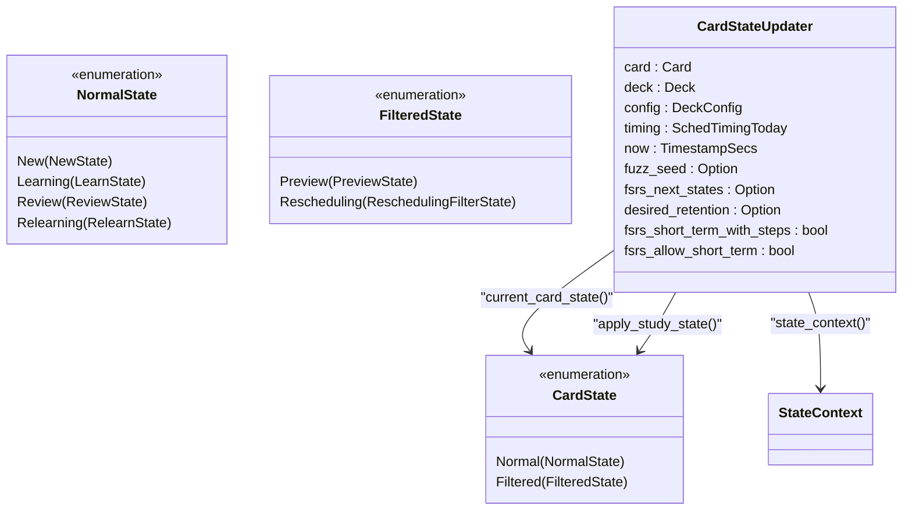
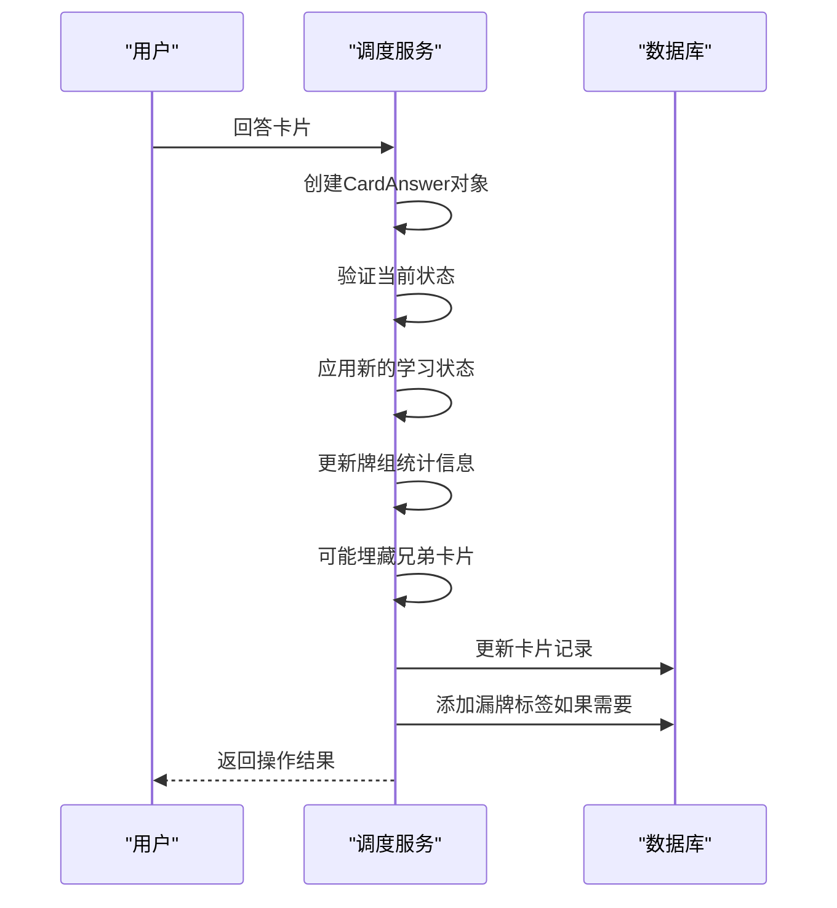
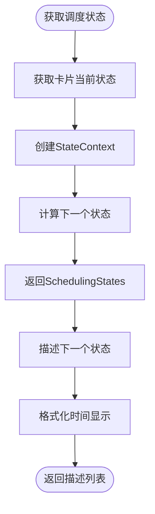

# 调度服务

<cite>
**本文档中引用的文件**  
- [service/mod.rs](file://rslib/src/scheduler/service/mod.rs)
- [service/answering.rs](file://rslib/src/scheduler/service/answering.rs)
- [service/states/mod.rs](file://rslib/src/scheduler/service/states/mod.rs)
- [answering/mod.rs](file://rslib/src/scheduler/answering/mod.rs)
- [answering/current.rs](file://rslib/src/scheduler/answering/current.rs)
- [answering/review.rs](file://rslib/src/scheduler/answering/review.rs)
- [states/mod.rs](file://rslib/src/scheduler/states/mod.rs)
- [states/review.rs](file://rslib/src/scheduler/states/review.rs)
- [mod.rs](file://rslib/src/scheduler/mod.rs)
</cite>

## 目录
1. [简介](#简介)
2. [核心功能](#核心功能)
3. [状态转换机制](#状态转换机制)
4. [用户答案处理](#用户答案处理)
5. [调度建议生成](#调度建议生成)
6. [服务模块交互](#服务模块交互)
7. [与其他核心模块集成](#与其他核心模块集成)
8. [常见问题与调试](#常见问题与调试)
9. [性能优化建议](#性能优化建议)

## 简介
Anki调度服务是Anki学习系统的核心组件，负责管理卡片的复习计划和调度逻辑。该服务实现了复杂的算法来确定卡片的最佳复习时间，确保用户能够高效地记忆学习内容。调度服务通过协调不同调度状态之间的转换、处理用户答案以及生成调度建议，为用户提供个性化的学习体验。本文档将深入解析调度服务的内部工作机制，包括其与answering模块的交互方式，以及如何与其他核心模块（如卡片、笔记、牌组）集成。

## 核心功能
调度服务的核心功能包括协调不同调度状态之间的转换、处理用户答案以及生成调度建议。这些功能通过`SchedulerService`和`BackendSchedulerService`两个主要接口实现。服务模块提供了丰富的API来管理卡片的调度状态，包括获取当前调度状态、描述下一个状态、回答卡片、升级调度器等操作。此外，服务还支持FSRS（Free Spaced Repetition Scheduler）算法的参数计算和模拟，为用户提供更精确的复习计划。

**Section sources**
- [service/mod.rs](file://rslib/src/scheduler/service/mod.rs#L1-L452)

## 状态转换机制
调度服务通过`CardState`枚举来表示卡片的不同调度状态，包括正常状态（Normal）和过滤状态（Filtered）。每种状态都有其特定的转换规则和行为。状态转换由`CardStateUpdater`结构体管理，该结构体包含了卡片、牌组、配置和时间信息等上下文数据。当用户回答卡片时，系统会根据当前状态和用户选择的评级（Again、Hard、Good、Easy）来确定下一个状态，并更新卡片的相关属性。

**Diagram sources**
- [states/mod.rs](file://rslib/src/scheduler/states/mod.rs#L1-L224)
- [answering/mod.rs](file://rslib/src/scheduler/answering/mod.rs#L1-L799)

**Section sources**
- [answering/mod.rs](file://rslib/src/scheduler/answering/mod.rs#L1-L799)
- [answering/current.rs](file://rslib/src/scheduler/answering/current.rs#L1-L139)

## 用户答案处理
用户答案处理是调度服务的关键功能之一，通过`answer_card`方法实现。当用户回答卡片时，系统会创建一个`CardAnswer`结构体，其中包含卡片ID、当前状态、新状态、评级、回答时间等信息。`answer_card_inner`方法负责处理答案的内部逻辑，包括验证当前状态、应用新的学习状态、更新牌组统计信息、可能埋藏兄弟卡片等。处理完成后，系统会更新卡片的数据库记录，并在需要时添加漏牌标签。

**Diagram sources**
- [answering/mod.rs](file://rslib/src/scheduler/answering/mod.rs#L1-L799)
- [service/answering.rs](file://rslib/src/scheduler/service/answering.rs#L1-L71)

**Section sources**
- [answering/mod.rs](file://rslib/src/scheduler/answering/mod.rs#L1-L799)
- [service/answering.rs](file://rslib/src/scheduler/service/answering.rs#L1-L71)

## 调度建议生成
调度建议生成是通过`get_scheduling_states`和`describe_next_states`方法实现的。`get_scheduling_states`方法返回卡片在不同评级下的下一个状态，而`describe_next_states`方法则将这些状态转换为用户友好的描述，显示在答案按钮上。这些方法利用`StateContext`结构体中的各种参数（如模糊因子、学习步骤、毕业间隔等）来计算下一个状态的间隔和属性。

**Diagram sources**
- [answering/mod.rs](file://rslib/src/scheduler/answering/mod.rs#L1-L799)
- [states/review.rs](file://rslib/src/scheduler/states/review.rs#L1-L395)

**Section sources**
- [answering/mod.rs](file://rslib/src/scheduler/answering/mod.rs#L1-L799)
- [states/review.rs](file://rslib/src/scheduler/states/review.rs#L1-L395)

## 服务模块交互
调度服务与answering模块通过`CardAnswer`结构体和相关方法进行交互。`CardAnswer`结构体实现了从`anki_proto::scheduler::CardAnswer`到内部表示的转换，使得前端和后端可以无缝通信。`answer_card`方法是主要的交互点，它接收用户答案并触发相应的调度逻辑。此外，服务还通过`get_scheduling_states`和`describe_next_states`方法向前端提供调度信息，以便用户界面可以正确显示答案按钮和间隔。

**Section sources**
- [service/mod.rs](file://rslib/src/scheduler/service/mod.rs#L1-L452)
- [service/answering.rs](file://rslib/src/scheduler/service/answering.rs#L1-L71)

## 与其他核心模块集成
调度服务与其他核心模块（如卡片、笔记、牌组）通过`Collection`结构体进行集成。`Collection`作为Anki的核心数据结构，提供了访问和操作这些模块的统一接口。调度服务通过`Collection`的实例来获取卡片、牌组和配置信息，并在需要时更新这些数据。例如，在处理用户答案时，调度服务会通过`Collection`来更新卡片的状态和统计信息。

**Section sources**
- [mod.rs](file://rslib/src/scheduler/mod.rs#L1-L136)
- [answering/mod.rs](file://rslib/src/scheduler/answering/mod.rs#L1-L799)

## 常见问题与调试
在使用调度服务时，可能会遇到一些常见问题，如状态转换异常、服务调用失败等。对于状态转换异常，可以检查`CardStateUpdater`的上下文数据是否正确，特别是`fuzz_seed`和`fsrs_next_states`等字段。对于服务调用失败，可以查看`OpOutput`的返回结果，以确定具体的错误原因。此外，还可以使用`transact`方法来确保操作的原子性，避免数据不一致的问题。

**Section sources**
- [answering/mod.rs](file://rslib/src/scheduler/answering/mod.rs#L1-L799)
- [service/mod.rs](file://rslib/src/scheduler/service/mod.rs#L1-L452)

## 性能优化建议
在高并发场景下，调度服务的响应性能至关重要。为了优化性能，可以采取以下措施：首先，使用`transact_no_undo`方法来避免不必要的撤销操作；其次，合理设置`fuzz_factor`以减少计算开销；最后，利用`get_fuzz_seed_for_id_and_reps`方法来生成一致的模糊种子，提高缓存命中率。此外，还可以通过异步处理和批量操作来进一步提升性能。

**Section sources**
- [answering/mod.rs](file://rslib/src/scheduler/answering/mod.rs#L1-L799)
- [service/mod.rs](file://rslib/src/scheduler/service/mod.rs#L1-L452)