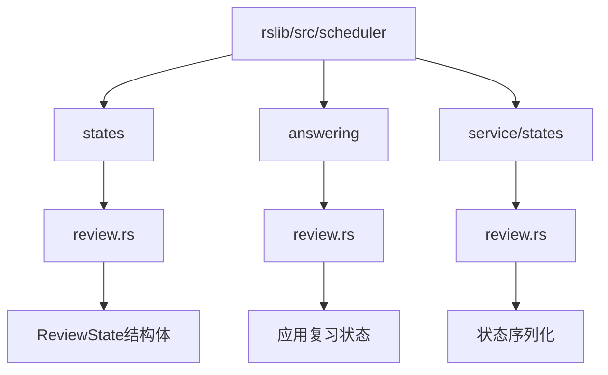
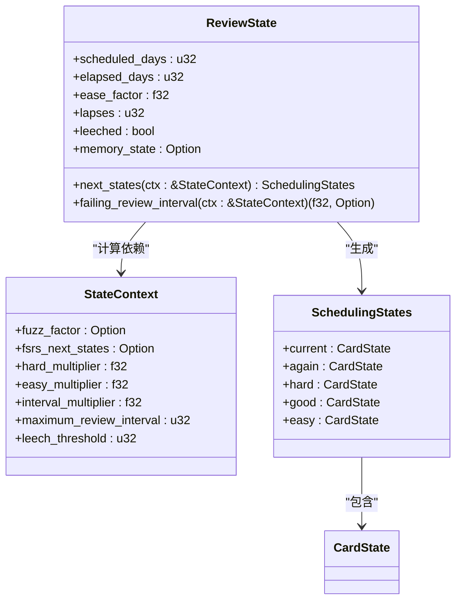
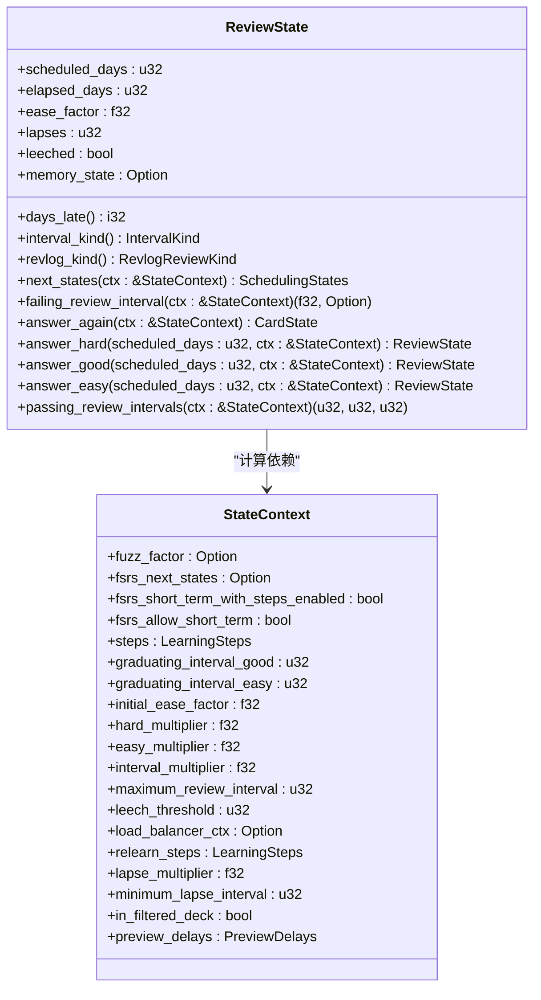
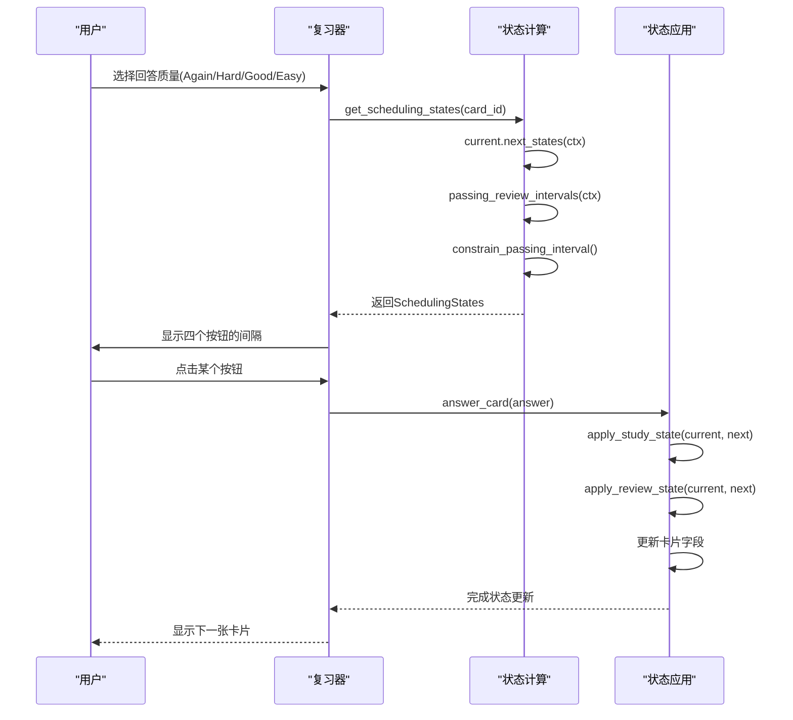
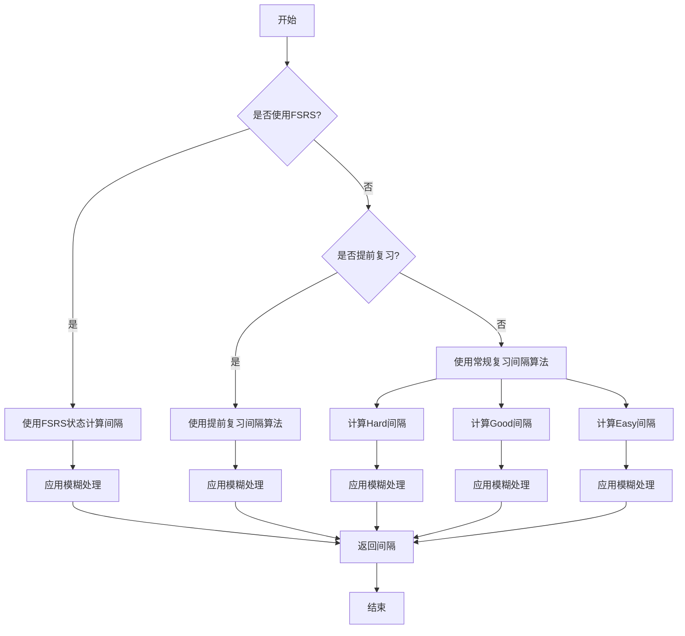
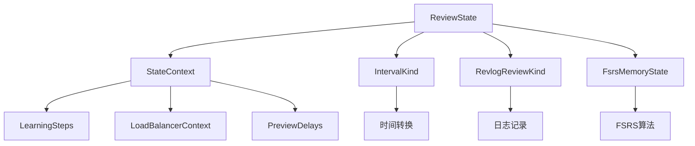

# 复习状态

<cite>
**本文档中引用的文件**  
- [review.rs](file://rslib/src/scheduler/states/review.rs)
- [review.rs](file://rslib/src/scheduler/answering/review.rs)
- [review.rs](file://rslib/src/scheduler/service/states/review.rs)
- [mod.rs](file://rslib/src/scheduler/answering/mod.rs)
- [mod.rs](file://rslib/src/scheduler/states/mod.rs)
</cite>

## 目录
1. [简介](#简介)
2. [项目结构](#项目结构)
3. [核心组件](#核心组件)
4. [架构概述](#架构概述)
5. [详细组件分析](#详细组件分析)
6. [依赖分析](#依赖分析)
7. [性能考虑](#性能考虑)
8. [故障排除指南](#故障排除指南)
9. [结论](#结论)

## 简介
本文档深入探讨Anki中复习状态的实现机制，重点分析`ReviewState`结构体在复习调度中的核心作用。文档详细解释了复习队列的构建、间隔调整算法、难度评级系统以及遗漏处理机制。特别关注`review.rs`文件中`ReviewState`结构体如何根据SM-2或FSRS算法计算下一个复习间隔，并描述了复习状态与学习状态、重新学习状态之间的转换逻辑。

## 项目结构
Anki的调度系统主要位于`rslib/src/scheduler`目录下，其中`states`子模块负责管理卡片的各种状态。复习状态相关的实现分散在多个文件中，核心逻辑位于`states/review.rs`，而状态转换和应用逻辑则分布在`answering`和`service/states`模块中。

**图示来源**
- [review.rs](file://rslib/src/scheduler/states/review.rs)
- [review.rs](file://rslib/src/scheduler/answering/review.rs)
- [review.rs](file://rslib/src/scheduler/service/states/review.rs)

**本节来源**
- [review.rs](file://rslib/src/scheduler/states/review.rs)
- [mod.rs](file://rslib/src/scheduler/states/mod.rs)

## 核心组件
`ReviewState`是Anki复习系统的核心数据结构，负责存储和管理卡片的复习相关信息。该结构体包含预定天数、经过天数、难度因子、遗漏次数等关键字段，并提供了计算不同回答质量下一次复习间隔的方法。`StateContext`结构体则提供了计算所需的各种配置参数，如间隔乘数、难度因子调整值等。

**本节来源**
- [review.rs](file://rslib/src/scheduler/states/review.rs)
- [mod.rs](file://rslib/src/scheduler/states/mod.rs)

## 架构概述
Anki的复习状态管理系统采用状态模式设计，通过`CardState`枚举统一管理卡片的各种状态。当卡片处于复习状态时，系统会根据用户的回答质量（Again、Hard、Good、Easy）计算出四种可能的下一个状态。这些状态计算基于当前的`ReviewState`和`StateContext`，并考虑了FSRS算法或传统的SM-2算法。

**图示来源**
- [review.rs](file://rslib/src/scheduler/states/review.rs)
- [mod.rs](file://rslib/src/scheduler/states/mod.rs)

## 详细组件分析

### 复习状态分析
`ReviewState`结构体是Anki复习系统的核心，它不仅存储了卡片的复习状态信息，还提供了计算不同回答质量下一次复习间隔的完整逻辑。系统根据用户选择的回答质量（1-4），分别计算出Again、Hard、Good、Easy四种可能的下一个状态。

#### 复习状态类图

**图示来源**
- [review.rs](file://rslib/src/scheduler/states/review.rs)

#### 状态转换序列图

**图示来源**
- [mod.rs](file://rslib/src/scheduler/answering/mod.rs)
- [review.rs](file://rslib/src/scheduler/answering/review.rs)

#### 复习间隔计算流程图

**图示来源**
- [review.rs](file://rslib/src/scheduler/states/review.rs)

**本节来源**
- [review.rs](file://rslib/src/scheduler/states/review.rs)
- [review.rs](file://rslib/src/scheduler/answering/review.rs)
- [mod.rs](file://rslib/src/scheduler/answering/mod.rs)

## 依赖分析
复习状态系统依赖于多个核心组件，包括状态上下文、学习步骤、间隔计算等。`StateContext`结构体作为依赖注入的容器，提供了计算所需的所有配置参数。系统还依赖于FSRS算法库来支持更先进的记忆模型计算。

**图示来源**
- [mod.rs](file://rslib/src/scheduler/states/mod.rs)
- [review.rs](file://rslib/src/scheduler/states/review.rs)

**本节来源**
- [mod.rs](file://rslib/src/scheduler/states/mod.rs)
- [review.rs](file://rslib/src/scheduler/states/review.rs)

## 性能考虑
复习状态的计算需要在用户交互的实时性要求下完成，因此性能优化至关重要。系统通过预计算所有可能的下一个状态来减少用户点击按钮时的延迟。模糊处理的随机种子基于卡片ID和复习次数生成，确保了结果的可重现性，同时避免了额外的存储开销。

## 故障排除指南
常见问题包括复习间隔计算异常、卡片难度评级不准确等。调试时应首先检查`StateContext`中的配置参数是否正确加载，特别是间隔乘数、难度因子调整值等关键参数。对于FSRS算法相关的问题，需要验证`FsrsMemoryState`是否正确初始化和更新。

**本节来源**
- [review.rs](file://rslib/src/scheduler/states/review.rs)
- [mod.rs](file://rslib/src/scheduler/answering/mod.rs)

## 结论
Anki的复习状态系统通过精心设计的状态模式和算法实现，为用户提供了一个高效、灵活的记忆管理工具。`ReviewState`结构体作为核心组件，不仅实现了传统的SM-2算法，还通过FSRS支持更先进的记忆模型。系统的模块化设计使得算法的扩展和配置的调整变得简单而安全。