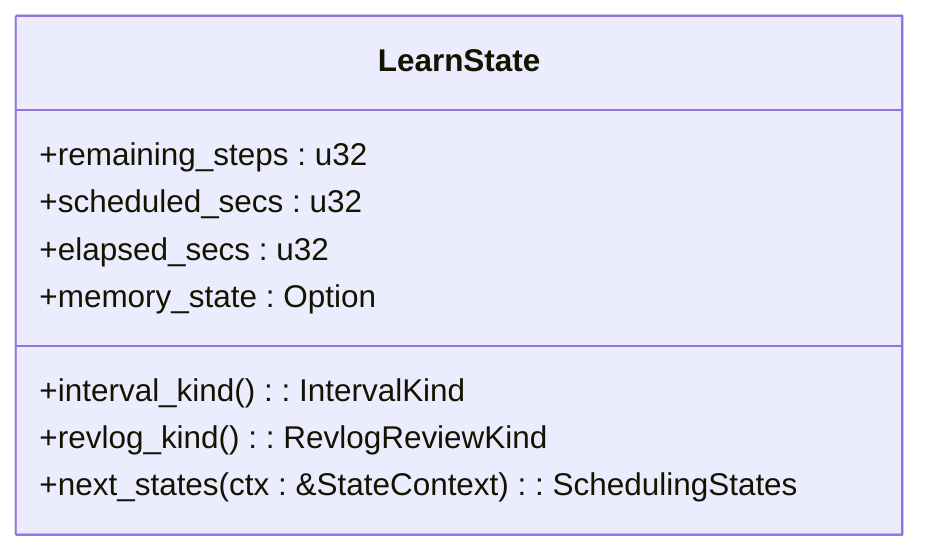
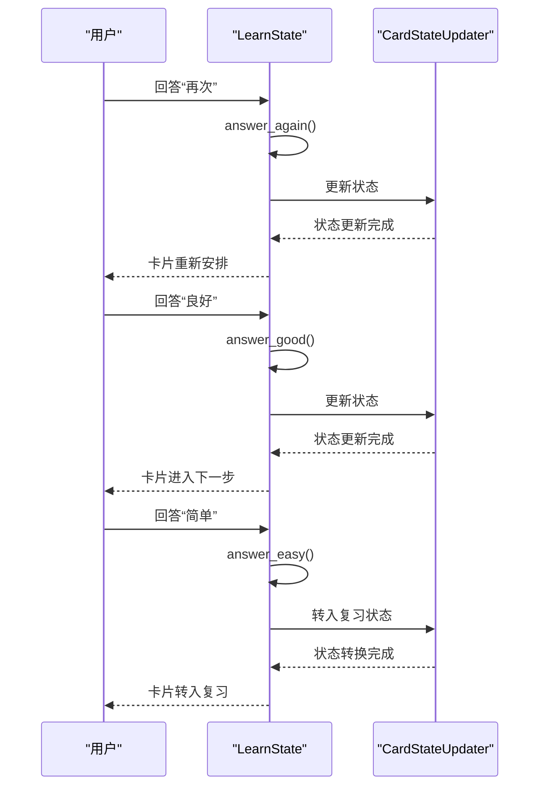
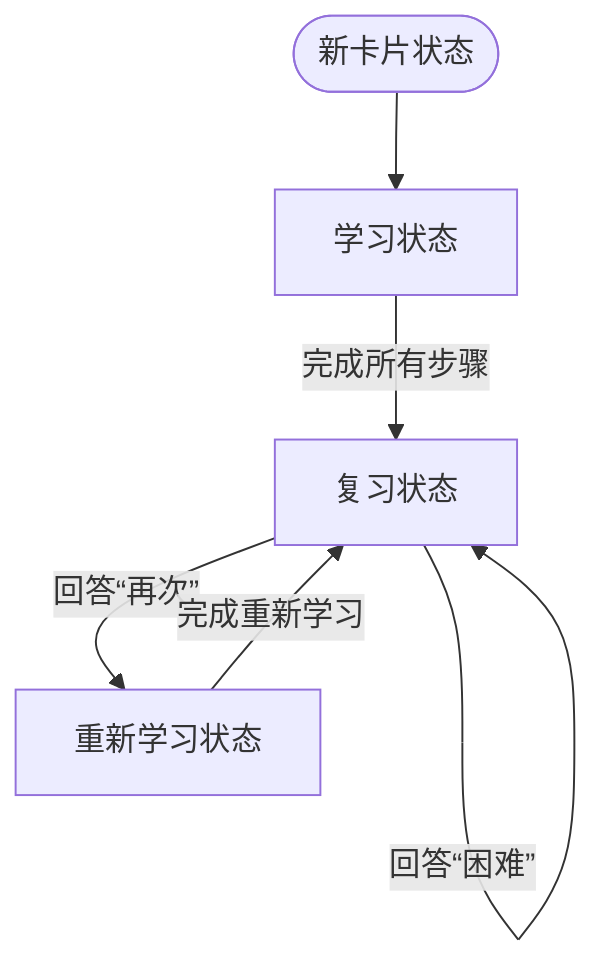

# 学习状态

<cite>
**本文档中引用的文件**  
- [learning.rs](file://rslib/src/scheduler/states/learning.rs)
- [answering/learning.rs](file://rslib/src/scheduler/answering/learning.rs)
- [service/states/learning.rs](file://rslib/src/scheduler/service/states/learning.rs)
- [states/mod.rs](file://rslib/src/scheduler/states/mod.rs)
</cite>

## 目录
1. [学习状态](#学习状态)
2. [核心组件](#核心组件)
3. [架构概述](#架构概述)
4. [详细组件分析](#详细组件分析)
5. [依赖分析](#依赖分析)
6. [性能考虑](#性能考虑)
7. [故障排除指南](#故障排除指南)
8. [结论](#结论)

## 核心组件

`LearnState` 结构体是 Anki 学习状态管理系统的核心，负责管理学习中的卡片及其后续学习计划。该结构体包含剩余步骤、计划秒数、已过秒数和记忆状态等关键属性。通过 `next_states` 方法，系统能够根据用户对卡片的回答类型（再次、困难、良好、简单）来计算下一个状态。当用户回答“再次”时，系统会重置剩余步骤并根据配置的延迟时间重新安排卡片；回答“良好”时，系统会减少剩余步骤并根据良好的延迟时间安排卡片；回答“简单”时，卡片将直接进入复习状态。学习状态与新卡片状态、复习状态之间的转换规则由 `CardStateUpdater` 类处理，确保卡片在不同状态间平滑过渡。

**Section sources**
- [learning.rs](file://rslib/src/scheduler/states/learning.rs#L0-L196)
- [answering/learning.rs](file://rslib/src/scheduler/answering/learning.rs#L0-L96)

## 架构概述

Anki 的学习状态管理系统采用模块化设计，各组件职责分明。`LearnState` 结构体位于 `rslib/src/scheduler/states/learning.rs`，负责定义学习状态的数据结构和基本行为。`CardStateUpdater` 类位于 `rslib/src/scheduler/answering/learning.rs`，负责更新卡片状态并生成相应的日志条目。`StateContext` 结构体提供上下文信息，包括模糊因子、学习步骤、毕业间隔等，用于指导状态转换。整个系统通过 `next_states` 方法实现状态转换的决策逻辑，确保学习卡片能够根据用户的回答动态调整其学习计划。

```mermaid
graph TB
subgraph "学习状态"
LearnState[LearnState]
CardStateUpdater[CardStateUpdater]
StateContext[StateContext]
end
LearnState --> CardStateUpdater : "更新状态"
CardStateUpdater --> StateContext : "获取上下文"
StateContext --> LearnState : "提供配置"
```

**Diagram sources **
- [learning.rs](file://rslib/src/scheduler/states/learning.rs#L0-L196)
- [answering/learning.rs](file://rslib/src/scheduler/answering/learning.rs#L0-L96)
- [states/mod.rs](file://rslib/src/scheduler/states/mod.rs#L84-L124)

## 详细组件分析

### LearnState 结构体分析

`LearnState` 结构体是学习状态管理的核心，包含四个主要字段：`remaining_steps` 表示剩余的学习步骤数，`scheduled_secs` 表示计划的延迟时间（以秒为单位），`elapsed_secs` 表示已过的时间（以秒为单位），`memory_state` 表示卡片的记忆状态。这些字段共同决定了学习卡片的行为和后续安排。



**Diagram sources **
- [learning.rs](file://rslib/src/scheduler/states/learning.rs#L0-L196)

#### 回答处理逻辑

`LearnState` 结构体提供了处理不同回答类型的逻辑。当用户回答“再次”时，系统会调用 `answer_again` 方法，重置剩余步骤并根据配置的延迟时间重新安排卡片。回答“困难”时，调用 `answer_hard` 方法，保持剩余步骤不变但增加延迟时间。回答“良好”时，调用 `answer_good` 方法，减少剩余步骤并根据良好的延迟时间安排卡片。回答“简单”时，调用 `answer_easy` 方法，直接将卡片转入复习状态。



**Diagram sources **
- [learning.rs](file://rslib/src/scheduler/states/learning.rs#L38-L195)
- [answering/learning.rs](file://rslib/src/scheduler/answering/learning.rs#L39-L79)

### 状态转换规则

学习状态与新卡片状态、复习状态之间的转换规则由 `CardStateUpdater` 类处理。当新卡片首次被回答时，它会进入学习状态。学习状态的卡片在完成所有学习步骤后会自动转入复习状态。如果复习状态的卡片被回答为“再次”，它会进入重新学习状态，重新经历学习步骤。这种状态转换机制确保了卡片能够根据用户的表现动态调整其学习计划。



**Diagram sources **
- [answering/learning.rs](file://rslib/src/scheduler/answering/learning.rs#L39-L79)
- [states/normal.rs](file://rslib/src/scheduler/states/normal.rs#L39-L80)

## 依赖分析

学习状态管理系统依赖于多个核心组件，包括 `StateContext` 提供的上下文信息、`CardStateUpdater` 提供的状态更新功能以及 `FsrsMemoryState` 提供的记忆状态管理。这些组件通过清晰的接口相互协作，确保学习状态管理系统的稳定性和可维护性。

```mermaid
graph TB
LearnState --> StateContext : "获取配置"
LearnState --> FsrsMemoryState : "管理记忆状态"
CardStateUpdater --> LearnState : "更新状态"
CardStateUpdater --> StateContext : "获取上下文"
```

**Diagram sources **
- [learning.rs](file://rslib/src/scheduler/states/learning.rs#L0-L196)
- [answering/learning.rs](file://rslib/src/scheduler/answering/learning.rs#L0-L96)
- [states/mod.rs](file://rslib/src/scheduler/states/mod.rs#L84-L124)

## 性能考虑

学习状态管理系统在设计时充分考虑了性能因素。通过使用 `fuzzed_next_learning_timestamp` 方法为学习间隔添加随机扰动，系统能够避免大量卡片在同一时间到期，从而减轻服务器负载。此外，系统还通过 `learning_ivl_with_fuzz` 方法限制扰动范围，确保学习间隔的合理性。

## 故障排除指南

### 学习卡片重复出现

如果学习卡片在短时间内重复出现，可能是由于学习步骤配置不当或系统时间设置错误。检查学习步骤配置，确保每个步骤的延迟时间合理。同时，确认系统时间设置正确，避免因时间偏差导致卡片提前到期。

### 延迟学习计算错误

如果发现延迟学习的计算结果与预期不符，可能是由于 `StateContext` 中的配置参数不正确。检查 `graduating_interval_good` 和 `graduating_interval_easy` 等参数的设置，确保它们符合预期的学习计划。

**Section sources**
- [learning.rs](file://rslib/src/scheduler/states/learning.rs#L0-L196)
- [answering/learning.rs](file://rslib/src/scheduler/answering/learning.rs#L0-L96)

## 结论

Anki 的学习状态管理系统通过 `LearnState` 结构体和 `CardStateUpdater` 类实现了高效、灵活的学习卡片管理。该系统能够根据用户的表现动态调整学习计划，确保学习效果最大化。通过合理的状态转换规则和性能优化措施，系统能够在保证学习质量的同时，提供流畅的用户体验。