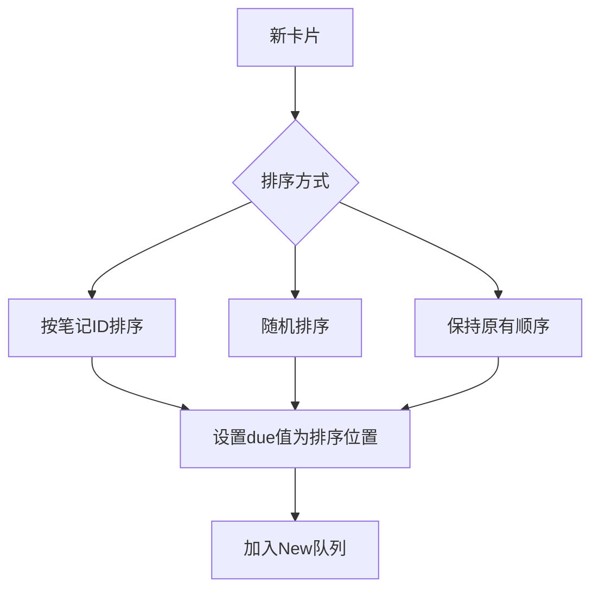
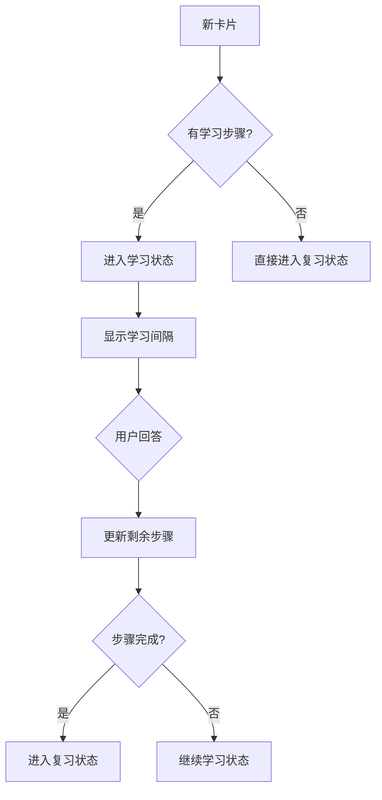
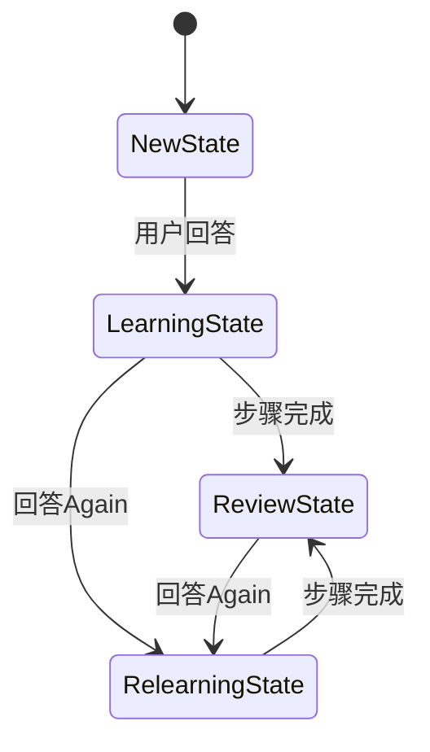

# 新卡片状态

<cite>
**本文档中引用的文件**  
- [new.rs](file://rslib/src/scheduler/new.rs)
- [states/new.rs](file://rslib/src/scheduler/states/new.rs)
- [states/normal.rs](file://rslib/src/scheduler/states/normal.rs)
- [states/mod.rs](file://rslib/src/scheduler/states/mod.rs)
- [states/learning.rs](file://rslib/src/scheduler/states/learning.rs)
- [states/review.rs](file://rslib/src/scheduler/states/review.rs)
</cite>

## 目录
1. [简介](#简介)
2. [新卡片队列管理](#新卡片队列管理)
3. [NewState 结构体设计](#newstate-结构体设计)
4. [抽卡算法与学习步骤](#抽卡算法与学习步骤)
5. [状态转换机制](#状态转换机制)
6. [间隔计算逻辑](#间隔计算逻辑)
7. [常见问题与调试](#常见问题与调试)
8. [最佳实践](#最佳实践)

## 简介
Anki 的新卡片状态是学习流程的起点，负责管理尚未进入复习阶段的卡片。该状态通过 `NewState` 结构体实现，控制新卡片的排序、抽取顺序和初始学习步骤。新卡片在首次回答后将根据用户表现转换为学习状态或直接进入复习状态。本节概述新卡片状态的核心职责和与其他调度状态的交互关系。

## 新卡片队列管理

Anki 使用 `CardQueue::New` 队列来管理新卡片，通过 `Card` 结构体的 `due` 字段存储卡片在队列中的位置。新卡片的排序由 `NewCardSorter` 结构体管理，支持三种排序方式：按笔记 ID 排序、随机排序和保持原有顺序。当用户调整卡片顺序时，系统会更新 `due` 值以反映新的位置。



**图示来源**
- [new.rs](file://rslib/src/scheduler/new.rs#L100-L150)

**本节来源**
- [new.rs](file://rslib/src/scheduler/new.rs#L50-L200)

## NewState 结构体设计

`NewState` 结构体定义了新卡片状态的核心属性，包含一个 `position` 字段表示卡片在新卡片队列中的位置。该结构体实现了 `interval_kind` 和 `revlog_kind` 方法，分别返回间隔类型和复习日志类型。`interval_kind` 返回 `InSecs(0)` 表示新卡片的间隔以秒为单位且初始值为0。

```rust
#[derive(Debug, Clone, Copy, PartialEq, Eq, Default)]
pub struct NewState {
    pub position: u32,
}
```

`NewState` 通过 `From` trait 转换为 `NormalState::New`，实现状态的统一管理。这种设计使得调度器可以统一处理不同类型的状态转换，提高了代码的可维护性。

**本节来源**
- [states/new.rs](file://rslib/src/scheduler/states/new.rs#L10-L20)
- [states/normal.rs](file://rslib/src/scheduler/states/normal.rs#L76-L79)

## 抽卡算法与学习步骤

新卡片的抽取算法由 `NewCardSorter` 实现，根据配置的排序方式对卡片进行排序。当用户回答新卡片时，系统根据学习步骤配置决定后续状态。如果学习步骤为空，新卡片将直接转换为复习状态；否则进入学习状态并遵循预设的学习间隔。

学习步骤的处理逻辑在 `LearnState` 中实现，通过 `remaining_steps` 字段跟踪剩余步骤数。每次回答后，系统根据用户选择（Again、Hard、Good、Easy）更新剩余步骤和调度间隔。对于新卡片，首次回答为 "Good" 或 "Easy" 时将直接毕业进入复习状态。



**图示来源**
- [states/learning.rs](file://rslib/src/scheduler/states/learning.rs#L50-L100)
- [states/new.rs](file://rslib/src/scheduler/states/new.rs#L15-L20)

**本节来源**
- [states/learning.rs](file://rslib/src/scheduler/states/learning.rs#L1-L200)

## 状态转换机制

新卡片状态的转换遵循严格的规则。当用户回答新卡片时，系统创建 `SchedulingStates` 对象，包含当前状态和可能的下一个状态。对于新卡片，`next_states` 方法会创建一个模拟学习状态失败的转换路径，但将当前状态保持为 `New`。

状态转换的核心逻辑在 `NormalState` 的 `next_states` 方法中实现。当处于 `New` 状态时，系统会创建一个具有失败学习步骤的 `LearnState`，然后将其作为下一个状态。这种设计确保了新卡片可以无缝过渡到学习流程，同时保持状态的一致性。



**图示来源**
- [states/normal.rs](file://rslib/src/scheduler/states/normal.rs#L50-L80)
- [states/review.rs](file://rslib/src/scheduler/states/review.rs#L100-L150)

**本节来源**
- [states/normal.rs](file://rslib/src/scheduler/states/normal.rs#L45-L100)

## 间隔计算逻辑

新卡片的间隔计算相对简单，初始间隔为0秒。当用户首次回答时，系统根据学习步骤配置计算下一个间隔。如果卡片直接毕业，将使用 `graduating_interval_good` 或 `graduating_interval_easy` 作为初始复习间隔。

对于需要学习步骤的卡片，系统使用 `steps` 配置中的值作为各步骤的间隔。这些间隔以秒为单位存储在 `scheduled_secs` 字段中。系统还会应用模糊算法（fuzz）在一定范围内随机调整最终间隔，防止卡片堆积。

间隔计算过程中，系统会考虑最大复习间隔和最小间隔限制，确保生成的间隔在合理范围内。对于 FSRS（Free Spaced Repetition Scheduler）模式，系统会使用不同的间隔计算策略，但基本原理保持一致。

**本节来源**
- [states/learning.rs](file://rslib/src/scheduler/states/learning.rs#L100-L150)
- [states/review.rs](file://rslib/src/scheduler/states/review.rs#L200-L250)

## 常见问题与调试

### 新卡片抽取顺序异常
当新卡片未按预期顺序出现时，可能是由于排序配置问题。检查 `NewCardInsertOrder` 设置是否正确，确认是否启用了随机排序。可以通过 `sort_cards` 方法重新排序卡片队列。

### 学习步骤配置失效
如果学习步骤配置未生效，检查 `LearningSteps` 是否正确初始化。确保 `steps` 字段包含有效的间隔值，并验证 `remaining_steps` 是否正确计算。使用调试日志可以跟踪步骤变化过程。

### 卡片状态转换错误
当新卡片未能正确转换到学习或复习状态时，检查 `next_states` 方法的实现。确认 `StateContext` 中的配置参数是否正确传递，特别是 `graduating_interval_good` 和 `graduating_interval_easy` 值。

调试时可以启用详细的日志记录，跟踪 `CardState` 的变化过程。使用单元测试验证状态转换逻辑，确保各种回答选项都能产生预期的结果。

**本节来源**
- [new.rs](file://rslib/src/scheduler/new.rs#L200-L300)
- [states/normal.rs](file://rslib/src/scheduler/states/normal.rs#L80-L100)

## 最佳实践

1. **合理配置学习步骤**：根据学习内容的难度设置适当的学习步骤和间隔，避免步骤过多导致学习负担过重。

2. **定期检查排序设置**：确保新卡片的排序方式符合学习目标，对于需要按特定顺序学习的内容，使用按笔记ID排序。

3. **监控间隔设置**：定期审查最大和最小间隔设置，确保它们符合长期记忆的科学原理。

4. **使用调试工具**：在调整调度参数后，使用调试模式验证状态转换和间隔计算是否符合预期。

5. **备份配置**：在修改重要调度参数前备份当前配置，以便在出现问题时快速恢复。

遵循这些最佳实践可以帮助用户最大化 Anki 的学习效果，确保新卡片状态的管理既科学又高效。

**本节来源**
- [new.rs](file://rslib/src/scheduler/new.rs#L300-L385)
- [states/mod.rs](file://rslib/src/scheduler/states/mod.rs#L1-L50)