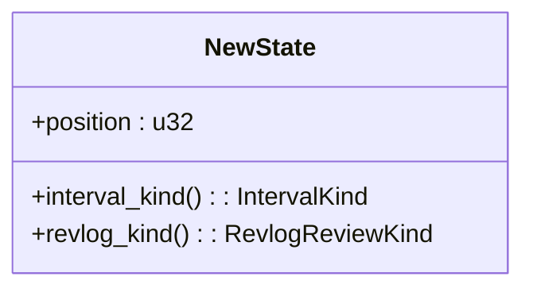
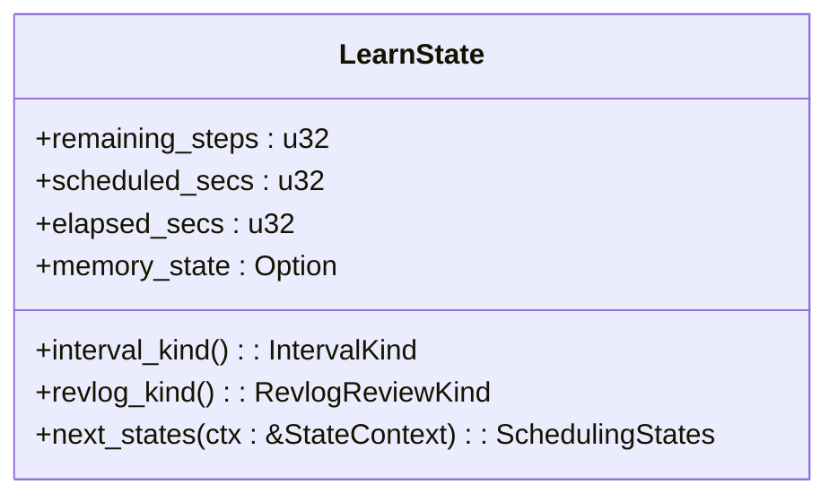
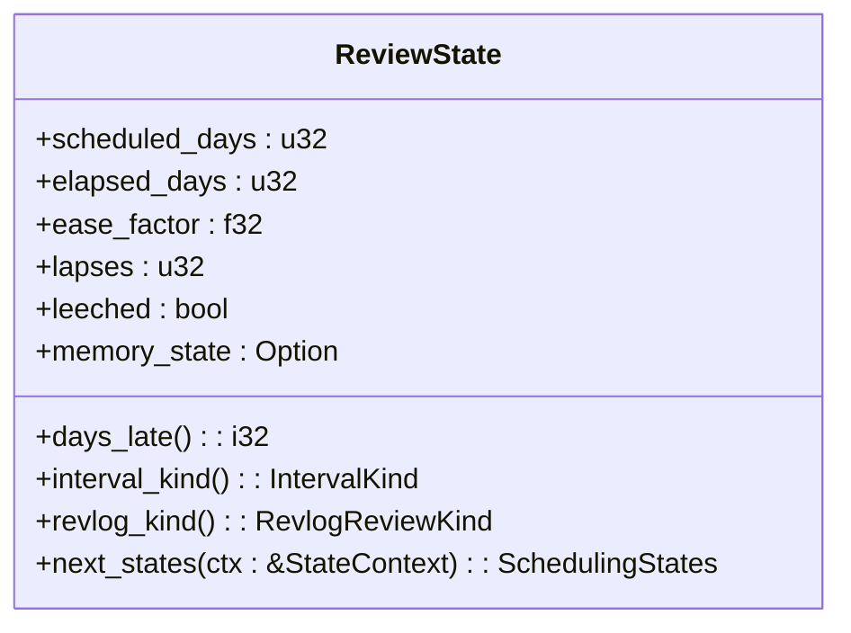
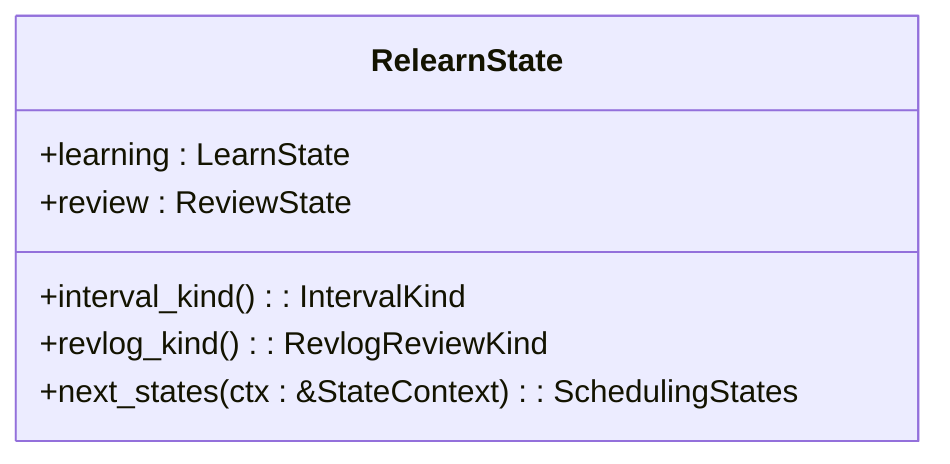
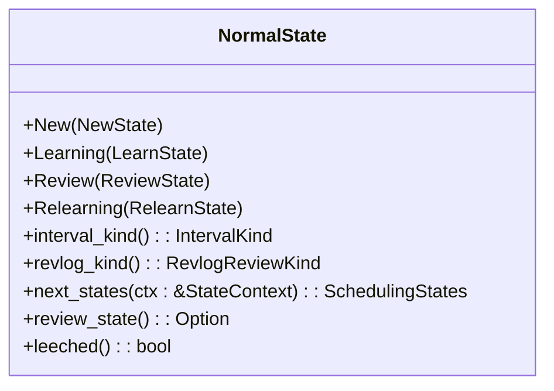
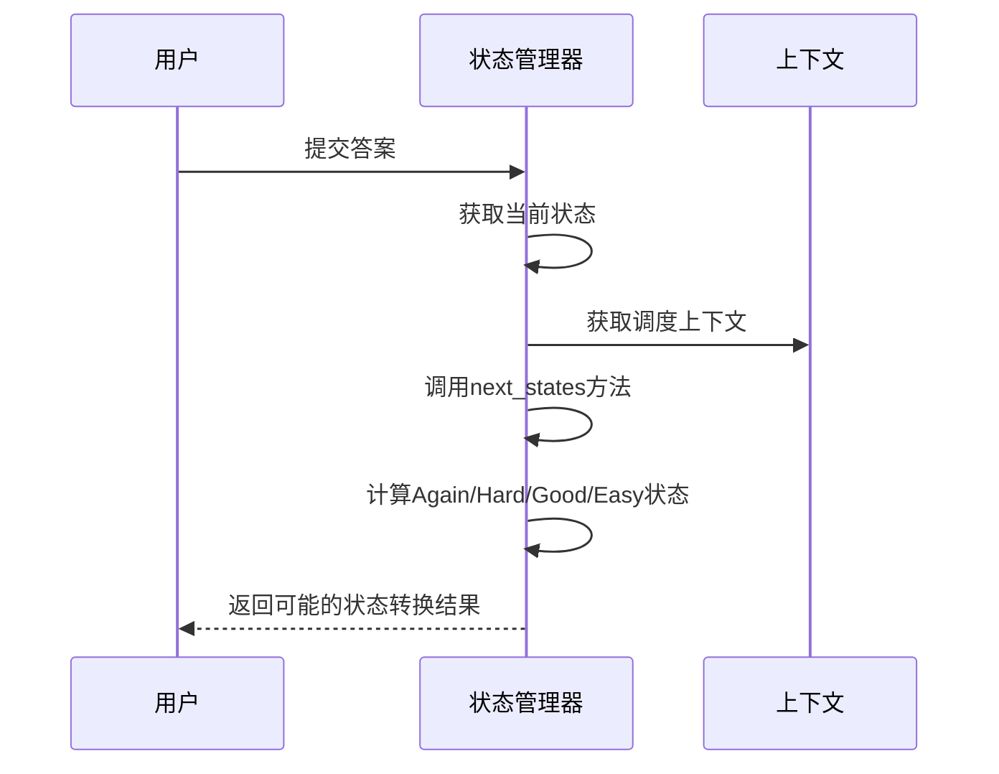

# 调度状态管理

<cite>
**本文档中引用的文件**  
- [mod.rs](file://rslib/src/scheduler/states/mod.rs)
- [new.rs](file://rslib/src/scheduler/states/new.rs)
- [learning.rs](file://rslib/src/scheduler/states/learning.rs)
- [review.rs](file://rslib/src/scheduler/states/review.rs)
- [relearning.rs](file://rslib/src/scheduler/states/relearning.rs)
- [filtered.rs](file://rslib/src/scheduler/states/filtered.rs)
- [normal.rs](file://rslib/src/scheduler/states/normal.rs)
- [steps.rs](file://rslib/src/scheduler/states/steps.rs)
- [interval_kind.rs](file://rslib/src/scheduler/states/interval_kind.rs)
</cite>

## 目录
1. [引言](#引言)
2. [核心调度状态](#核心调度状态)
3. [状态转换逻辑](#状态转换逻辑)
4. [状态管理器与上下文](#状态管理器与上下文)
5. [过滤牌组状态](#过滤牌组状态)
6. [学习步骤管理](#学习步骤管理)
7. [间隔类型处理](#间隔类型处理)
8. [常见问题与最佳实践](#常见问题与最佳实践)
9. [结论](#结论)

## 引言
Anki的调度系统通过精确的状态管理机制来控制卡片的学习流程。该系统实现了新卡片、学习中、复习、重新学习等多种状态，并通过状态机模式进行管理。本文档深入分析rslib/src/scheduler/states目录下的实现，详细解释各状态的转换逻辑、条件判断和行为特征。

**节来源**
- [mod.rs](file://rslib/src/scheduler/states/mod.rs#L1-L223)

## 核心调度状态
Anki调度系统定义了多种核心状态，每种状态代表卡片在学习过程中的不同阶段。

### 新卡片状态
新卡片状态（NewState）表示尚未开始学习的卡片。该状态包含一个位置属性，用于确定卡片在新卡片队列中的顺序。



**图来源**
- [new.rs](file://rslib/src/scheduler/states/new.rs#L1-L23)

**节来源**
- [new.rs](file://rslib/src/scheduler/states/new.rs#L1-L23)

### 学习中状态
学习中状态（LearnState）表示正在学习过程中的卡片。该状态包含剩余步骤、计划秒数、已过秒数和记忆状态等属性。



**图来源**
- [learning.rs](file://rslib/src/scheduler/states/learning.rs#L1-L196)

**节来源**
- [learning.rs](file://rslib/src/scheduler/states/learning.rs#L1-L196)

### 复习状态
复习状态（ReviewState）表示进入常规复习阶段的卡片。该状态包含计划天数、已过天数、轻松因子、遗漏次数、是否标记为困难和记忆状态等属性。



**图来源**
- [review.rs](file://rslib/src/scheduler/states/review.rs#L1-L394)

**节来源**
- [review.rs](file://rslib/src/scheduler/states/review.rs#L1-L394)

### 重新学习状态
重新学习状态（RelearnState）表示因回答错误而需要重新学习的卡片。该状态包含学习阶段和复习阶段两个子状态。



**图来源**
- [relearning.rs](file://rslib/src/scheduler/states/relearning.rs#L1-L204)

**节来源**
- [relearning.rs](file://rslib/src/scheduler/states/relearning.rs#L1-L204)

## 状态转换逻辑
Anki的状态转换通过next_states方法实现，根据用户操作和系统规则进行状态切换。

### 正常状态枚举
NormalState枚举将新卡片、学习中、复习和重新学习状态统一管理，提供了一致的接口。



**图来源**
- [normal.rs](file://rslib/src/scheduler/states/normal.rs#L1-L99)

**节来源**
- [normal.rs](file://rslib/src/scheduler/states/normal.rs#L1-L99)

### 状态转换流程
当用户对卡片进行操作时，系统会根据当前状态和操作类型计算出可能的下一个状态。



**图来源**
- [mod.rs](file://rslib/src/scheduler/states/mod.rs#L1-L223)
- [normal.rs](file://rslib/src/scheduler/states/normal.rs#L1-L99)

**节来源**
- [mod.rs](file://rslib/src/scheduler/states/mod.rs#L1-L223)
- [normal.rs](file://rslib/src/scheduler/states/normal.rs#L1-L99)

## 状态管理器与上下文
状态管理器通过StateContext结构体获取必要的上下文信息，以进行正确的状态转换。

### 状态上下文
StateContext结构体包含了状态转换所需的各种参数，如模糊因子、学习步骤、毕业间隔、轻松因子等。

```mermaid
classDiagram
    class StateContext {
        +