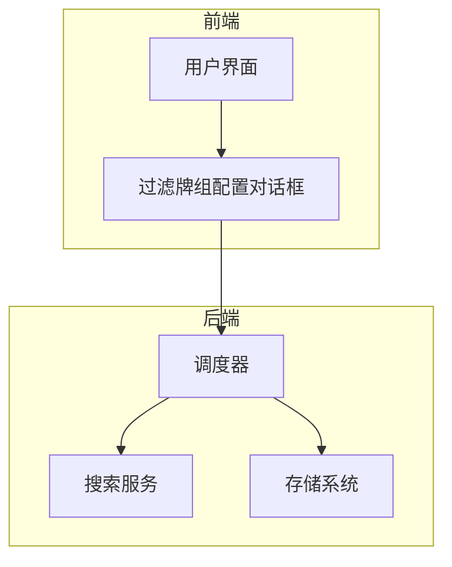
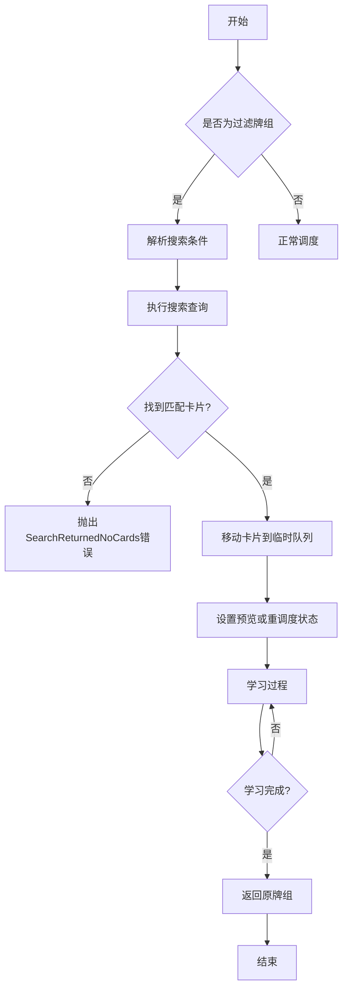
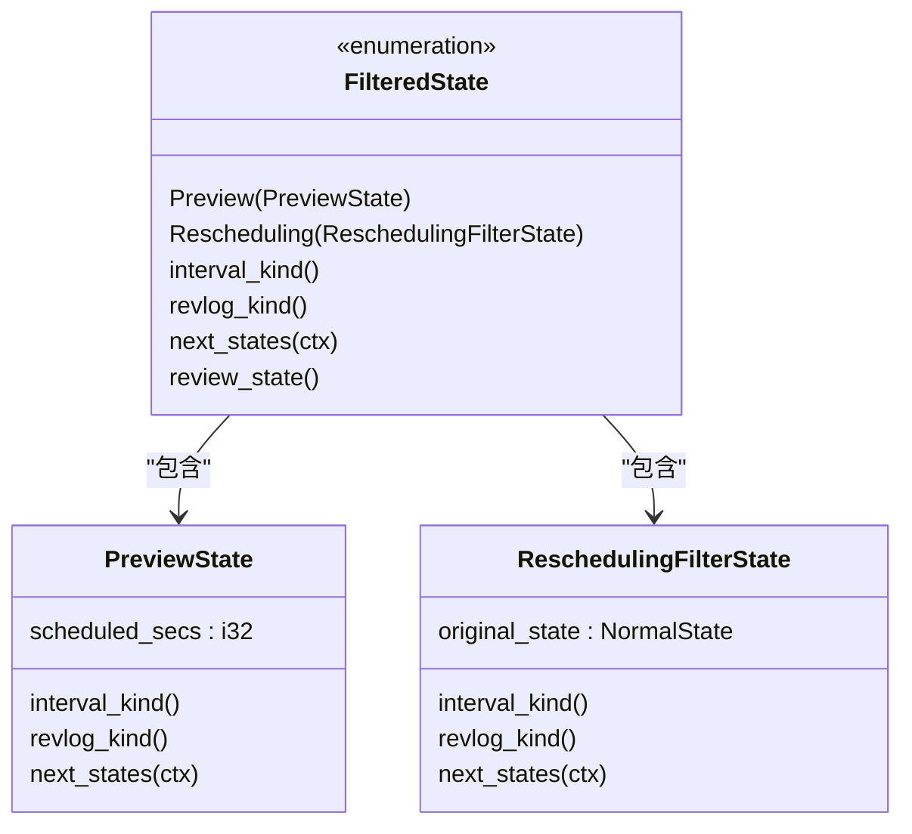
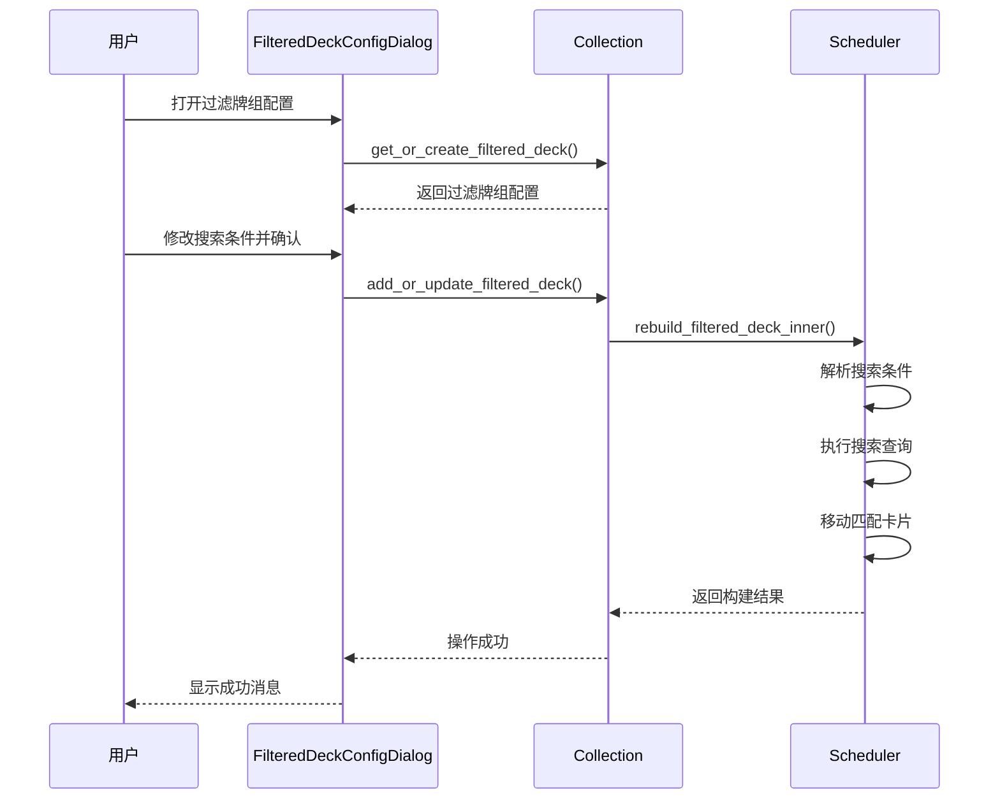
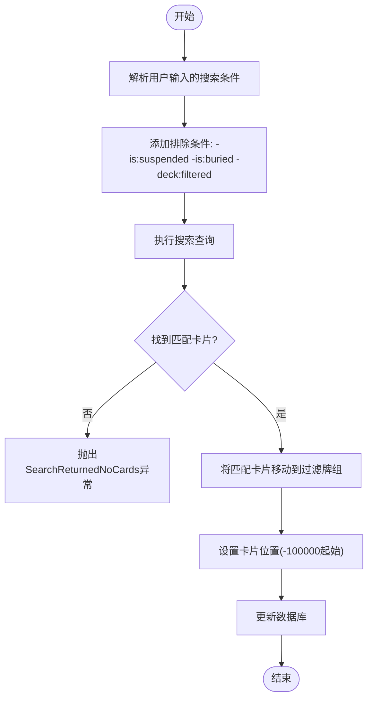
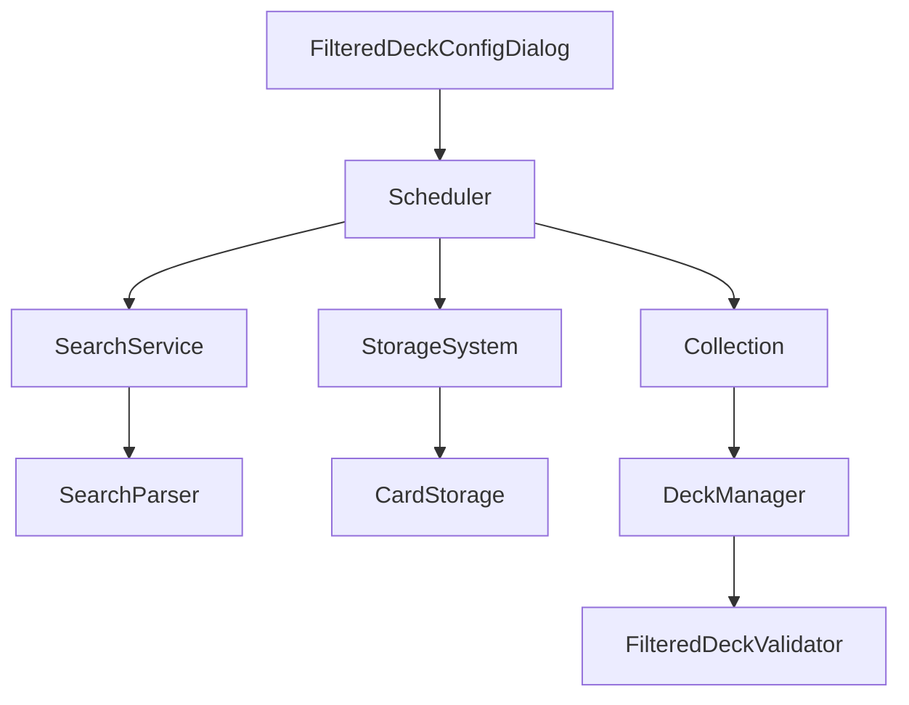

# 过滤牌组状态

<cite>
**本文档中引用的文件**  
- [filtered.rs](file://rslib/src/decks/filtered.rs)
- [filtered.rs](file://rslib/src/scheduler/states/filtered.rs)
- [filtered.rs](file://rslib/src/scheduler/service/states/filtered.rs)
- [filtered.rs](file://rslib/src/scheduler/filtered/mod.rs)
- [filtered.rs](file://rslib/src/error/filtered.rs)
- [v3.py](file://pylib/anki/scheduler/v3.py)
- [filtered_deck.py](file://qt/aqt/filtered_deck.py)
- [decks.py](file://pylib/anki/decks.py)
- [base.py](file://pylib/anki/scheduler/base.py)
</cite>

## 目录
1. [简介](#简介)
2. [项目结构](#项目结构)
3. [核心组件](#核心组件)
4. [架构概述](#架构概述)
5. [详细组件分析](#详细组件分析)
6. [依赖分析](#依赖分析)
7. [性能考虑](#性能考虑)
8. [故障排除指南](#故障排除指南)
9. [结论](#结论)

## 简介
本文档全面解释了Anki中过滤牌组状态的实现机制。过滤牌组是一种动态创建的临时学习队列，允许用户基于自定义搜索条件筛选卡片进行集中学习。文档详细说明了`FilteredState`结构体的设计原理、搜索查询执行流程、临时状态管理以及过期处理策略。同时描述了过滤牌组状态与其他常规状态的交互方式和转换规则，并提供常见问题的解决方案。

## 项目结构
Anki的过滤牌组功能分布在多个模块中，主要涉及Rust后端逻辑和Python前端交互。核心功能位于`rslib/src/scheduler/filtered/`目录下，而用户界面则由`qt/aqt/`中的组件实现。

**图示来源**
- [filtered_deck.py](file://qt/aqt/filtered_deck.py#L29-L306)
- [filtered.rs](file://rslib/src/scheduler/filtered/mod.rs#L47-L78)

**本节来源**
- [filtered.rs](file://rslib/src/decks/filtered.rs#L0-L71)
- [filtered.rs](file://rslib/src/scheduler/filtered/mod.rs#L47-L78)

## 核心组件
过滤牌组的核心组件包括`FilteredState`枚举、`FilteredDeckForUpdate`消息结构以及相关的错误处理机制。这些组件共同实现了动态牌组创建、卡片筛选和临时状态管理的功能。

**本节来源**
- [filtered.rs](file://rslib/src/scheduler/states/filtered.rs#L0-L46)
- [filtered.rs](file://rslib/src/scheduler/service/states/filtered.rs#L0-L36)

## 架构概述
过滤牌组的架构基于状态机模式，通过`FilteredState`区分预览和重调度两种模式。当用户创建或重建过滤牌组时，系统会解析搜索条件，将匹配的卡片临时移动到过滤牌组中，并根据配置决定是否重新安排学习进度。

**图示来源**
- [filtered.rs](file://rslib/src/scheduler/filtered/mod.rs#L110-L154)
- [v3.py](file://pylib/anki/scheduler/v3.py#L203-L213)

## 详细组件分析

### FilteredState 结构分析
`FilteredState`是一个枚举类型，包含`Preview`和`Rescheduling`两个变体，用于表示过滤牌组中卡片的不同学习状态。

#### 类图

**图示来源**
- [filtered.rs](file://rslib/src/scheduler/states/filtered.rs#L0-L46)
- [filtered.rs](file://rslib/src/scheduler/states/rescheduling_filter.rs#L0-L39)

#### 状态转换序列图

**图示来源**
- [filtered_deck.py](file://qt/aqt/filtered_deck.py#L29-L306)
- [filtered.rs](file://rslib/src/scheduler/filtered/mod.rs#L47-L78)

**本节来源**
- [filtered.rs](file://rslib/src/scheduler/states/filtered.rs#L0-L46)
- [filtered.rs](file://rslib/src/scheduler/filtered/mod.rs#L80-L111)

### 搜索条件解析机制
过滤牌组使用Anki的搜索语法来定义筛选条件。系统在构建过滤牌组时会自动添加排除规则，确保不会包含已暂停、已埋藏或已在其他过滤牌组中的卡片。

#### 搜索条件处理流程图

**图示来源**
- [filtered.rs](file://rslib/src/scheduler/filtered/mod.rs#L110-L154)
- [parser.rs](file://rslib/src/search/parser.rs#L67-L117)

**本节来源**
- [filtered.rs](file://rslib/src/scheduler/filtered/mod.rs#L110-L154)
- [parser.rs](file://rslib/src/search/parser.rs#L354-L386)

## 依赖分析
过滤牌组功能依赖于多个核心模块，包括搜索服务、存储系统和调度器。这些模块之间的依赖关系确保了过滤牌组能够正确地执行搜索、管理卡片状态和处理学习流程。

**图示来源**
- [filtered.rs](file://rslib/src/scheduler/filtered/mod.rs#L47-L78)
- [filtered_deck.py](file://qt/aqt/filtered_deck.py#L29-L306)

**本节来源**
- [filtered.rs](file://rslib/src/scheduler/filtered/mod.rs#L47-L78)
- [base.py](file://pylib/anki/scheduler/base.py#L128-L131)

## 性能考虑
过滤牌组的性能主要受搜索查询复杂度和匹配卡片数量的影响。系统通过限制最多两个搜索条件和使用优化的数据库查询来保证性能。建议用户避免过于复杂的搜索条件，以确保快速响应。

## 故障排除指南
以下是过滤牌组常见问题及其解决方案：

**本节来源**
- [filtered.rs](file://rslib/src/error/filtered.rs#L0-L42)
- [filtered_deck.py](file://qt/aqt/filtered_deck.py#L29-L306)

### 过滤条件解析错误
**问题**: 搜索条件语法错误导致无法创建过滤牌组  
**解决方案**: 
1. 检查搜索语法是否正确
2. 避免使用不支持的搜索操作符
3. 参考Anki官方文档中的搜索语法指南

### 临时牌组卡片丢失
**问题**: 学习过程中卡片意外从过滤牌组消失  
**解决方案**:
1. 确保没有其他进程修改了相关卡片
2. 检查是否有同步操作影响了本地数据
3. 重建过滤牌组以恢复卡片

### 搜索返回空结果
**问题**: 过滤条件没有匹配到任何卡片  
**解决方案**:
1. 放宽搜索条件以增加匹配范围
2. 检查是否有排除条件过于严格
3. 使用浏览器功能验证搜索条件是否正确

## 结论
Anki的过滤牌组状态设计精巧，通过`FilteredState`状态机有效管理了临时学习队列的生命周期。系统结合了强大的搜索功能和灵活的状态管理，为用户提供了高效的集中学习体验。理解其内部机制有助于更好地利用这一功能，并在遇到问题时能够快速定位和解决。