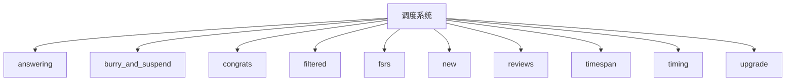
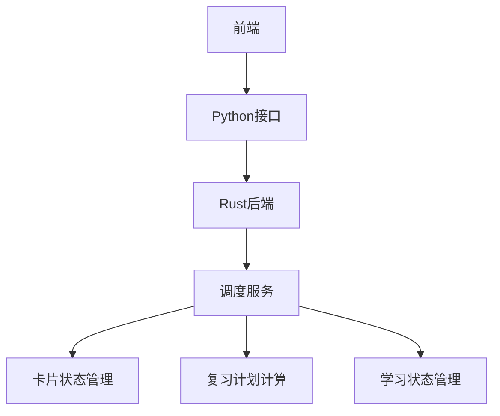
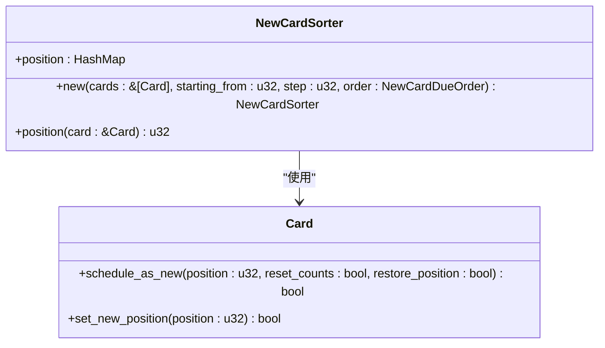
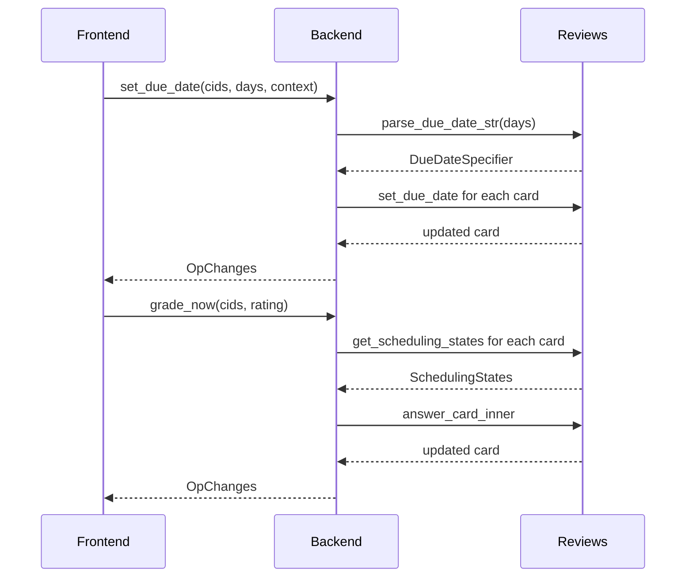
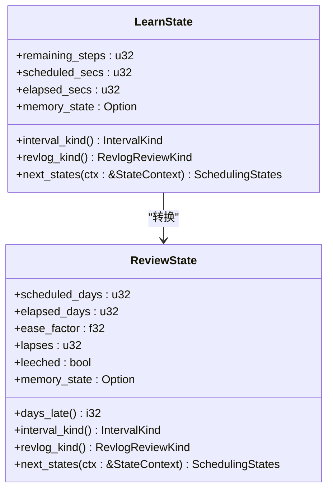
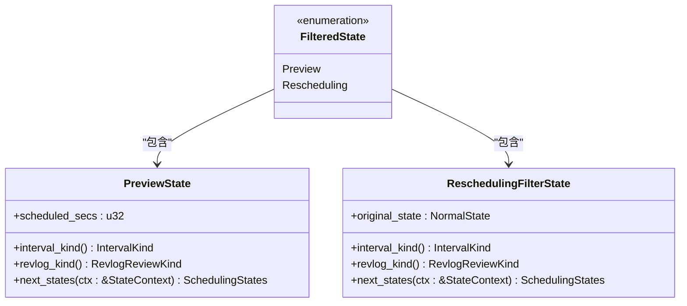
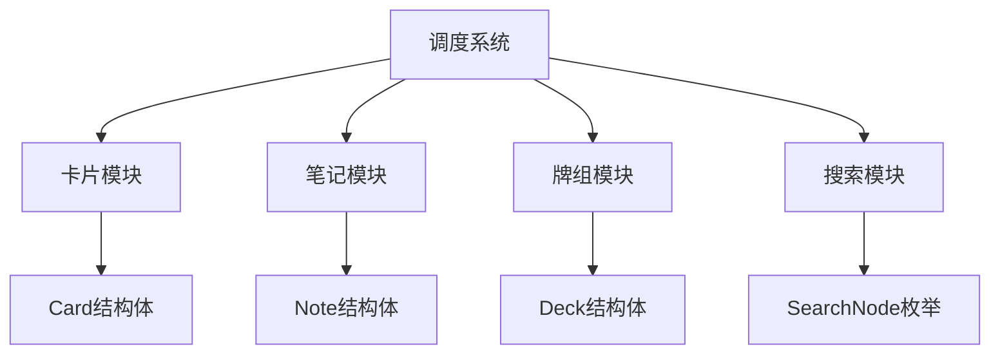

# 调度系统

<cite>
**本文档中引用的文件**  
- [v3.py](file://pylib/anki/scheduler/v3.py)
- [mod.rs](file://rslib/src/scheduler/mod.rs)
- [service/mod.rs](file://rslib/src/scheduler/service/mod.rs)
- [states/mod.rs](file://rslib/src/scheduler/states/mod.rs)
- [new.rs](file://rslib/src/scheduler/new.rs)
- [reviews.rs](file://rslib/src/scheduler/reviews.rs)
- [fsrs/params.rs](file://rslib/src/scheduler/fsrs/params.rs)
- [states/new.rs](file://rslib/src/scheduler/states/new.rs)
- [states/review.rs](file://rslib/src/scheduler/states/review.rs)
- [states/learning.rs](file://rslib/src/scheduler/states/learning.rs)
</cite>

## 目录
1. [引言](#引言)
2. [项目结构](#项目结构)
3. [核心组件](#核心组件)
4. [架构概述](#架构概述)
5. [详细组件分析](#详细组件分析)
6. [依赖分析](#依赖分析)
7. [性能考虑](#性能考虑)
8. [故障排除指南](#故障排除指南)
9. [结论](#结论)

## 引言
Anki的调度系统是其核心功能之一，负责管理卡片的复习计划。该系统实现了新卡片调度、复习调度、学习状态管理和过滤牌组调度。FSRS（Free Spaced Repetition Scheduler）算法是该系统的核心，它基于用户的复习历史来预测最佳复习时间。调度系统与其他模块如卡片、笔记和牌组紧密交互，确保高效的复习流程。本文档旨在为初学者提供间隔重复算法的概念性概述，同时为经验丰富的开发者深入解析调度服务的内部工作原理。

## 项目结构
Anki的调度系统主要位于`rslib/src/scheduler`目录下，包含多个子模块，每个模块负责不同的调度功能。这些模块包括`answering`、`bury_and_suspend`、`congrats`、`filtered`、`fsrs`、`new`、`reviews`、`timespan`、`timing`和`upgrade`。此外，`pylib/anki/scheduler`目录下的`v3.py`文件提供了Python接口，用于与Rust后端进行交互。

**图源**
- [mod.rs](file://rslib/src/scheduler/mod.rs#L1-L135)

**本节来源**
- [mod.rs](file://rslib/src/scheduler/mod.rs#L1-L135)

## 核心组件
调度系统的核心组件包括新卡片调度、复习调度、学习状态管理和过滤牌组调度。这些组件通过`CardState`枚举和`SchedulingStates`结构体来管理卡片的状态转换。`CardState`枚举包含`Normal`和`Filtered`两种状态，分别对应普通卡片和过滤牌组中的卡片。`SchedulingStates`结构体则包含了当前状态和可能的下一个状态。

**本节来源**
- [states/mod.rs](file://rslib/src/scheduler/states/mod.rs#L1-L223)
- [service/mod.rs](file://rslib/src/scheduler/service/mod.rs#L1-L451)

## 架构概述
Anki的调度系统采用分层架构，前端通过Python接口调用Rust后端的服务。Rust后端负责处理所有调度逻辑，包括计算下一个复习时间、更新卡片状态等。调度服务通过`SchedulerService` trait提供了一系列方法，如`get_queued_cards`、`answer_card`和`get_scheduling_states`，这些方法被前端调用以获取和更新卡片信息。

**图源**
- [service/mod.rs](file://rslib/src/scheduler/service/mod.rs#L1-L451)

**本节来源**
- [service/mod.rs](file://rslib/src/scheduler/service/mod.rs#L1-L451)

## 详细组件分析

### 新卡片调度分析
新卡片调度由`new.rs`文件中的`reschedule_cards_as_new`函数实现。该函数将指定的卡片重新安排为新卡片，并根据配置决定是否恢复位置和重置计数。`NewCardSorter`结构体用于对新卡片进行排序，支持按笔记ID、随机或保持原有顺序。

**图源**
- [new.rs](file://rslib/src/scheduler/new.rs#L1-L385)

**本节来源**
- [new.rs](file://rslib/src/scheduler/new.rs#L1-L385)

### 复习调度分析
复习调度由`reviews.rs`文件中的`set_due_date`和`grade_now`函数实现。`set_due_date`函数用于设置卡片的到期日期，支持指定最小和最大天数范围。`grade_now`函数用于立即评分卡片，根据评分结果更新卡片状态。

**图源**
- [reviews.rs](file://rslib/src/scheduler/reviews.rs#L1-L301)

**本节来源**
- [reviews.rs](file://rslib/src/scheduler/reviews.rs#L1-L301)

### 学习状态管理分析
学习状态管理由`states`模块中的`LearnState`和`ReviewState`结构体实现。`LearnState`表示学习阶段的卡片状态，包含剩余步骤、计划秒数和已过秒数。`ReviewState`表示复习阶段的卡片状态，包含计划天数、已过天数、易度因子、遗漏次数和是否被标记为困难。

**图源**
- [states/learning.rs](file://rslib/src/scheduler/states/learning.rs#L1-L196)
- [states/review.rs](file://rslib/src/scheduler/states/review.rs#L1-L394)

**本节来源**
- [states/learning.rs](file://rslib/src/scheduler/states/learning.rs#L1-L196)
- [states/review.rs](file://rslib/src/scheduler/states/review.rs#L1-L394)

### 过滤牌组调度分析
过滤牌组调度由`filtered`模块实现，允许用户创建临时牌组进行集中复习。`FilteredState`枚举包含`Preview`和`Rescheduling`两种状态，分别对应预览和重新安排。`PreviewState`用于预览卡片，而`ReschedulingFilterState`用于重新安排卡片的复习计划。

**图源**
- [states/filtered.rs](file://rslib/src/scheduler/states/filtered.rs#L1-L100)

**本节来源**
- [states/filtered.rs](file://rslib/src/scheduler/states/filtered.rs#L1-L100)

## 依赖分析
调度系统依赖于多个外部模块，包括卡片、笔记、牌组和搜索模块。这些模块通过`Collection`结构体提供的方法进行交互。例如，`get_queued_cards`方法依赖于搜索模块来查找待复习的卡片，而`answer_card`方法依赖于卡片模块来更新卡片状态。

**图源**
- [mod.rs](file://rslib/src/scheduler/mod.rs#L1-L135)
- [service/mod.rs](file://rslib/src/scheduler/service/mod.rs#L1-L451)

**本节来源**
- [mod.rs](file://rslib/src/scheduler/mod.rs#L1-L135)
- [service/mod.rs](file://rslib/src/scheduler/service/mod.rs#L1-L451)

## 性能考虑
在大规模数据集下，调度系统的性能至关重要。为了优化性能，Anki采用了多种策略，包括缓存调度信息、批量处理卡片操作和使用高效的搜索算法。`scheduler_info`方法通过缓存`SchedTimingToday`对象来减少重复计算，而`get_queued_cards`方法通过限制返回的卡片数量来避免内存溢出。

**本节来源**
- [mod.rs](file://rslib/src/scheduler/mod.rs#L1-L135)
- [service/mod.rs](file://rslib/src/scheduler/service/mod.rs#L1-L451)

## 故障排除指南
常见的调度问题包括卡片排序异常和学习步骤计算错误。对于卡片排序异常，可以检查`NewCardSorter`的排序逻辑是否正确。对于学习步骤计算错误，可以检查`LearningSteps`的配置是否合理。此外，确保`fuzz_factor`的值在合理范围内，以避免过度随机化。

**本节来源**
- [new.rs](file://rslib/src/scheduler/new.rs#L1-L385)
- [states/learning.rs](file://rslib/src/scheduler/states/learning.rs#L1-L196)

## 结论
Anki的调度系统是一个复杂而高效的系统，它通过FSRS算法和多种调度策略来优化用户的复习体验。通过深入了解其内部工作原理，开发者可以更好地利用和扩展这一系统，为用户提供更个性化的学习体验。