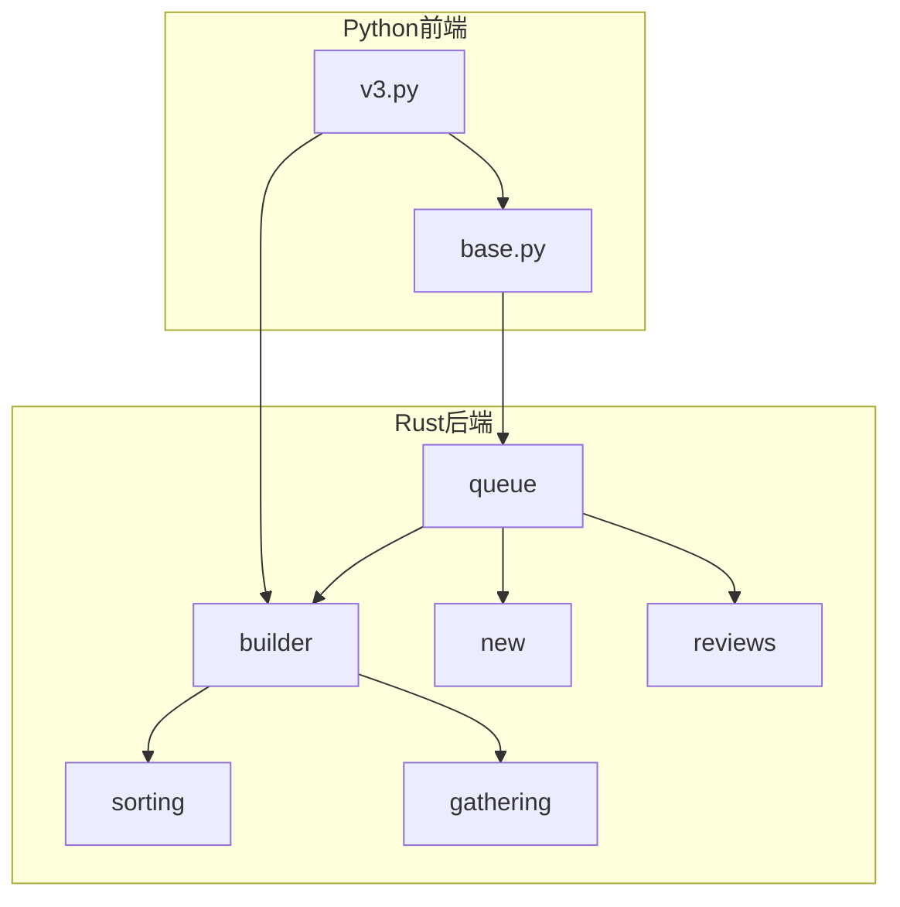
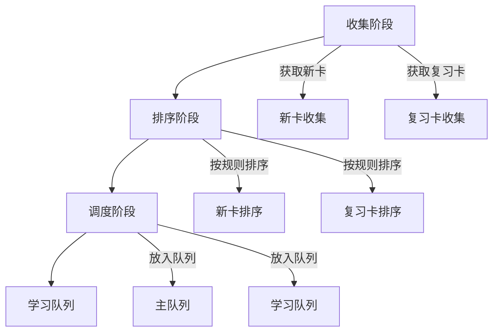
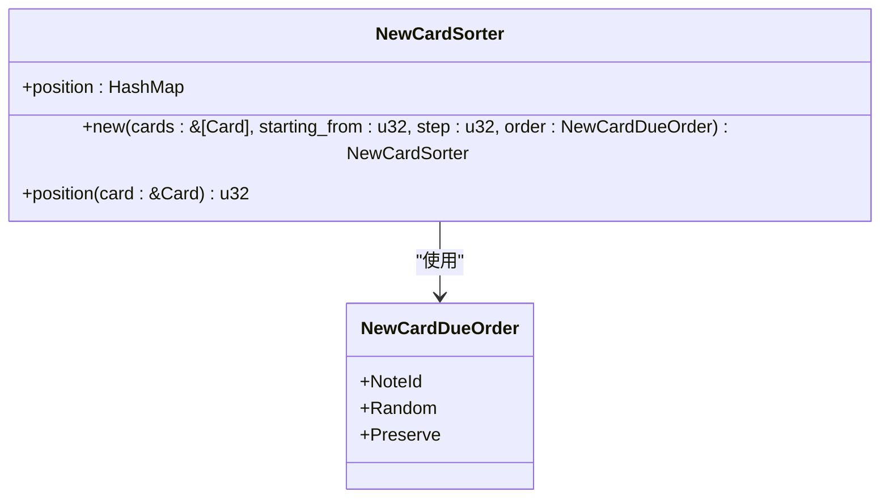
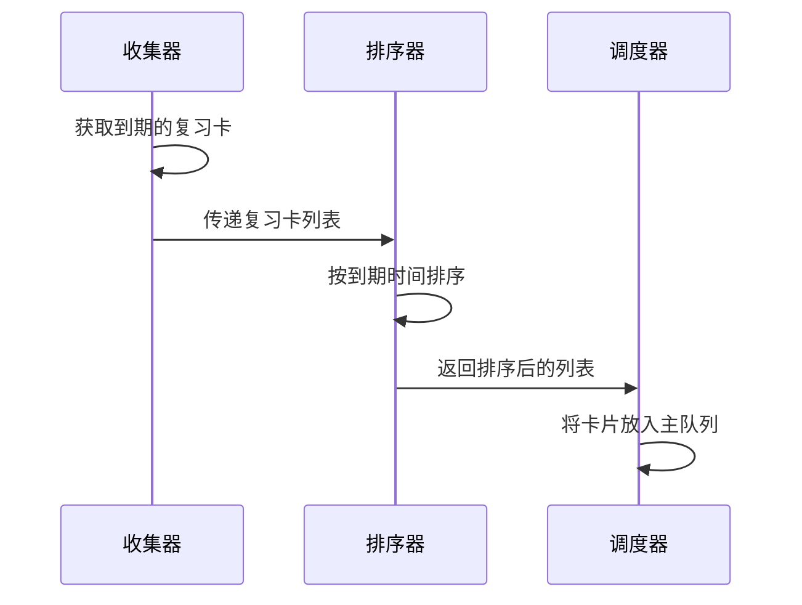
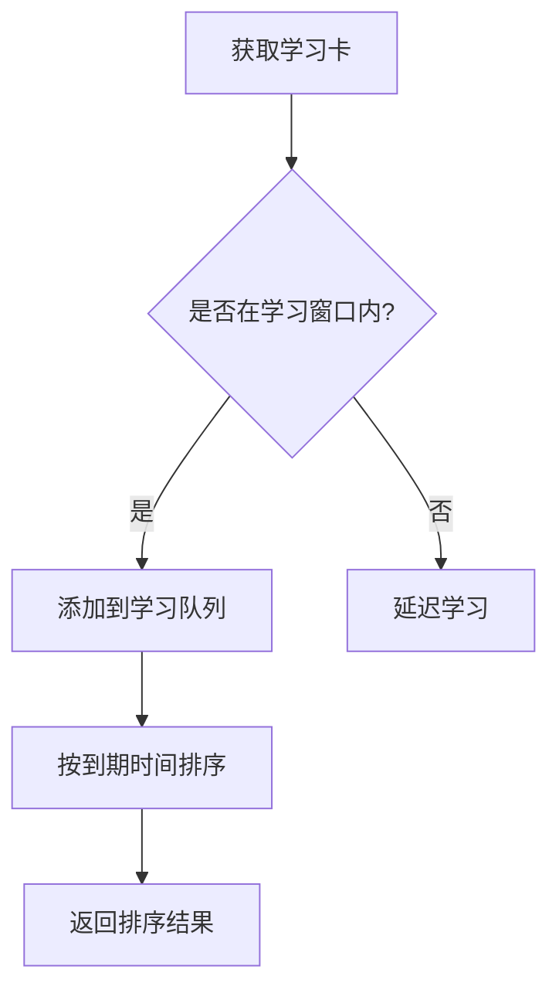
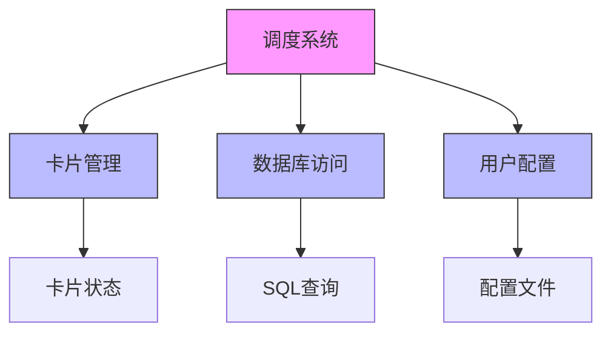

# 卡片排序

<cite>
**本文档中引用的文件**  
- [new.rs](file://rslib/src/scheduler/new.rs)
- [queue.rs](file://rslib/src/scheduler/queue/main.rs)
- [builder.rs](file://rslib/src/scheduler/queue/builder/mod.rs)
- [sorting.rs](file://rslib/src/scheduler/queue/builder/sorting.rs)
- [gathering.rs](file://rslib/src/scheduler/queue/builder/gathering.rs)
- [base.py](file://pylib/anki/scheduler/base.py)
- [v3.py](file://pylib/anki/scheduler/v3.py)
</cite>

## 目录
1. [简介](#简介)
2. [项目结构](#项目结构)
3. [核心组件](#核心组件)
4. [架构概述](#架构概述)
5. [详细组件分析](#详细组件分析)
6. [依赖分析](#依赖分析)
7. [性能考虑](#性能考虑)
8. [故障排除指南](#故障排除指南)
9. [结论](#结论)

## 简介
Anki的调度系统通过复杂的排序机制管理卡片的学习流程。该系统根据卡片类型（新卡、复习、学习）和用户配置对卡片进行优先级排序，确保学习效率和用户体验的平衡。排序算法结合了间隔重复算法，动态调整卡片的复习间隔。系统支持多种排序规则，包括按笔记ID、随机排序和保持原有顺序。此外，还提供了对高优先级牌组和自定义排序规则的处理机制。

## 项目结构
Anki的调度系统主要由Rust后端和Python前端组成。Rust部分负责核心调度逻辑，包括卡片队列的构建和排序。Python部分提供API接口，与前端交互。调度相关的代码主要位于`rslib/src/scheduler`目录下，包括`queue`、`new`、`reviews`等子模块。Python部分位于`pylib/anki/scheduler`目录，包含`v3.py`和`base.py`等文件。

**图表来源**  
- [queue/main.rs](file://rslib/src/scheduler/queue/main.rs#L1-L48)
- [builder/mod.rs](file://rslib/src/scheduler/queue/builder/mod.rs#L1-L547)

**章节来源**  
- [rslib/src/scheduler](file://rslib/src/scheduler#L1-L136)
- [pylib/anki/scheduler](file://pylib/anki/scheduler#L1-L263)

## 核心组件
调度系统的核心组件包括卡片队列构建器、排序器和收集器。这些组件协同工作，确保卡片按照预定规则被正确排序和调度。系统支持多种排序策略，可以根据用户需求进行配置。卡片的状态管理是核心功能之一，确保每张卡片都能根据其学习进度得到适当的处理。

**章节来源**  
- [new.rs](file://rslib/src/scheduler/new.rs#L1-L385)
- [base.py](file://pylib/anki/scheduler/base.py#L225-L263)

## 架构概述
Anki的调度架构采用分层设计，将卡片管理分为收集、排序和调度三个主要阶段。收集阶段从数据库中获取符合条件的卡片；排序阶段根据配置的规则对卡片进行排序；调度阶段将排序后的卡片放入相应的队列中等待学习。这种分层设计使得系统具有良好的可扩展性和可维护性。

**图表来源**  
- [builder/mod.rs](file://rslib/src/scheduler/queue/builder/mod.rs#L1-L547)
- [queue/main.rs](file://rslib/src/scheduler/queue/main.rs#L1-L48)

## 详细组件分析

### 新卡排序分析
新卡排序是调度系统的重要组成部分。系统提供了多种排序选项，包括按笔记ID排序、随机排序和保持原有顺序。排序算法通过`NewCardSorter`结构体实现，该结构体根据指定的排序规则为每张新卡分配位置。

**图表来源**  
- [new.rs](file://rslib/src/scheduler/new.rs#L39-L90)
- [sorting.rs](file://rslib/src/scheduler/queue/builder/sorting.rs#L1-L82)

### 复习卡排序分析
复习卡的排序基于间隔重复算法，考虑卡片的到期时间和学习进度。系统通过`DueCard`结构体管理复习卡的信息，并根据配置的排序规则进行排序。排序算法确保即将到期的卡片优先被复习，同时平衡不同难度卡片的分布。

**图表来源**  
- [gathering.rs](file://rslib/src/scheduler/queue/builder/gathering.rs#L1-L177)
- [builder/mod.rs](file://rslib/src/scheduler/queue/builder/mod.rs#L1-L547)

### 学习卡排序分析
学习卡的排序需要考虑卡片的剩余学习步骤和预计学习时间。系统通过`LearningQueueEntry`结构体管理学习卡的信息，并根据学习进度进行排序。排序算法确保学习卡能够按照预定的学习计划被复习，同时避免学习负担过重。

**图表来源**  
- [queue/main.rs](file://rslib/src/scheduler/queue/main.rs#L1-L48)
- [gathering.rs](file://rslib/src/scheduler/queue/builder/gathering.rs#L1-L177)

## 依赖分析
调度系统依赖于多个核心组件，包括卡片管理、数据库访问和用户配置。这些组件通过清晰的接口进行交互，确保系统的稳定性和可维护性。系统使用Rust的模块化设计，将不同功能分离到独立的模块中，降低了组件间的耦合度。

**图表来源**  
- [mod.rs](file://rslib/src/scheduler/mod.rs#L1-L136)
- [service/mod.rs](file://rslib/src/scheduler/service/mod.rs#L1-L452)

**章节来源**  
- [rslib/src/scheduler](file://rslib/src/scheduler#L1-L136)
- [pylib/anki/scheduler](file://pylib/anki/scheduler#L1-L263)

## 性能考虑
在处理大量卡片时，排序算法的效率至关重要。系统采用多种优化策略来提高性能，包括使用高效的排序算法、减少数据库查询次数和缓存常用数据。对于大规模卡片集合，系统优先使用稳定的排序算法，确保排序结果的一致性。

**章节来源**  
- [sorting.rs](file://rslib/src/scheduler/queue/builder/sorting.rs#L1-L82)
- [gathering.rs](file://rslib/src/scheduler/queue/builder/gathering.rs#L1-L177)

## 故障排除指南
常见的排序问题包括排序不稳定和优先级错乱。这些问题通常由配置错误或数据异常引起。解决这些问题的方法包括检查用户配置、验证卡片数据完整性和重新构建调度队列。对于复杂的排序问题，建议使用系统提供的调试工具进行分析。

**章节来源**  
- [new.rs](file://rslib/src/scheduler/new.rs#L1-L385)
- [v3.py](file://pylib/anki/scheduler/v3.py#L118-L149)

## 结论
Anki的卡片排序机制是一个复杂而精密的系统，它通过多种排序策略和优化算法确保学习效率和用户体验的平衡。系统的设计充分考虑了可扩展性和可维护性，为未来的功能扩展提供了良好的基础。通过对核心组件的深入分析，我们可以更好地理解系统的运作原理，并为性能优化和问题排查提供指导。