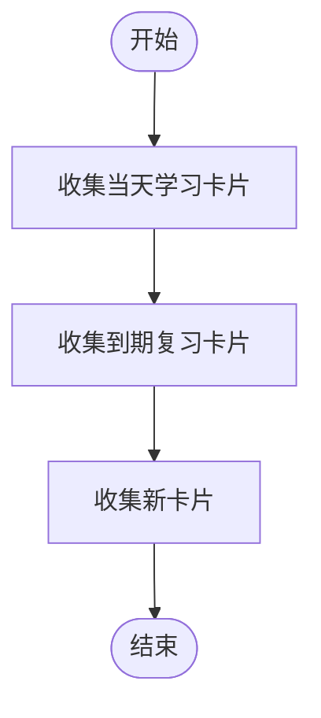
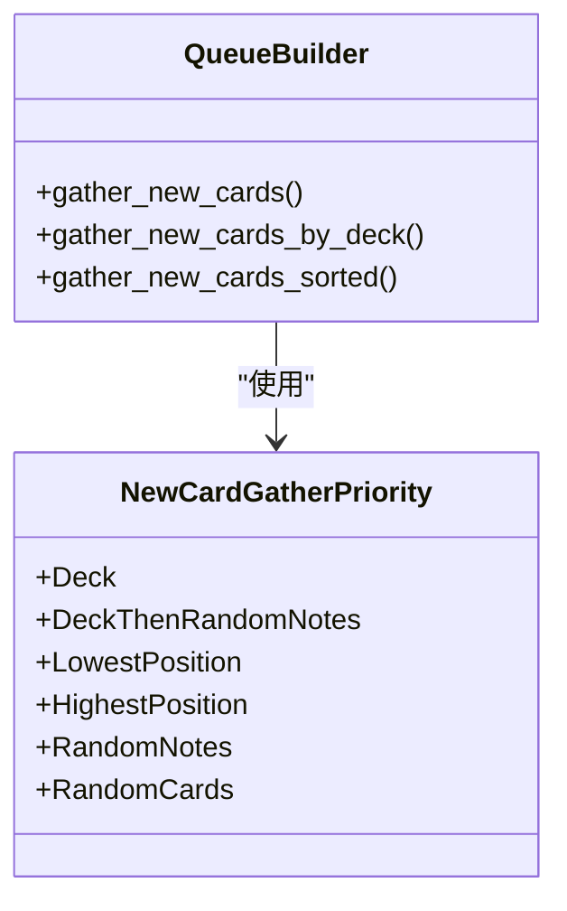
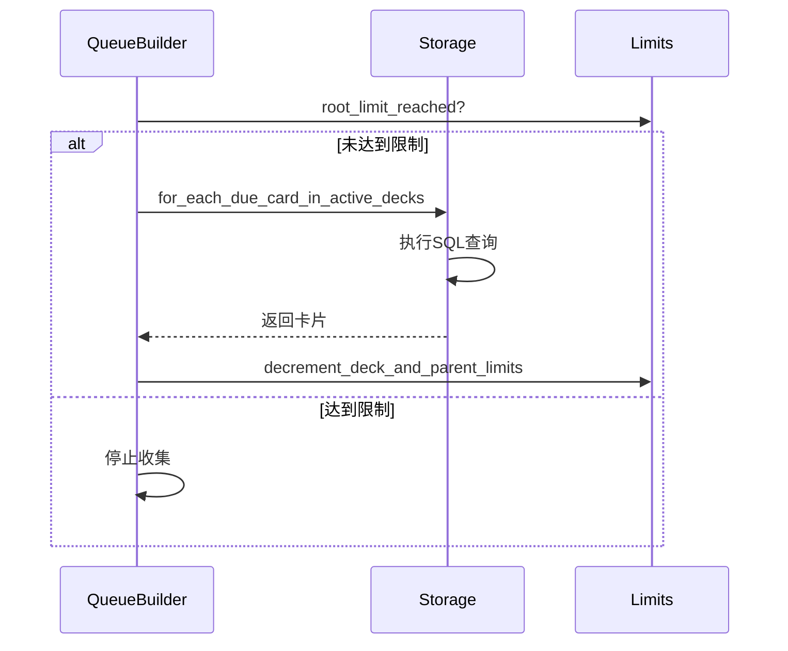
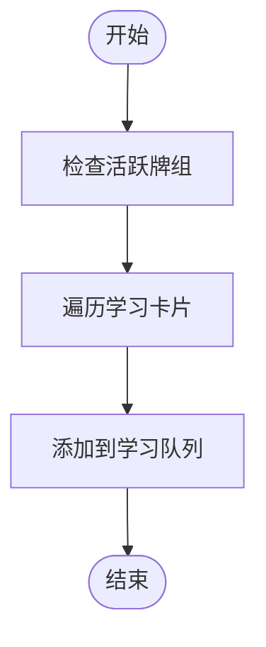
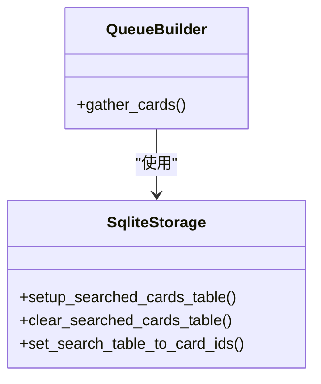

# 卡片收集

<cite>
**本文档中引用的文件**  
- [gathering.rs](file://rslib/src/scheduler/queue/builder/gathering.rs)
- [mod.rs](file://rslib/src/scheduler/queue/builder/mod.rs)
- [card/mod.rs](file://rslib/src/storage/card/mod.rs)
- [deckconfig/mod.rs](file://rslib/src/deckconfig/mod.rs)
- [limits.rs](file://rslib/src/decks/limits.rs)
- [new_cards.sql](file://rslib/src/storage/card/new_cards.sql)
- [active_new_cards.sql](file://rslib/src/storage/card/active_new_cards.sql)
- [due_cards.sql](file://rslib/src/storage/card/due_cards.sql)
- [intraday_due.sql](file://rslib/src/storage/card/intraday_due.sql)
</cite>

## 目录
1. [简介](#简介)
2. [收集流程概述](#收集流程概述)
3. [新卡片收集](#新卡片收集)
4. [复习卡片收集](#复习卡片收集)
5. [学习卡片收集](#学习卡片收集)
6. [性能优化策略](#性能优化策略)
7. [常见问题与解决方案](#常见问题与解决方案)
8. [大规模数据集下的性能考虑](#大规模数据集下的性能考虑)

## 简介
Anki的卡片收集机制是其调度系统的核心组成部分，负责从数据库中检索待处理的卡片。该机制根据牌组配置、学习限制和用户偏好过滤卡片，确保用户能够高效地进行学习。本文档将深入探讨gathering模块如何实现这一功能。

## 收集流程概述
卡片收集过程由`QueueBuilder`类的`gather_cards`方法驱动，该方法依次调用不同的收集函数来获取不同类型的学习卡片。整个流程包括以下几个步骤：
- 收集当天的学习卡片
- 收集到期的复习卡片
- 收集新的学习卡片



**Diagram sources**
- [gathering.rs](file://rslib/src/scheduler/queue/builder/gathering.rs#L15-L22)

**Section sources**
- [gathering.rs](file://rslib/src/scheduler/queue/builder/gathering.rs#L15-L22)

## 新卡片收集
新卡片的收集逻辑主要通过`gather_new_cards`函数实现。该函数根据用户的配置选择不同的收集策略，如按牌组优先级或随机顺序等。

### 收集策略
新卡片的收集策略由`NewCardGatherPriority`枚举定义，包括：
- 按牌组优先级
- 按最低位置
- 按最高位置
- 随机笔记
- 随机卡片



**Diagram sources**
- [deckconfig/mod.rs](file://rslib/src/deckconfig/mod.rs#L25-L31)
- [gathering.rs](file://rslib/src/scheduler/queue/builder/gathering.rs#L74-L94)

**Section sources**
- [gathering.rs](file://rslib/src/scheduler/queue/builder/gathering.rs#L74-L94)

### SQL查询
新卡片的收集依赖于特定的SQL查询语句，这些查询语句位于`new_cards.sql`和`active_new_cards.sql`文件中。

```sql
SELECT id,
  nid,
  ord,
  cast(mod AS integer),
  did,
  odid
FROM cards
WHERE did = ?
  AND queue = 0
```

**Section sources**
- [new_cards.sql](file://rslib/src/storage/card/new_cards.sql)
- [active_new_cards.sql](file://rslib/src/storage/card/active_new_cards.sql)

## 复习卡片收集
复习卡片的收集逻辑通过`gather_due_cards`函数实现。该函数根据当前时间、排序选项和卡片类型来确定哪些卡片需要被复习。

### 限制检查
在收集复习卡片之前，系统会检查是否达到了根级别的限制。如果达到限制，则停止收集。



**Diagram sources**
- [gathering.rs](file://rslib/src/scheduler/queue/builder/gathering.rs#L58-L68)
- [limits.rs](file://rslib/src/decks/limits.rs#L300-L398)

**Section sources**
- [gathering.rs](file://rslib/src/scheduler/queue/builder/gathering.rs#L58-L68)

### SQL查询
复习卡片的收集依赖于`due_cards.sql`文件中的SQL查询语句。

```sql
SELECT id,
  nid,
  due,
  cast(ivl AS integer),
  cast(mod AS integer),
  did,
  odid
FROM cards
WHERE did IN (
    SELECT id
    FROM active_decks
  )
  AND (
    queue = ?
    AND due <= ?
  )
```

**Section sources**
- [due_cards.sql](file://rslib/src/storage/card/due_cards.sql)

## 学习卡片收集
学习卡片的收集分为当天学习卡片和跨天学习卡片两种情况。当天学习卡片的收集通过`gather_intraday_learning_cards`函数实现。

### 当天学习卡片
当天学习卡片的收集逻辑相对简单，主要是遍历所有活跃牌组中的学习卡片。



**Diagram sources**
- [gathering.rs](file://rslib/src/scheduler/queue/builder/gathering.rs#L48-L56)

**Section sources**
- [gathering.rs](file://rslib/src/scheduler/queue/builder/gathering.rs#L48-L56)

### SQL查询
当天学习卡片的收集依赖于`intraday_due.sql`文件中的SQL查询语句。

```sql
SELECT id,
  nid,
  due,
  cast(mod AS integer),
  did,
  odid
FROM cards
WHERE did IN (
    SELECT id
    FROM active_decks
  )
  AND (
    queue IN (1, 4)
    AND due <= ?
  )
```

**Section sources**
- [intraday_due.sql](file://rslib/src/storage/card/intraday_due.sql)

## 性能优化策略
为了提高卡片收集的性能，Anki采用了多种优化策略，包括批量加载和缓存机制。

### 批量加载
通过使用`for_each`系列函数，Anki可以一次性加载多个卡片，减少数据库查询次数。

### 缓存机制
Anki使用`search_cids`临时表来存储搜索结果，避免重复查询。



**Diagram sources**
- [card/mod.rs](file://rslib/src/storage/card/mod.rs#L695-L731)

**Section sources**
- [card/mod.rs](file://rslib/src/storage/card/mod.rs#L695-L731)

## 常见问题与解决方案
在实际使用过程中，可能会遇到一些常见问题，如收集遗漏卡片或收集过多卡片。

### 收集遗漏卡片
可能原因：
- 数据库查询条件不正确
- 限制检查过于严格

解决方案：
- 检查SQL查询语句
- 调整限制设置

### 收集过多卡片
可能原因：
- 限制未正确应用
- 排序逻辑有误

解决方案：
- 确保限制检查逻辑正确
- 验证排序逻辑

**Section sources**
- [gathering.rs](file://rslib/src/scheduler/queue/builder/gathering.rs)
- [limits.rs](file://rslib/src/decks/limits.rs)

## 大规模数据集下的性能考虑
在处理大规模数据集时，需要特别注意内存使用和查询效率。

### 内存使用优化
- 使用流式处理而非一次性加载所有数据
- 及时释放不再使用的资源

### 查询效率优化
- 确保数据库索引正确
- 避免复杂的JOIN操作

**Section sources**
- [card/mod.rs](file://rslib/src/storage/card/mod.rs)
- [gathering.rs](file://rslib/src/scheduler/queue/builder/gathering.rs)