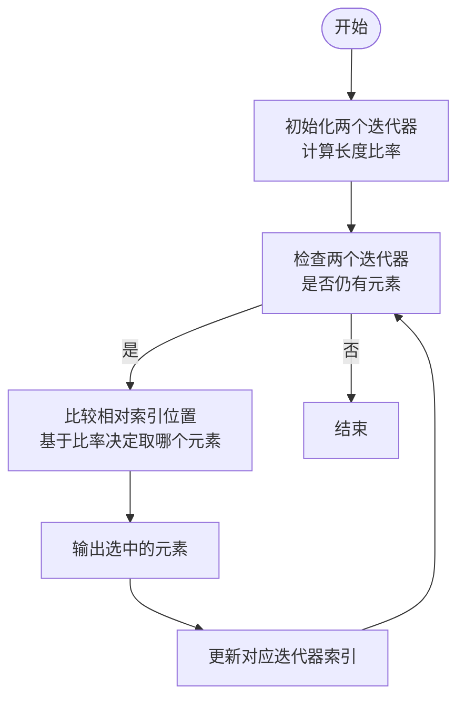
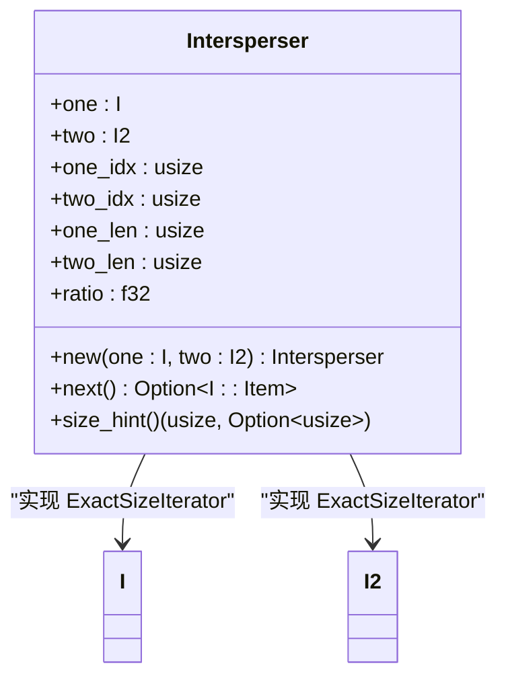

# 卡片穿插

<cite>
**本文档中引用的文件**  
- [intersperser.rs](file://rslib/src/scheduler/queue/builder/intersperser.rs)
</cite>

## 目录
1. [简介](#简介)
2. [穿插机制核心原理](#穿插机制核心原理)
3. [算法实现与逻辑分析](#算法实现与逻辑分析)
4. [穿插策略对学习节奏的影响](#穿插策略对学习节奏的影响)
5. [常见问题与调整策略](#常见问题与调整策略)
6. [性能考量与复杂度分析](#性能考量与复杂度分析)
7. [结论](#结论)

## 简介
Anki的调度系统通过智能穿插机制优化学习体验，将不同类型的学习任务（如新卡片学习、复习和预览）合理混合，避免单一类型卡片连续出现。这种设计有助于促进知识的多样化复习，提升记忆效果。本文深入解析`intersperser`模块如何实现这一机制，并探讨其对学习节奏的影响及可调参数。

**Section sources**
- [intersperser.rs](file://rslib/src/scheduler/queue/builder/intersperser.rs#L0-L133)

## 穿插机制核心原理
Anki使用`Intersperser`结构体作为适配器，将两个长度不同的迭代器均匀混合成一个序列。该机制基于两个输入序列的相对比例动态决定下一个元素的来源，确保较长序列的元素不会过度集中，同时尽可能均匀分布较短序列的元素。

穿插算法的核心思想是根据两个序列的长度计算比率，并利用该比率在遍历过程中动态判断应从哪个序列中取出下一个元素。这保证了即使两个序列长度差异较大，也能实现较为均衡的穿插效果。

**Diagram sources**
- [intersperser.rs](file://rslib/src/scheduler/queue/builder/intersperser.rs#L0-L133)

## 算法实现与逻辑分析
`Intersperser`结构体包含两个主要迭代器`one`和`two`，以及它们各自的索引和长度信息。构造函数`new`会预先计算两个序列长度的比率`(one_len + 1) as f32 / (two_len + 1) as f32`，以避免除零错误并平滑极端情况。

在每次调用`next()`方法时，算法会：
1. 检查两个迭代器是否还有剩余元素
2. 若两者都非空，则计算第二个序列的“相对索引”`(idx2 + 1) * ratio`
3. 将相对索引与第一个序列的实际索引比较，决定从哪个迭代器取值
4. 若其中一个已耗尽，则直接从另一个迭代器取值

这种设计确保了即使两个序列长度悬殊，也能实现尽可能均匀的穿插分布。

**Diagram sources**
- [intersperser.rs](file://rslib/src/scheduler/queue/builder/intersperser.rs#L0-L133)

## 穿插策略对学习节奏的影响
穿插机制显著改善了学习过程中的节奏感。通过避免同类卡片连续出现，用户能够在不同知识点之间切换，减少认知疲劳。例如，当新卡片与复习卡片穿插时，用户可以在掌握新知识的同时巩固旧知识，形成良好的学习循环。

此外，穿插策略还支持优先处理更长队列的任务，确保高负载类型的卡片不会被完全忽略。例如，若复习卡片数量远多于新卡片，系统会适当增加复习卡片的出现频率，但仍保持新卡片的定期出现，维持学习的新鲜感和进度平衡。

**Section sources**
- [intersperser.rs](file://rslib/src/scheduler/queue/builder/intersperser.rs#L0-L133)

## 常见问题与调整策略
尽管穿插机制设计精巧，但在实际使用中可能出现以下问题：

- **穿插不均**：当某一类型卡片数量极少时，可能长时间不出现。可通过调整调度参数或手动干预卡片队列来缓解。
- **特定类型延迟**：某些卡片可能因算法权重而被推迟。建议定期检查学习统计，确保所有卡片类型得到合理覆盖。
- **极端长度差异**：当两个队列长度差异极大时，短队列元素可能显得过于稀疏。此时可考虑分批处理或启用其他调度模式。

调整策略包括修改穿插比率计算方式、引入随机扰动因子或允许用户自定义穿插偏好。

## 性能考量与复杂度分析
`Intersperser`的实现具有优秀的性能特性：
- 时间复杂度：每次`next()`调用为O(1)，整体穿插过程为O(n+m)，其中n和m分别为两个序列的长度
- 空间复杂度：O(1)，仅需存储少量元数据
- 迭代器特性：实现了`ExactSizeIterator`，支持精确大小预测，便于上层调度器进行资源规划

由于不涉及复杂的数据结构操作或内存分配，该模块在大规模卡片集合下仍能保持高效运行。

**Section sources**
- [intersperser.rs](file://rslib/src/scheduler/queue/builder/intersperser.rs#L0-L133)

## 结论
Anki的卡片穿插机制通过`Intersperser`模块实现了高效且智能的任务混合策略。该机制不仅提升了学习体验的多样性与节奏感，还在性能上表现出色。理解其底层原理有助于用户更好地利用Anki进行高效学习，并为未来调度算法的优化提供了坚实基础。