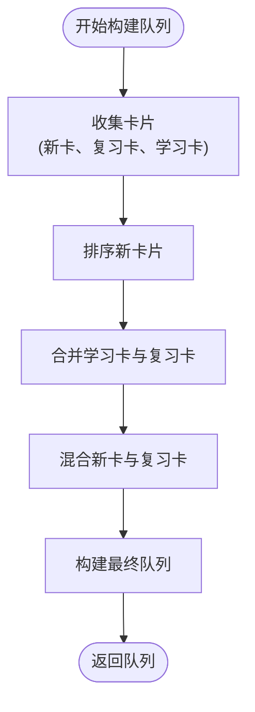
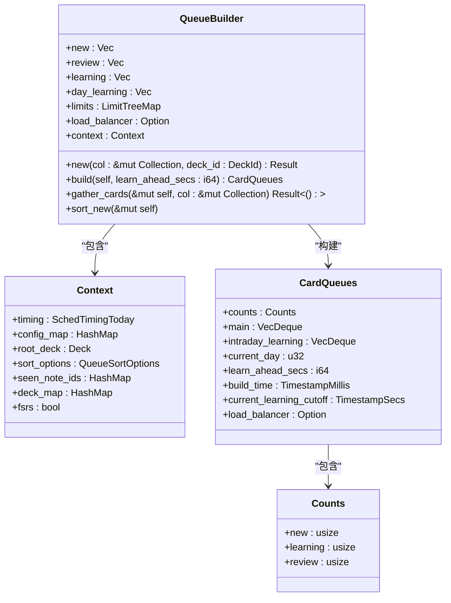
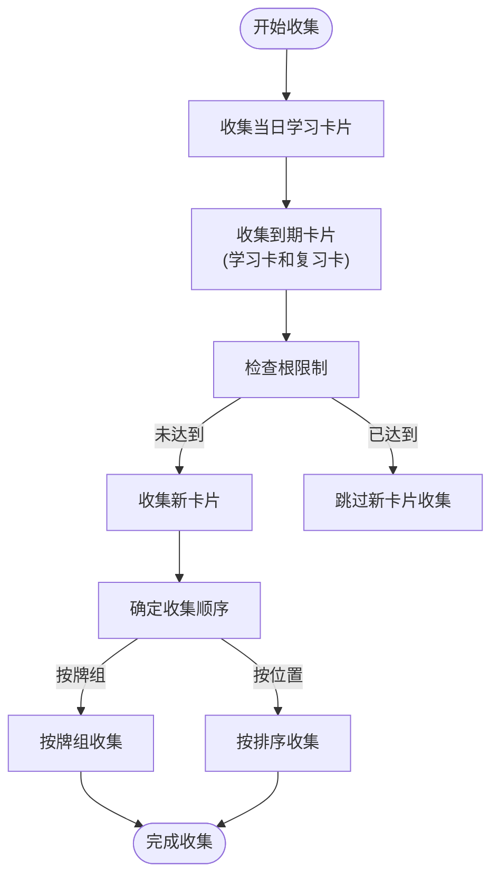
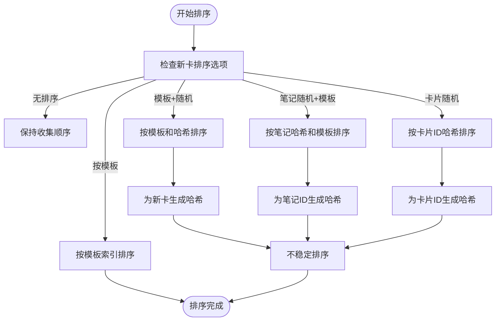
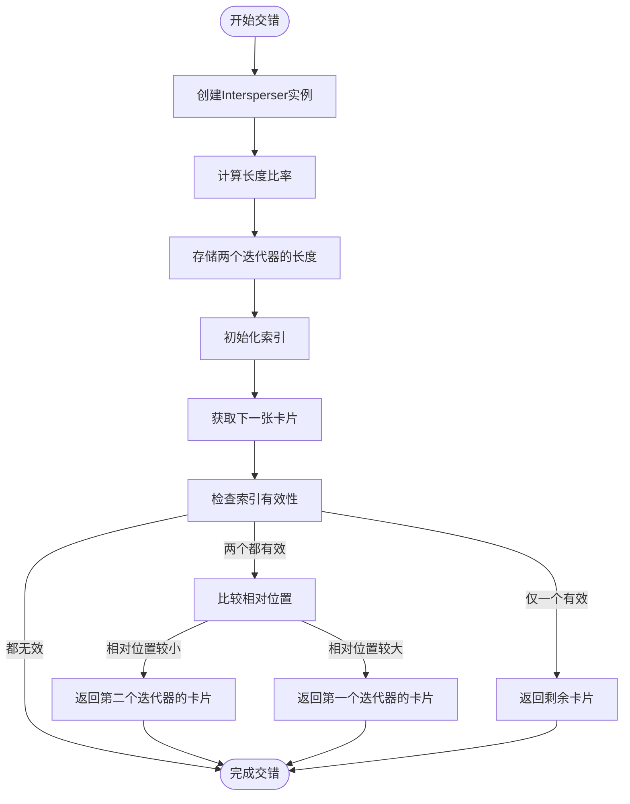
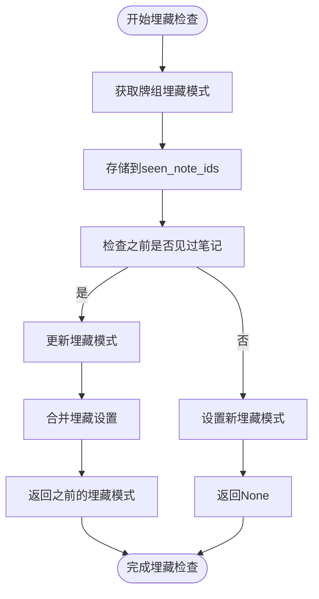
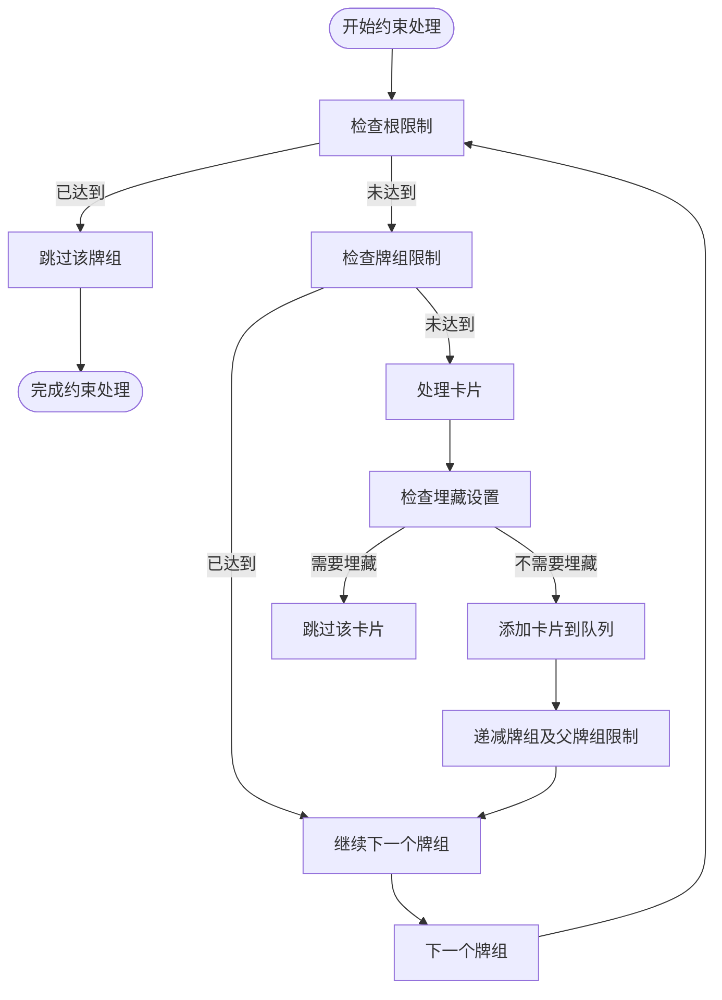
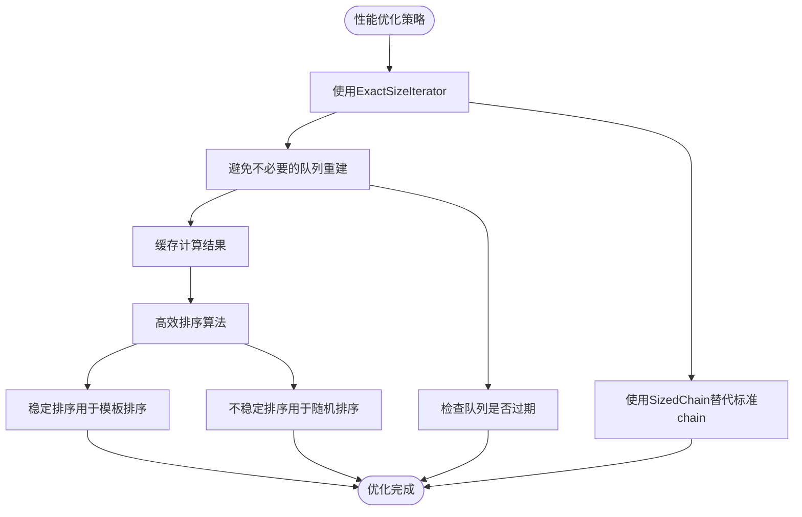

# 调度队列构建

<cite>
**本文档中引用的文件**  
- [main.rs](file://rslib/src/scheduler/queue/main.rs)
- [mod.rs](file://rslib/src/scheduler/queue/builder/mod.rs)
- [gathering.rs](file://rslib/src/scheduler/queue/builder/gathering.rs)
- [sorting.rs](file://rslib/src/scheduler/queue/builder/sorting.rs)
- [intersperser.rs](file://rslib/src/scheduler/queue/builder/intersperser.rs)
- [burying.rs](file://rslib/src/scheduler/queue/builder/burying.rs)
- [sized_chain.rs](file://rslib/src/scheduler/queue/builder/sized_chain.rs)
- [mod.rs](file://rslib/src/scheduler/queue/mod.rs)
- [entry.rs](file://rslib/src/scheduler/queue/entry.rs)
- [learning.rs](file://rslib/src/scheduler/queue/learning.rs)
</cite>

## 目录
1. [简介](#简介)
2. [队列构建流程概述](#队列构建流程概述)
3. [核心组件分析](#核心组件分析)
4. [收集机制](#收集机制)
5. [排序机制](#排序机制)
6. [交错机制](#交错机制)
7. [埋藏机制](#埋藏机制)
8. [约束处理](#约束处理)
9. [常见问题与解决方案](#常见问题与解决方案)
10. [性能优化](#性能优化)
11. [结论](#结论)

## 简介
Anki的调度队列构建机制是其学习系统的核心组成部分，负责组织和管理待学习的卡片。该机制通过一系列子模块协同工作，确保用户能够按照最优的学习节奏进行复习。队列构建过程涉及卡片的收集、排序、交错和约束处理等多个环节，每个环节都有其特定的功能和实现方式。

## 队列构建流程概述

**Diagram sources**
- [mod.rs](file://rslib/src/scheduler/queue/builder/mod.rs#L1-L547)

**Section sources**
- [mod.rs](file://rslib/src/scheduler/queue/builder/mod.rs#L1-L547)

## 核心组件分析

**Diagram sources**
- [mod.rs](file://rslib/src/scheduler/queue/builder/mod.rs#L1-L547)
- [mod.rs](file://rslib/src/scheduler/queue/mod.rs#L1-L302)

**Section sources**
- [mod.rs](file://rslib/src/scheduler/queue/builder/mod.rs#L1-L547)
- [mod.rs](file://rslib/src/scheduler/queue/mod.rs#L1-L302)

## 收集机制

**Diagram sources**
- [gathering.rs](file://rslib/src/scheduler/queue/builder/gathering.rs#L1-L177)

**Section sources**
- [gathering.rs](file://rslib/src/scheduler/queue/builder/gathering.rs#L1-L177)

## 排序机制

**Diagram sources**
- [sorting.rs](file://rslib/src/scheduler/queue/builder/sorting.rs#L1-L82)

**Section sources**
- [sorting.rs](file://rslib/src/scheduler/queue/builder/sorting.rs#L1-L82)

## 交错机制

**Diagram sources**
- [intersperser.rs](file://rslib/src/scheduler/queue/builder/intersperser.rs#L1-L134)

**Section sources**
- [intersperser.rs](file://rslib/src/scheduler/queue/builder/intersperser.rs#L1-L134)

## 埋藏机制

**Diagram sources**
- [burying.rs](file://rslib/src/scheduler/queue/builder/burying.rs#L1-L95)

**Section sources**
- [burying.rs](file://rslib/src/scheduler/queue/builder/burying.rs#L1-L95)

## 约束处理

**Diagram sources**
- [gathering.rs](file://rslib/src/scheduler/queue/builder/gathering.rs#L1-L177)
- [mod.rs](file://rslib/src/scheduler/queue/builder/mod.rs#L1-L547)

**Section sources**
- [gathering.rs](file://rslib/src/scheduler/queue/builder/gathering.rs#L1-L177)
- [mod.rs](file://rslib/src/scheduler/queue/builder/mod.rs#L1-L547)

## 常见问题与解决方案

### 卡片排序异常
当用户发现卡片排序不符合预期时，可能是由于以下原因：
- 牌组配置中的排序选项设置不正确
- 新卡收集优先级与排序顺序不匹配
- 哈希种子计算出现问题

**解决方案**：检查牌组配置中的`new_card_sort_order`和`new_card_gather_priority`设置，确保它们符合用户的期望。

### 队列为空
队列为空可能由以下情况导致：
- 所有牌组的每日限制都已达到
- 用户设置了不正确的牌组限制
- 牌组中没有符合条件的卡片

**解决方案**：检查牌组的每日新卡和复习卡限制，确认是否有足够的卡片可供学习。

### 埋藏功能失效
埋藏功能可能因为以下原因失效：
- 牌组配置中的埋藏选项未启用
- 笔记级别的埋藏状态未正确更新
- 系统在处理兄弟卡片时出现逻辑错误

**解决方案**：验证牌组配置中的`bury_new`、`bury_reviews`和`bury_interday_learning`设置，并检查`seen_note_ids`映射的更新逻辑。

**Section sources**
- [mod.rs](file://rslib/src/scheduler/queue/builder/mod.rs#L1-L547)
- [gathering.rs](file://rslib/src/scheduler/queue/builder/gathering.rs#L1-L177)
- [burying.rs](file://rslib/src/scheduler/queue/builder/burying.rs#L1-L95)

## 性能优化

**Diagram sources**
- [sized_chain.rs](file://rslib/src/scheduler/queue/builder/sized_chain.rs#L1-L81)
- [sorting.rs](file://rslib/src/scheduler/queue/builder/sorting.rs#L1-L82)
- [mod.rs](file://rslib/src/scheduler/queue/mod.rs#L1-L302)

**Section sources**
- [sized_chain.rs](file://rslib/src/scheduler/queue/builder/sized_chain.rs#L1-L81)
- [sorting.rs](file://rslib/src/scheduler/queue/builder/sorting.rs#L1-L82)
- [mod.rs](file://rslib/src/scheduler/queue/mod.rs#L1-L302)

## 结论
Anki的调度队列构建机制是一个复杂而精密的系统，通过收集、排序、交错和约束处理等多个子模块的协同工作，为用户提供了一个高效的学习体验。该机制不仅考虑了卡片的学习状态和优先级，还充分考虑了用户的个性化设置和各种约束条件。通过深入理解这一机制的工作原理，开发者可以更好地优化系统性能，解决潜在问题，并为用户提供更加智能和个性化的学习体验。