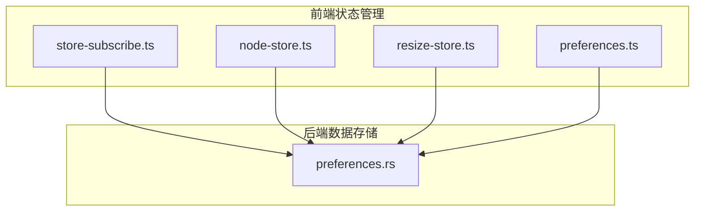
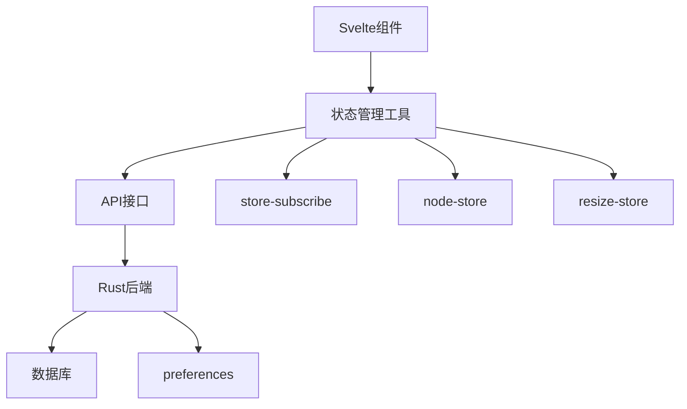
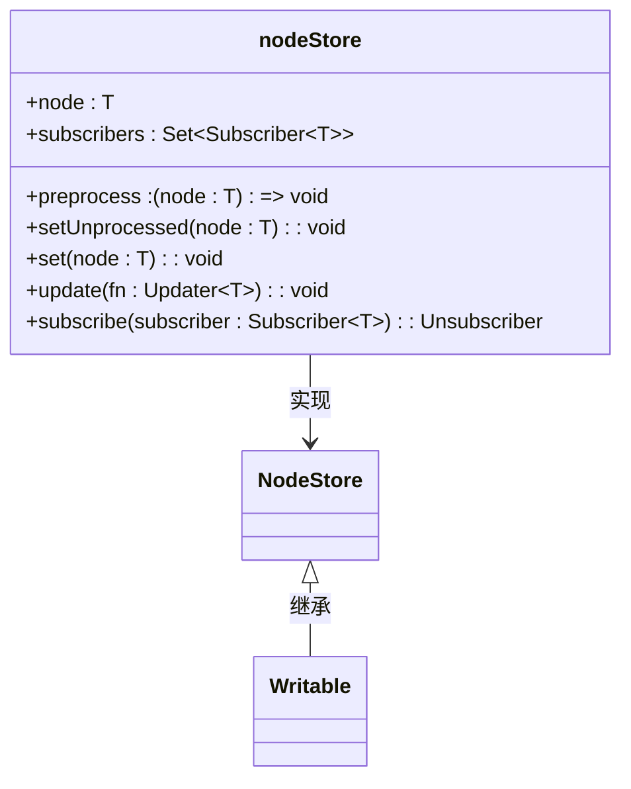
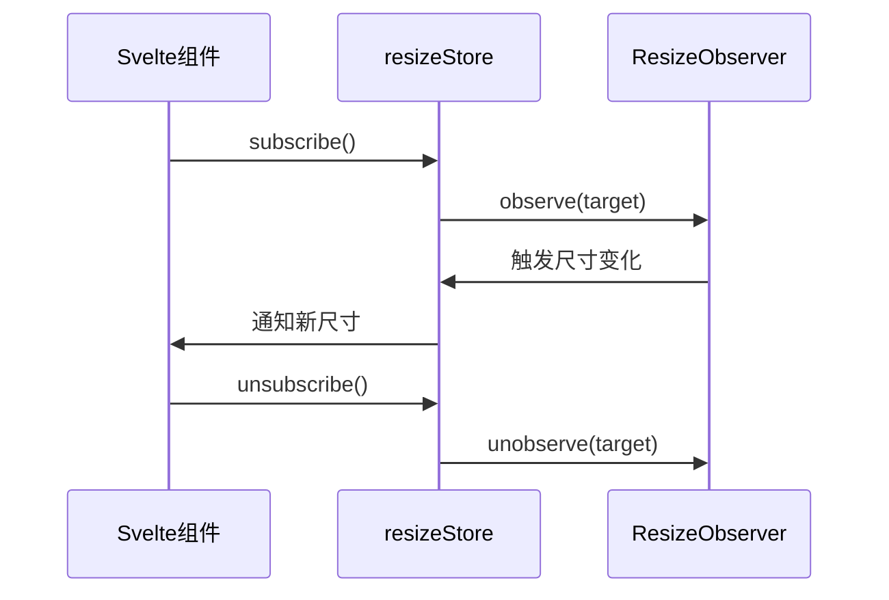
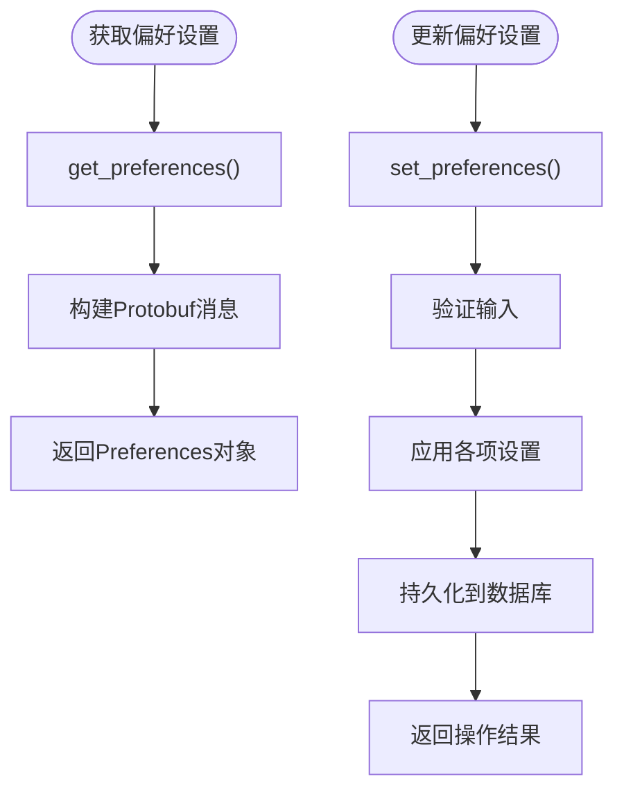
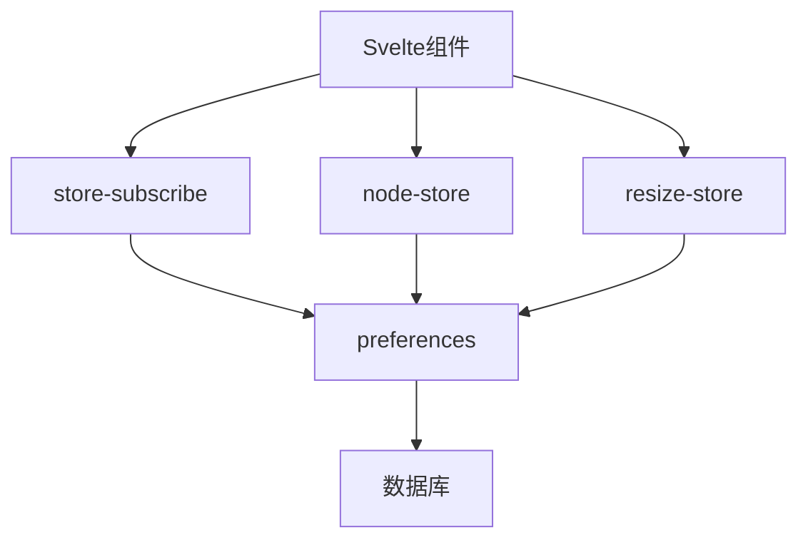

# Svelte状态管理

<cite>
**本文档中引用的文件**  
- [store-subscribe.ts](file://ts/lib/sveltelib/store-subscribe.ts)
- [node-store.ts](file://ts/lib/sveltelib/node-store.ts)
- [resize-store.ts](file://ts/lib/sveltelib/resize-store.ts)
- [preferences.rs](file://rslib/src/preferences.rs)
</cite>

## 目录
1. [简介](#简介)
2. [项目结构](#项目结构)
3. [核心组件](#核心组件)
4. [架构概述](#架构概述)
5. [详细组件分析](#详细组件分析)
6. [依赖分析](#依赖分析)
7. [性能考虑](#性能考虑)
8. [故障排除指南](#故障排除指南)
9. [结论](#结论)

## 简介
本文档深入探讨Anki应用中基于Svelte框架的状态管理机制。重点分析了`store-subscribe.ts`中的订阅机制如何高效管理组件状态更新，`node-store.ts`中节点存储的实现原理，`resize-store.ts`对窗口大小变化的响应式处理，以及`preferences.rs`中用户偏好设置的状态管理。通过实际应用场景如图像遮蔽和卡片预览功能，展示状态管理的具体实现方式，并为不同层次开发者提供最佳实践建议。

## 项目结构
Anki的前端状态管理主要集中在TypeScript代码库中，特别是`ts/lib/sveltelib/`目录下的核心状态管理模块。这些模块与后端Rust代码通过清晰的接口进行交互，形成了完整的状态管理体系。



**图示来源**  
- [store-subscribe.ts](file://ts/lib/sveltelib/store-subscribe.ts#L1-L42)
- [node-store.ts](file://ts/lib/sveltelib/node-store.ts#L1-L50)
- [resize-store.ts](file://ts/lib/sveltelib/resize-store.ts#L1-L44)
- [preferences.rs](file://rslib/src/preferences.rs#L1-L156)

**本节来源**  
- [ts/lib/sveltelib/store-subscribe.ts](file://ts/lib/sveltelib/store-subscribe.ts#L1-L42)
- [ts/lib/sveltelib/node-store.ts](file://ts/lib/sveltelib/node-store.ts#L1-L50)

## 核心组件
本文档的核心组件包括四个关键文件：`store-subscribe.ts`实现了安全的订阅机制，`node-store.ts`管理DOM节点的状态，`resize-store.ts`处理窗口尺寸变化的响应，`preferences.rs`则负责持久化用户偏好设置。这些组件共同构成了Anki应用的状态管理基础架构。

**本节来源**  
- [store-subscribe.ts](file://ts/lib/sveltelib/store-subscribe.ts#L1-L42)
- [node-store.ts](file://ts/lib/sveltelib/node-store.ts#L1-L50)
- [resize-store.ts](file://ts/lib/sveltelib/resize-store.ts#L1-L44)
- [preferences.rs](file://rslib/src/preferences.rs#L1-L156)

## 架构概述
Anki的状态管理采用分层架构设计，前端Svelte组件通过专门的状态管理工具与后端Rust数据存储进行交互。这种设计实现了关注点分离，确保了状态变更的一致性和可预测性。



**图示来源**  
- [store-subscribe.ts](file://ts/lib/sveltelib/store-subscribe.ts#L1-L42)
- [node-store.ts](file://ts/lib/sveltelib/node-store.ts#L1-L50)
- [resize-store.ts](file://ts/lib/sveltelib/resize-store.ts#L1-L44)
- [preferences.rs](file://rslib/src/preferences.rs#L1-L156)

## 详细组件分析

### store-subscribe机制分析
`store-subscribe.ts`文件实现了一个防止重复订阅的安全机制。该机制通过封装Svelte的原生store订阅功能，确保在组件生命周期中不会发生重复订阅或取消订阅的问题。

```mermaid
classDiagram
class storeSubscribe {
+store : Readable~T~
+callback : (value : T) => void
+start : boolean
+subscribe() : void
+unsubscribe() : void
}
storeSubscribe --> StoreAccessors : 实现
StoreAccessors {
+subscribe() : void
+unsubscribe() : void
}
```

**图示来源**  
- [store-subscribe.ts](file://ts/lib/sveltelib/store-subscribe.ts#L13-L39)

**本节来源**  
- [store-subscribe.ts](file://ts/lib/sveltelib/store-subscribe.ts#L1-L42)

### node-store实现原理
`node-store.ts`实现了专门用于管理DOM节点的状态存储。该组件允许对节点进行预处理，并通过isEqualNode方法优化更新检测，避免不必要的重渲染。



**图示来源**  
- [node-store.ts](file://ts/lib/sveltelib/node-store.ts#L10-L47)

**本节来源**  
- [node-store.ts](file://ts/lib/sveltelib/node-store.ts#L1-L50)

### resize-store响应式处理
`resize-store.ts`封装了ResizeObserver API，创建了一个响应式的尺寸变化store。当有订阅者时自动开始观察目标元素，最后一个订阅者取消时自动停止观察，实现了资源的高效管理。



**图示来源**  
- [resize-store.ts](file://ts/lib/sveltelib/resize-store.ts#L21-L41)

**本节来源**  
- [resize-store.ts](file://ts/lib/sveltelib/resize-store.ts#L1-L44)

### preferences状态管理
`preferences.rs`文件实现了用户偏好设置的获取和更新逻辑。通过Protobuf消息格式与前端通信，确保了跨平台的一致性，并提供了类型安全的配置管理。



**图示来源**  
- [preferences.rs](file://rslib/src/preferences.rs#L1-L156)

**本节来源**  
- [preferences.rs](file://rslib/src/preferences.rs#L1-L156)

## 依赖分析
Anki的状态管理组件之间存在清晰的依赖关系。前端Svelte组件依赖于专门的状态管理工具，这些工具又通过API层与后端Rust代码交互。后端代码负责数据持久化和业务逻辑处理。



**图示来源**  
- [store-subscribe.ts](file://ts/lib/sveltelib/store-subscribe.ts#L1-L42)
- [node-store.ts](file://ts/lib/sveltelib/node-store.ts#L1-L50)
- [resize-store.ts](file://ts/lib/sveltelib/resize-store.ts#L1-L44)
- [preferences.rs](file://rslib/src/preferences.rs#L1-L156)

**本节来源**  
- [store-subscribe.ts](file://ts/lib/sveltelib/store-subscribe.ts#L1-L42)
- [node-store.ts](file://ts/lib/sveltelib/node-store.ts#L1-L50)
- [resize-store.ts](file://ts/lib/sveltelib/resize-store.ts#L1-L44)
- [preferences.rs](file://rslib/src/preferences.rs#L1-L156)

## 性能考虑
Anki的状态管理设计充分考虑了性能优化。通过避免重复订阅、使用节点相等性检查、按需激活观察器等策略，最大限度地减少了不必要的计算和内存占用。这种精细化的状态管理对于保持应用的响应速度至关重要，特别是在处理大量卡片和复杂用户界面时。

## 故障排除指南
当遇到状态管理相关问题时，应首先检查订阅生命周期是否正确管理，确保没有内存泄漏。对于DOM节点更新问题，验证preprocess函数的正确性。尺寸响应问题通常与ResizeObserver的激活状态有关，而偏好设置问题则需要检查前后端数据序列化的一致性。

**本节来源**  
- [store-subscribe.ts](file://ts/lib/sveltelib/store-subscribe.ts#L1-L42)
- [node-store.ts](file://ts/lib/sveltelib/node-store.ts#L1-L50)
- [resize-store.ts](file://ts/lib/sveltelib/resize-store.ts#L1-L44)
- [preferences.rs](file://rslib/src/preferences.rs#L1-L156)

## 结论
Anki的Svelte状态管理实现展示了如何在复杂应用中有效组织和管理状态。通过专门化的状态管理工具、清晰的分层架构和性能优化策略，实现了高效、可靠的状态管理。这套系统既满足了初学者对响应式编程的基本需求，也为高级开发者提供了足够的灵活性和控制力，是现代前端状态管理的优秀实践案例。