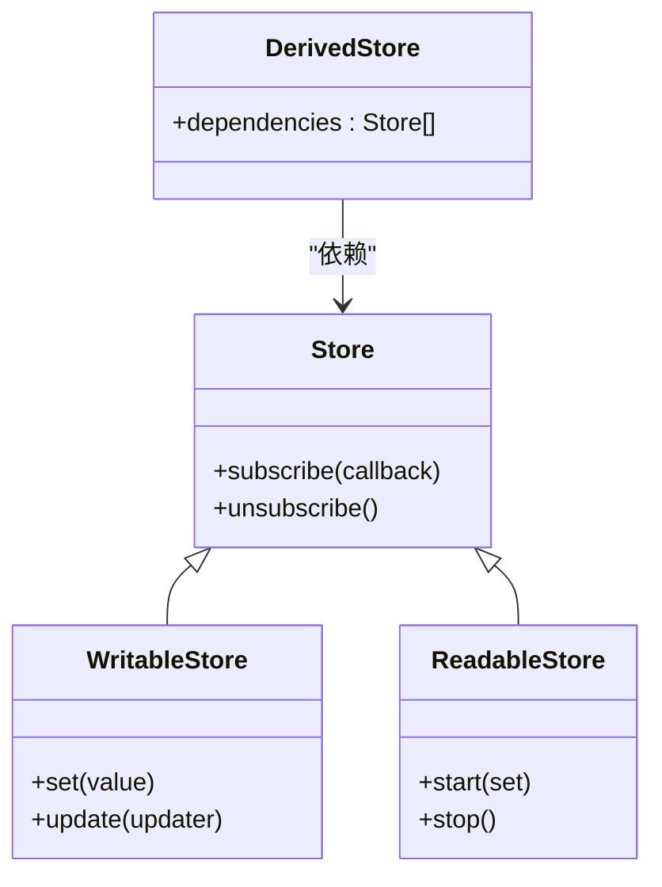
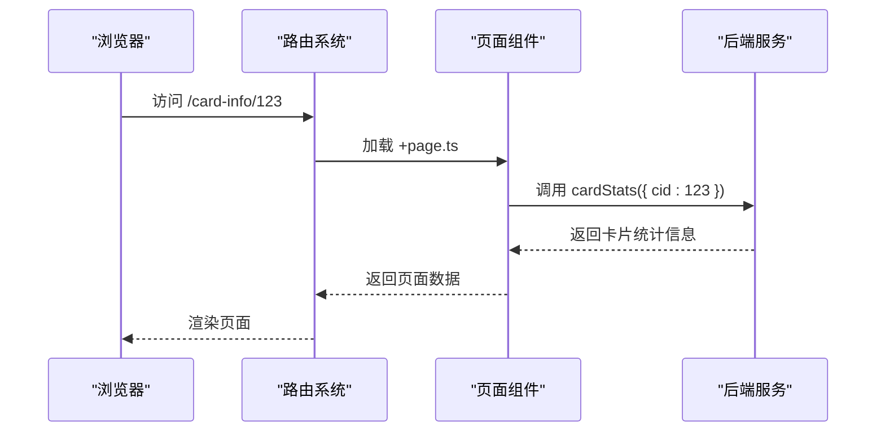
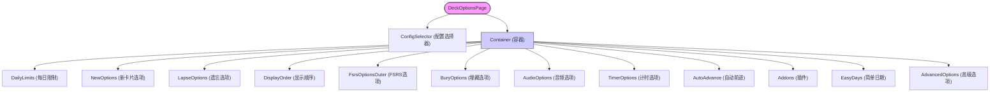
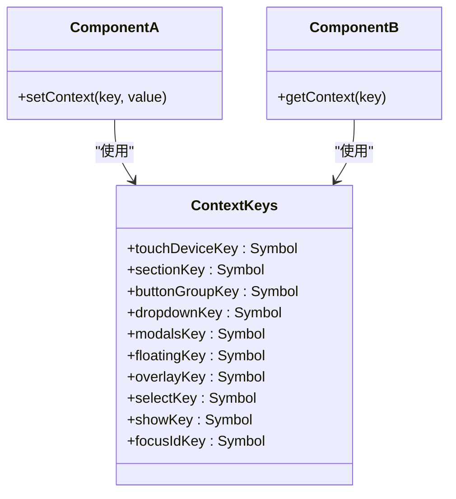

# Svelte组件架构

<cite>
**本文档引用的文件**
- [context-keys.ts](file://ts/lib/components/context-keys.ts)
- [DeckOptionsPage.svelte](file://ts/routes/deck-options/DeckOptionsPage.svelte)
- [+page.ts](file://ts/routes/card-info/[cardId]/+page.ts)
- [auto-update.ts](file://ts/lib/sveltelib/position/auto-update.ts)
- [store-subscribe.ts](file://ts/lib/sveltelib/store-subscribe.ts)
- [theme.ts](file://ts/lib/sveltelib/theme.ts)
</cite>

## 目录
1. [引言](#引言)
2. [Svelte框架设计原理](#svelte框架设计原理)
3. [组件生命周期与响应式声明](#组件生命周期与响应式声明)
4. [状态管理机制](#状态管理机制)
5. [前端路由系统实现](#前端路由系统实现)
6. [上下文键值系统](#上下文键值系统)
7. [Svelte辅助库设计与使用](#svelte辅助库设计与使用)
8. [组件创建与组合模式](#组件创建与组合模式)
9. [初学者指导](#初学者指导)
10. [性能优化建议](#性能优化建议)
11. [最佳实践](#最佳实践)

## 引言
本文档详细阐述Anki项目中Svelte组件架构的设计与实现。文档涵盖Svelte框架的核心概念、组件通信机制、状态管理策略以及实际应用中的最佳实践，为开发者提供全面的技术指导。

## Svelte框架设计原理
Svelte作为一种编译时框架，在构建阶段将组件转换为高效的原生JavaScript代码，避免了运行时虚拟DOM的开销。这种设计使得Anki的前端应用具有出色的性能表现和快速的响应能力。

**Section sources**
- [theme.ts](file://ts/lib/sveltelib/theme.ts#L1-L35)

## 组件生命周期与响应式声明
Svelte组件通过声明式语法实现响应式更新，当数据变化时自动更新DOM。组件的生命周期由编译器管理，开发者可以通过`onMount`、`beforeUpdate`等函数钩子在特定阶段执行逻辑。

**Section sources**
- [auto-update.ts](file://ts/lib/sveltelib/position/auto-update.ts#L1-L56)

## 状态管理机制
Svelte提供内置的可读、可写和派生存储机制，实现跨组件的状态共享。通过`writable`、`readable`和`derived`函数创建存储实例，组件可以订阅这些存储以响应状态变化。

**Diagram sources**
- [store-subscribe.ts](file://ts/lib/sveltelib/store-subscribe.ts#L1-L42)

## 前端路由系统实现
Anki使用基于文件系统的路由机制，通过SvelteKit的约定式路由实现页面导航。路由文件位于`ts/routes`目录下，每个目录对应一个路由层级，`[param]`表示动态路由参数。

### card-info页面组件
card-info路由用于显示卡片详细信息，通过动态参数`[cardId]`获取特定卡片的数据。页面加载时调用后端API获取卡片统计信息并渲染。

**Diagram sources**
- [+page.ts](file://ts/routes/card-info/[cardId]/+page.ts#L1-L19)

### deck-options页面组件
deck-options路由用于配置牌组选项，采用模块化设计将不同功能选项分解为独立组件。主页面通过组合这些组件实现完整的配置界面。

**Diagram sources**
- [DeckOptionsPage.svelte](file://ts/routes/deck-options/DeckOptionsPage.svelte#L1-L149)

## 上下文键值系统
context-keys.ts文件定义了全局上下文键值，用于在组件树中传递共享数据。通过Symbol创建唯一的键值，避免命名冲突，实现类型安全的上下文通信。

**Diagram sources**
- [context-keys.ts](file://ts/lib/components/context-keys.ts#L1-L13)

## Svelte辅助库设计与使用
sveltelib目录包含一系列Svelte辅助工具，提供通用功能和最佳实践的封装。

### position库
position库基于floating-ui实现浮动元素的定位功能，提供自动更新、位置算法等工具，用于实现下拉菜单、工具提示等UI组件。

**Section sources**
- [auto-update.ts](file://ts/lib/sveltelib/position/auto-update.ts#L1-L56)

### store-subscribe库
store-subscribe库提供安全的存储订阅机制，防止重复订阅和取消订阅，确保资源的正确释放。

**Section sources**
- [store-subscribe.ts](file://ts/lib/sveltelib/store-subscribe.ts#L1-L42)

### theme库
theme库管理应用的主题状态，通过观察document元素的class变化实时响应主题切换，支持夜间模式等功能。

**Section sources**
- [theme.ts](file://ts/lib/sveltelib/theme.ts#L1-L35)

## 组件创建与组合模式
Svelte组件采用单文件组件(SFC)格式，将模板、脚本和样式封装在单一文件中。通过import语句导入其他组件，使用标签语法进行组合，实现组件的复用和嵌套。

## 初学者指导
对于Svelte初学者，建议从基础概念入手：理解响应式声明、学习存储机制、掌握组件通信方式。通过阅读Anki中的简单组件示例，逐步理解复杂组件的实现模式。

## 性能优化建议
1. 避免不必要的重新渲染，使用`{#if}`条件渲染替代`display: none`
2. 合理使用存储，避免过度订阅
3. 对于复杂计算，使用派生存储缓存结果
4. 利用Svelte的编译优化，编写简洁的响应式代码

## 最佳实践
1. 保持组件单一职责，避免功能过于复杂
2. 使用TypeScript增强类型安全
3. 遵循Anki的代码风格和命名约定
4. 充分利用Svelte的内置功能，减少外部依赖
5. 编写可测试的组件，确保代码质量