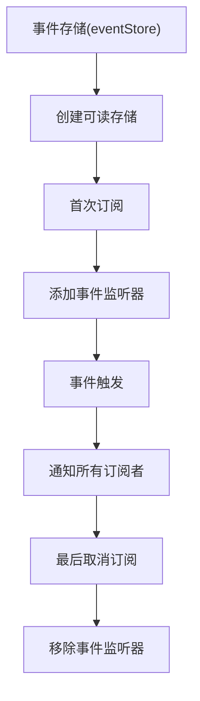
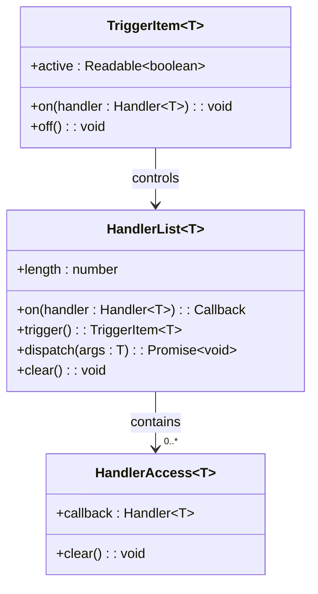

# Svelte组件通信机制

<cite>
**本文档中引用的文件**  
- [context-keys.ts](file://ts/lib/components/context-keys.ts)
- [context-property.ts](file://ts/lib/sveltelib/context-property.ts)
- [event-store.ts](file://ts/lib/sveltelib/event-store.ts)
- [handler-list.ts](file://ts/lib/sveltelib/handler-list.ts)
- [card-info/[cardId]/+page.ts](file://ts/routes/card-info/[cardId]/+page.ts)
- [deck-options/[deckId]/+page.ts](file://ts/routes/deck-options/[deckId]/+page.ts)
</cite>

## 目录
1. [引言](#引言)
2. [Svelte上下文基础概念](#svelte上下文基础概念)
3. [上下文键值系统详解](#上下文键值系统详解)
4. [上下文属性实现原理](#上下文属性实现原理)
5. [事件驱动通信机制](#事件驱动通信机制)
6. [实际应用示例](#实际应用示例)
7. [最佳实践与性能优化](#最佳实践与性能优化)
8. [结论](#结论)

## 引言
Anki前端采用Svelte框架构建，其组件通信机制是理解应用架构的关键。本文深入分析Anki中基于Svelte的组件通信系统，重点解析上下文(Context)机制、事件存储(Event Store)和处理器列表(Handler List)等核心通信模式。这些机制共同实现了跨层级组件间高效、解耦的状态共享和事件传递。

## Svelte上下文基础概念

Svelte上下文(Context)是一种允许父组件向其任意深度的后代组件传递数据的机制，避免了传统"props层层传递"的繁琐。与React的Context类似，Svelte的`setContext`和`getContext`提供了一种安全的依赖注入方式。上下文在组件树中创建一个作用域，只有在该作用域内的组件才能访问特定的上下文值。

**Section sources**
- [context-property.ts](file://ts/lib/sveltelib/context-property.ts#L1-L47)

## 上下文键值系统详解

Anki通过`context-keys.ts`文件集中管理所有上下文键值，使用ES6的`Symbol`类型确保键的唯一性，避免命名冲突。系统分为多个功能域：

- **设备与布局**：`touchDeviceKey`用于检测触摸设备，`sectionKey`管理页面区域
- **UI组件**：`buttonGroupKey`、`dropdownKey`、`selectKey`等为复合UI组件提供内部通信
- **模态与浮层**：`modalsKey`、`floatingKey`、`overlayKey`协调弹窗和浮动元素的层级管理
- **状态管理**：`showKey`控制显示状态，`focusIdKey`管理焦点元素

这种集中式键值管理确保了全局上下文的一致性和可维护性。

**Section sources**
- [context-keys.ts](file://ts/lib/components/context-keys.ts#L1-L14)
- [context-keys.ts](file://ts/lib/tslib/context-keys.ts#L1-L10)

## 上下文属性实现原理

`context-property.ts`实现了一个高级抽象`contextProperty`，封装了Svelte原生的上下文API。其核心是一个工厂函数，接收一个Symbol键并返回一个元组`[ContextProperty<T>, SetContextPropertyAction<T>]`。

`ContextProperty<T>`接口提供`get()`和`available()`方法，前者获取上下文值（类型声明为非undefined，但实际可能为undefined），后者安全检查上下文是否存在。`set`函数封装了`setContext`调用。这种模式强制了类型安全的上下文使用，避免了直接操作原生API的潜在错误。

**Section sources**
- [context-property.ts](file://ts/lib/sveltelib/context-property.ts#L1-L47)

## 事件驱动通信机制

### 事件存储(Event Store)

`event-store.ts`利用Svelte的可读存储(Readable Store)实现事件驱动通信。`eventStore`函数创建一个与DOM事件绑定的存储，当有订阅者时自动添加事件监听器，无订阅者时自动移除，实现了资源的自动管理。

**Diagram sources**
- [event-store.ts](file://ts/lib/sveltelib/event-store.ts#L1-L74)

### 处理器列表(Handler List)

`handler-list.ts`实现了一个强大的事件处理器管理系统。`HandlerList<T>`类维护一个处理器列表，支持动态添加和移除。`trigger`方法返回一个`TriggerItem`，提供`on`/`off`开关和`active`状态存储，非常适合实现临时输入处理器。

`once`选项支持一次性事件处理器。`dispatch`方法并发执行所有处理器并聚合Promise结果。这种设计模式非常适合实现命令模式或观察者模式。

**Diagram sources**
- [handler-list.ts](file://ts/lib/sveltelib/handler-list.ts#L1-L175)

**Section sources**
- [event-store.ts](file://ts/lib/sveltelib/event-store.ts#L1-L74)
- [handler-list.ts](file://ts/lib/sveltelib/handler-list.ts#L1-L175)

## 实际应用示例

### card-info页面通信

在`card-info`页面中，通过Svelte的`load`函数异步获取卡片统计信息。该数据通过路由上下文传递给子组件，实现了数据获取与UI渲染的分离。组件树通过上下文共享`info`数据，避免了props的深层传递。

**Section sources**
- [card-info/[cardId]/+page.ts](file://ts/routes/card-info/[cardId]/+page.ts#L1-L20)

### deck-options页面通信

`deck-options`页面利用`HandlerList`管理用户交互事件。当用户修改牌组选项时，事件处理器被激活，收集变更并提交到后端。`active`存储可用于禁用其他竞争性输入，确保操作的原子性。

**Section sources**
- [deck-options/[deckId]/+page.ts](file://ts/routes/deck-options/[deckId]/+page.ts#L1-L20)

## 最佳实践与性能优化

1. **避免过度使用上下文**：仅对真正需要跨多层传递的状态使用上下文，避免将上下文当作全局状态机
2. **合理使用Symbol键**：始终使用`Symbol`而非字符串作为上下文键，防止命名冲突
3. **及时清理事件监听器**：利用`event-store`的自动管理特性，避免内存泄漏
4. **控制处理器生命周期**：使用`once`选项或手动`off`来清理一次性处理器
5. **类型安全优先**：通过`context-property`等封装确保类型安全，减少运行时错误
6. **性能监控**：对于高频事件，考虑节流或防抖，避免过度重渲染

## 结论
Anki的Svelte组件通信机制展现了现代前端架构的优雅设计。通过上下文、事件存储和处理器列表的组合，实现了高度解耦、类型安全且性能优良的组件交互。理解这些机制不仅有助于贡献Anki开发，也为构建复杂Svelte应用提供了最佳实践范本。