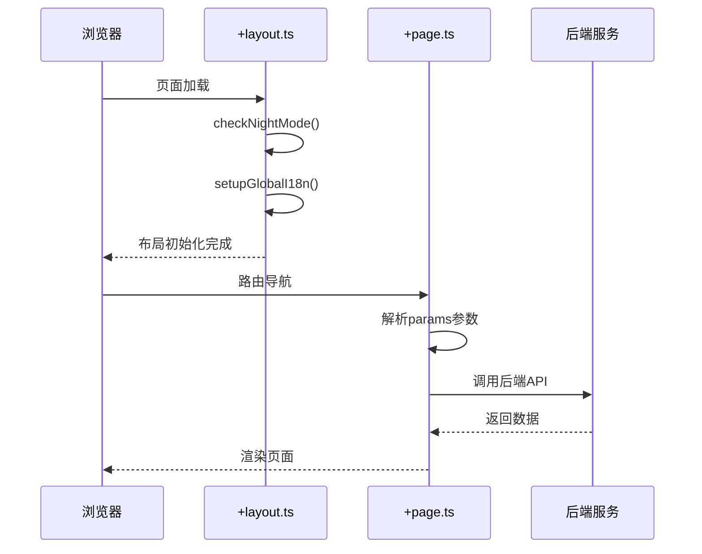
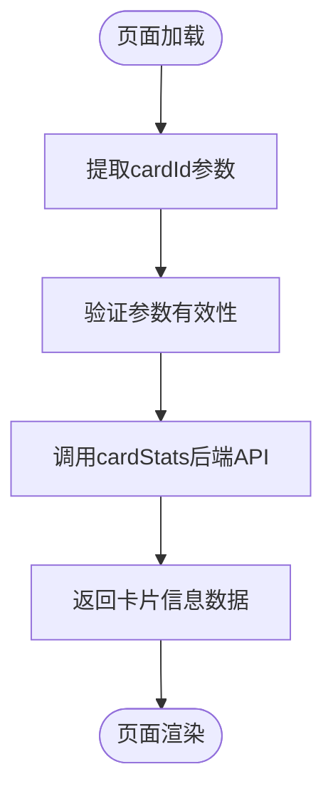
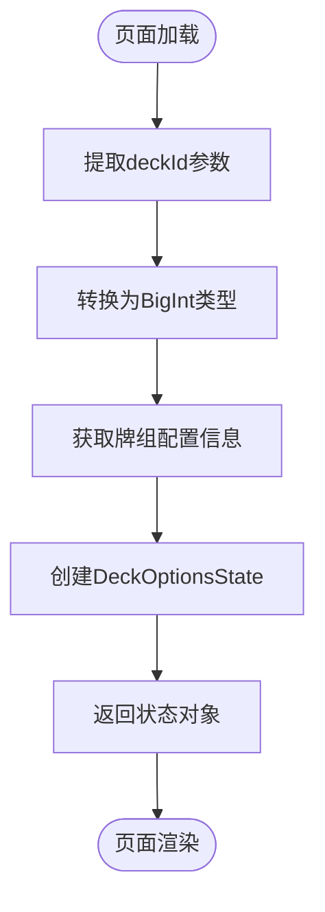
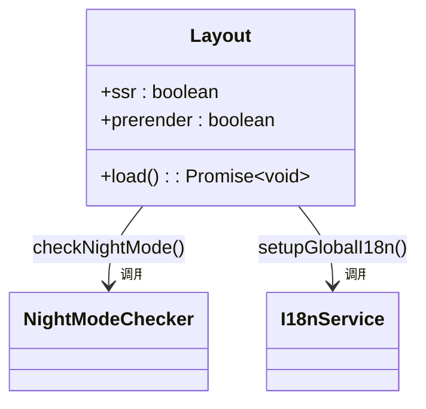
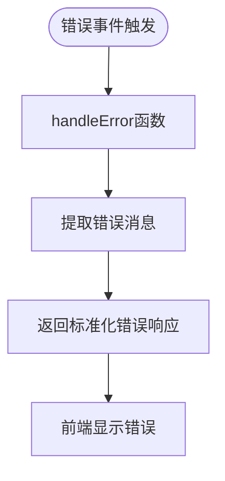

# Svelte路由系统实现

<cite>
**本文档中引用的文件**
- [card-info/[cardId]/+page.ts](file://ts/routes/card-info/[cardId]/+page.ts)
- [deck-options/[deckId]/+page.ts](file://ts/routes/deck-options/[deckId]/+page.ts)
- [+layout.ts](file://ts/routes/+layout.ts)
- [hooks.client.js](file://ts/src/hooks.client.js)
</cite>

## 目录
1. [简介](#简介)
2. [项目结构](#项目结构)
3. [核心组件](#核心组件)
4. [架构概述](#架构概述)
5. [详细组件分析](#详细组件分析)
6. [依赖分析](#依赖分析)
7. [性能考虑](#性能考虑)
8. [故障排除指南](#故障排除指南)
9. [结论](#结论)

## 简介
本文档深入解析Anki中基于SvelteKit的路由系统实现机制。重点分析动态路由参数处理、数据加载逻辑以及客户端初始化流程，为开发者提供完整的路由系统理解。

## 项目结构
Anki的Svelte路由系统位于`ts/routes`目录下，采用SvelteKit的标准路由结构。系统通过文件系统驱动的路由机制实现页面导航和数据获取。

```mermaid
graph TD
A[ts/routes] --> B[card-info/[cardId]]
A --> C[deck-options/[deckId]]
A --> D[+layout.ts]
A --> E[hooks.client.js]
B --> F[+page.ts]
C --> G[+page.ts]
```

**图示来源**
- [card-info/[cardId]/+page.ts](file://ts/routes/card-info/[cardId]/+page.ts)
- [deck-options/[deckId]/+page.ts](file://ts/routes/deck-options/[deckId]/+page.ts)
- [+layout.ts](file://ts/routes/+layout.ts)

**章节来源**
- [ts/routes](file://ts/routes)

## 核心组件
Svelte路由系统的核心组件包括动态路由处理、数据加载函数和布局组件。系统通过`+page.ts`文件实现页面级数据获取，利用`+layout.ts`提供跨页面的共享逻辑。

**章节来源**
- [card-info/[cardId]/+page.ts](file://ts/routes/card-info/[cardId]/+page.ts)
- [deck-options/[deckId]/+page.ts](file://ts/routes/deck-options/[deckId]/+page.ts)
- [+layout.ts](file://ts/routes/+layout.ts)

## 架构概述
Anki的Svelte路由系统采用服务端渲染(SSR)禁用的客户端优先架构，通过异步数据加载实现动态内容获取。



**图示来源**
- [+layout.ts](file://ts/routes/+layout.ts#L10-L15)
- [card-info/[cardId]/+page.ts](file://ts/routes/card-info/[cardId]/+page.ts#L14-L19)

## 详细组件分析

### 动态路由参数处理
SvelteKit通过文件夹命名实现动态路由，方括号内的名称作为参数名。

#### card-info页面分析


**图示来源**
- [card-info/[cardId]/+page.ts](file://ts/routes/card-info/[cardId]/+page.ts#L14-L19)

**章节来源**
- [card-info/[cardId]/+page.ts](file://ts/routes/card-info/[cardId]/+page.ts)

#### deck-options页面分析


**图示来源**
- [deck-options/[deckId]/+page.ts](file://ts/routes/deck-options/[deckId]/+page.ts#L7-L16)

**章节来源**
- [deck-options/[deckId]/+page.ts](file://ts/routes/deck-options/[deckId]/+page.ts)

### 布局组件复用机制
`+layout.ts`文件提供跨页面共享的初始化逻辑。



**图示来源**
- [+layout.ts](file://ts/routes/+layout.ts#L8-L15)

**章节来源**
- [+layout.ts](file://ts/routes/+layout.ts)

### 客户端钩子初始化
客户端错误处理钩子确保应用的稳定性。



**图示来源**
- [hooks.client.js](file://ts/src/hooks.client.js#L0-L7)

**章节来源**
- [hooks.client.js](file://ts/src/hooks.client.js)

## 依赖分析
路由系统依赖于多个核心服务和工具。

```mermaid
graph LR
A[+page.ts] --> B[@generated/backend]
A --> C[类型定义]
D[+layout.ts] --> E[@tslib/i18n]
D --> F[@tslib/nightmode]
G[hooks.client.js] --> H[SvelteKit错误处理]
```

**图示来源**
- [card-info/[cardId]/+page.ts](file://ts/routes/card-info/[cardId]/+page.ts#L2)
- [+layout.ts](file://ts/routes/+layout.ts#L2-L3)
- [hooks.client.js](file://ts/src/hooks.client.js#L1)

**章节来源**
- [card-info/[cardId]/+page.ts](file://ts/routes/card-info/[cardId]/+page.ts)
- [+layout.ts](file://ts/routes/+layout.ts)
- [hooks.client.js](file://ts/src/hooks.client.js)

## 性能考虑
路由系统通过以下方式优化性能：
- 禁用服务端渲染以提高客户端响应速度
- 异步数据加载避免阻塞主线程
- 参数预解析减少运行时开销
- 模块化设计支持代码分割

## 故障排除指南
常见路由问题及解决方案：

**章节来源**
- [card-info/[cardId]/+page.ts](file://ts/routes/card-info/[cardId]/+page.ts)
- [deck-options/[deckId]/+page.ts](file://ts/routes/deck-options/[deckId]/+page.ts)
- [hooks.client.js](file://ts/src/hooks.client.js)

## 结论
Anki的Svelte路由系统通过SvelteKit的约定优于配置原则，实现了高效、可维护的前端路由架构。系统充分利用动态路由、数据加载和布局组件等特性，为用户提供流畅的交互体验。