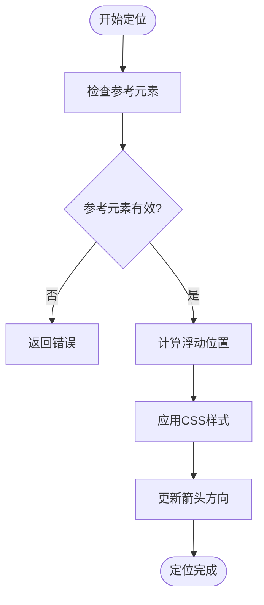
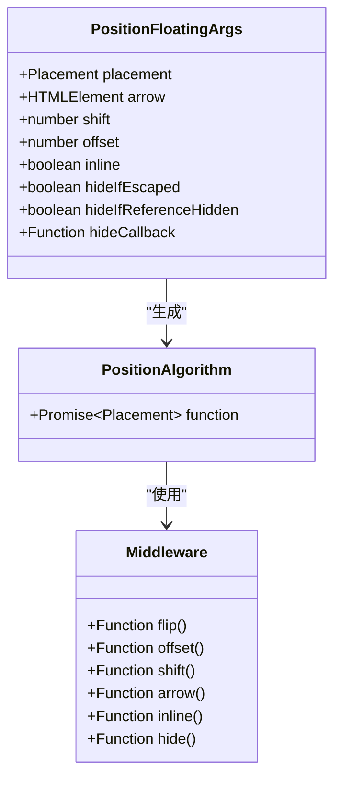
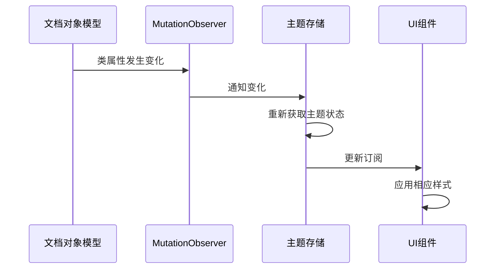
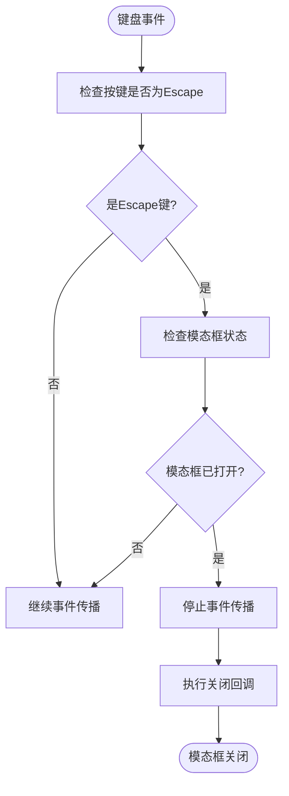

# Svelte辅助库

<cite>
**本文档中引用的文件**  
- [auto-update.ts](file://ts/lib/sveltelib/position/auto-update.ts)
- [position-floating.ts](file://ts/lib/sveltelib/position/position-floating.ts)
- [theme.ts](file://ts/lib/sveltelib/theme.ts)
- [modal-closing.ts](file://ts/lib/sveltelib/modal-closing.ts)
</cite>

## 目录
1. [简介](#简介)
2. [浮动元素定位算法](#浮动元素定位算法)
3. [主题管理系统](#主题管理系统)
4. [模态框关闭逻辑](#模态框关闭逻辑)
5. [实际应用示例](#实际应用示例)
6. [UI模式原理](#ui模式原理)
7. [高级开发建议](#高级开发建议)

## 简介
Anki中的Svelte辅助库为构建现代化的用户界面提供了核心功能支持。这些辅助库实现了浮动元素定位、主题管理、模态框交互等关键UI组件，确保了应用在不同设备和环境下的良好用户体验。本文档深入分析这些辅助库的实现机制，为开发者提供全面的技术指导。

## 浮动元素定位算法

### 位置计算与自动更新机制
Anki的浮动元素定位系统基于`@floating-ui/dom`库构建，通过`auto-update.ts`和`position-floating.ts`两个核心文件实现。`auto-update.ts`提供了一个Svelte动作，用于在参考元素或滚动容器发生变化时自动重新计算浮动元素的位置。

`autoUpdate`函数接收参考元素和定位函数作为参数，返回一个包含`destroy`和`update`方法的对象。当组件销毁时，会自动清理相关的监听器；当需要更新位置时，可以调用`update`方法重新应用定位逻辑。

**Diagram sources**
- [auto-update.ts](file://ts/lib/sveltelib/position/auto-update.ts#L32-L53)

**Section sources**
- [auto-update.ts](file://ts/lib/sveltelib/position/auto-update.ts#L1-L56)

### 边界检测与自动调整
`position-floating.ts`文件实现了复杂的定位算法，通过一系列中间件（middleware）来处理位置计算。系统支持多种定位策略，包括翻转（flip）、偏移（offset）、位移（shift）和箭头对齐（arrow）。

定位算法首先构建一个中间件数组，包含基本的定位策略。如果启用了内联模式（inline），则在数组开头添加`inline`中间件。系统还支持两种隐藏策略：当浮动元素超出视口边界时隐藏，以及当参考元素被隐藏时隐藏。

**Diagram sources**
- [position-floating.ts](file://ts/lib/sveltelib/position/position-floating.ts#L19-L109)

**Section sources**
- [position-floating.ts](file://ts/lib/sveltelib/position/position-floating.ts#L1-L113)

## 主题管理系统

### 暗色模式切换实现
Anki的主题管理系统通过`theme.ts`文件实现，基于文档根元素的CSS类来检测当前主题状态。系统通过`pageTheme`可读存储（readable store）来管理主题信息，当根元素的类发生变化时自动更新。

`getThemeFromRoot`函数检查`document.documentElement`是否包含`night-mode`类，以此判断当前是否为暗色模式。系统使用`MutationObserver`监听根元素的类属性变化，确保主题状态能够实时同步。

**Diagram sources**
- [theme.ts](file://ts/lib/sveltelib/theme.ts#L20-L22)

**Section sources**
- [theme.ts](file://ts/lib/sveltelib/theme.ts#L1-L36)

### CSS变量应用
主题管理系统与CSS变量紧密结合，通过JavaScript动态修改CSS自定义属性来实现主题切换。当`pageTheme`存储更新时，相关组件会自动重新渲染，应用新的样式变量。这种机制确保了主题切换的平滑性和一致性，同时保持了良好的性能表现。

## 模态框关闭逻辑

### 点击外部关闭与键盘事件处理
`modal-closing.ts`文件实现了模态框的关闭逻辑，通过`registerModalClosingHandler`函数注册键盘事件监听器。该函数返回一个包含`set`和`remove`方法的对象，用于控制模态框的状态和清理事件监听。

当Escape键被按下且模态框处于打开状态时，系统会调用`event.stopImmediatePropagation()`阻止事件冒泡，避免触发其他键盘处理程序。这种设计确保了模态框的关闭行为优先级最高，提供了良好的用户体验。

**Diagram sources**
- [modal-closing.ts](file://ts/lib/sveltelib/modal-closing.ts#L14-L31)

**Section sources**
- [modal-closing.ts](file://ts/lib/sveltelib/modal-closing.ts#L1-L35)

### 过渡动画集成
虽然`modal-closing.ts`本身不直接处理动画，但它与CSS过渡动画完美集成。当模态框关闭回调被触发时，通常会启动一个过渡动画，然后在动画结束后真正移除模态框元素。这种分离关注点的设计使得逻辑控制和视觉效果可以独立开发和维护。

## 实际应用示例

### 工具提示实现
在工具提示（tooltip）组件中，`position-floating`算法被用来确保提示框始终正确地定位在参考元素附近。通过设置适当的`placement`参数（如"top"、"bottom"、"left"、"right"），可以控制提示框的初始位置。`shift`和`offset`参数则用于微调位置，避免与参考元素重叠。

### 弹出菜单实现
弹出菜单（dropdown menu）利用`auto-update`机制，在用户滚动页面时自动调整菜单位置。菜单的箭头元素通过`arrowElement`参数传入，系统会根据计算出的实际位置自动旋转箭头，使其始终指向参考元素。

### 对话框实现
对话框（dialog）组件结合使用主题管理和模态框关闭逻辑。对话框的外观会根据`pageTheme`存储的当前主题自动调整，而`registerModalClosingHandler`确保用户可以通过点击外部区域或按下Escape键来关闭对话框，提供了符合用户预期的交互体验。

## UI模式原理

### 浮动元素定位基本原则
浮动元素定位的核心原则是确保元素在视口内可见且不被遮挡。Anki的实现遵循了这一原则，通过`flip`中间件在空间不足时自动翻转位置，通过`shift`中间件在边缘时进行微调。这种智能定位策略大大提升了用户界面的可用性。

### 主题管理设计模式
Anki的主题管理采用了观察者模式，`pageTheme`存储作为被观察对象，所有依赖主题的组件作为观察者。当主题状态变化时，所有订阅者都会收到通知并相应更新。这种响应式设计模式使得主题切换既高效又可靠。

### 模态框交互规范
模态框的交互遵循了Web无障碍标准，支持键盘导航和Escape键关闭。通过在捕获阶段（capture phase）注册事件监听器，确保模态框的关闭逻辑优先于其他处理程序，提供了可预测的用户体验。

## 高级开发建议

### 自定义扩展指南
开发者可以通过创建自定义中间件来扩展`position-floating`算法的功能。例如，可以添加一个`resize`中间件来处理窗口大小变化时的重新定位，或者创建一个`collision`中间件来检测与其他浮动元素的碰撞。

### 性能优化策略
为了优化性能，建议在不需要时及时调用`remove`方法清理事件监听器和观察者。对于频繁更新的浮动元素，可以考虑使用防抖（debounce）或节流（throttle）技术来减少重新计算的频率。同时，合理使用CSS变换（transform）而不是直接修改`left`和`top`属性，可以利用硬件加速提升动画性能。