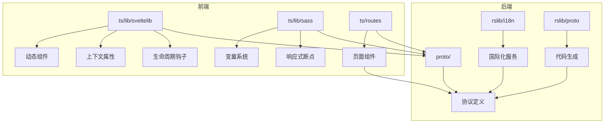
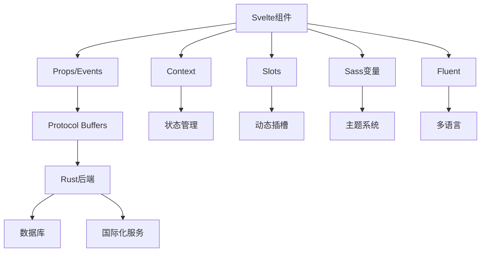
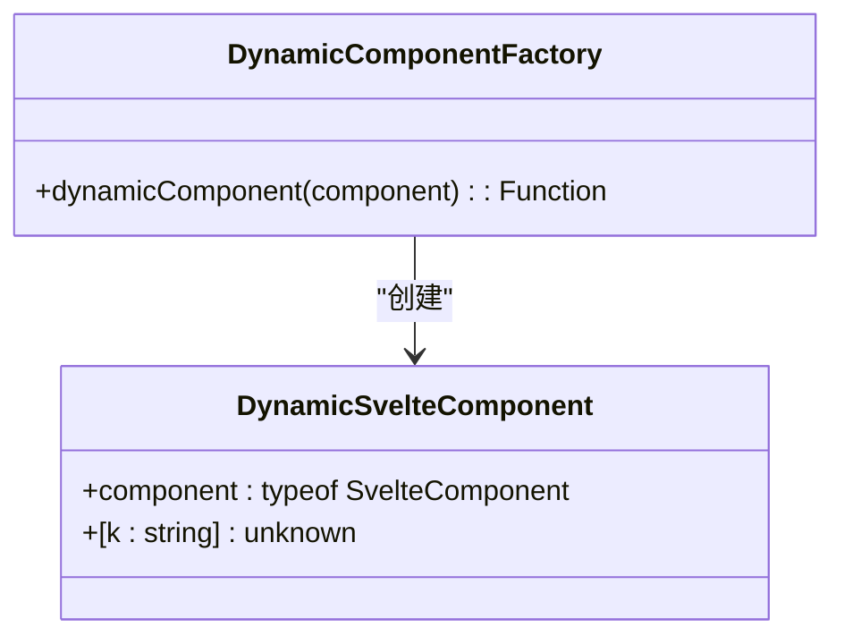
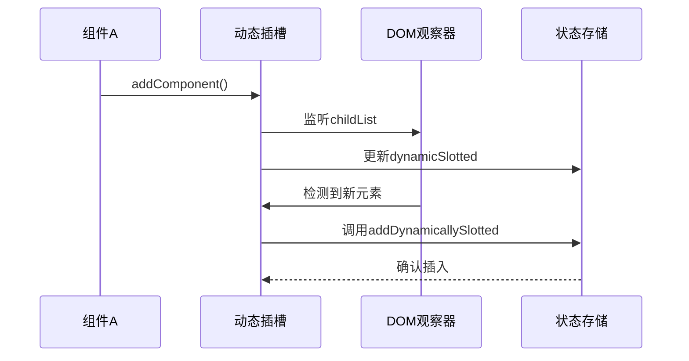
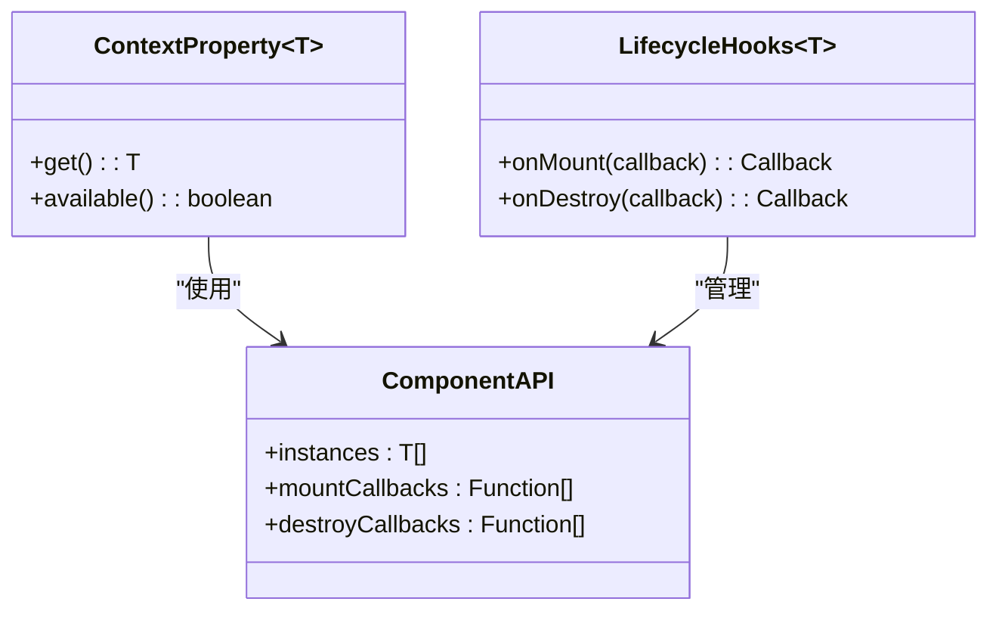
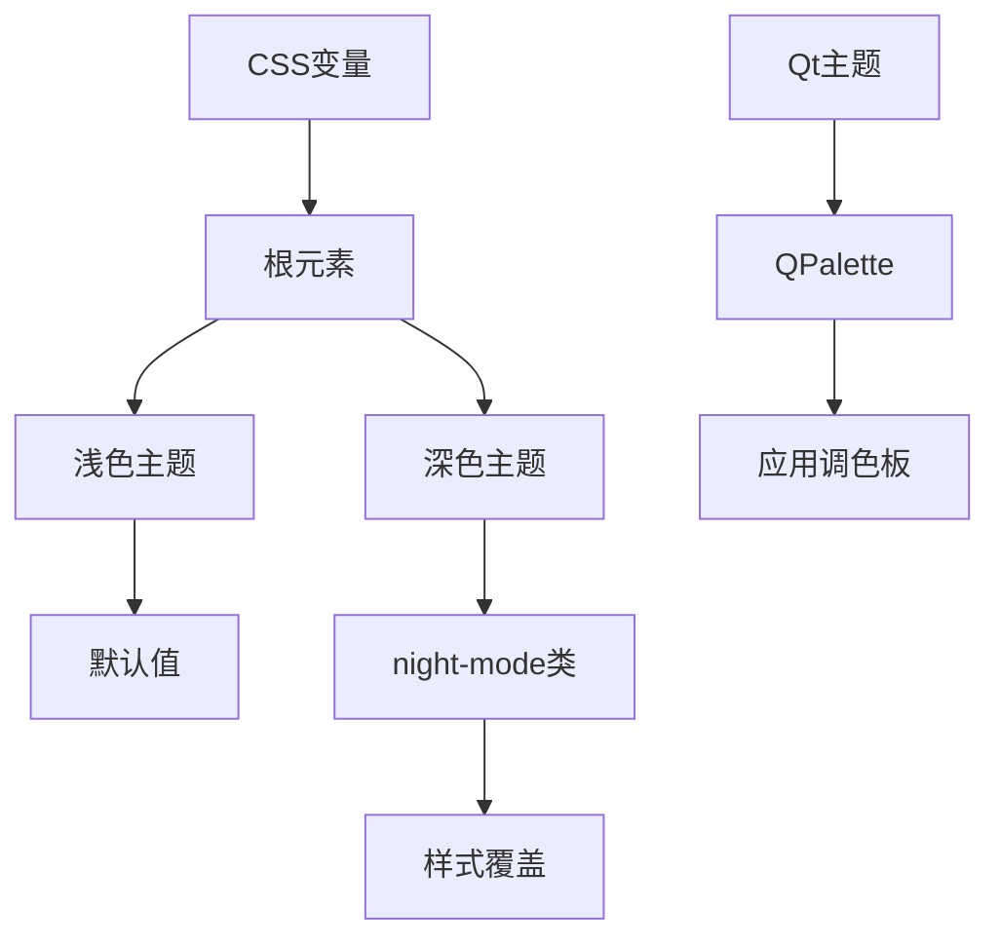
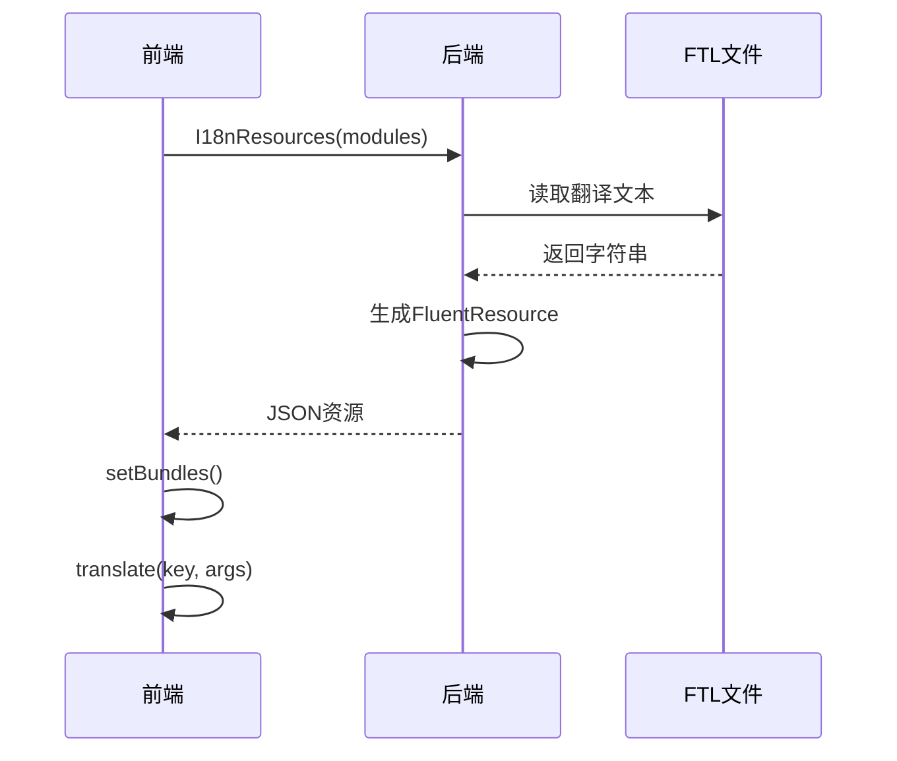
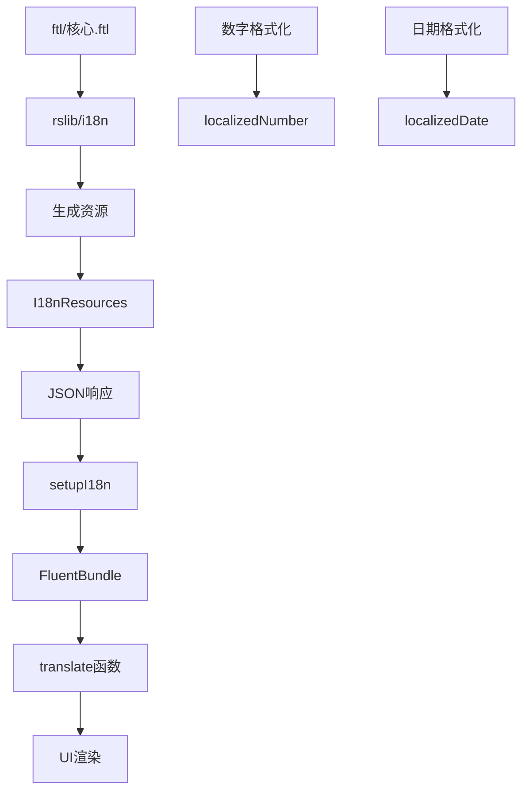

# 前端组件系统

<cite>
**本文档中引用的文件**  
- [dynamicComponent.ts](file://ts/lib/sveltelib/dynamicComponent.ts)
- [dynamic-slotting.ts](file://ts/lib/sveltelib/dynamic-slotting.ts)
- [context-property.ts](file://ts/lib/sveltelib/context-property.ts)
- [lifecycle-hooks.ts](file://ts/lib/sveltelib/lifecycle-hooks.ts)
- [export-runtime.ts](file://ts/lib/sveltelib/export-runtime.ts)
- [vars.scss](file://ts/lib/sass/_vars.scss)
- [functions.scss](file://ts/lib/sass/_functions.scss)
- [breakpoints.scss](file://ts/lib/sass/breakpoints.scss)
- [i18n.proto](file://proto/anki/i18n.proto)
- [ftl-helpers.ts](file://ts/lib/generated/ftl-helpers.ts)
- [utils.ts](file://ts/lib/tslib/i18n/utils.ts)
- [lib.rs](file://rslib/i18n/src/lib.rs)
- [frontend.proto](file://proto/anki/frontend.proto)
- [build.rs](file://rslib/proto/build.rs)
- [typescript.rs](file://rslib/proto/typescript.rs)
- [python.rs](file://rslib/proto/python.rs)
</cite>

## 目录
1. [简介](#简介)
2. [项目结构](#项目结构)
3. [核心组件](#核心组件)
4. [架构概述](#架构概述)
5. [详细组件分析](#详细组件分析)
6. [依赖分析](#依赖分析)
7. [性能考虑](#性能考虑)
8. [故障排除指南](#故障排除指南)
9. [结论](#结论)

## 简介
Anki的前端组件系统基于Svelte框架构建，采用模块化设计实现跨平台UI一致性。系统通过Protocol Buffers与后端通信，集成Sass样式系统和Fluent国际化框架，支持动态组件扩展和主题切换功能。该文档详细说明组件架构、样式管理、多语言支持及与协议缓冲区的集成机制。

## 项目结构
Anki前端代码主要位于`ts/`目录，采用Svelte + TypeScript技术栈。核心组件库位于`ts/lib/`，包含Svelte工具、Sass变量和国际化支持。路由组件在`ts/routes/`目录，通过Vite构建系统打包。样式系统基于Sass模块化设计，国际化文本存储在`ftl/`目录，通过Rust后端服务生成多语言资源。



**图示来源**  
- [sveltelib](file://ts/lib/sveltelib/)
- [sass](file://ts/lib/sass/)
- [proto](file://proto/anki/)

**本节来源**  
- [ts/](file://ts/)
- [proto/](file://proto/anki/)

## 核心组件
前端系统采用Svelte组件架构，通过`dynamicComponent`和`dynamicSlotting`实现组件动态扩展。上下文属性系统使用Symbol作为键值，确保类型安全的上下文传递。生命周期钩子允许插件在组件挂载和销毁时执行自定义逻辑。样式系统基于CSS变量和Sass混合，支持深色模式切换。

**本节来源**  
- [dynamicComponent.ts](file://ts/lib/sveltelib/dynamicComponent.ts)
- [dynamic-slotting.ts](file://ts/lib/sveltelib/dynamic-slotting.ts)
- [context-property.ts](file://ts/lib/sveltelib/context-property.ts)
- [lifecycle-hooks.ts](file://ts/lib/sveltelib/lifecycle-hooks.ts)

## 架构概述
系统采用分层架构，前端组件通过Protocol Buffers与Rust后端通信。Svelte组件层负责UI渲染，Sass样式系统管理视觉表现，Fluent框架处理多语言支持。构建系统使用esbuild打包，通过svelte-preprocess处理Sass和TypeScript。国际化资源从ftl文件生成，经Rust后端序列化为JSON供前端使用。



**图示来源**  
- [frontend.proto](file://proto/anki/frontend.proto)
- [i18n.proto](file://proto/anki/i18n.proto)
- [build.rs](file://rslib/proto/build.rs)

## 详细组件分析

### Svelte组件架构
Anki使用Svelte作为UI框架，通过`dynamicComponent`工厂函数创建可复用组件。组件支持属性传递、事件绑定和上下文共享。`export-runtime`模块暴露Svelte运行时，确保插件使用相同的框架实例。



**图示来源**  
- [dynamicComponent.ts](file://ts/lib/sveltelib/dynamicComponent.ts)
- [export-runtime.ts](file://ts/lib/sveltelib/export-runtime.ts)

**本节来源**  
- [dynamicComponent.ts](file://ts/lib/sveltelib/dynamicComponent.ts#L0-L24)
- [export-runtime.ts](file://ts/lib/sveltelib/export-runtime.ts#L0-L16)

### 动态插槽系统
`dynamicSlotting`函数实现组件动态扩展，允许在运行时插入或修改UI元素。系统使用MutationObserver监听DOM变化，通过writable store管理插槽状态。`addDynamicallySlotted`函数处理新组件的插入逻辑。



**图示来源**  
- [dynamic-slotting.ts](file://ts/lib/sveltelib/dynamic-slotting.ts)
- [children-access](file://ts/lib/tslib/children-access)

**本节来源**  
- [dynamic-slotting.ts](file://ts/lib/sveltelib/dynamic-slotting.ts#L0-L36)
- [dynamic-slotting.ts](file://ts/lib/sveltelib/dynamic-slotting.ts#L71-L112)

### 上下文与生命周期
上下文属性系统使用`contextProperty`工厂创建类型安全的上下文。生命周期钩子通过`lifecycleHooks`提供onMount和onDestroy回调，支持异步清理函数。系统维护组件实例列表，确保正确的挂载顺序。



**图示来源**  
- [context-property.ts](file://ts/lib/sveltelib/context-property.ts)
- [lifecycle-hooks.ts](file://ts/lib/sveltelib/lifecycle-hooks.ts)

**本节来源**  
- [context-property.ts](file://ts/lib/sveltelib/context-property.ts#L0-L45)
- [lifecycle-hooks.ts](file://ts/lib/sveltelib/lifecycle-hooks.ts#L0-L29)

## 样式系统
样式系统基于Sass模块化设计，使用`_vars.scss`定义设计令牌。`_functions.scss`提供`create-vars-from-map`辅助函数，将嵌套映射转换为CSS变量。`breakpoints.scss`实现响应式断点系统，支持移动设备适配。

### Sass变量架构
设计系统采用分层变量结构，包含颜色调色板、间距、边框半径等基础属性。变量通过`@use`指令导入，支持深色模式切换。Python脚本`extract_sass_vars.py`将Sass变量转换为Python可读格式。

```mermaid
erDiagram
VARS ||--o{ PROPS : "包含"
VARS ||--o{ COLORS : "包含"
PROPS ||--o{ FONT : "字体"
PROPS ||--o{ BORDER_RADIUS : "边框"
PROPS ||--o{ TRANSITION : "过渡"
COLORS ||--o{ PALETTE : "调色板"
class VARS {
props: Map
colors: Map
}
class PROPS {
font-size: 15px
border-radius: 5px
transition: 180ms
}
```

**图示来源**  
- [vars.scss](file://ts/lib/sass/_vars.scss)
- [functions.scss](file://ts/lib/sass/_functions.scss)
- [extract_sass_vars.py](file://qt/tools/extract_sass_vars.py)

**本节来源**  
- [vars.scss](file://ts/lib/sass/_vars.scss#L0-L66)
- [functions.scss](file://ts/lib/sass/_functions.scss#L0-L46)
- [extract_sass_vars.py](file://qt/tools/extract_sass_vars.py#L0-L55)

### 主题支持
主题系统通过CSS变量实现，支持深色模式切换。`bootstrap-dark.scss`提供深色主题样式，`filterStylingNightMode`函数过滤夜间模式样式。Qt端`theme.py`通过QPalette应用系统级主题。



**图示来源**  
- [bootstrap-dark.scss](file://ts/lib/sass/bootstrap-dark.scss)
- [styling.ts](file://ts/html-filter/styling.ts)
- [theme.py](file://qt/aqt/theme.py)

**本节来源**  
- [bootstrap-dark.scss](file://ts/lib/sass/bootstrap-dark.scss)
- [styling.ts](file://ts/html-filter/styling.ts#L33-L52)
- [theme.py](file://qt/aqt/theme.py#L276-L323)

## 国际化支持
国际化系统基于Fluent框架，使用`.ftl`文件存储翻译字符串。Rust后端`I18nService`提供翻译服务，通过`I18nResourcesRequest`获取多语言资源。前端使用`setupI18n`初始化国际化环境。

### 国际化实现机制
系统采用分层国际化架构，`.ftl`文件存储翻译模板，Rust后端序列化为JSON，前端FluentBundle解析并格式化字符串。`translate`函数通过模块索引和消息索引定位翻译文本。



**图示来源**  
- [i18n.proto](file://proto/anki/i18n.proto)
- [lib.rs](file://rslib/i18n/src/lib.rs)
- [ftl-helpers.ts](file://ts/lib/generated/ftl-helpers.ts)

**本节来源**  
- [i18n.proto](file://proto/anki/i18n.proto#L0-L51)
- [lib.rs](file://rslib/i18n/src/lib.rs#L151-L205)
- [ftl-helpers.ts](file://ts/lib/generated/ftl-helpers.ts#L0-L56)

### 多语言管理流程
多语言管理流程从`.ftl`文件开始，通过Rust构建脚本生成TypeScript接口。`setupI18n`函数加载指定模块的资源，创建FluentBundle实例。`localizedNumber`等辅助函数处理数字、日期的本地化格式化。



**图示来源**  
- [utils.ts](file://ts/lib/tslib/i18n/utils.ts)
- [lib.rs](file://rslib/i18n/src/lib.rs)
- [ftl/](file://ftl/core/)

**本节来源**  
- [utils.ts](file://ts/lib/tslib/i18n/utils.ts#L51-L108)
- [lib.rs](file://rslib/i18n/src/lib.rs#L299-L339)
- [ftl/](file://ftl/core/)

## 依赖分析
前端系统依赖Svelte框架、Fluent国际化库和Protocol Buffers。构建依赖esbuild、esbuild-svelte和svelte-preprocess。样式系统依赖Sass和Bootstrap组件。运行时通过`registerPackageRaw`暴露Svelte运行时给插件使用。

```mermaid
dependency-graph
"Svelte" --> "前端组件"
"Fluent" --> "国际化"
"Protocol Buffers" --> "服务通信"
"esbuild" --> "构建系统"
"Sass" --> "样式处理"
"Bootstrap" --> "UI组件"
"前端组件" --> "动态插槽"
"国际化" --> "翻译服务"
"服务通信" --> "后端集成"
```

**图示来源**  
- [package.json](file://package.json)
- [vite.config.ts](file://ts/vite.config.ts)
- [bundle_svelte.mjs](file://ts/bundle_svelte.mjs)

**本节来源**  
- [package.json](file://package.json)
- [vite.config.ts](file://ts/vite.config.ts)
- [bundle_svelte.mjs](file://ts/bundle_svelte.mjs#L0-L42)

## 性能考虑
系统通过代码分割、懒加载和虚拟滚动优化性能。Svelte的编译时优化减少运行时开销。CSS变量和Sass混合提高样式复用性。国际化资源按需加载，避免初始包体积过大。Protocol Buffers序列化效率高于JSON。

## 故障排除指南
常见问题包括组件上下文丢失、国际化文本缺失和样式冲突。调试时应检查上下文键值是否匹配，确认`.ftl`文件包含对应翻译，验证CSS变量是否正确注入。构建问题通常与esbuild配置或Sass编