# 前端集成

<cite>
**本文档中引用的文件**  
- [ftl-helpers.ts](file://ts/lib/generated/ftl-helpers.ts)
- [index.ts](file://ts/lib/tslib/i18n/index.ts)
- [utils.ts](file://ts/lib/tslib/i18n/utils.ts)
- [typescript.rs](file://rslib/i18n/typescript.rs)
- [webview.py](file://qt/aqt/webview.py)
- [lib.rs](file://rslib/i18n/src/lib.rs)
- [i18n.proto](file://proto/anki/i18n.proto)
</cite>

## 目录
1. [简介](#简介)
2. [类型安全的国际化函数生成](#类型安全的国际化函数生成)
3. 前端i18n服务实现
4. Svelte组件中的i18n使用模式
5. Python-JavaScript消息传递机制
6. 性能优化建议
7. 调试技巧

## 简介
Anki的前端国际化系统采用Fluent本地化框架，通过类型安全的代码生成和高效的运行时服务，为Svelte组件提供编译时检查和动态文本支持。该系统通过Python后端与前端JavaScript的协同工作，实现了多语言支持的无缝集成。

## 类型安全的国际化函数生成

Anki通过Rust工具在构建时从FTL（Fluent）文件生成类型安全的TypeScript函数。这些函数提供编译时检查，防止使用不存在的文本ID。

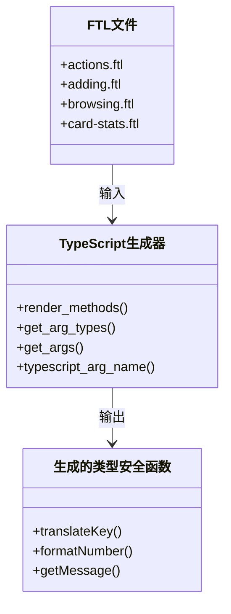

**图示来源**
- [typescript.rs](file://rslib/i18n/typescript.rs#L43-L89)

**章节来源**
- [typescript.rs](file://rslib/i18n/typescript.rs#L43-L89)
- [ftl-helpers.ts](file://ts/lib/generated/ftl-helpers.ts#L0-L56)

### 代码生成机制
Rust工具`rslib/i18n/typescript.rs`中的`render_methods`函数遍历所有翻译模块，为每个文本ID生成对应的TypeScript函数。函数名采用驼峰命名法，将连字符替换为下划线。

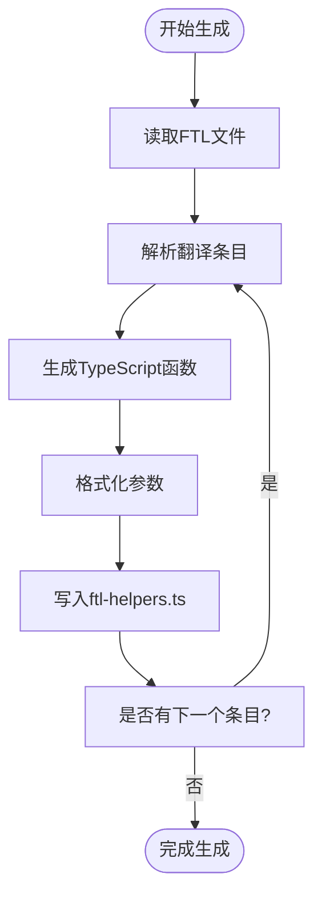

**图示来源**
- [typescript.rs](file://rslib/i18n/typescript.rs#L43-L89)

**章节来源**
- [typescript.rs](file://rslib/i18n/typescript.rs#L43-L89)

### 类型安全保证
生成的函数具有完整的TypeScript类型定义，确保在编译时就能捕获错误的文本ID引用或不正确的参数类型。

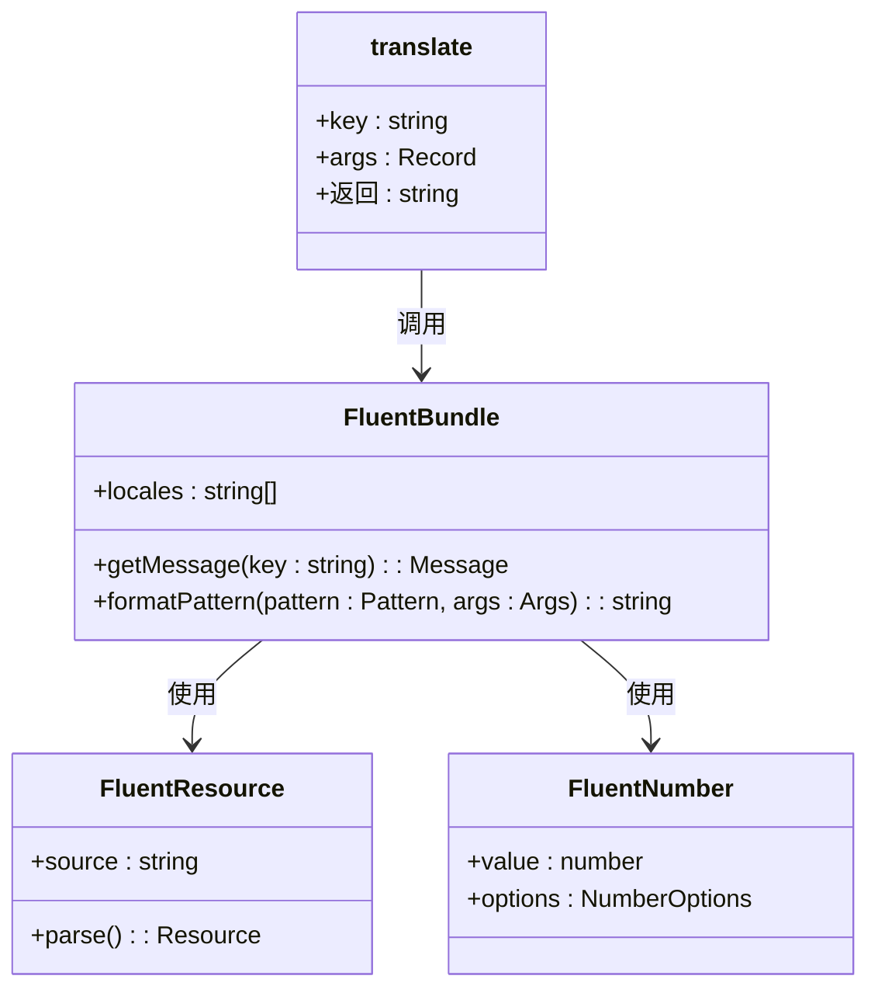

**图示来源**
- [ftl-helpers.ts](file://ts/lib/generated/ftl-helpers.ts#L0-L56)

**章节来源**
- [ftl-helpers.ts](file://ts/lib/generated/ftl-helpers.ts#L0-L56)

## 前端i18n服务实现

前端i18n服务在`ts/lib/tslib/i18n/utils.ts`中实现，提供文本格式化、缓存机制和异步加载策略。

### 服务架构
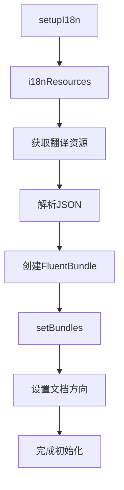

**图示来源**
- [utils.ts](file://ts/lib/tslib/i18n/utils.ts#L51-L109)

**章节来源**
- [utils.ts](file://ts/lib/tslib/i18n/utils.ts#L51-L109)

### 文本格式化功能
i18n服务提供多种文本格式化功能，包括数字、日期和字符串比较。

```mermaid
classDiagram
class i18n服务 {
+localizedNumber(n : number, precision : number) : string
+createLocaleNumberFormat(options : NumberFormatOptions) : NumberFormat
+localeCompare(first : string, second : string, options : CollatorOptions) : number
+withCollapsedWhitespace(s : string) : string
+withoutUnicodeIsolation(s : string) : string
+setupI18n(args : {modules : ModuleName[]}) : Promise<void>
+setupGlobalI18n() : Promise<void>
}
i18n服务 --> FluentBundle : 依赖
i18n服务 --> Intl.NumberFormat : 依赖
i18n服务 --> Intl.Collator : 依赖
```

**图示来源**
- [utils.ts](file://ts/lib/tslib/i18n/utils.ts#L51-L109)

**章节来源**
- [utils.ts](file://ts/lib/tslib/i18n/utils.ts#L51-L109)

### 缓存与异步加载
服务采用异步加载策略，通过Promise缓存机制避免重复初始化。

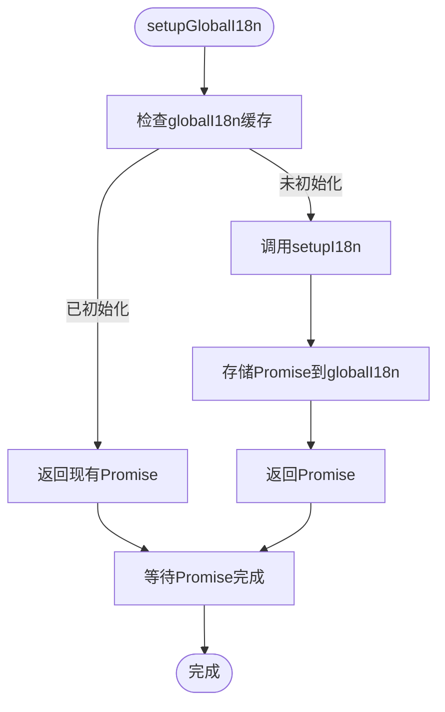

**图示来源**
- [utils.ts](file://ts/lib/tslib/i18n/utils.ts#L100-L109)

**章节来源**
- [utils.ts](file://ts/lib/tslib/i18n/utils.ts#L100-L109)

## Svelte组件中的i18n使用模式

在Svelte组件中使用`$lib/tslib/i18n`的正确模式包括在模板中使用`t()`函数和在脚本中处理动态文本。

### 模板使用模式
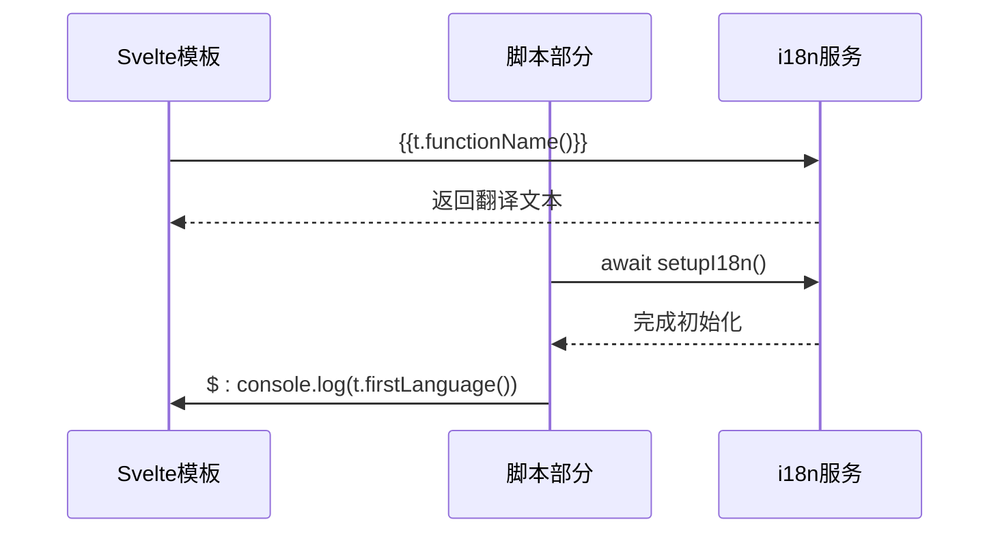

**图示来源**
- [index.ts](file://ts/lib/tslib/i18n/index.ts#L0-L6)
- [utils.ts](file://ts/lib/tslib/i18n/utils.ts#L51-L109)

**章节来源**
- [index.ts](file://ts/lib/tslib/i18n/index.ts#L0-L6)
- [utils.ts](file://ts/lib/tslib/i18n/utils.ts#L51-L109)

### 动态文本处理
在脚本中处理动态文本时，需要确保i18n服务已正确初始化。

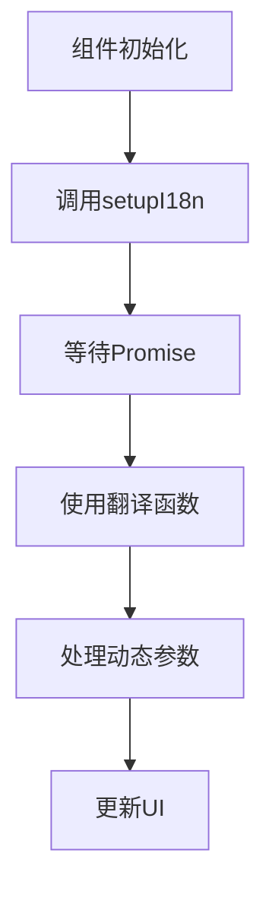

**图示来源**
- [utils.ts](file://ts/lib/tslib/i18n/utils.ts#L51-L109)

**章节来源**
- [utils.ts](file://ts/lib/tslib/i18n/utils.ts#L51-L109)

## Python-JavaScript消息传递机制

`webview.py`中实现的Python-JavaScript消息传递机制负责将当前语言环境同步到前端。

### 消息传递架构


**图示来源**
- [webview.py](file://qt/aqt/webview.py#L0-L1014)

**章节来源**
- [webview.py](file://qt/aqt/webview.py#L0-L1014)

### 语言环境同步流程
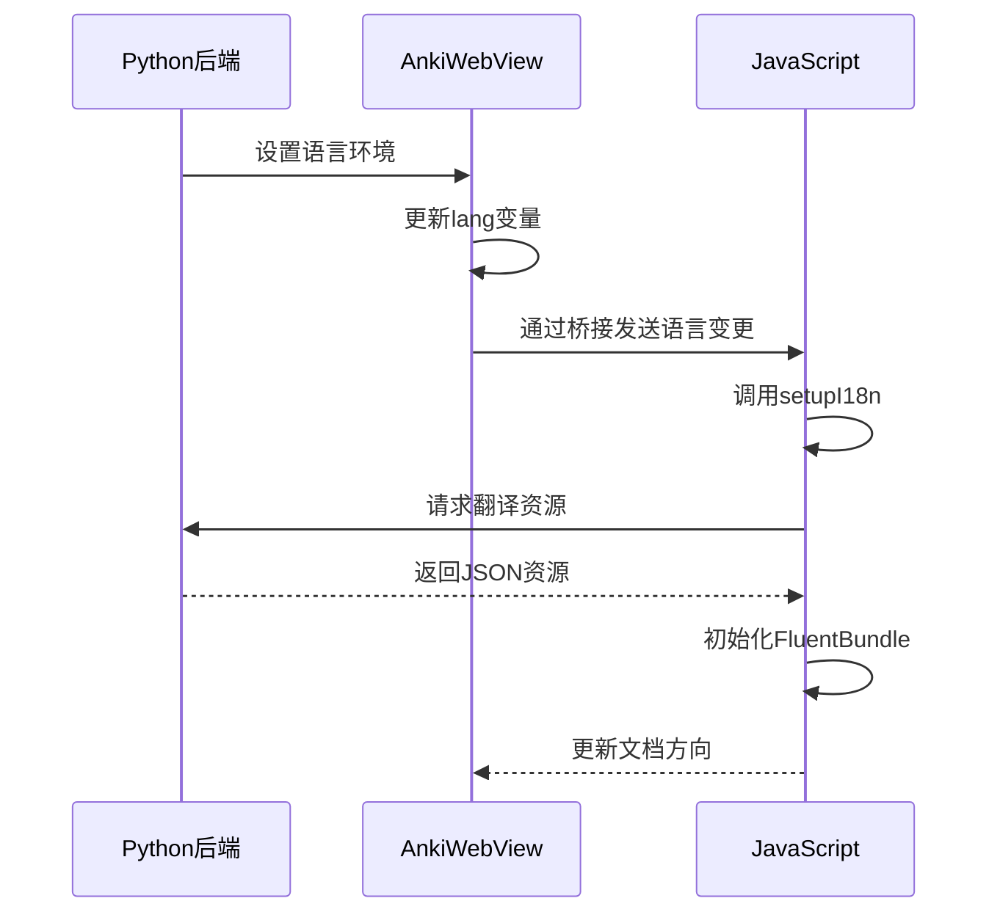

**图示来源**
- [webview.py](file://qt/aqt/webview.py#L0-L1014)
- [utils.ts](file://ts/lib/tslib/i18n/utils.ts#L51-L109)

**章节来源**
- [webview.py](file://qt/aqt/webview.py#L0-L1014)
- [utils.ts](file://ts/lib/tslib/i18n/utils.ts#L51-L109)

## 性能优化建议

### 文本包的懒加载
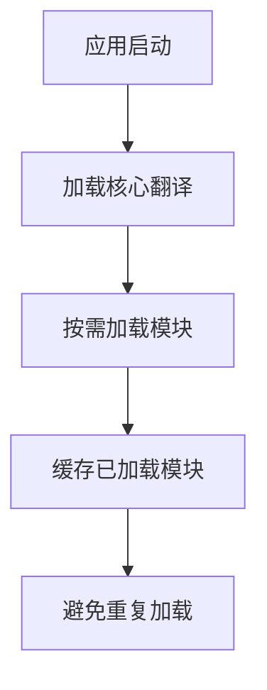

**章节来源**
- [lib.rs](file://rslib/i18n/src/lib.rs#L299-L339)

### 按需加载策略
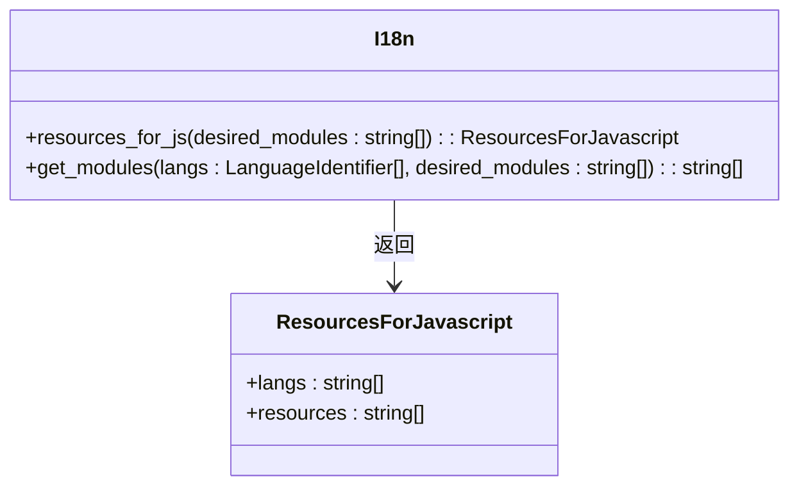

**图示来源**
- [lib.rs](file://rslib/i18n/src/lib.rs#L299-L339)

**章节来源**
- [lib.rs](file://rslib/i18n/src/lib.rs#L299-L339)

## 调试技巧

### 热重载翻译文件
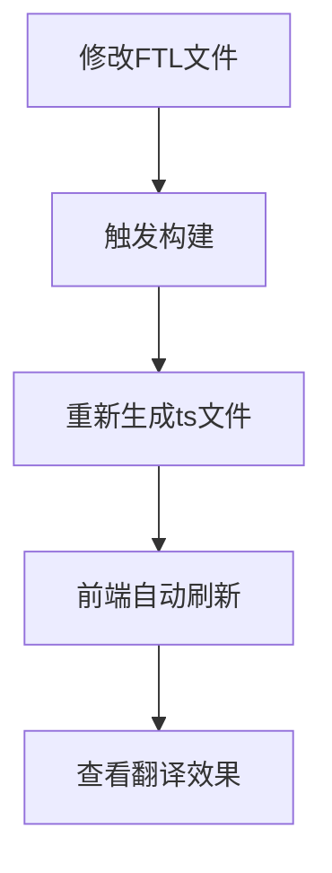

**章节来源**
- [typescript.rs](file://rslib/i18n/typescript.rs#L43-L89)
- [utils.ts](file://ts/lib/tslib/i18n/utils.ts#L51-L109)

### 错误处理
```mermaid
flowchart TD
A[查找文本ID] --> B{ID存在?}
B --> |是| C[返回翻译文本]
B --> |否| D[返回'missing key: ${key}']
D --> E[控制台警告]
```

**图示来源**
- [ftl-helpers.ts](file://ts/lib/generated/ftl-helpers.ts#L0-L56)

**章节来源**
- [ftl-helpers.ts](file://ts/lib/generated/ftl-helpers.ts#L0-L56)