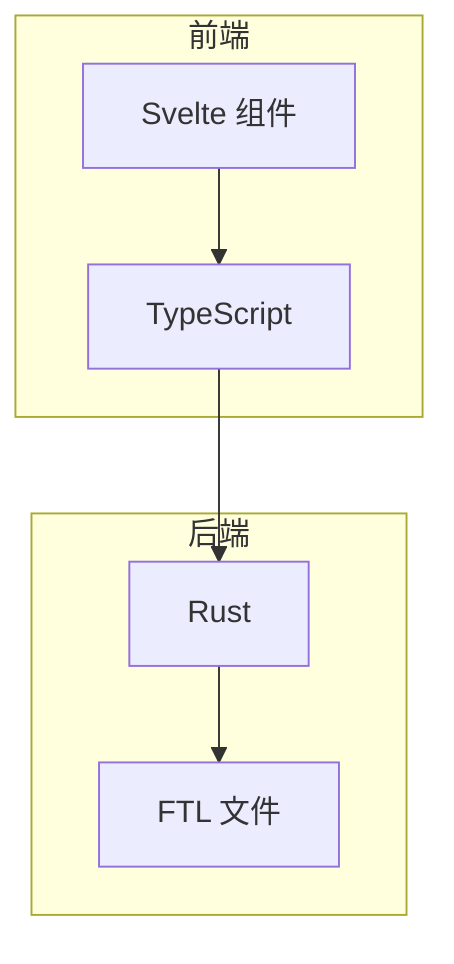
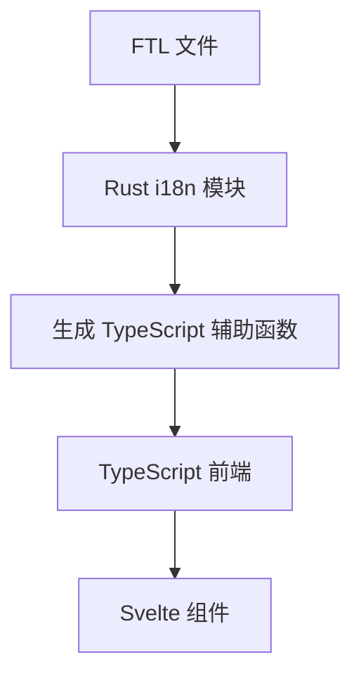
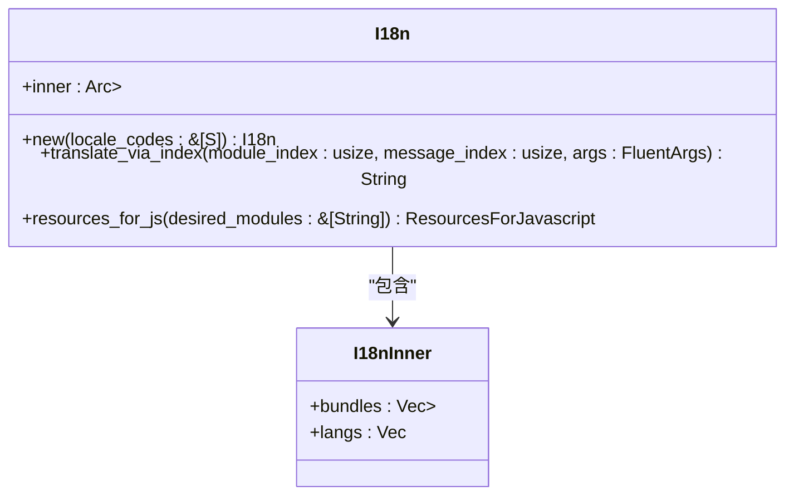
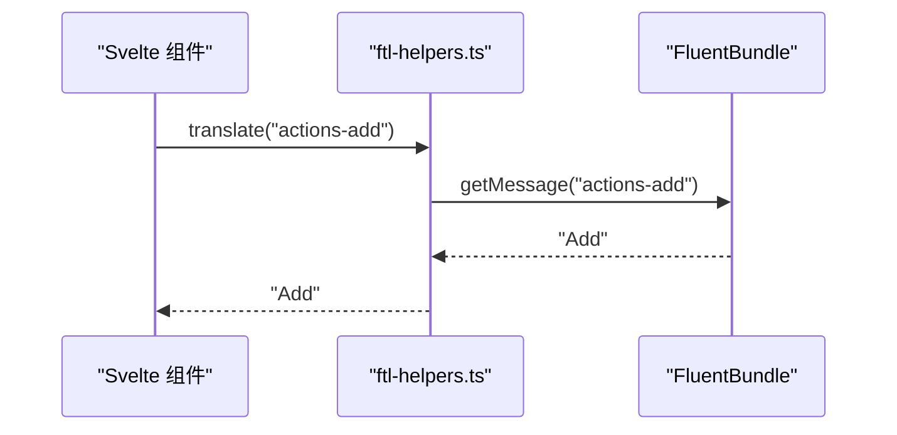
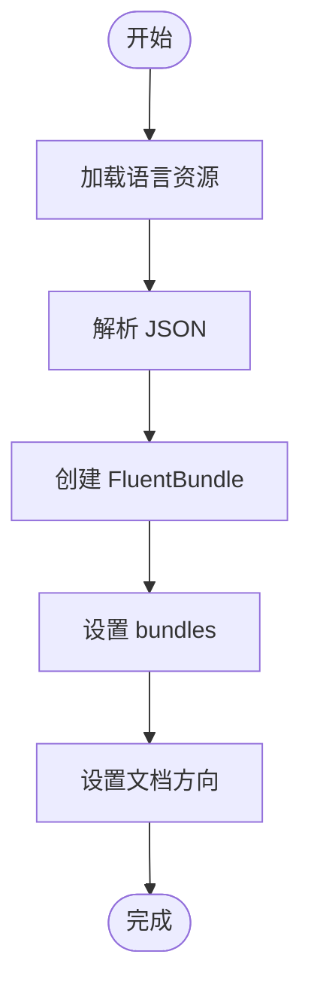

# 国际化支持

<cite>
**本文档中引用的文件**  
- [actions.ftl](file://ftl/core/actions.ftl)
- [lib.rs](file://rslib/i18n/src/lib.rs)
- [ftl-helpers.ts](file://ts/lib/generated/ftl-helpers.ts)
- [utils.ts](file://ts/lib/tslib/i18n/utils.ts)
- [typescript.rs](file://rslib/i18n/typescript.rs)
</cite>

## 目录
1. [简介](#简介)
2. [项目结构](#项目结构)
3. [核心组件](#核心组件)
4. [架构概述](#架构概述)
5. [详细组件分析](#详细组件分析)
6. [依赖分析](#依赖分析)
7. [性能考虑](#性能考虑)
8. [故障排除指南](#故障排除指南)
9. [结论](#结论)

## 简介
Anki 使用 Fluent (FTL) 格式实现其国际化（i18n）系统，支持多语言界面。该系统通过 Rust 和 TypeScript 的集成，实现了类型安全的翻译函数生成、动态语言资源加载和前端本地化集成。开发者可以使用生成的辅助函数在 Svelte 组件中进行文本本地化，并遵循最佳实践处理复数形式、变量插值和复杂文本格式。

## 项目结构
Anki 的国际化系统分布在多个目录中，主要包括：
- `ftl/core/`：存放 FTL 格式的语言文件，如 `actions.ftl`。
- `rslib/i18n/`：Rust 实现的 i18n 核心逻辑，包括资源解析和绑定生成。
- `ts/lib/generated/`：自动生成的 TypeScript 辅助函数，用于前端调用。
- `ts/lib/tslib/i18n/`：TypeScript 前端集成模块，负责加载和设置语言包。



**Diagram sources**
- [actions.ftl](file://ftl/core/actions.ftl)
- [lib.rs](file://rslib/i18n/src/lib.rs)

**Section sources**
- [actions.ftl](file://ftl/core/actions.ftl)
- [lib.rs](file://rslib/i18n/src/lib.rs)

## 核心组件
Anki 的国际化系统由以下几个核心组件构成：
- **FTL 文件**：定义了所有可翻译的字符串，如 `actions.ftl` 中的用户界面操作文本。
- **Rust i18n 模块**：负责解析 FTL 文件，生成类型安全的辅助函数，并提供给前端使用。
- **TypeScript 辅助函数**：通过 `ftl-helpers.ts` 提供 `translate` 函数，用于在前端进行文本翻译。
- **前端集成**：通过 `setupI18n` 函数加载指定模块的语言资源，并设置当前语言环境。

**Section sources**
- [actions.ftl](file://ftl/core/actions.ftl)
- [lib.rs](file://rslib/i18n/src/lib.rs)
- [ftl-helpers.ts](file://ts/lib/generated/ftl-helpers.ts)
- [utils.ts](file://ts/lib/tslib/i18n/utils.ts)

## 架构概述
Anki 的国际化架构分为三层：语言文件层、Rust 后端层和 TypeScript 前端层。语言文件（FTL）存储所有翻译文本；Rust 层解析这些文件并生成类型安全的辅助函数；TypeScript 层通过 `setupI18n` 加载资源并提供给 Svelte 组件使用。



**Diagram sources**
- [lib.rs](file://rslib/i18n/src/lib.rs)
- [ftl-helpers.ts](file://ts/lib/generated/ftl-helpers.ts)
- [utils.ts](file://ts/lib/tslib/i18n/utils.ts)

## 详细组件分析

### FTL 文件分析
FTL 文件（如 `actions.ftl`）定义了所有可翻译的字符串。每个条目包含一个键和对应的翻译文本，支持变量插值和复数形式。

```ftl
actions-add = Add
actions-delete = Delete
plural = You have {$hats ->
    [one]   1 hat
   *[other] {$hats} hats
}.
```

**Section sources**
- [actions.ftl](file://ftl/core/actions.ftl)

### Rust i18n 模块分析
Rust 的 `i18n` 模块负责解析 FTL 文件，生成类型安全的辅助函数，并提供给前端使用。`get_bundle` 函数解析 FTL 文本为 AST，`I18n` 结构体管理多个语言包的加载和切换。



**Diagram sources**
- [lib.rs](file://rslib/i18n/src/lib.rs)

### TypeScript 辅助函数分析
`ftl-helpers.ts` 提供了 `translate` 函数，用于在前端进行文本翻译。`setBundles` 函数设置当前语言包，`getMessage` 函数从语言包中获取翻译文本。



**Diagram sources**
- [ftl-helpers.ts](file://ts/lib/generated/ftl-helpers.ts)

### 前端集成分析
`setupI18n` 函数加载指定模块的语言资源，并设置当前语言环境。`localizedDate` 和 `localizedNumber` 函数提供本地化的日期和数字格式化。



**Diagram sources**
- [utils.ts](file://ts/lib/tslib/i18n/utils.ts)

## 依赖分析
Anki 的国际化系统依赖于以下外部库：
- `@fluent/bundle`：用于解析和格式化 FTL 文本。
- `intl-pluralrules`：用于处理复数形式。
- `num_format`：用于数字格式化。

```mermaid
graph LR
A[Anki i18n] --> B[@fluent/bundle]
A --> C[intl-pluralrules]
A --> D[num_format]
```

**Diagram sources**
- [Cargo.toml](file://rslib/i18n/Cargo.toml)
- [package.json](file://package.json)

**Section sources**
- [Cargo.toml](file://rslib/i18n/Cargo.toml)
- [package.json](file://package.json)

## 性能考虑
- **资源按需加载**：`setupI18n` 只加载指定模块的语言资源，减少初始加载时间。
- **缓存机制**：`FluentBundle` 缓存已解析的翻译文本，提高重复调用的性能。
- **异步加载**：语言资源通过异步方式加载，避免阻塞主线程。

## 故障排除指南
- **缺失翻译**：检查 FTL 文件中是否存在对应键，或确保语言包已正确加载。
- **变量插值失败**：确认传递给 `translate` 的参数名称与 FTL 文件中的变量名一致。
- **复数形式错误**：确保 `FluentNumber` 正确处理小数和整数。

**Section sources**
- [lib.rs](file://rslib/i18n/src/lib.rs)
- [ftl-helpers.ts](file://ts/lib/generated/ftl-helpers.ts)

## 结论
Anki 的国际化系统通过 Fluent 格式和 Rust/TypeScript 的深度集成，实现了高效、类型安全的多语言支持。开发者可以通过生成的辅助函数轻松实现文本本地化，并遵循最佳实践处理复杂的语言特性。