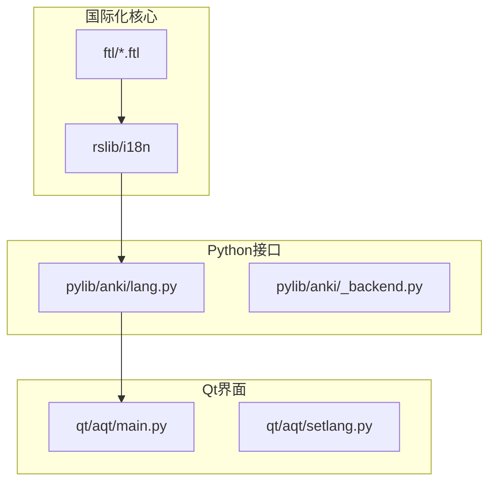
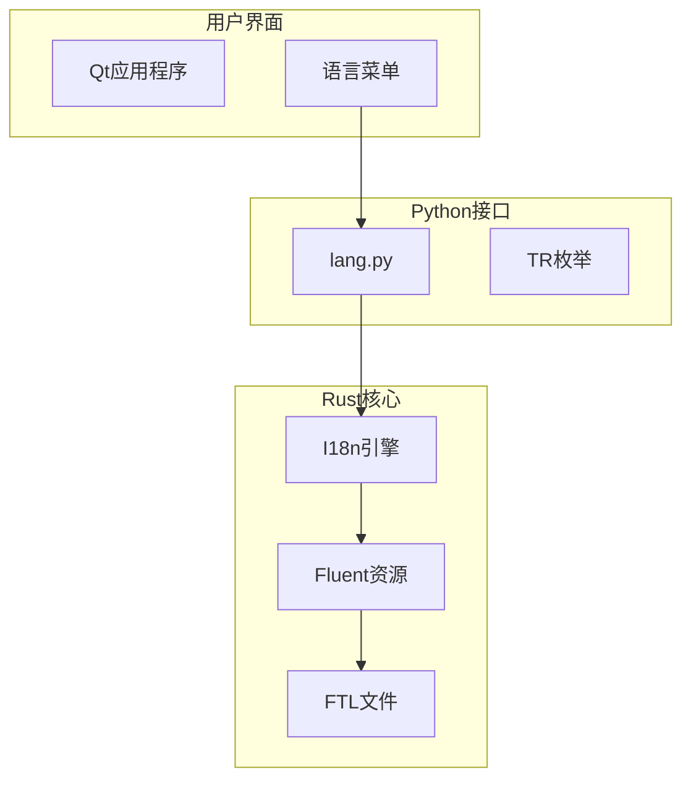
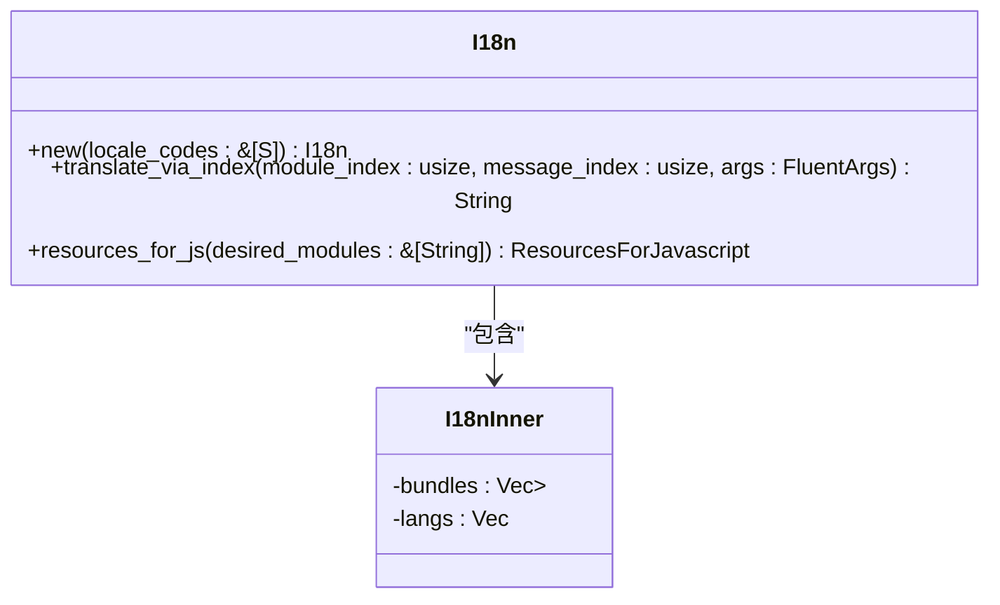
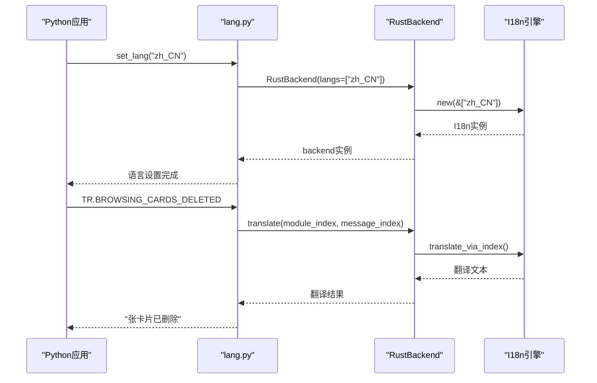
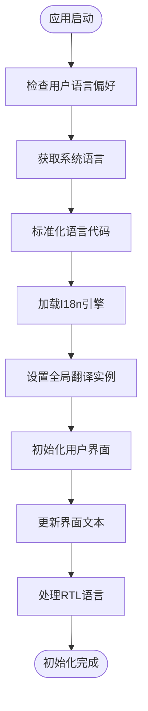
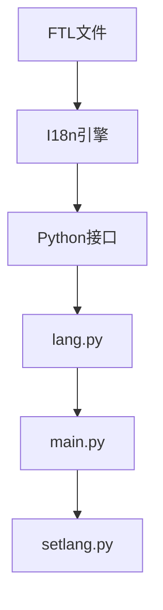

# 多语言流程

<cite>
**本文档中引用的文件**  
- [lib.rs](file://rslib/i18n/src/lib.rs)
- [python.rs](file://rslib/i18n/python.rs)
- [lang.py](file://pylib/anki/lang.py)
- [main.py](file://qt/aqt/main.py)
</cite>

## 目录
1. [简介](#简介)
2. [项目结构](#项目结构)
3. [核心组件](#核心组件)
4. [架构概述](#架构概述)
5. [详细组件分析](#详细组件分析)
6. [依赖分析](#依赖分析)
7. [性能考虑](#性能考虑)
8. [故障排除指南](#故障排除指南)
9. [结论](#结论)
10. [附录](#附录)（如有必要）

## 简介
本文档详细阐述了Anki应用程序的多语言支持流程。文档深入解析了Rust国际化库的实现机制，包括语言检测、加载和切换功能，以及Python接口如何将这些功能暴露给上层应用。同时，文档还说明了界面语言环境的初始化流程、语言偏好设置的存储与读取逻辑，并提供了添加新语言支持的完整指南。

## 项目结构
Anki的多语言支持系统分布在多个关键目录中，主要包括rslib/i18n（Rust国际化核心）、pylib/anki（Python接口层）和qt/aqt（Qt界面层）。这种分层架构实现了国际化功能的模块化和可维护性。

**图示来源**
- [lib.rs](file://rslib/i18n/src/lib.rs#L1-L50)
- [lang.py](file://pylib/anki/lang.py#L1-L20)

**本节来源**
- [lib.rs](file://rslib/i18n/src/lib.rs#L1-L100)
- [lang.py](file://pylib/anki/lang.py#L1-L50)

## 核心组件
多语言支持系统的核心组件包括Rust实现的国际化引擎、Python绑定接口、语言偏好管理器和Qt界面初始化器。这些组件协同工作，实现了完整的多语言支持流程。

**本节来源**
- [lib.rs](file://rslib/i18n/src/lib.rs#L1-L50)
- [lang.py](file://pylib/anki/lang.py#L1-L30)

## 架构概述
Anki的多语言架构采用分层设计，从底层的Rust国际化引擎到上层的Qt界面，各层职责分明。Rust层负责核心的翻译资源管理和语言处理，Python层提供接口绑定，Qt层负责用户界面的语言呈现。

**图示来源**
- [lib.rs](file://rslib/i18n/src/lib.rs#L1-L100)
- [lang.py](file://pylib/anki/lang.py#L1-L50)
- [main.py](file://qt/aqt/main.py#L1-L50)

## 详细组件分析

### 国际化引擎分析
Rust实现的国际化引擎是多语言支持的核心，负责语言检测、资源加载和文本翻译。

#### 对象导向组件

**图示来源**
- [lib.rs](file://rslib/i18n/src/lib.rs#L150-L300)

**本节来源**
- [lib.rs](file://rslib/i18n/src/lib.rs#L1-L500)

### Python接口分析
Python接口层将Rust的国际化功能暴露给上层应用，提供了便捷的翻译调用方式。

#### API/服务组件

**图示来源**
- [python.rs](file://rslib/i18n/python.rs#L1-L50)
- [lang.py](file://pylib/anki/lang.py#L1-L100)

**本节来源**
- [python.rs](file://rslib/i18n/python.rs#L1-L110)
- [lang.py](file://pylib/anki/lang.py#L1-L256)

### Qt界面初始化分析
Qt界面层负责语言环境的初始化和界面语言的动态更新。

#### 复杂逻辑组件

**图示来源**
- [main.py](file://qt/aqt/main.py#L1-L100)
- [lang.py](file://pylib/anki/lang.py#L1-L50)

**本节来源**
- [main.py](file://qt/aqt/main.py#L1-L800)
- [lang.py](file://pylib/anki/lang.py#L1-L256)

## 依赖分析
多语言支持系统的组件间存在明确的依赖关系，形成了清晰的调用链。

**图示来源**
- [lib.rs](file://rslib/i18n/src/lib.rs#L1-L50)
- [python.rs](file://rslib/i18n/python.rs#L1-L50)
- [lang.py](file://pylib/anki/lang.py#L1-L50)
- [main.py](file://qt/aqt/main.py#L1-L50)

**本节来源**
- [lib.rs](file://rslib/i18n/src/lib.rs#L1-L50)
- [python.rs](file://rslib/i18n/python.rs#L1-L110)
- [lang.py](file://pylib/anki/lang.py#L1-L256)
- [main.py](file://qt/aqt/main.py#L1-L800)

## 性能考虑
多语言支持系统在设计时考虑了性能优化，包括翻译资源的预加载、缓存机制和高效的字符串查找算法。系统采用惰性加载策略，只在需要时加载特定语言的翻译资源，减少了内存占用。

## 故障排除指南
当遇到多语言支持问题时，可以按照以下步骤进行排查：
1. 检查FTL文件是否正确放置在相应目录中
2. 验证语言代码是否符合ISO标准
3. 确认Rust编译时是否正确生成了字符串资源
4. 检查Python接口是否正确调用了Rust后端

**本节来源**
- [lib.rs](file://rslib/i18n/src/lib.rs#L1-L50)
- [lang.py](file://pylib/anki/lang.py#L1-L50)
- [main.py](file://qt/aqt/main.py#L1-L50)

## 结论
Anki的多语言支持系统通过Rust、Python和Qt的协同工作，实现了高效、可扩展的国际化功能。系统设计合理，层次分明，为添加新语言支持提供了清晰的流程和工具支持。

## 附录

### 添加新语言支持指南
1. **注册语言代码**：在pylib/anki/lang.py的langs列表中添加新的语言名称和代码
2. **创建翻译文件**：在ftl/core和ftl/qt目录下创建相应的FTL文件
3. **测试验证**：使用测试框架验证新语言的显示效果和功能完整性

### 右到左语言支持
对于阿拉伯语等右到左语言，系统通过Unicode隔离字符（\u{2068}和\u{2069}）来确保文本正确显示。在pylib/anki/lang.py中提供了is_rtl函数来检测语言方向性。

**本节来源**
- [lang.py](file://pylib/anki/lang.py#L1-L50)
- [lib.rs](file://rslib/i18n/src/lib.rs#L1-L50)