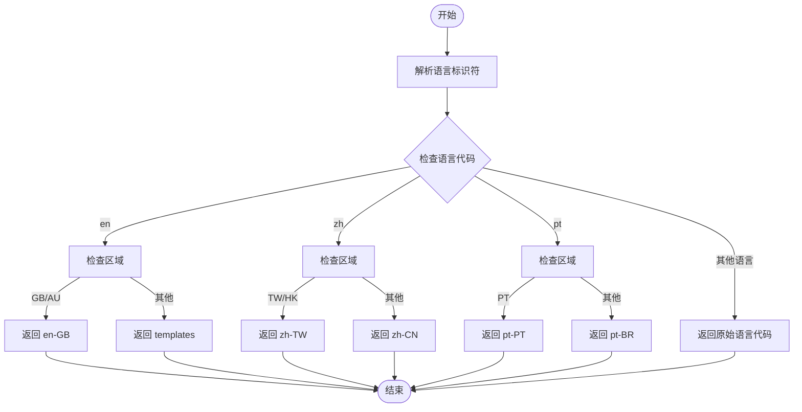

# 新语言支持添加指南

<cite>
**本文档中引用的文件**
- [lib.rs](file://rslib/i18n/src/lib.rs)
- [actions.ftl](file://ftl/core/actions.ftl)
- [build.rs](file://rslib/i18n/build.rs)
- [gather.rs](file://rslib/i18n/gather.rs)
- [extract.rs](file://rslib/i18n/extract.rs)
- [write_strings.rs](file://rslib/i18n/write_strings.rs)
- [python.rs](file://rslib/i18n/python.rs)
- [typescript.rs](file://rslib/i18n/typescript.rs)
</cite>

## 目录
1. [简介](#简介)
2. [项目结构](#项目结构)
3. [核心组件](#核心组件)
4. [架构概述](#架构概述)
5. [详细组件分析](#详细组件分析)
6. [依赖分析](#依赖分析)
7. [性能考虑](#性能考虑)
8. [故障排除指南](#故障排除指南)
9. [结论](#结论)

## 简介
本指南详细说明了为Anki添加新语言支持的完整流程。涵盖在rslib/i18n/src/lib.rs中注册新语言代码的步骤，创建翻译文件(.ftl)的过程，以及测试新语言支持的方法。同时包含处理特殊语言特性（如复数形式、性别变体、右到左文字）的技术要求和最佳实践。

## 项目结构
Anki的国际化系统主要由rslib/i18n模块和ftl目录组成。rslib/i18n负责处理多语言支持的核心逻辑，而ftl目录包含所有翻译字符串文件。

**图示来源**
- [lib.rs](file://rslib/i18n/src/lib.rs#L1-L540)
- [build.rs](file://rslib/i18n/build.rs#L1-L45)

**章节来源**
- [lib.rs](file://rslib/i18n/src/lib.rs#L1-L540)
- [build.rs](file://rslib/i18n/build.rs#L1-L45)

## 核心组件
Anki的国际化系统基于Fluent框架实现，核心组件包括语言注册机制、翻译文件处理和运行时语言加载。

**章节来源**
- [lib.rs](file://rslib/i18n/src/lib.rs#L1-L540)
- [actions.ftl](file://ftl/core/actions.ftl#L1-L98)

## 架构概述
Anki的国际化系统采用编译时生成和运行时加载相结合的架构。在编译时，系统会扫描所有FTL文件并生成类型安全的访问接口；在运行时，根据用户选择的语言加载相应的翻译资源。

**图示来源**
- [build.rs](file://rslib/i18n/build.rs#L1-L45)
- [lib.rs](file://rslib/i18n/src/lib.rs#L1-L540)

## 详细组件分析

### 语言代码注册分析
在rslib/i18n/src/lib.rs中，语言代码的注册和处理通过`remapped_lang_name`函数实现，该函数将语言标识符映射到具体的语言文件。

**图示来源**
- [lib.rs](file://rslib/i18n/src/lib.rs#L50-L90)

**章节来源**
- [lib.rs](file://rslib/i18n/src/lib.rs#L50-L90)

### 翻译文件创建分析
创建新的语言翻译文件需要遵循特定的结构和格式要求。以ftl/core/actions.ftl为例，每个翻译条目包含键名、值和可选的注释。

**图示来源**
- [actions.ftl](file://ftl/core/actions.ftl#L1-L98)
- [lib.rs](file://rslib/i18n/src/lib.rs#L1-L540)

**章节来源**
- [actions.ftl](file://ftl/core/actions.ftl#L1-L98)

### 字符串提取与验证分析
字符串提取和验证过程涉及多个步骤，从源代码中提取待翻译的字符串，到验证翻译文件的完整性。

**图示来源**
- [extract.rs](file://rslib/i18n/extract.rs#L1-L191)
- [check.rs](file://rslib/i18n/check.rs#L1-L100)

**章节来源**
- [extract.rs](file://rslib/i18n/extract.rs#L1-L191)

## 依赖分析
Anki的国际化系统依赖于多个Rust crate和内部模块，形成了复杂的依赖关系网络。

**图示来源**
- [Cargo.toml](file://rslib/i18n/Cargo.toml#L1-L20)
- [build.rs](file://rslib/i18n/build.rs#L1-L45)

**章节来源**
- [Cargo.toml](file://rslib/i18n/Cargo.toml#L1-L20)
- [build.rs](file://rslib/i18n/build.rs#L1-L45)

## 性能考虑
Anki的国际化系统在设计时考虑了性能优化，特别是在语言包加载和字符串查找方面。

**章节来源**
- [lib.rs](file://rslib/i18n/src/lib.rs#L1-L540)

## 故障排除指南
当添加新语言支持时，可能会遇到各种问题，本节提供常见问题的解决方案。

**章节来源**
- [lib.rs](file://rslib/i18n/src/lib.rs#L1-L540)
- [test.rs](file://rslib/i18n/src/lib.rs#L500-L540)

## 结论
Anki的国际化系统提供了一套完整的多语言支持解决方案，通过编译时生成和运行时加载的结合，确保了翻译的类型安全性和运行效率。添加新语言支持需要遵循特定的流程，包括语言代码注册、翻译文件创建、字符串提取和验证等步骤。