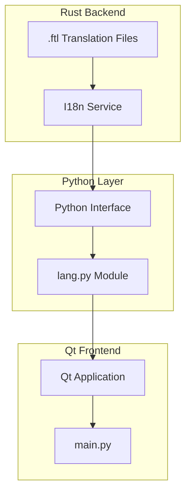
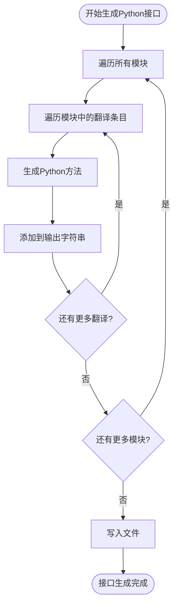
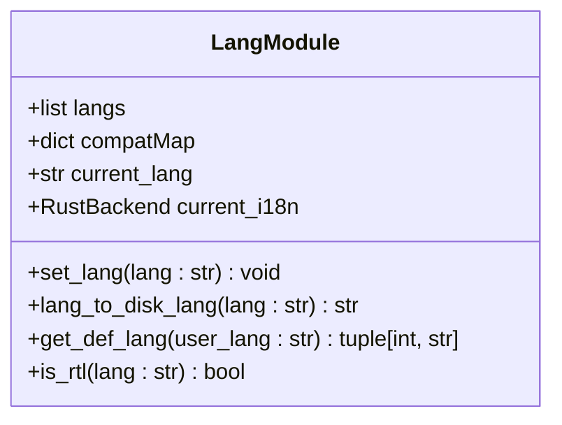
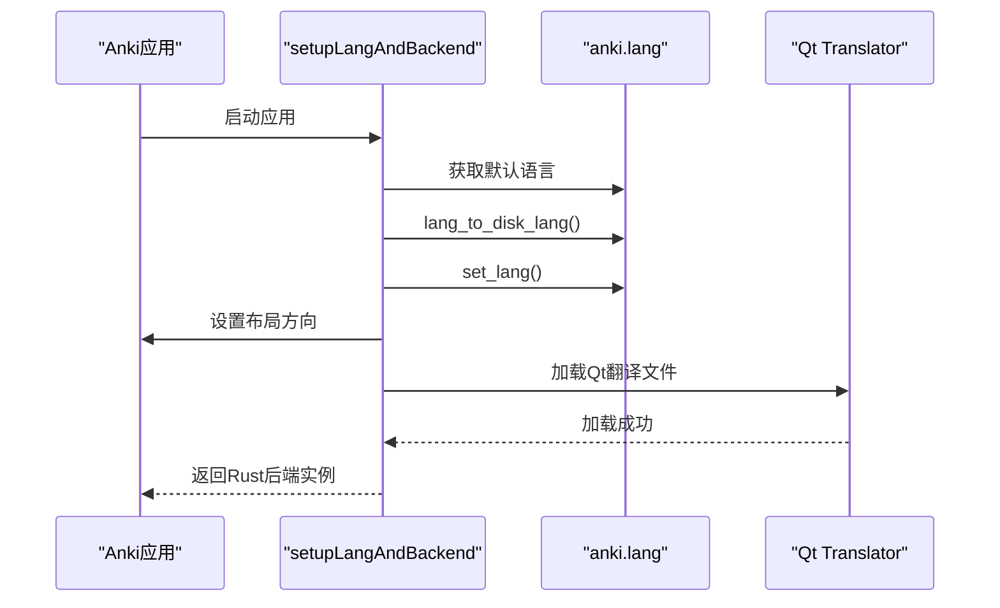
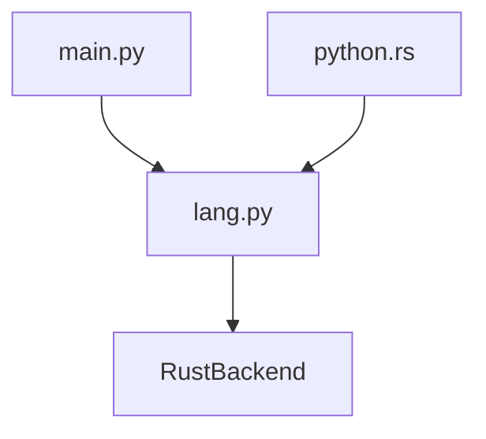

# 语言切换与持久化

<cite>
**本文档中引用的文件**   
- [python.rs](file://rslib/i18n/python.rs)
- [lang.py](file://pylib/anki/lang.py)
- [main.py](file://qt/aqt/main.py)
</cite>

## 目录
1. [简介](#简介)
2. [项目结构](#项目结构)
3. [核心组件](#核心组件)
4. [架构概述](#架构概述)
5. [详细组件分析](#详细组件分析)
6. [依赖分析](#依赖分析)
7. [性能考虑](#性能考虑)
8. [故障排除指南](#故障排除指南)
9. [结论](#结论)
10. [附录](#附录)（如有必要）

## 简介
本文档深入探讨了Anki应用程序中的语言切换与持久化机制。重点分析了rslib/i18n/python.rs中定义的Python接口如何实现语言切换功能，以及pylib/anki/lang.py中语言偏好设置的存储格式和读取逻辑。文档还描述了qt/aqt/main.py中界面语言动态更新的实现机制，包括Qt翻译系统的重新加载和所有界面组件的刷新流程。此外，文档说明了语言设置在应用程序重启后的持久化机制，以及配置文件的存储位置和格式。最后，文档提供了处理语言切换时可能出现的界面布局问题（如文本长度变化）的解决方案。

## 项目结构
Anki项目的文件组织遵循功能模块化的原则，主要分为以下几个核心目录：rslib用于存放Rust实现的国际化（i18n）功能，pylib包含Python层的业务逻辑和语言处理，qt目录则负责Qt图形用户界面的实现。这种分层架构使得语言切换功能的实现清晰地分布在不同技术栈中。

**Section sources**
- [python.rs](file://rslib/i18n/python.rs)
- [lang.py](file://pylib/anki/lang.py)
- [main.py](file://qt/aqt/main.py)

## 核心组件
本节分析实现语言切换功能的核心组件。`rslib/i18n/python.rs` 文件定义了从Rust后端生成Python接口的逻辑，这些接口是Python代码调用Rust国际化服务的桥梁。`pylib/anki/lang.py` 是语言处理的核心模块，它管理着当前语言设置、提供语言列表，并处理与旧版本的兼容性映射。`qt/aqt/main.py` 中的 `AnkiQt` 类则负责在Qt界面中应用和更新语言设置。

**Section sources**
- [python.rs](file://rslib/i18n/python.rs#L1-L110)
- [lang.py](file://pylib/anki/lang.py#L1-L256)
- [main.py](file://qt/aqt/main.py#L1-L1901)

## 架构概述
Anki的语言切换机制采用分层架构。最底层是Rust实现的`I18n`服务，它直接处理`.ftl`翻译文件。中间层是通过`python.rs`生成的Python接口，为上层应用提供访问Rust服务的途径。最上层是Qt应用，它通过`lang.py`模块设置和获取语言，并在`main.py`中触发界面的刷新。这种设计实现了业务逻辑与界面的解耦。

**Diagram sources **
- [python.rs](file://rslib/i18n/python.rs#L1-L110)
- [lang.py](file://pylib/anki/lang.py#L1-L256)
- [main.py](file://qt/aqt/main.py#L1-L1901)

## 详细组件分析
本节将对实现语言切换的关键组件进行深入分析。

### Python接口生成分析
`rslib/i18n/python.rs` 文件中的 `write_py_interface` 函数负责生成Python接口。它遍历所有模块和翻译条目，为每个翻译键生成一个对应的Python方法。这些方法最终会被写入一个自动生成的Python文件中。

**Diagram sources **
- [python.rs](file://rslib/i18n/python.rs#L1-L110)

**Section sources**
- [python.rs](file://rslib/i18n/python.rs#L1-L110)

### 语言偏好设置分析
`pylib/anki/lang.py` 模块是语言设置的核心。它通过 `langs` 变量存储所有支持的语言及其代码，通过 `compatMap` 处理旧版语言代码的映射。`set_lang` 函数用于设置当前语言，并初始化Rust后端。

**Diagram sources **
- [lang.py](file://pylib/anki/lang.py#L1-L256)

**Section sources**
- [lang.py](file://pylib/anki/lang.py#L1-L256)

### 界面语言动态更新分析
`qt/aqt/main.py` 中的 `setupLangAndBackend` 函数在应用启动时被调用，负责设置语言和后端。它首先获取用户首选语言，然后调用 `anki.lang.set_lang` 设置语言，并根据语言方向（RTL）调整布局，最后加载Qt翻译文件。

**Diagram sources **
- [main.py](file://qt/aqt/main.py#L229-L282)

**Section sources**
- [main.py](file://qt/aqt/main.py#L229-L282)

## 依赖分析
语言切换功能的实现依赖于多个组件的协同工作。`main.py` 依赖于 `lang.py` 来获取和设置语言，而 `lang.py` 又依赖于Rust后端提供的翻译服务。`python.rs` 作为生成器，是连接Rust和Python层的桥梁。

**Diagram sources **
- [main.py](file://qt/aqt/main.py#L229-L282)
- [lang.py](file://pylib/anki/lang.py#L1-L256)
- [python.rs](file://rslib/i18n/python.rs#L1-L110)

**Section sources**
- [main.py](file://qt/aqt/main.py#L229-L282)
- [lang.py](file://pylib/anki/lang.py#L1-L256)
- [python.rs](file://rslib/i18n/python.rs#L1-L110)

## 性能考虑
语言切换操作主要涉及文件I/O和字符串处理。由于翻译文件在启动时被一次性加载到内存中，因此运行时的语言切换非常高效。主要的性能开销在于Qt界面的刷新，但这通常是可以接受的。

## 故障排除指南
如果语言切换功能失效，首先应检查 `lang.py` 中的 `langs` 列表是否包含目标语言。其次，确认 `compatMap` 是否正确处理了语言代码的映射。最后，检查 `main.py` 中的 `setupLangAndBackend` 函数是否被正确调用。

**Section sources**
- [lang.py](file://pylib/anki/lang.py#L1-L256)
- [main.py](file://qt/aqt/main.py#L229-L282)

## 结论
Anki的语言切换与持久化机制设计精良，通过分层架构实现了功能的解耦和高效执行。从Rust后端的翻译服务，到Python层的接口和逻辑处理，再到Qt前端的界面应用，整个流程清晰且健壮。该机制确保了用户可以无缝地切换界面语言，并且设置能够持久化保存。