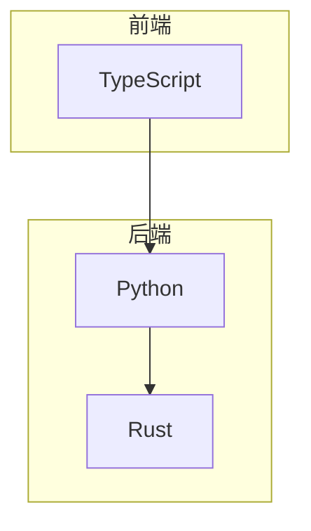
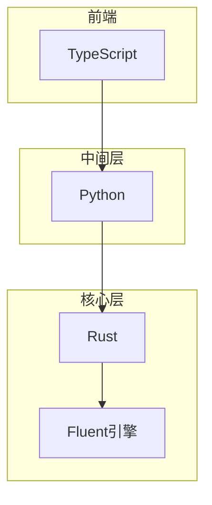
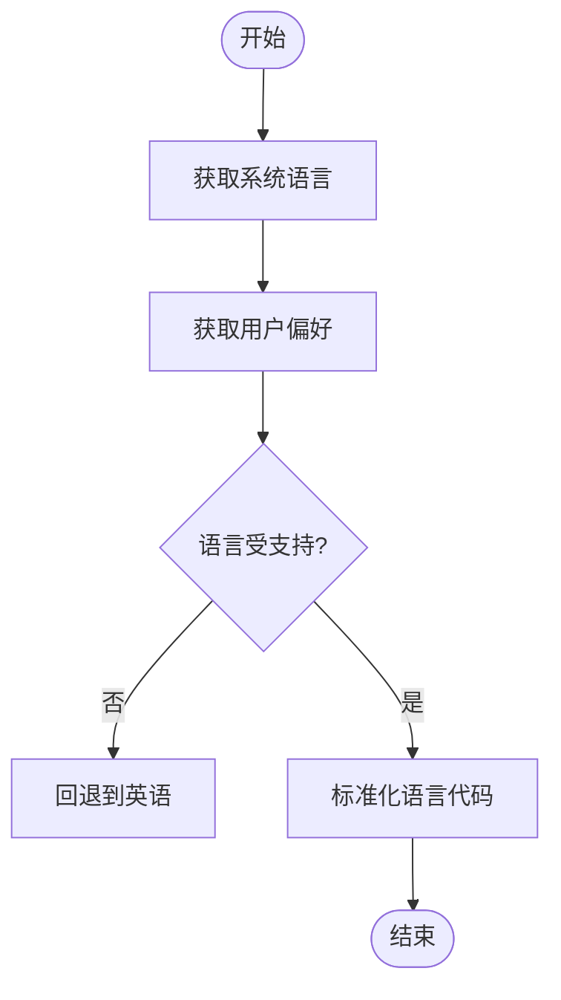
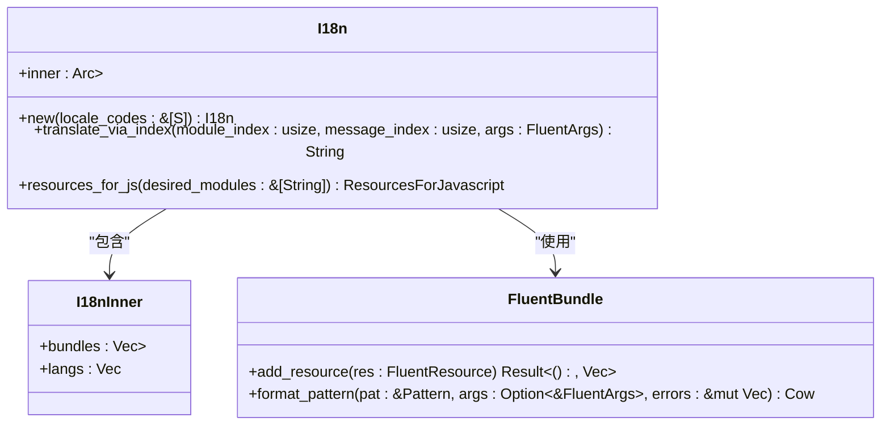
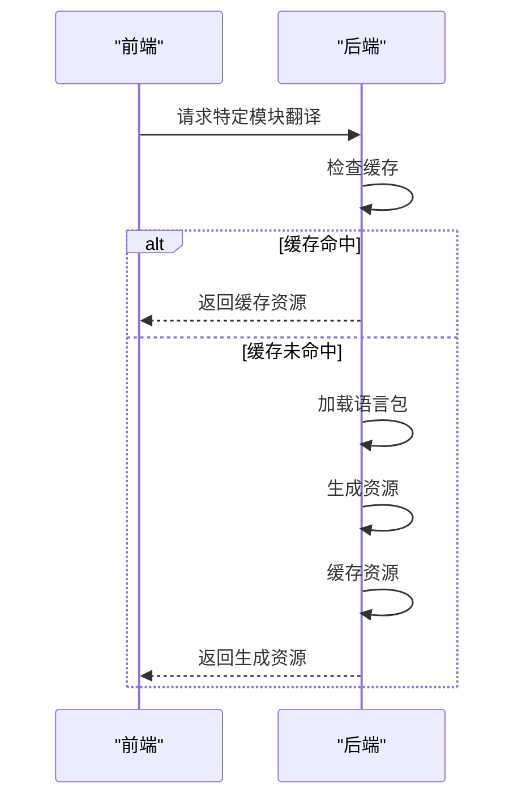
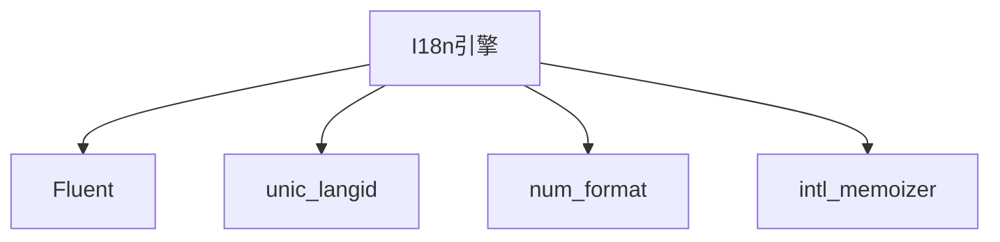

# 语言检测与加载

<cite>
**本文档中引用的文件**   
- [lib.rs](file://rslib/i18n/src/lib.rs)
- [lang.py](file://pylib/anki/lang.py)
</cite>

## 目录
1. [简介](#简介)
2. [项目结构](#项目结构)
3. [核心组件](#核心组件)
4. [架构概述](#架构概述)
5. [详细组件分析](#详细组件分析)
6. [依赖分析](#依赖分析)
7. [性能考虑](#性能考虑)
8. [故障排除指南](#故障排除指南)
9. [结论](#结论)
10. [附录](#附录)（如有必要）

## 简介
本文档深入探讨了Anki应用程序中的语言检测与加载机制。重点分析了rslib/i18n/src/lib.rs中实现的语言环境检测逻辑，包括系统语言识别、用户偏好匹配和默认语言回退策略。同时描述了支持的语言列表管理机制，以及语言包的加载流程和缓存策略。此外，还说明了pylib/anki/lang.py中实现的语言代码验证和语言环境初始化过程，包括处理语言代码标准化（如zh-CN与zh_TW区分）的具体实现细节，以及在不同操作系统（Windows、macOS、Linux）上的语言检测差异处理。最后，文档涵盖了性能优化措施，如语言包的延迟加载和内存管理。

## 项目结构
Anki的国际化（i18n）系统主要由两个核心组件构成：Rust实现的底层语言处理库和Python实现的高层接口。Rust组件位于rslib/i18n目录下，负责核心的语言检测、翻译和格式化功能。Python组件位于pylib/anki/lang.py，作为Rust后端的包装器，提供向后兼容的API并处理系统级语言检测。此外，前端TypeScript代码通过setupI18n函数按需加载特定模块的语言资源，实现了高效的资源管理。

**图表来源**
- [lang.py](file://pylib/anki/lang.py#L1-L255)
- [lib.rs](file://rslib/i18n/src/lib.rs#L1-L540)

**章节来源**
- [lang.py](file://pylib/anki/lang.py#L1-L255)
- [lib.rs](file://rslib/i18n/src/lib.rs#L1-L540)

## 核心组件
Anki的语言检测与加载系统由两个主要组件构成：Rust实现的I18n核心库和Python实现的lang模块。Rust组件提供了高性能的翻译引擎和语言环境管理，而Python组件则负责与操作系统交互，获取系统语言设置，并作为Rust后端的接口。这种分层架构使得核心翻译逻辑可以跨平台复用，同时保持了与Python生态系统的兼容性。

**章节来源**
- [lib.rs](file://rslib/i18n/src/lib.rs#L1-L540)
- [lang.py](file://pylib/anki/lang.py#L1-L255)

## 架构概述
Anki的国际化架构采用分层设计，从底层的Rust翻译引擎到上层的Python接口，再到前端的TypeScript模块化加载。Rust层使用Fluent国际化框架处理翻译资源的解析和格式化，Python层负责系统语言检测和用户偏好管理，前端则通过按需加载机制优化性能。这种架构确保了翻译的准确性和性能，同时提供了灵活的扩展能力。

**图表来源**
- [lib.rs](file://rslib/i18n/src/lib.rs#L1-L540)
- [lang.py](file://pylib/anki/lang.py#L1-L255)

## 详细组件分析
本节深入分析Anki语言检测与加载系统的各个关键组件，包括语言环境检测、翻译引擎、语言包加载和缓存策略等。

### 语言环境检测分析
Anki的语言环境检测机制首先通过Python的locale模块获取系统默认语言，然后与用户偏好进行匹配。如果两者都不可用，则回退到英语。检测到的语言代码会经过标准化处理，确保与支持的语言列表匹配。

**图表来源**
- [lang.py](file://pylib/anki/lang.py#L188-L231)

**章节来源**
- [lang.py](file://pylib/anki/lang.py#L188-L231)

### 翻译引擎分析
Rust实现的I18n引擎使用Fluent框架处理翻译资源。引擎支持多语言捆绑，按优先级顺序尝试匹配翻译，最后回退到英语模板。数字格式化根据语言习惯自动调整小数点分隔符。

**图表来源**
- [lib.rs](file://rslib/i18n/src/lib.rs#L1-L540)

**章节来源**
- [lib.rs](file://rslib/i18n/src/lib.rs#L1-L540)

### 语言包加载分析
Anki的语言包加载采用延迟加载和模块化策略。前端按需请求特定模块的翻译资源，后端根据请求动态生成对应的语言包。这种机制减少了初始加载时间，提高了应用性能。

**图表来源**
- [lib.rs](file://rslib/i18n/src/lib.rs#L1-L540)
- [lang.py](file://pylib/anki/lang.py#L1-L255)

**章节来源**
- [lib.rs](file://rslib/i18n/src/lib.rs#L1-L540)
- [lang.py](file://pylib/anki/lang.py#L1-L255)

## 依赖分析
Anki的国际化系统依赖于多个外部库和框架。核心依赖包括Fluent国际化框架、unic_langid语言标识符库和num_format数字格式化库。这些依赖共同提供了强大的国际化支持，包括复杂的复数规则处理、语言标识符解析和本地化数字格式化。

**图表来源**
- [lib.rs](file://rslib/i18n/src/lib.rs#L1-L540)

**章节来源**
- [lib.rs](file://rslib/i18n/src/lib.rs#L1-L540)

## 性能考虑
Anki在语言检测与加载方面实施了多项性能优化措施。包括翻译资源的延迟加载、内存中的缓存机制、以及按需生成语言包。这些优化确保了应用的快速启动和流畅运行，特别是在处理大量翻译资源时。

## 故障排除指南
当遇到语言显示问题时，首先检查系统语言设置是否正确，然后验证用户偏好是否与支持的语言列表匹配。如果问题仍然存在，可以尝试清除语言包缓存或重置语言设置。对于开发人员，可以启用调试日志来跟踪翻译查找过程。

**章节来源**
- [lib.rs](file://rslib/i18n/src/lib.rs#L1-L540)
- [lang.py](file://pylib/anki/lang.py#L1-L255)

## 结论
Anki的语言检测与加载机制通过Rust和Python的协同工作，实现了高效、准确的国际化支持。系统采用分层架构，将核心翻译逻辑与系统级语言检测分离，既保证了性能又保持了灵活性。模块化的资源加载和智能的回退策略确保了用户体验的一致性，即使在部分翻译缺失的情况下也能正常工作。

## 附录
### 支持的语言列表
Anki支持多种语言，包括但不限于：
- 简体中文 (zh_CN)
- 繁体中文 (zh_TW)
- 英语 (en_US)
- 日语 (ja_JP)
- 韩语 (ko_KR)

### 语言代码映射
特定语言代码会被映射到标准格式：
- zh-TW: 台湾、香港地区
- zh-CN: 其他中文地区
- pt-BR: 巴西葡萄牙语
- pt-PT: 葡萄牙葡萄牙语

**章节来源**
- [lang.py](file://pylib/anki/lang.py#L1-L255)