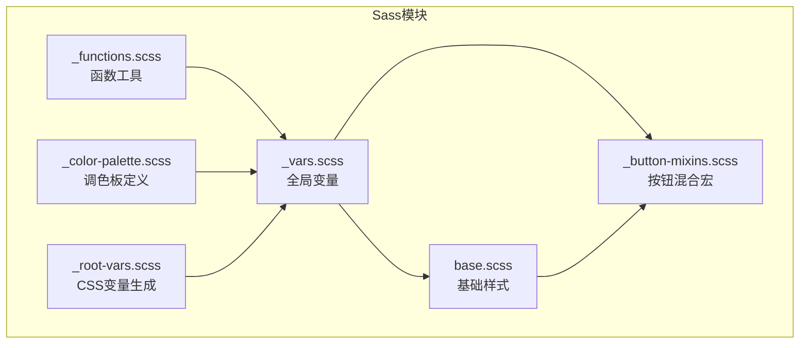
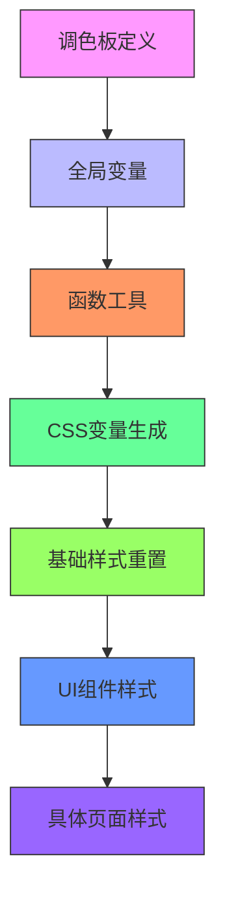
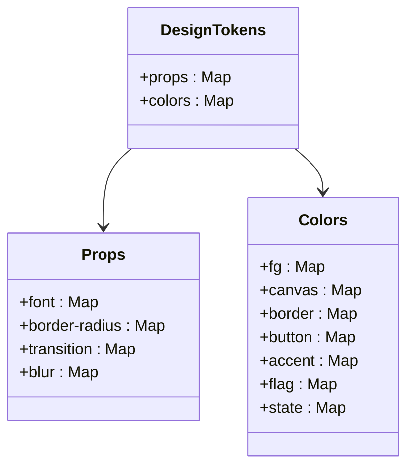
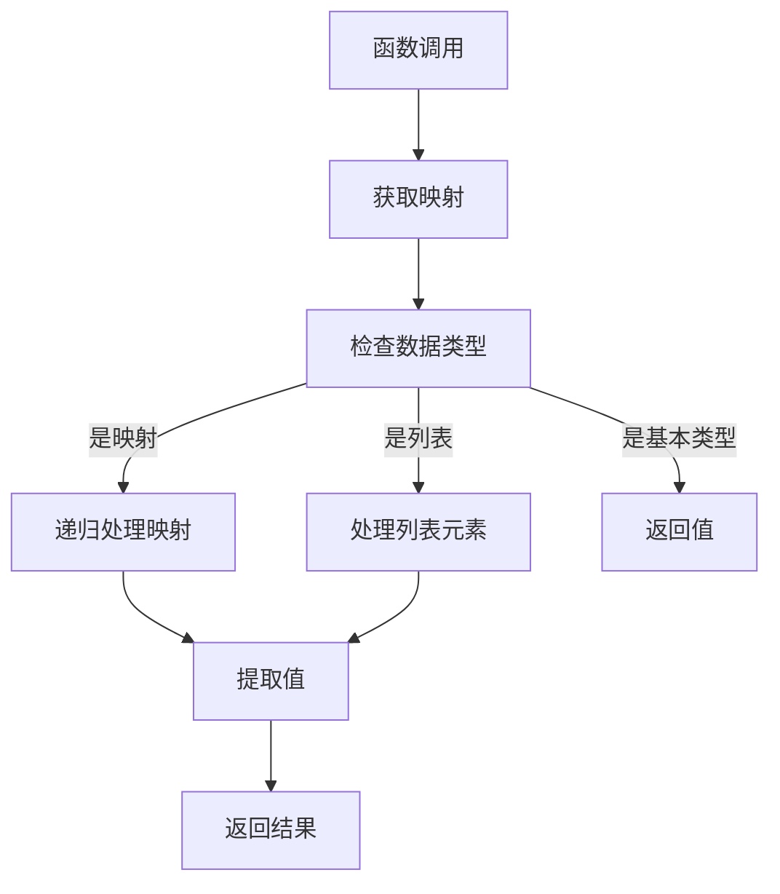
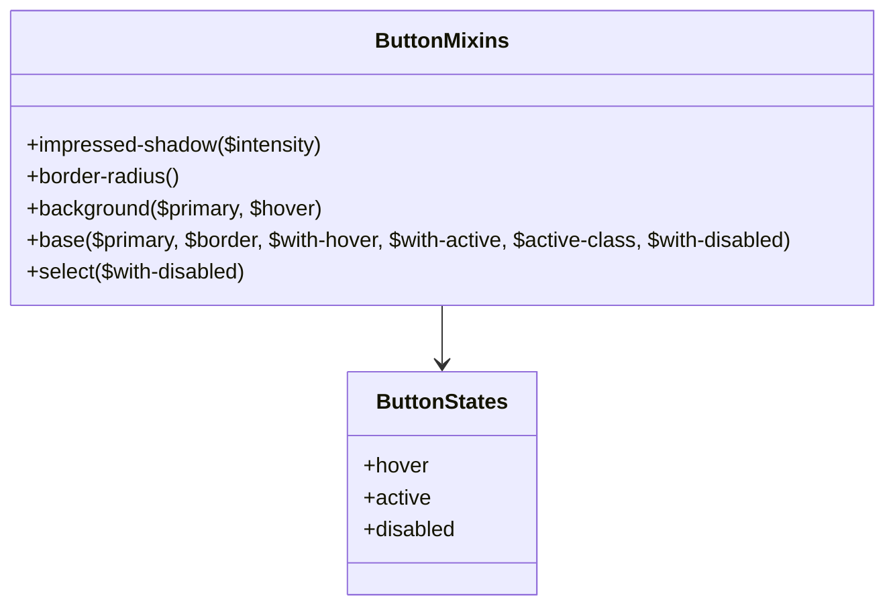

# Sass架构

<cite>
**本文档中引用的文件**  
- [_vars.scss](file://ts/lib/sass/_vars.scss)
- [_functions.scss](file://ts/lib/sass/_functions.scss)
- [_button-mixins.scss](file://ts/lib/sass/_button-mixins.scss)
- [base.scss](file://ts/lib/sass/base.scss)
- [_color-palette.scss](file://ts/lib/sass/_color-palette.scss)
- [_root-vars.scss](file://ts/lib/sass/_root-vars.scss)
</cite>

## 目录
1. [简介](#简介)
2. [项目结构](#项目结构)
3. [核心组件](#核心组件)
4. [架构概述](#架构概述)
5. [详细组件分析](#详细组件分析)
6. [依赖分析](#依赖分析)
7. [性能考虑](#性能考虑)
8. [故障排除指南](#故障排除指南)
9. [结论](#结论)
10. [附录](#附录)（如有必要）

## 简介
本文档深入解析Anki的Sass架构，重点分析设计系统中的核心Sass文件。文档详细阐述了全局变量系统、颜色操作函数、按钮混合宏以及CSS重置策略，展示了如何通过Sass实现UI组件的一致性。

## 项目结构
Anki的Sass架构采用模块化设计，将样式系统分解为多个可重用的组件文件。核心Sass文件位于`ts/lib/sass/`目录下，通过清晰的文件组织策略实现设计系统的可维护性和可扩展性。

**图示来源**  
- [_vars.scss](file://ts/lib/sass/_vars.scss#L1-L474)
- [_functions.scss](file://ts/lib/sass/_functions.scss#L1-L88)
- [_button-mixins.scss](file://ts/lib/sass/_button-mixins.scss#L1-L122)
- [base.scss](file://ts/lib/sass/base.scss#L1-L90)

**章节来源**  
- [ts/lib/sass](file://ts/lib/sass)

## 核心组件
Anki的Sass架构由五个核心组件构成：全局变量系统、函数工具库、按钮混合宏、基础样式重置和调色板管理系统。这些组件协同工作，确保UI设计的一致性和可维护性。

**章节来源**  
- [_vars.scss](file://ts/lib/sass/_vars.scss#L1-L474)
- [_functions.scss](file://ts/lib/sass/_functions.scss#L1-L88)
- [_button-mixins.scss](file://ts/lib/sass/_button-mixins.scss#L1-L122)

## 架构概述
Anki的Sass架构采用分层设计模式，从基础的调色板定义到复杂的UI组件样式，形成完整的样式系统。架构通过Sass的模块化特性，实现了设计令牌的集中管理和组件样式的可重用性。

**图示来源**  
- [_color-palette.scss](file://ts/lib/sass/_color-palette.scss)
- [_vars.scss](file://ts/lib/sass/_vars.scss)
- [_functions.scss](file://ts/lib/sass/_functions.scss)
- [_root-vars.scss](file://ts/lib/sass/_root-vars.scss)
- [base.scss](file://ts/lib/sass/base.scss)

## 详细组件分析
### 全局变量系统分析
Anki的全局变量系统通过`_vars.scss`文件定义，采用嵌套映射结构组织设计令牌。系统包含间距、字体大小、边框半径等设计属性，支持明暗主题切换。

**图示来源**  
- [_vars.scss](file://ts/lib/sass/_vars.scss#L1-L474)

**章节来源**  
- [_vars.scss](file://ts/lib/sass/_vars.scss#L1-L474)

### 函数工具库分析
`_functions.scss`文件实现了Sass函数工具库，提供变量映射、深度获取和值提取功能。这些函数支持从嵌套映射中动态提取设计令牌，实现灵活的主题系统。

**图示来源**  
- [_functions.scss](file://ts/lib/sass/_functions.scss#L1-L88)

**章节来源**  
- [_functions.scss](file://ts/lib/sass/_functions.scss#L1-L88)

### 按钮混合宏分析
`_button-mixins.scss`文件定义了按钮样式混合宏，提供一致的按钮外观和交互效果。混合宏支持主按钮、悬停状态和禁用状态的样式配置。

**图示来源**  
- [_button-mixins.scss](file://ts/lib/sass/_button-mixins.scss#L1-L122)

**章节来源**