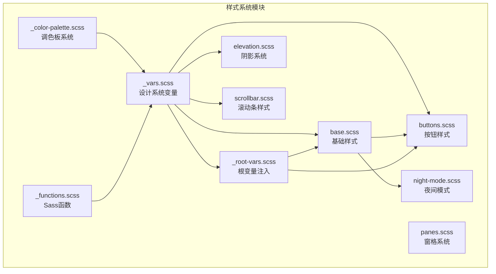
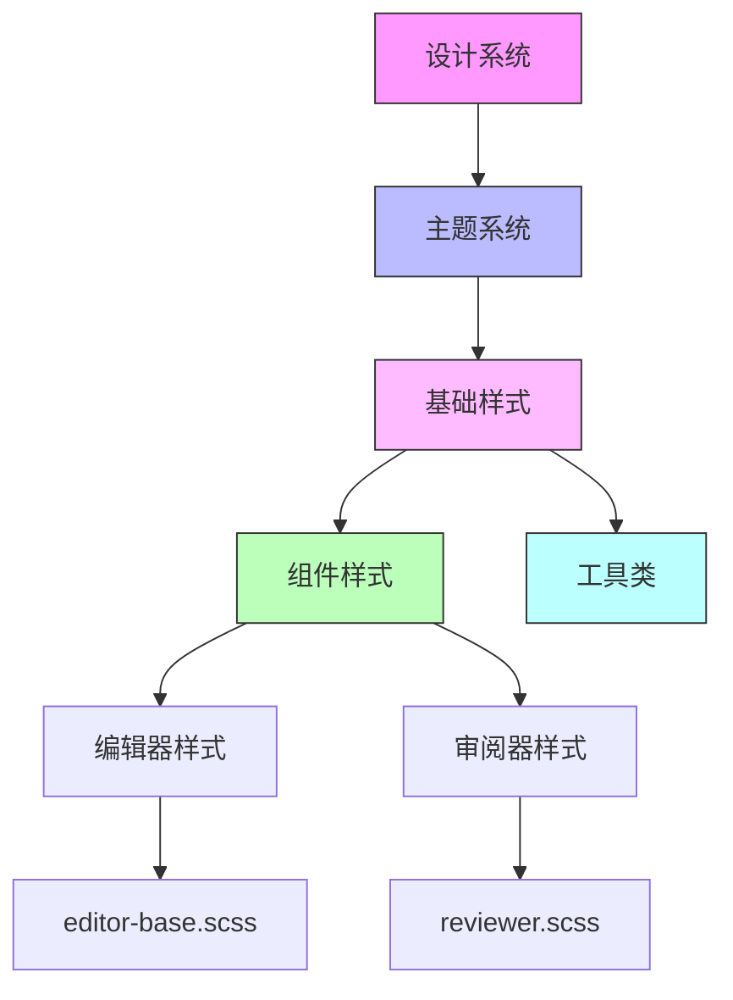
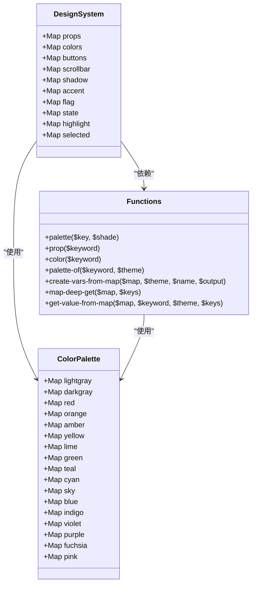
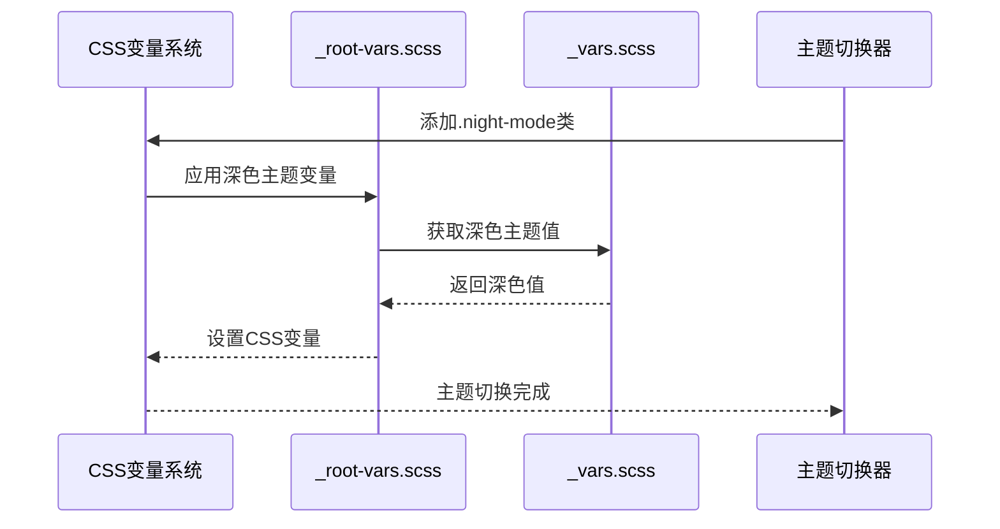
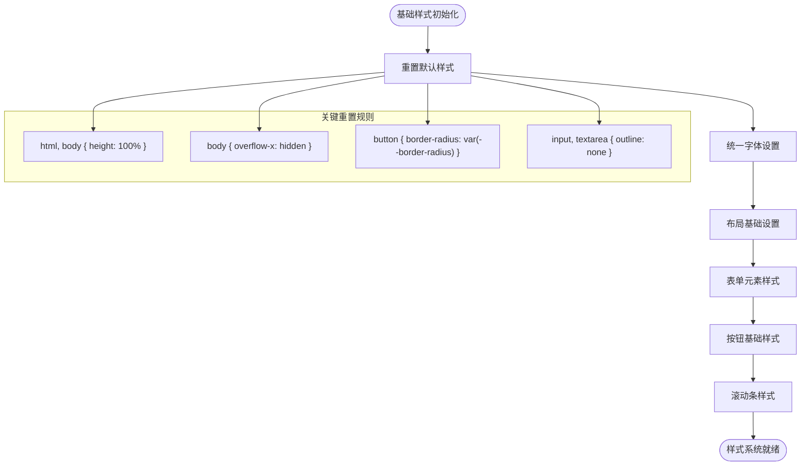
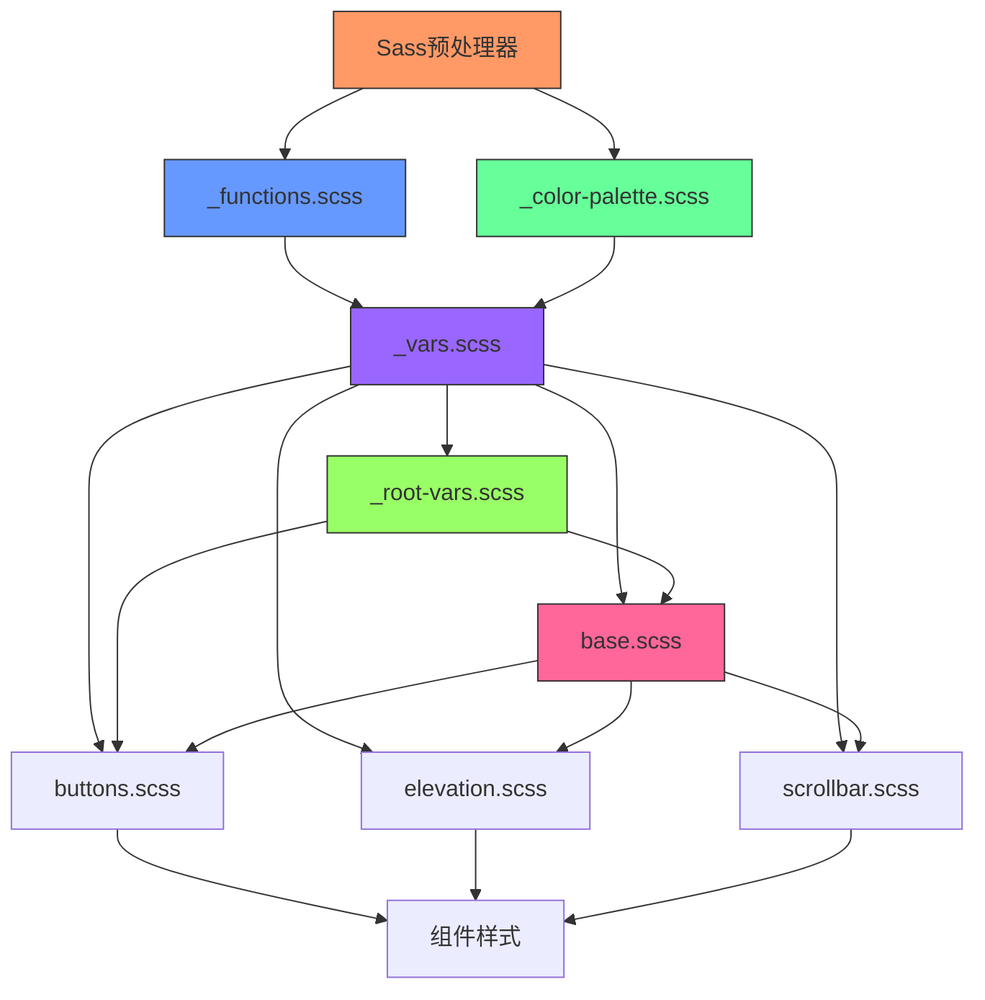

# 样式系统

<cite>
**本文档中引用的文件**   
- [\_vars.scss](file://ts/lib/sass/_vars.scss)
- [\_color-palette.scss](file://ts/lib/sass/_color-palette.scss)
- [base.scss](file://ts/lib/sass/base.scss)
- [night-mode.scss](file://ts/lib/sass/night-mode.scss)
- [buttons.scss](file://ts/lib/sass/buttons.scss)
- [elevation.scss](file://ts/lib/sass/elevation.scss)
- [\_button-mixins.scss](file://ts/lib/sass/_button-mixins.scss)
- [\_functions.scss](file://ts/lib/sass/_functions.scss)
- [\_root-vars.scss](file://ts/lib/sass/_root-vars.scss)
- [scrollbar.scss](file://ts/lib/sass/scrollbar.scss)
- [panes.scss](file://ts/lib/sass/panes.scss)
- [editor-base.scss](file://ts/editor/editor-base.scss)
- [reviewer.scss](file://ts/reviewer/reviewer.scss)
</cite>

## 目录
1. [简介](#简介)
2. [项目结构](#项目结构)
3. [核心组件](#核心组件)
4. [架构概述](#架构概述)
5. [详细组件分析](#详细组件分析)
6. [依赖分析](#依赖分析)
7. [性能考虑](#性能考虑)
8. [故障排除指南](#故障排除指南)
9. [结论](#结论)
10. [附录](#附录)（如有必要）

## 简介
本文档全面介绍了Anki前端样式系统的架构和实现。样式系统基于Sass预处理器构建，采用模块化设计，支持主题化和响应式布局。系统通过变量、混合宏和函数的组合使用，实现了高度可维护和可扩展的CSS架构。核心设计理念包括使用CSS自定义属性（变量）实现主题切换、通过Sass映射结构组织设计系统、利用Bootstrap框架基础并进行定制化扩展。

## 项目结构
Anki的前端样式系统位于`ts/lib/sass/`目录下，采用模块化组织方式。系统由核心变量定义、基础样式重置、组件样式和工具类组成。主要文件包括`_vars.scss`中的设计系统变量、`_color-palette.scss`中的调色板定义、`base.scss`中的基础样式和`night-mode.scss`中的夜间模式实现。

**Diagram sources**
- [\_vars.scss](file://ts/lib/sass/_vars.scss)
- [\_color-palette.scss](file://ts/lib/sass/_color-palette.scss)
- [base.scss](file://ts/lib/sass/base.scss)
- [night-mode.scss](file://ts/lib/sass/night-mode.scss)

**Section sources**
- [\_vars.scss](file://ts/lib/sass/_vars.scss#L1-L474)
- [\_color-palette.scss](file://ts/lib/sass/_color-palette.scss#L1-L214)
- [base.scss](file://ts/lib/sass/base.scss#L1-L90)

## 核心组件
Anki样式系统的核心组件包括设计系统变量、主题系统、基础样式架构和UI组件系统。设计系统通过Sass映射结构定义了颜色、间距、边框半径等设计令牌，这些令牌在编译时转换为CSS自定义属性。主题系统通过`:root`选择器和类名切换实现夜间模式，支持高对比度和可访问性需求。基础样式基于Bootstrap框架进行定制，同时保持了轻量级和高性能的特点。

**Section sources**
- [\_vars.scss](file://ts/lib/sass/_vars.scss#L1-L474)
- [base.scss](file://ts/lib/sass/base.scss#L1-L90)
- [\_root-vars.scss](file://ts/lib/sass/_root-vars.scss#L1-L66)

## 架构概述
Anki的样式系统采用分层架构，从底层设计系统到顶层组件样式形成完整的样式链。系统通过Sass模块系统组织代码，确保了良好的封装性和可维护性。设计系统变量通过`_vars.scss`文件集中管理，主题逻辑在`_root-vars.scss`中实现，基础样式在`base.scss`中定义，而具体组件样式则分布在各自的SCSS文件中。

**Diagram sources**
- [\_vars.scss](file://ts/lib/sass/_vars.scss#L1-L474)
- [\_root-vars.scss](file://ts/lib/sass/_root-vars.scss#L1-L66)
- [base.scss](file://ts/lib/sass/base.scss#L1-L90)

## 详细组件分析
### 设计系统与变量管理
Anki的样式系统通过`_vars.scss`文件定义了完整的设计系统。系统使用Sass映射结构组织变量，包括颜色、边框半径、过渡效果等设计令牌。这些变量通过`create-vars-from-map`函数转换为CSS自定义属性，在运行时可通过JavaScript动态修改。

**Diagram sources**
- [\_vars.scss](file://ts/lib/sass/_vars.scss#L1-L474)
- [\_color-palette.scss](file://ts/lib/sass/_color-palette.scss#L1-L214)
- [\_functions.scss](file://ts/lib/sass/_functions.scss#L1-L88)

**Section sources**
- [\_vars.scss](file://ts/lib/sass/_vars.scss#L1-L474)
- [\_color-palette.scss](file://ts/lib/sass/_color-palette.scss#L1-L214)
- [\_functions.scss](file://ts/lib/sass/_functions.scss#L1-L88)

### 主题系统与夜间模式
Anki的主题系统通过CSS自定义属性和`:root`选择器实现。系统在`_root-vars.scss`中定义了浅色和深色主题的变量映射，通过切换`.night-mode`类来激活夜间模式。这种实现方式允许在运行时动态切换主题，同时保持了CSS的可维护性。

**Diagram sources**
- [\_root-vars.scss](file://ts/lib/sass/_root-vars.scss#L1-L66)
- [\_vars.scss](file://ts/lib/sass/_vars.scss#L1-L474)
- [night-mode.scss](file://ts/lib/sass/night-mode.scss#L1-L12)

**Section sources**
- [\_root-vars.scss](file://ts/lib/sass/_root-vars.scss#L1-L66)
- [night-mode.scss](file://ts/lib/sass/night-mode.scss#L1-L12)

### 基础样式与CSS重置
`base.scss`文件定义了Anki的基础样式架构和CSS重置策略。系统基于Bootstrap框架的reboot和utilities模块，同时进行了大量定制化修改。样式重置包括字体继承、溢出处理、表单元素样式统一等，确保了跨浏览器的一致性。

**Diagram sources**
- [base.scss](file://ts/lib/sass/base.scss#L1-L90)
- [\_vars.scss](file://ts/lib/sass/_vars.scss#L1-L474)

**Section sources**
- [base.scss](file://ts/lib/sass/base.scss#L1-L90)

### 组件特定样式
#### 编辑器样式
`editor-base.scss`文件定义了Anki编辑器的基础样式。该样式表继承了`base.scss`中的基础样式，同时针对编辑器的特殊需求进行了定制。样式包括字体设置、溢出处理和Bootstrap组件的导入。

**Section sources**
- [editor-base.scss](file://ts/editor/editor-base.scss#L1-L16)

#### 审阅器样式
`reviewer.scss`文件定义了卡片审阅界面的样式。该样式表处理了卡片内容的显示、标记和标志的定位、输入反馈样式等。特别实现了夜间模式下的图像滤镜处理，确保内容可读性。

**Section sources**
- [reviewer.scss](file://ts/reviewer/reviewer.scss#L1-L137)

## 依赖分析
Anki样式系统的依赖关系清晰，采用自上而下的依赖链。核心依赖包括Sass预处理器、Bootstrap CSS框架和CSS自定义属性。系统通过`@use`规则管理Sass模块依赖，确保了良好的封装性。

**Diagram sources**
- [\_functions.scss](file://ts/lib/sass/_functions.scss#L1-L88)
- [\_color-palette.scss](file://ts/lib/sass/_color-palette.scss#L1-L214)
- [\_vars.scss](file://ts/lib/sass/_vars.scss#L1-L474)
- [\_root-vars.scss](file://ts/lib/sass/_root-vars.scss#L1-L66)
- [base.scss](file://ts/lib/sass/base.scss#L1-L90)

**Section sources**
- [\_functions.scss](file://ts/lib/sass/_functions.scss#L1-L88)
- [base.scss](file://ts/lib/sass/base.scss#L1-L90)

## 性能考虑
Anki样式系统在性能方面进行了多项优化。通过使用CSS自定义属性减少了CSS文件大小，利用Sass编译时优化减少了运行时计算。系统避免了深层嵌套和复杂选择器，确保了样式应用的高效性。滚动条样式等性能敏感的组件使用了硬件加速的CSS属性。

## 故障排除指南
当遇到样式问题时，建议按照以下步骤排查：首先检查是否正确引入了基础样式文件，然后验证CSS自定义属性是否正确注入，最后确认主题类名是否正确应用。对于夜间模式问题，需要检查`.night-mode`类是否正确添加到根元素。

**Section sources**
- [\_root-vars.scss](file://ts/lib/sass/_root-vars.scss#L1-L66)
- [night-mode.scss](file://ts/lib/sass/night-mode.scss#L1-L12)

## 结论
Anki的前端样式系统是一个现代化、模块化的设计系统实现。通过Sass预处理器的强大功能，系统实现了设计令牌的集中管理、主题系统的灵活切换和组件样式的可维护性。系统架构清晰，依赖关系明确，为未来的样式扩展和维护提供了坚实的基础。