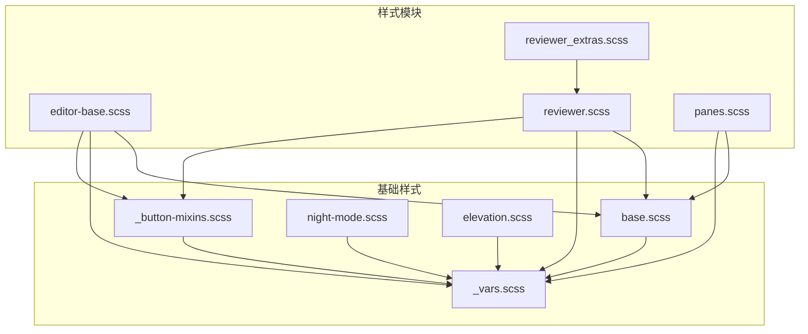
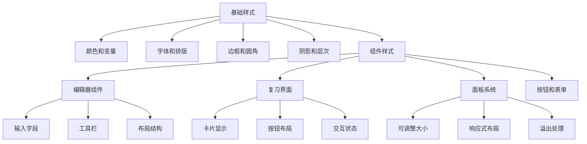
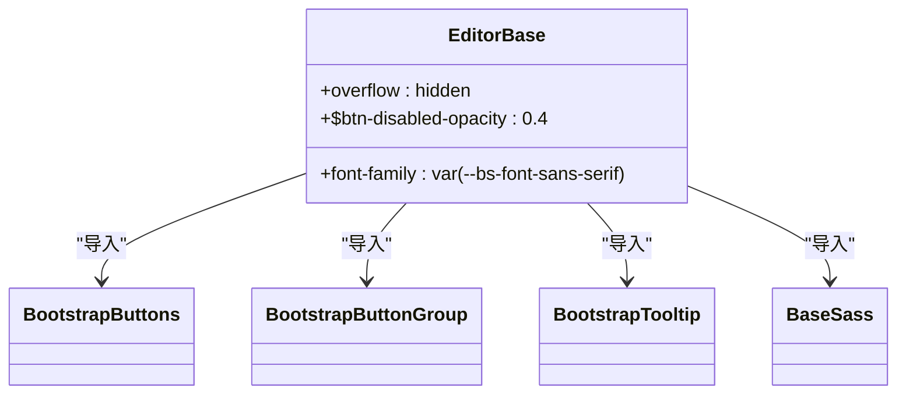
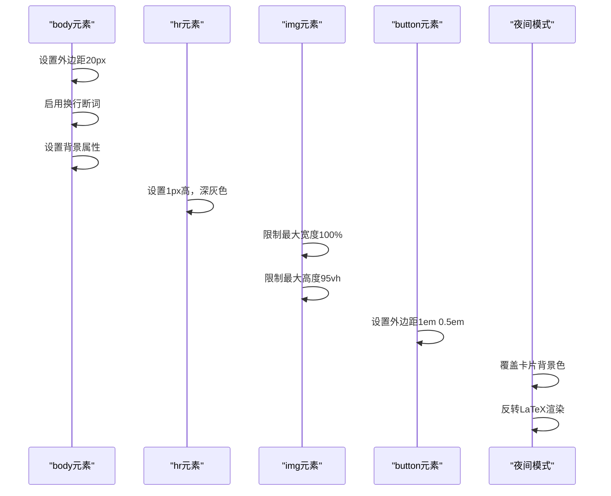
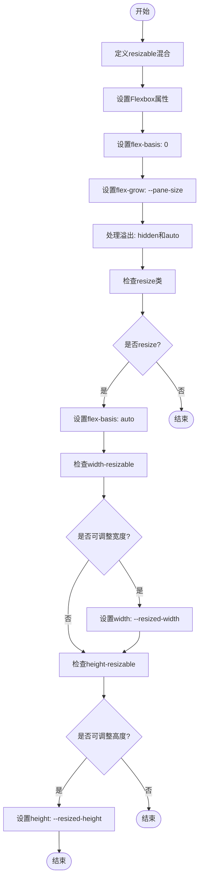
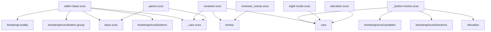

# 组件样式

<cite>
**本文档中引用的文件**   
- [editor-base.scss](file://ts/editor/editor-base.scss)
- [reviewer.scss](file://ts/reviewer/reviewer.scss)
- [reviewer_extras.scss](file://ts/reviewer/reviewer_extras.scss)
- [panes.scss](file://ts/lib/sass/panes.scss)
- [base.scss](file://ts/lib/sass/base.scss)
- [_vars.scss](file://ts/lib/sass/_vars.scss)
- [_button-mixins.scss](file://ts/lib/sass/_button-mixins.scss)
- [night-mode.scss](file://ts/lib/sass/night-mode.scss)
- [elevation.scss](file://ts/lib/sass/elevation.scss)
</cite>

## 目录
1. [简介](#简介)
2. [项目结构](#项目结构)
3. [核心组件](#核心组件)
4. [架构概述](#架构概述)
5. [详细组件分析](#详细组件分析)
6. [依赖分析](#依赖分析)
7. [性能考虑](#性能考虑)
8. [故障排除指南](#故障排除指南)
9. [结论](#结论)
10. [附录](#附录)（如有必要）

## 简介
本文档详细分析Anki组件样式架构，重点研究编辑器组件、复习界面和面板系统的样式设计。文档涵盖editor-base.scss中定义的编辑器布局结构、输入字段样式和工具栏设计，reviewer.scss和reviewer_extras.scss中实现的复习界面样式，以及panes.scss中定义的面板系统和响应式布局策略。同时，文档解释了组件CSS类的命名规范和BEM（块-元素-修饰符）方法的应用实例，并提供了一致性指南，用于扩展现有组件样式和创建新组件样式。

## 项目结构
Anki的样式系统主要由多个SCSS文件组成，这些文件分布在不同的目录中，形成了一个模块化的样式架构。核心样式文件包括editor-base.scss（编辑器组件）、reviewer.scss（复习界面）和panes.scss（面板系统）。这些文件通过导入基础样式变量和混合（mixins）来实现一致的设计语言。样式系统采用模块化设计，将不同功能区域的样式分离到独立的文件中，便于维护和扩展。

**Diagram sources**
- [editor-base.scss](file://ts/editor/editor-base.scss)
- [reviewer.scss](file://ts/reviewer/reviewer.scss)
- [reviewer_extras.scss](file://ts/reviewer/reviewer_extras.scss)
- [panes.scss](file://ts/lib/sass/panes.scss)
- [base.scss](file://ts/lib/sass/base.scss)
- [_vars.scss](file://ts/lib/sass/_vars.scss)

**Section sources**
- [editor-base.scss](file://ts/editor/editor-base.scss)
- [reviewer.scss](file://ts/reviewer/reviewer.scss)
- [reviewer_extras.scss](file://ts/reviewer/reviewer_extras.scss)
- [panes.scss](file://ts/lib/sass/panes.scss)

## 核心组件
Anki的样式系统由三个核心组件构成：编辑器组件、复习界面组件和面板系统。编辑器组件负责笔记编辑界面的样式，包括输入字段、工具栏和布局结构。复习界面组件管理卡片显示、按钮布局和交互状态的视觉呈现。面板系统则提供了灵活的布局框架，支持可调整大小的面板和响应式设计。这些组件通过共享的基础样式变量和混合实现视觉一致性，同时保持各自的功能独立性。

**Section sources**
- [editor-base.scss](file://ts/editor/editor-base.scss)
- [reviewer.scss](file://ts/reviewer/reviewer.scss)
- [panes.scss](file://ts/lib/sass/panes.scss)

## 架构概述
Anki的样式架构采用分层设计，从基础样式到具体组件样式逐层构建。基础样式层包含全局变量、颜色调色板、字体设置和通用混合。组件样式层在此基础上构建具体的UI元素样式，如按钮、输入框和布局容器。这种分层架构确保了设计的一致性和可维护性。样式系统还特别注重夜间模式的支持，通过CSS变量和特定的样式规则实现主题切换。

**Diagram sources**
- [_vars.scss](file://ts/lib/sass/_vars.scss)
- [base.scss](file://ts/lib/sass/base.scss)
- [editor-base.scss](file://ts/editor/editor-base.scss)
- [reviewer.scss](file://ts/reviewer/reviewer.scss)
- [panes.scss](file://ts/lib/sass/panes.scss)

## 详细组件分析
本文档对Anki的三个主要样式组件进行深入分析：编辑器组件、复习界面组件和面板系统。每个组件的分析包括其CSS结构、关键样式规则、布局策略和交互设计。通过具体的代码示例和可视化图表，展示这些组件如何协同工作，创建一致且功能强大的用户界面。

### 编辑器组件分析
编辑器组件的样式定义在editor-base.scss文件中，它为笔记编辑界面提供了基础的布局和视觉风格。该组件采用Flexbox布局模型，确保内容在不同屏幕尺寸下的良好适应性。样式系统通过导入Bootstrap的按钮和按钮组样式，实现了现代化的交互元素设计。编辑器的根元素设置了无滚动条的溢出隐藏，确保界面的整洁性。

**Diagram sources**
- [editor-base.scss](file://ts/editor/editor-base.scss)
- [base.scss](file://ts/lib/sass/base.scss)

**Section sources**
- [editor-base.scss](file://ts/editor/editor-base.scss)

#### 复习界面组件分析
复习界面的样式主要在reviewer.scss文件中定义，它控制着卡片显示、按钮布局和各种交互状态的视觉呈现。该组件特别关注卡片内容的可读性和交互元素的可用性。样式规则包括对图片的最大尺寸限制、列表的文本对齐方式以及代码块的白空间处理。夜间模式通过专门的CSS类实现，确保在暗色主题下的良好视觉效果。

**Diagram sources**
- [reviewer.scss](file://ts/reviewer/reviewer.scss)

**Section sources**
- [reviewer.scss](file://ts/reviewer/reviewer.scss)
- [reviewer_extras.scss](file://ts/reviewer/reviewer_extras.scss)

#### 面板系统分析
面板系统的样式在panes.scss文件中定义，它提供了一个灵活的布局框架，支持可调整大小的面板和响应式设计。核心是`resizable`混合，它使用Flexbox布局并结合CSS自定义属性来实现动态尺寸调整。该系统通过`--pane-size`、`--resized-width`和`--resized-height`等CSS变量控制面板的尺寸行为，实现了高度的灵活性和可配置性。

**Diagram sources**
- [panes.scss](file://ts/lib/sass/panes.scss)

**Section sources**
- [panes.scss](file://ts/lib/sass/panes.scss)

## 依赖分析
Anki的样式系统具有清晰的依赖关系，确保了设计的一致性和可维护性。核心依赖包括基础样式变量、Bootstrap组件样式和特定功能的样式模块。这种模块化依赖结构使得样式系统易于扩展和维护，同时也便于主题化和定制。

**Diagram sources**
- [editor-base.scss](file://ts/editor/editor-base.scss)
- [reviewer.scss](file://ts/reviewer/reviewer.scss)
- [reviewer_extras.scss](file://ts/reviewer/reviewer_extras.scss)
- [panes.scss](file://ts/lib/sass/panes.scss)
- [_button-mixins.scss](file://ts/lib/sass/_button-mixins.scss)
- [night-mode.scss](file://ts/lib/sass/night-mode.scss)
- [elevation.scss](file://ts/lib/sass/elevation.scss)

**Section sources**
- [editor-base.scss](file://ts/editor/editor-base.scss)
- [reviewer.scss](file://ts/reviewer/reviewer.scss)
- [reviewer_extras.scss](file://ts/reviewer/reviewer_extras.scss)
- [panes.scss](file://ts/lib/sass/panes.scss)
- [_button-mixins.scss](file://ts/lib/sass/_button-mixins.scss)
- [night-mode.scss](file://ts/lib/sass/night-mode.scss)
- [elevation.scss](file://ts/lib/sass/elevation.scss)

## 性能考虑
Anki的样式系统在性能方面进行了优化，主要体现在CSS变量的使用、高效的布局模型和合理的资源加载策略上。通过使用CSS自定义属性，系统实现了动态样式的高效更新，避免了频繁的DOM重排。Flexbox布局模型的选择确保了在不同屏幕尺寸下的良好性能表现。此外，模块化的样式结构允许按需加载，减少了初始加载时间。

## 故障排除指南
当遇到样式相关问题时，建议首先检查CSS变量的定义和继承关系，确保主题设置正确应用。对于布局问题，应验证Flexbox属性的设置是否符合预期，特别是flex-grow、flex-basis和overflow属性。夜间模式问题通常与CSS类的正确应用有关，需要检查夜间模式切换逻辑和相关样式规则。面板尺寸调整问题可能涉及CSS变量的正确设置和resize类的应用。

**Section sources**
- [panes.scss](file://ts/lib/sass/panes.scss)
- [night-mode.scss](file://ts/lib/sass/night-mode.scss)

## 结论
Anki的组件样式系统采用模块化和分层的设计架构，通过基础样式变量、混合和组件样式的组合，实现了高度一致且灵活的用户界面设计。系统特别注重夜间模式支持、响应式布局和可访问性，确保在各种使用场景下的良好用户体验。通过遵循BEM命名规范和CSS变量的合理使用，样式系统既保持了代码的可维护性，又提供了足够的扩展性，为未来的功能开发奠定了坚实的基础。

## 附录
本文档中提到的所有样式文件都遵循GNU AGPL v3或更高版本的许可证。样式系统的设计充分考虑了跨平台兼容性和可访问性要求，确保在不同设备和使用环境下的良好表现。对于希望扩展或定制Anki样式的开发者，建议遵循现有的命名规范和架构模式，以保持整体设计语言的一致性。