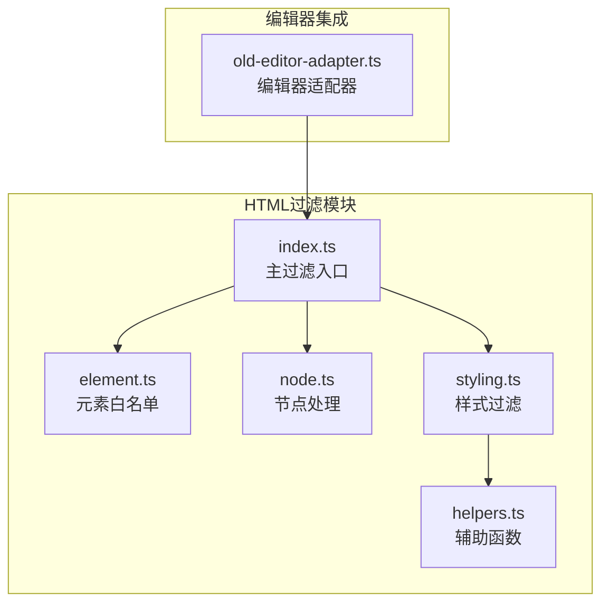
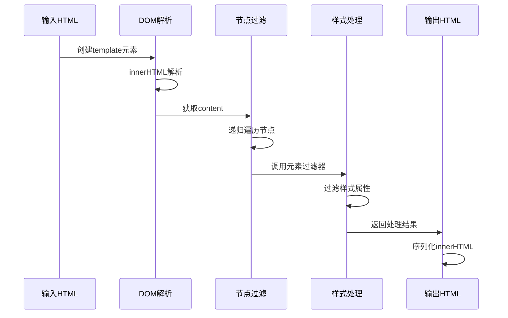
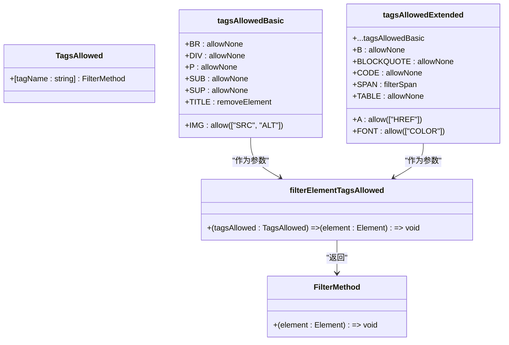
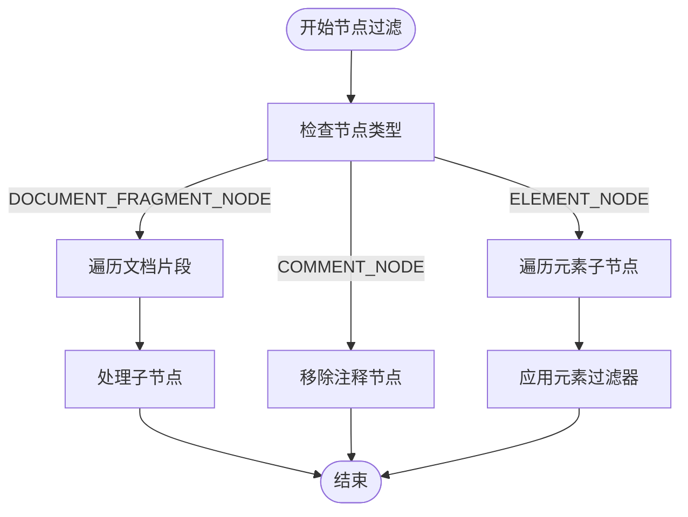
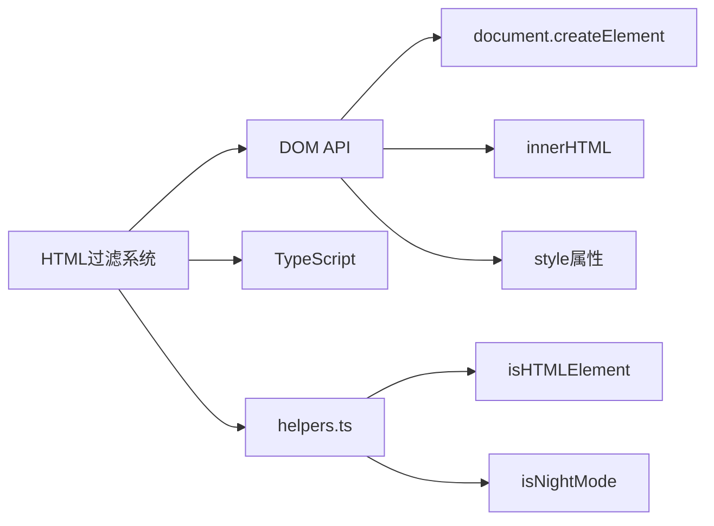

# HTML过滤与安全

<cite>
**本文档中引用的文件**
- [index.ts](file://ts/html-filter/index.ts)
- [element.ts](file://ts/html-filter/element.ts)
- [node.ts](file://ts/html-filter/node.ts)
- [styling.ts](file://ts/html-filter/styling.ts)
- [index.test.ts](file://ts/html-filter/index.test.ts)
- [old-editor-adapter.ts](file://ts/editor/old-editor-adapter.ts)
</cite>

## 目录
1. [简介](#简介)
2. [项目结构](#项目结构)
3. [核心组件](#核心组件)
4. [架构概述](#架构概述)
5. [详细组件分析](#详细组件分析)
6. [依赖分析](#依赖分析)
7. [性能考虑](#性能考虑)
8. [故障排除指南](#故障排除指南)
9. [结论](#结论)

## 简介
本文档详细分析了Anki应用中的HTML过滤与安全机制。该系统旨在确保用户输入的HTML内容既安全又符合应用的格式要求。通过多层过滤机制，系统能够有效防止XSS攻击、清理不安全内容，同时保留必要的格式化功能。文档将深入探讨过滤器的架构设计、白名单机制、节点处理逻辑和样式过滤规则，并提供开发者扩展指南。

## 项目结构
HTML过滤系统位于`ts/html-filter`目录下，由多个模块协同工作。主过滤函数`filterHTML`协调整个过滤流程，而具体的过滤逻辑则分散在`element.ts`、`node.ts`和`styling.ts`等文件中。该系统通过`old-editor-adapter.ts`与编辑器集成，确保用户粘贴的HTML内容经过安全处理。



**Diagram sources**
- [index.ts](file://ts/html-filter/index.ts)
- [element.ts](file://ts/html-filter/element.ts)
- [node.ts](file://ts/html-filter/node.ts)
- [styling.ts](file://ts/html-filter/styling.ts)
- [old-editor-adapter.ts](file://ts/editor/old-editor-adapter.ts)

**Section sources**
- [index.ts](file://ts/html-filter/index.ts)
- [element.ts](file://ts/html-filter/element.ts)

## 核心组件
HTML过滤系统由四个核心组件构成：过滤模式管理、元素白名单、节点遍历和样式过滤。这些组件共同协作，确保HTML内容的安全性和一致性。系统支持三种过滤模式：基础模式、扩展模式和内部模式，每种模式适用于不同的使用场景。

**Section sources**
- [index.ts](file://ts/html-filter/index.ts#L1-L20)
- [element.ts](file://ts/html-filter/element.ts#L1-L30)

## 架构概述
HTML过滤器采用分层架构设计，首先将输入的HTML字符串解析为DOM树，然后通过递归遍历的方式对每个节点进行过滤处理，最后将处理后的DOM树重新序列化为HTML字符串。这种设计确保了过滤过程的完整性和一致性。



**Diagram sources**
- [index.ts](file://ts/html-filter/index.ts#L34-L45)
- [node.ts](file://ts/html-filter/node.ts#L16-L34)

## 详细组件分析
本节将深入分析HTML过滤系统的各个关键组件，包括元素白名单机制、节点处理逻辑和样式过滤规则。

### 元素白名单机制分析
系统通过元素白名单机制严格控制允许的HTML标签类型。白名单分为基础模式和扩展模式，确保不同场景下的安全性需求。



**Diagram sources**
- [element.ts](file://ts/html-filter/element.ts#L44-L108)

**Section sources**
- [element.ts](file://ts/html-filter/element.ts#L1-L110)

### 节点处理逻辑分析
节点处理模块负责遍历DOM树并应用相应的过滤规则。它能够识别不同类型的节点（注释节点、文档片段节点、元素节点），并执行相应的处理逻辑。



**Diagram sources**
- [node.ts](file://ts/html-filter/node.ts#L16-L34)

**Section sources**
- [node.ts](file://ts/html-filter/node.ts#L1-L36)

### 样式过滤规则分析
样式过滤模块通过精确的规则控制CSS样式的安全性。它根据不同的模式（夜间模式、日间模式、内部模式）应用不同的过滤策略，确保样式既安全又符合用户体验要求。

```mermaid
classDiagram
class StylingPredicate {
+(property : string, value : string) => boolean
}
class filterStyling {
+defaultPredicate : StylingPredicate
+exceptions : Record<string, StylingPredicate>
+(element : HTMLElement) => void
}
class filterStylingNightMode {
+defaultPredicate : discard
+exceptions : nightModeExceptions
}
class filterStylingLightMode {
+defaultPredicate : discard
+exceptions : {color : keep, background-color : keep, ...}
}
class filterStylingInternal {
+defaultPredicate : keep
+exceptions : {font-size : discard, font-family : discard, ...}
}
filterStyling --> StylingPredicate : "使用"
filterStylingNightMode --> filterStyling : "继承"
filterStylingLightMode --> filterStyling : "继承"
filterStylingInternal --> filterStyling : "继承"
```

**Diagram sources**
- [styling.ts](file://ts/html-filter/styling.ts#L12-L31)

**Section sources**
- [styling.ts](file://ts/html-filter/styling.ts#L1-L54)

## 依赖分析
HTML过滤系统依赖于浏览器的DOM API和TypeScript类型系统。它通过`document.createElement("template")`创建临时容器来解析HTML，利用DOM树的结构特性进行安全的节点操作。系统还依赖于`isHTMLElement`和`isNightMode`等辅助函数来判断元素类型和应用模式。



**Diagram sources**
- [index.ts](file://ts/html-filter/index.ts#L34-L45)
- [element.ts](file://ts/html-filter/element.ts#L1-L30)
- [helpers.ts](file://ts/html-filter/helpers.ts)

**Section sources**
- [index.ts](file://ts/html-filter/index.ts#L1-L55)
- [element.ts](file://ts/html-filter/element.ts#L1-L110)

## 性能考虑
HTML过滤器在设计时考虑了性能优化。通过使用`template`元素进行HTML解析，避免了直接操作文档DOM带来的性能开销。节点遍历采用递归方式，确保所有节点都被处理。样式过滤通过预定义的规则集，减少了运行时的计算量。对于大量内容的处理，建议在Web Worker中执行过滤操作，以避免阻塞主线程。

## 故障排除指南
当HTML过滤器未按预期工作时，可以检查以下常见问题：确保输入的HTML字符串格式正确；验证过滤模式参数设置正确；检查白名单配置是否包含所需标签；确认样式规则是否符合预期。测试用例（index.test.ts）提供了各种场景的验证示例，可作为调试参考。

**Section sources**
- [index.test.ts](file://ts/html-filter/index.test.ts#L1-L49)
- [index.ts](file://ts/html-filter/index.ts#L34-L45)

## 结论
Anki的HTML过滤与安全机制通过分层设计和模块化架构，有效平衡了安全性与功能性。系统通过白名单控制、节点遍历和样式过滤等多重机制，确保用户输入的HTML内容既安全又符合应用要求。开发者可以通过扩展白名单和样式规则来满足特定需求，同时保持系统的整体安全性。