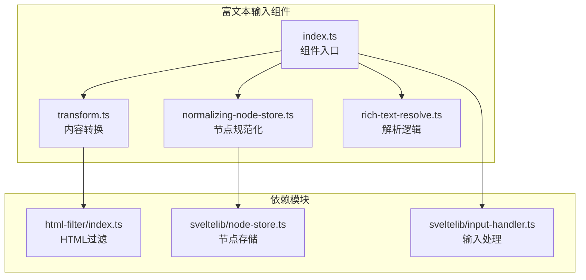
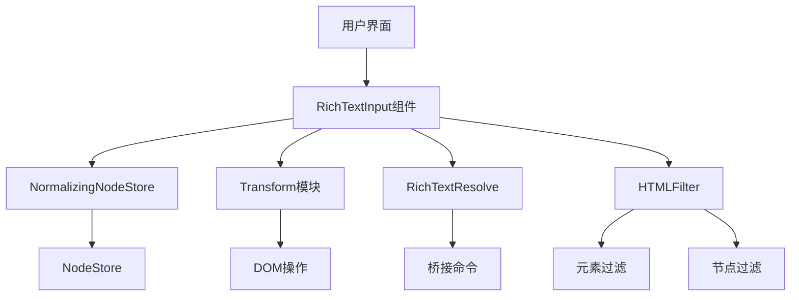
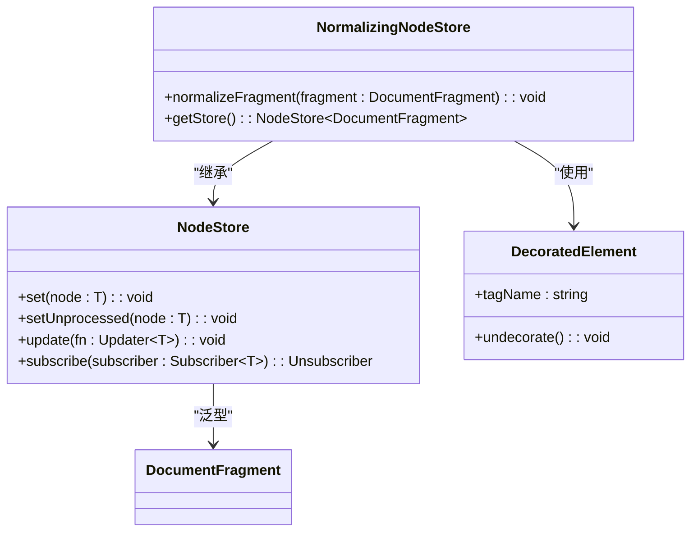
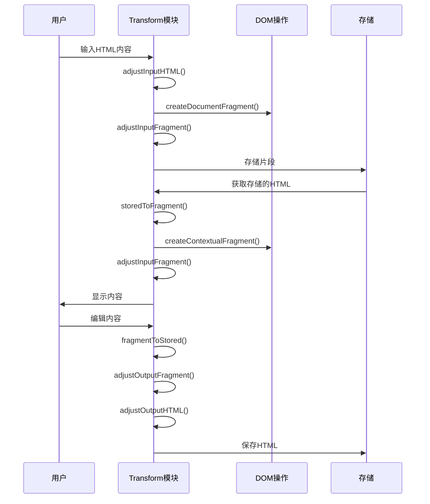
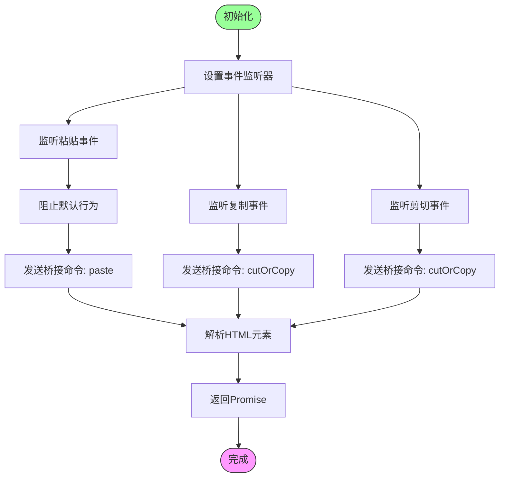
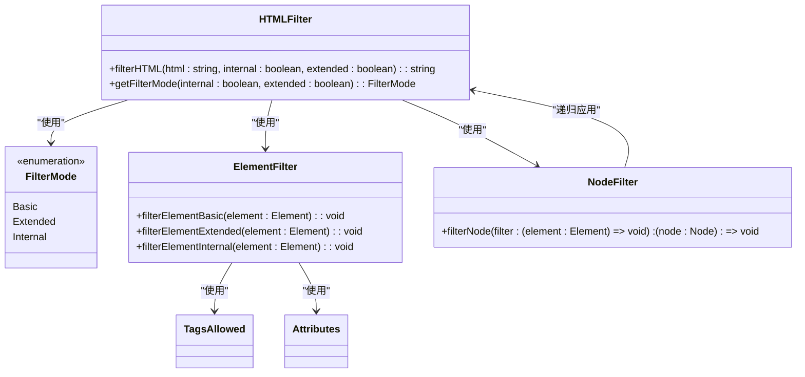
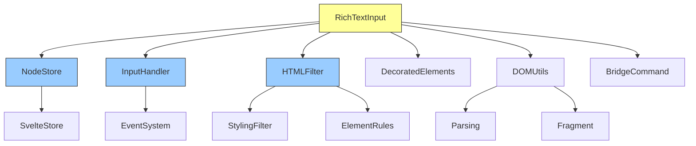

# 富文本输入组件

<cite>
**本文档中引用的文件**  
- [index.ts](file://ts/editor/rich-text-input/index.ts)
- [normalizing-node-store.ts](file://ts/editor/rich-text-input/normalizing-node-store.ts)
- [transform.ts](file://ts/editor/rich-text-input/transform.ts)
- [rich-text-resolve.ts](file://ts/editor/rich-text-input/rich-text-resolve.ts)
- [index.ts](file://ts/html-filter/index.ts)
- [element.ts](file://ts/html-filter/element.ts)
- [node-store.ts](file://ts/lib/sveltelib/node-store.ts)
- [input-handler.ts](file://ts/lib/sveltelib/input-handler.ts)
</cite>

## 目录
1. [简介](#简介)
2. [项目结构](#项目结构)
3. [核心组件](#核心组件)
4. [架构概述](#架构概述)
5. [详细组件分析](#详细组件分析)
6. [依赖分析](#依赖分析)
7. [性能考虑](#性能考虑)
8. [故障排除指南](#故障排除指南)
9. [结论](#结论)

## 简介
本文档详细介绍了Anki应用中富文本输入组件的技术实现。该组件为用户提供了一个功能完整的富文本编辑环境，支持文本格式化、内容解析和安全过滤等核心功能。文档深入分析了富文本编辑器的架构设计，包括DOM节点规范化处理、文本格式化操作、内容解析逻辑以及安全过滤机制。

## 项目结构
富文本输入组件位于`ts/editor/rich-text-input`目录下，是Anki前端编辑系统的核心部分。该组件与其他编辑功能模块协同工作，构成了完整的富文本处理生态系统。

**图表来源**  
- [index.ts](file://ts/editor/rich-text-input/index.ts)
- [normalizing-node-store.ts](file://ts/editor/rich-text-input/normalizing-node-store.ts)
- [transform.ts](file://ts/editor/rich-text-input/transform.ts)
- [rich-text-resolve.ts](file://ts/editor/rich-text-input/rich-text-resolve.ts)
- [index.ts](file://ts/html-filter/index.ts)
- [node-store.ts](file://ts/lib/sveltelib/node-store.ts)
- [input-handler.ts](file://ts/lib/sveltelib/input-handler.ts)

**本节来源**  
- [ts/editor/rich-text-input](file://ts/editor/rich-text-input)
- [ts/html-filter](file://ts/html-filter)

## 核心组件
富文本输入组件由多个核心文件组成，每个文件负责特定的功能模块。`index.ts`作为组件的入口文件，导出了富文本输入组件的主要API。`normalizing-node-store.ts`实现了DOM节点的规范化处理机制，确保编辑器内容的一致性。`transform.ts`定义了文本格式化操作，包括加粗、斜体、下划线等样式的应用。`rich-text-resolve.ts`实现了富文本解析逻辑，将用户输入转换为结构化内容。`html-filter/index.ts`提供了安全过滤功能，确保富文本内容的安全性。

**本节来源**  
- [index.ts](file://ts/editor/rich-text-input/index.ts)
- [normalizing-node-store.ts](file://ts/editor/rich-text-input/normalizing-node-store.ts)
- [transform.ts](file://ts/editor/rich-text-input/transform.ts)
- [rich-text-resolve.ts](file://ts/editor/rich-text-input/rich-text-resolve.ts)
- [index.ts](file://ts/html-filter/index.ts)

## 架构概述
富文本输入组件采用模块化架构设计，各组件之间通过清晰的接口进行通信。组件的核心是`RichTextInput` Svelte组件，它整合了所有子模块的功能，为用户提供统一的编辑界面。

**图表来源**  
- [index.ts](file://ts/editor/rich-text-input/index.ts)
- [normalizing-node-store.ts](file://ts/editor/rich-text-input/normalizing-node-store.ts)
- [transform.ts](file://ts/editor/rich-text-input/transform.ts)
- [rich-text-resolve.ts](file://ts/editor/rich-text-input/rich-text-resolve.ts)
- [index.ts](file://ts/html-filter/index.ts)

## 详细组件分析

### NormalizingNodeStore分析
`NormalizingNodeStore`是富文本编辑器中负责DOM节点规范化处理的核心组件。它基于Svelte的`node-store`实现，为`DocumentFragment`提供了一个可观察的存储机制。

**图表来源**  
- [normalizing-node-store.ts](file://ts/editor/rich-text-input/normalizing-node-store.ts)
- [node-store.ts](file://ts/lib/sveltelib/node-store.ts)

**本节来源**  
- [normalizing-node-store.ts](file://ts/editor/rich-text-input/normalizing-node-store.ts)
- [node-store.ts](file://ts/lib/sveltelib/node-store.ts)

### Transform模块分析
`Transform`模块负责富文本内容的输入输出转换，确保编辑器内容在存储和显示之间正确转换。

**图表来源**  
- [transform.ts](file://ts/editor/rich-text-input/transform.ts)
- [dom.ts](file://ts/lib/dom/index.ts)
- [parsing.ts](file://ts/lib/parsing/index.ts)

**本节来源**  
- [transform.ts](file://ts/editor/rich-text-input/transform.ts)

### RichTextResolve分析
`RichTextResolve`模块处理富文本的解析逻辑，特别是剪贴板操作的桥接命令。

**图表来源**  
- [rich-text-resolve.ts](file://ts/editor/rich-text-input/rich-text-resolve.ts)
- [bridgecommand.ts](file://ts/lib/bridgecommand/index.ts)
- [events.ts](file://ts/lib/events/index.ts)

**本节来源**  
- [rich-text-resolve.ts](file://ts/editor/rich-text-input/rich-text-resolve.ts)

### HTMLFilter集成分析
`HTMLFilter`模块与富文本输入组件集成，确保用户输入的内容符合安全标准。

**图表来源**  
- [index.ts](file://ts/html-filter/index.ts)
- [element.ts](file://ts/html-filter/element.ts)
- [node.ts](file://ts/html-filter/node.ts)

**本节来源**  
- [index.ts](file://ts/html-filter/index.ts)
- [element.ts](file://ts/html-filter/element.ts)

## 依赖分析
富文本输入组件依赖于多个核心模块，这些模块共同构成了完整的编辑功能。

**图表来源**  
- [index.ts](file://ts/editor/rich-text-input/index.ts)
- [normalizing-node-store.ts](file://ts/editor/rich-text-input/normalizing-node-store.ts)
- [transform.ts](file://ts/editor/rich-text-input/transform.ts)
- [rich-text-resolve.ts](file://ts/editor/rich-text-input/rich-text-resolve.ts)
- [index.ts](file://ts/html-filter/index.ts)
- [node-store.ts](file://ts/lib/sveltelib/node-store.ts)
- [input-handler.ts](file://ts/lib/sveltelib/input-handler.ts)

**本节来源**  
- [package.json](file://package.json)
- [tsconfig.json](file://tsconfig.json)

## 性能考虑
富文本输入组件在设计时考虑了多个性能优化点。`NormalizingNodeStore`通过`normalize()`方法定期清理DOM树，避免节点碎片化。`Transform`模块在内容转换时使用`createContextualFragment`而不是直接操作innerHTML，提高了DOM创建效率。`RichTextResolve`使用Promise机制异步处理元素解析，避免阻塞主线程。`HTMLFilter`采用预定义的过滤规则，避免了运行时的复杂计算。

## 故障排除指南
当富文本输入组件出现问题时，可以参考以下常见问题的解决方案：

**本节来源**  
- [errors.ts](file://ts/lib/errors/index.ts)
- [debug.ts](file://ts/lib/debug/index.ts)

## 结论
富文本输入组件是Anki应用中一个功能强大且设计精良的编辑器实现。通过模块化设计和清晰的职责划分，组件实现了富文本编辑的核心功能，包括内容规范化、格式化转换、解析逻辑和安全过滤。组件的架构设计考虑了性能和可维护性，为开发者提供了清晰的扩展接口。通过深入理解组件的实现机制，开发者可以有效地使用和扩展富文本功能，满足各种复杂的编辑需求。