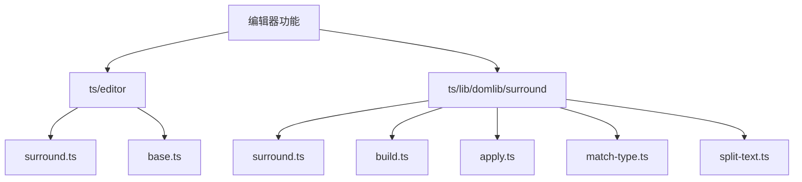
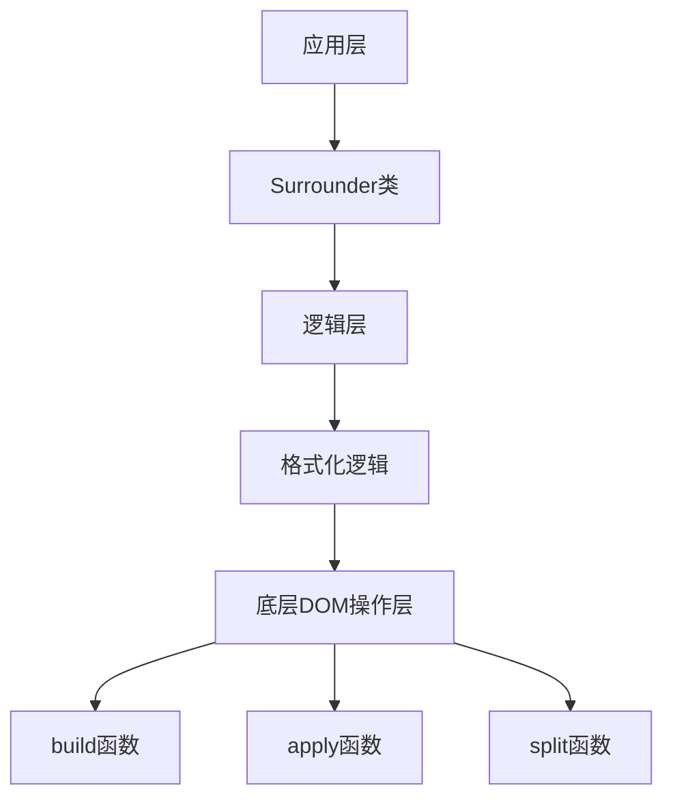
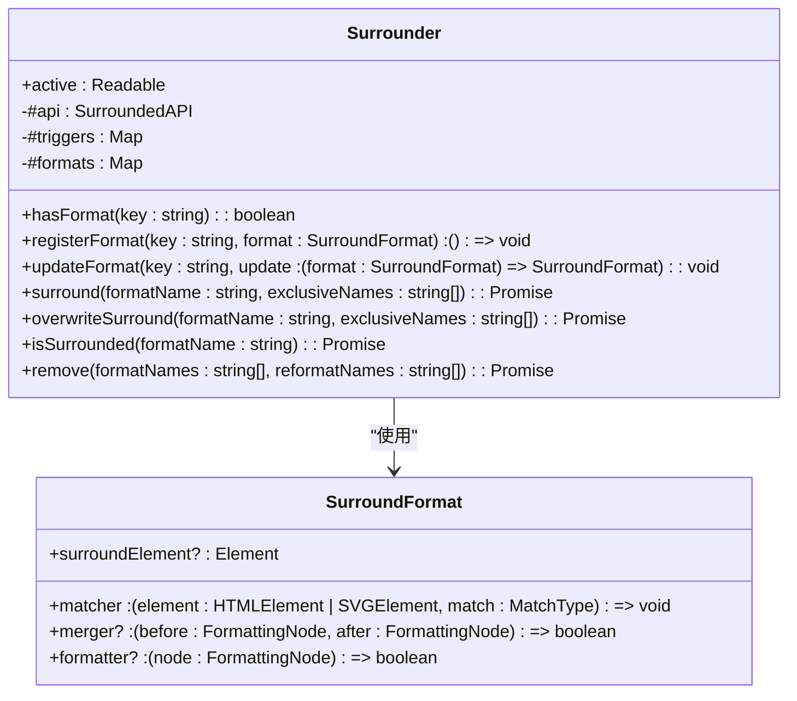
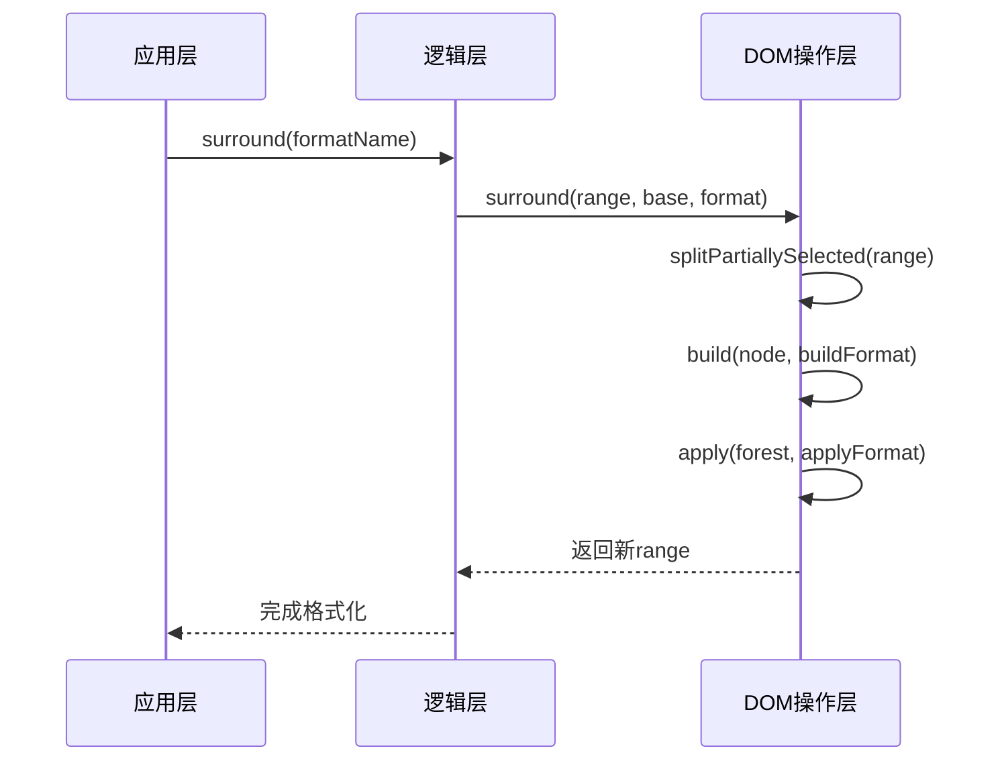
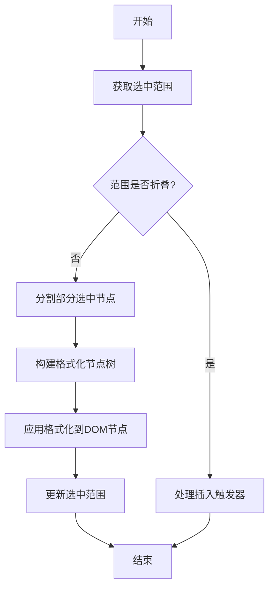
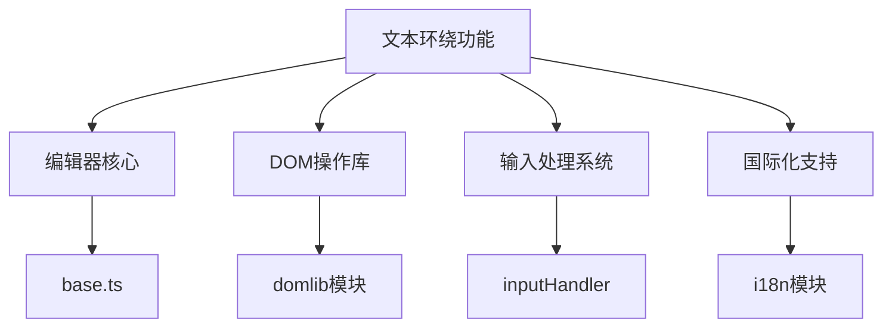

# 文本环绕功能

<cite>
**本文档中引用的文件**   
- [surround.ts](file://ts/editor/surround.ts)
- [base.ts](file://ts/editor/base.ts)
- [surround/surround.ts](file://ts/lib/domlib/surround/surround.ts)
- [surround/match-type.ts](file://ts/lib/domlib/surround/match-type.ts)
- [surround/split-text.ts](file://ts/lib/domlib/surround/split-text.ts)
- [surround-format.ts](file://ts/lib/domlib/surround/surround-format.ts)
</cite>

## 目录
1. [简介](#简介)
2. [项目结构](#项目结构)
3. [核心组件](#核心组件)
4. [架构概述](#架构概述)
5. [详细组件分析](#详细组件分析)
6. [依赖分析](#依赖分析)
7. [性能考虑](#性能考虑)
8. [故障排除指南](#故障排除指南)
9. [结论](#结论)

## 简介
本文档详细介绍了Anki编辑器中的文本环绕功能实现。该功能允许用户对选中的文本内容进行格式化操作，如加粗、斜体、链接等。文档深入分析了`surround.ts`中实现的核心逻辑，解释了其与`base.ts`中核心编辑器类的集成方式，并描述了`lib/domlib/surround`模块提供的底层DOM操作支持。

## 项目结构
Anki编辑器的文本环绕功能主要分布在`ts/editor`和`ts/lib/domlib/surround`两个目录中。`ts/editor`目录包含编辑器的核心实现，而`ts/lib/domlib/surround`目录提供了底层的DOM操作支持。

**Diagram sources**
- [surround.ts](file://ts/editor/surround.ts)
- [surround/surround.ts](file://ts/lib/domlib/surround/surround.ts)

**Section sources**
- [surround.ts](file://ts/editor/surround.ts)
- [base.ts](file://ts/editor/base.ts)

## 核心组件
文本环绕功能的核心组件包括`Surrounder`类、`SurroundFormat`接口以及底层的DOM操作函数。`Surrounder`类负责管理文本环绕操作的状态和触发器，`SurroundFormat`接口定义了格式化的规则，而底层DOM操作函数则实现了具体的DOM节点操作。

**Section sources**
- [surround.ts](file://ts/editor/surround.ts#L74-L392)
- [surround-format.ts](file://ts/lib/domlib/surround/surround-format.ts#L6-L28)

## 架构概述
文本环绕功能的架构分为三层：应用层、逻辑层和底层DOM操作层。应用层通过`Surrounder`类提供API，逻辑层处理格式化逻辑，底层DOM操作层执行具体的DOM节点操作。

**Diagram sources**
- [surround.ts](file://ts/editor/surround.ts#L74-L392)
- [surround/surround.ts](file://ts/lib/domlib/surround/surround.ts#L40-L74)

## 详细组件分析

### Surrounder类分析
`Surrounder`类是文本环绕功能的核心，它管理着所有格式化操作的状态和触发器。该类通过`registerFormat`方法注册新的格式化模式，并通过`surround`、`overwriteSurround`和`remove`方法执行具体的格式化操作。

**Diagram sources**
- [surround.ts](file://ts/editor/surround.ts#L74-L392)
- [surround-format.ts](file://ts/lib/domlib/surround/surround-format.ts#L6-L28)

### 底层DOM操作分析
底层DOM操作模块提供了文本环绕功能所需的DOM操作支持，包括树构建、节点应用和格式化处理。`build`函数负责构建格式化节点树，`apply`函数负责将格式化应用到DOM节点，`split`函数负责处理部分选中的文本节点。

**Diagram sources**
- [surround/surround.ts](file://ts/lib/domlib/surround/surround.ts#L40-L74)
- [surround/split-text.ts](file://ts/lib/domlib/surround/split-text.ts#L0-L94)

### 格式化处理流程分析
文本环绕功能的格式化处理流程包括范围分割、树构建、节点应用和结果返回四个步骤。该流程确保了格式化操作的准确性和效率。

**Diagram sources**
- [surround/surround.ts](file://ts/lib/domlib/surround/surround.ts#L40-L74)
- [surround/split-text.ts](file://ts/lib/domlib/surround/split-text.ts#L0-L94)

**Section sources**
- [surround/surround.ts](file://ts/lib/domlib/surround/surround.ts#L40-L74)
- [surround/split-text.ts](file://ts/lib/domlib/surround/split-text.ts#L0-L94)

## 依赖分析
文本环绕功能依赖于多个模块和组件，包括编辑器核心、DOM操作库和输入处理系统。这些依赖关系确保了功能的完整性和稳定性。

**Diagram sources**
- [surround.ts](file://ts/editor/surround.ts)
- [base.ts](file://ts/editor/base.ts)

**Section sources**
- [surround.ts](file://ts/editor/surround.ts)
- [base.ts](file://ts/editor/base.ts)

## 性能考虑
文本环绕功能在设计时考虑了性能优化，包括使用高效的DOM操作算法、最小化重排和重绘以及合理的内存管理。这些优化确保了在处理大量文本时仍能保持良好的响应速度。

## 故障排除指南
当文本环绕功能出现问题时，可以检查以下几个方面：确保编辑器API已正确设置、验证格式化配置是否正确、检查DOM结构是否符合预期以及确认输入处理系统是否正常工作。

**Section sources**
- [surround.ts](file://ts/editor/surround.ts#L74-L392)
- [surround/surround.ts](file://ts/lib/domlib/surround/surround.ts#L40-L74)

## 结论
Anki编辑器的文本环绕功能通过清晰的分层架构和高效的实现方式，为用户提供了一套强大而灵活的文本格式化工具。该功能的模块化设计使得扩展新的格式化模式变得简单，同时底层的优化确保了良好的性能表现。