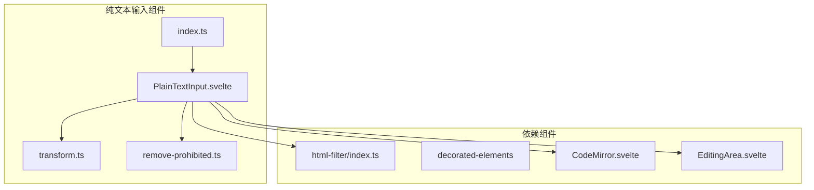
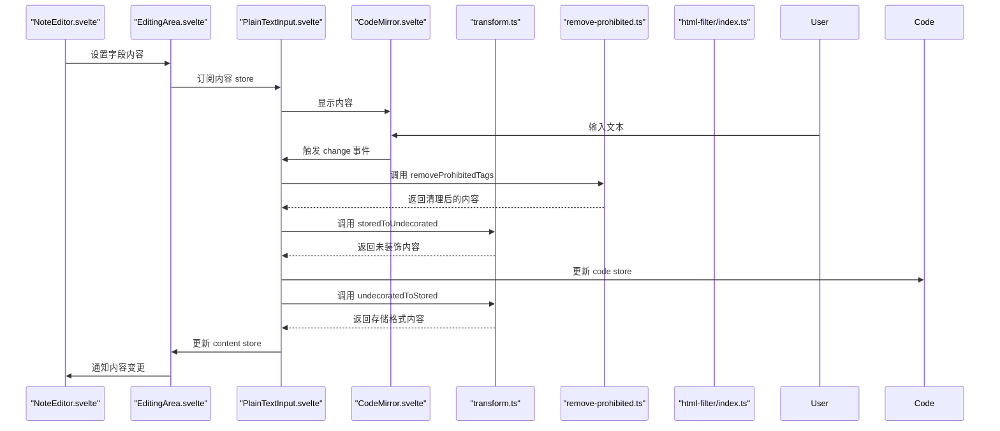
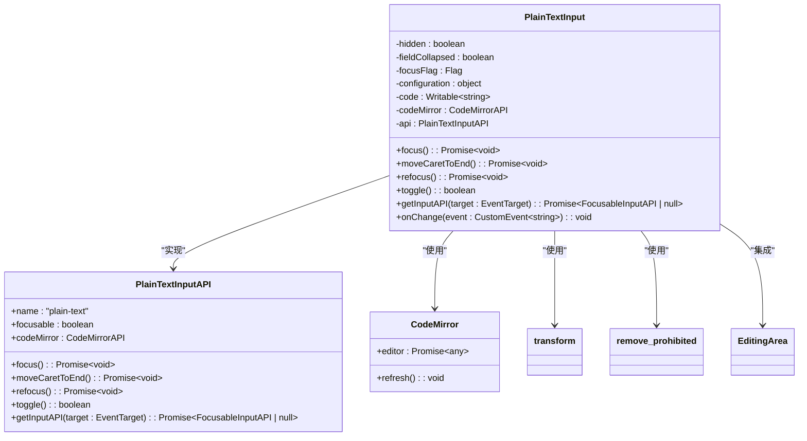
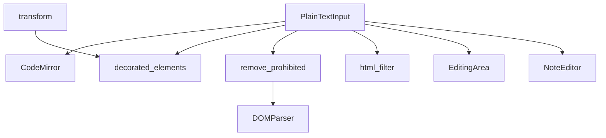

# 纯文本输入组件

<cite>
**本文档中引用的文件**  
- [index.ts](file://ts/editor/plain-text-input/index.ts)
- [PlainTextInput.svelte](file://ts/editor/plain-text-input/PlainTextInput.svelte)
- [transform.ts](file://ts/editor/plain-text-input/transform.ts)
- [remove-prohibited.ts](file://ts/editor/plain-text-input/remove-prohibited.ts)
- [index.ts](file://ts/html-filter/index.ts)
- [RichTextInput.svelte](file://ts/editor/rich-text-input/RichTextInput.svelte)
- [EditingArea.svelte](file://ts/editor/EditingArea.svelte)
- [NoteEditor.svelte](file://ts/editor/NoteEditor.svelte)
</cite>

## 目录
1. [简介](#简介)
2. [项目结构](#项目结构)
3. [核心组件](#核心组件)
4. [架构概述](#架构概述)
5. [详细组件分析](#详细组件分析)
6. [依赖分析](#依赖分析)
7. [性能考虑](#性能考虑)
8. [故障排除指南](#故障排除指南)
9. [结论](#结论)

## 简介
本文档深入分析了 Anki 应用程序中纯文本输入组件的技术实现。该组件为用户提供了一个简洁、安全的文本编辑环境，特别适用于不需要富文本格式的场景。文档详细探讨了 `plain-text-input` 模块的设计原理、与富文本输入组件的差异、文本转换逻辑、禁止内容移除机制以及与 HTML 过滤器的协同工作方式。通过本技术文档，开发者可以全面理解该组件的内部工作机制，并掌握如何进行自定义扩展。

## 项目结构
纯文本输入组件位于 `ts/editor/plain-text-input/` 目录下，是 Anki 前端编辑器系统的一部分。该组件与富文本输入组件并列，共同构成了笔记编辑的核心功能。其设计遵循模块化原则，将不同的功能职责分离到独立的文件中，便于维护和扩展。

**图示来源**  
- [index.ts](file://ts/editor/plain-text-input/index.ts)
- [PlainTextInput.svelte](file://ts/editor/plain-text-input/PlainTextInput.svelte)
- [transform.ts](file://ts/editor/plain-text-input/transform.ts)
- [remove-prohibited.ts](file://ts/editor/plain-text-input/remove-prohibited.ts)
- [index.ts](file://ts/html-filter/index.ts)

## 核心组件
纯文本输入组件的核心由 `PlainTextInput.svelte` 文件实现，它是一个 Svelte 组件，封装了用户界面和交互逻辑。该组件通过 `index.ts` 文件对外暴露 API，使得其他模块可以方便地导入和使用。`transform.ts` 和 `remove-prohibited.ts` 文件则分别负责文本的转换和安全过滤，确保输入内容的合规性。

**本节来源**  
- [index.ts](file://ts/editor/plain-text-input/index.ts)
- [PlainTextInput.svelte](file://ts/editor/plain-text-input/PlainTextInput.svelte)
- [transform.ts](file://ts/editor/plain-text-input/transform.ts)
- [remove-prohibited.ts](file://ts/editor/plain-text-input/remove-prohibited.ts)

## 架构概述
纯文本输入组件的架构设计体现了清晰的分层和职责分离。它基于 CodeMirror 编辑器构建，通过 Svelte 框架管理状态和生命周期。组件与上层的 `EditingArea` 和 `NoteEditor` 进行通信，接收内容更新并反馈用户交互。同时，它利用独立的工具函数进行文本处理和安全过滤，确保了代码的可维护性和可测试性。

**图示来源**  
- [PlainTextInput.svelte](file://ts/editor/plain-text-input/PlainTextInput.svelte)
- [transform.ts](file://ts/editor/plain-text-input/transform.ts)
- [remove-prohibited.ts](file://ts/editor/plain-text-input/remove-prohibited.ts)
- [index.ts](file://ts/html-filter/index.ts)
- [EditingArea.svelte](file://ts/editor/EditingArea.svelte)
- [NoteEditor.svelte](file://ts/editor/NoteEditor.svelte)

## 详细组件分析

### PlainTextInput 组件分析
`PlainTextInput` 组件是纯文本输入功能的核心实现。它通过 Svelte 的 `writable` store 管理内部状态，并与外部的 `content` store 进行双向绑定。组件的生命周期由 `lifecycleHooks` 管理，确保在正确的时间点执行初始化和清理操作。

#### 对象导向组件

**图示来源**  
- [PlainTextInput.svelte](file://ts/editor/plain-text-input/PlainTextInput.svelte)
- [index.ts](file://ts/editor/plain-text-input/index.ts)
- [transform.ts](file://ts/editor/plain-text-input/transform.ts)
- [remove-prohibited.ts](file://ts/editor/plain-text-input/remove-prohibited.ts)
- [EditingArea.svelte](file://ts/editor/EditingArea.svelte)

### 与富文本输入组件的设计差异
纯文本输入组件与富文本输入组件（`RichTextInput`）在设计上存在显著差异。富文本组件基于 `ContentEditable` 实现，支持复杂的 HTML 格式和内联样式，而纯文本组件则使用 `CodeMirror` 作为底层编辑器，专注于提供一个简洁、无格式的文本编辑环境。这种设计选择使得纯文本组件在处理纯文本内容时更加高效和安全。

**本节来源**  
- [PlainTextInput.svelte](file://ts/editor/plain-text-input/PlainTextInput.svelte)
- [RichTextInput.svelte](file://ts/editor/rich-text-input/RichTextInput.svelte)

### transform.ts 中的文本转换逻辑
`transform.ts` 文件定义了纯文本内容在存储格式和编辑格式之间的转换逻辑。`storedToUndecorated` 函数将存储的 HTML 字符串转换为未装饰的纯文本，而 `undecoratedToStored` 函数则执行相反的操作。这些转换通过 `decoratedElements` 模块实现，确保了文本在不同状态下的正确表示。

**本节来源**  
- [transform.ts](file://ts/editor/plain-text-input/transform.ts)

### remove-prohibited.ts 中的禁止内容移除机制
`remove-prohibited.ts` 文件实现了一个简单的安全过滤机制，用于移除输入内容中的禁止标签，如 `<script>` 和 `<link>`。该机制通过 `DOMParser` 解析 HTML 字符串，然后遍历 DOM 树，移除所有匹配的标签。这确保了输入内容的合规性，防止潜在的安全风险。

**本节来源**  
- [remove-prohibited.ts](file://ts/editor/plain-text-input/remove-prohibited.ts)

### 与 html-filter/index.ts 的协同工作
虽然 `PlainTextInput` 组件直接调用了 `removeProhibitedTags`，但它也间接依赖于 `html-filter` 模块的整体安全策略。`html-filter` 提供了更全面的 HTML 过滤功能，包括基本模式、扩展模式和内部模式，可以根据不同的使用场景应用不同程度的过滤规则。纯文本组件的安全性是整个系统安全策略的一部分。

**本节来源**  
- [remove-prohibited.ts](file://ts/editor/plain-text-input/remove-prohibited.ts)
- [index.ts](file://ts/html-filter/index.ts)

## 依赖分析
纯文本输入组件依赖于多个内部和外部模块。它直接依赖于 `CodeMirror` 作为编辑器，`decorated-elements` 用于文本转换，以及 `html-filter` 用于安全过滤。同时，它与 `EditingArea` 和 `NoteEditor` 等上层组件紧密集成，通过 Svelte 的 context 机制进行通信。

**图示来源**  
- [PlainTextInput.svelte](file://ts/editor/plain-text-input/PlainTextInput.svelte)
- [transform.ts](file://ts/editor/plain-text-input/transform.ts)
- [remove-prohibited.ts](file://ts/editor/plain-text-input/remove-prohibited.ts)
- [index.ts](file://ts/html-filter/index.ts)
- [EditingArea.svelte](file://ts/editor/EditingArea.svelte)
- [NoteEditor.svelte](file://ts/editor/NoteEditor.svelte)

## 性能考虑
纯文本输入组件在性能方面进行了优化。通过使用 `CodeMirror`，它提供了高效的文本渲染和编辑体验。组件的响应式更新通过 Svelte 的 `tick()` 函数和 `refresh()` 方法进行管理，避免了不必要的重渲染。此外，文本转换和过滤操作都是同步执行的，确保了用户交互的流畅性。

## 故障排除指南
在使用纯文本输入组件时，可能会遇到一些常见问题。例如，如果输入内容中的 HTML 标签被意外移除，应检查 `remove-prohibited.ts` 中的禁止标签列表。如果文本格式转换出现问题，应检查 `transform.ts` 中的转换逻辑。确保 `decoratedElements` 模块正确加载和配置是解决此类问题的关键。

**本节来源**  
- [transform.ts](file://ts/editor/plain-text-input/transform.ts)
- [remove-prohibited.ts](file://ts/editor/plain-text-input/remove-prohibited.ts)

## 结论
纯文本输入组件是 Anki 应用程序中一个关键的前端模块，它提供了一个安全、高效的文本编辑环境。通过深入分析其架构、组件和依赖关系，我们可以看到其设计的合理性和可维护性。该组件的成功实现为开发者提供了一个优秀的范例，展示了如何在现代前端框架中构建复杂且可靠的用户界面组件。