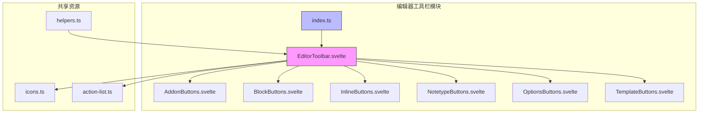
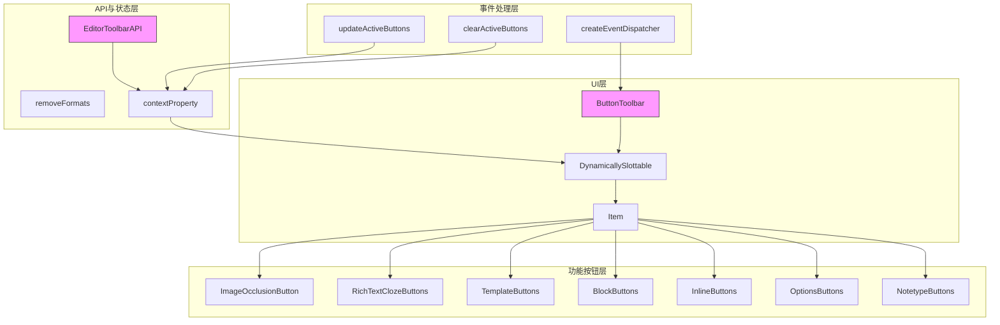
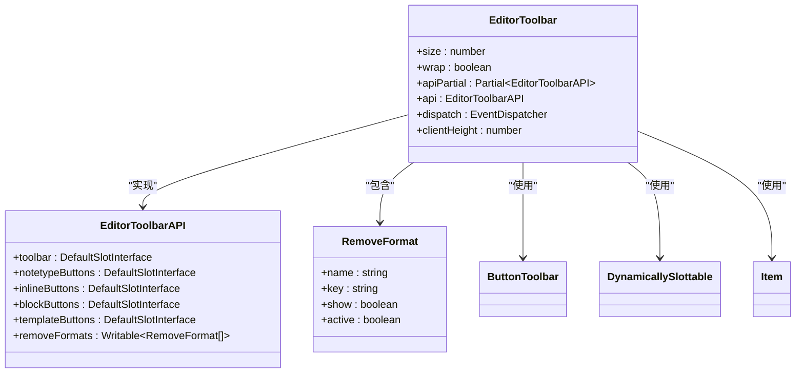
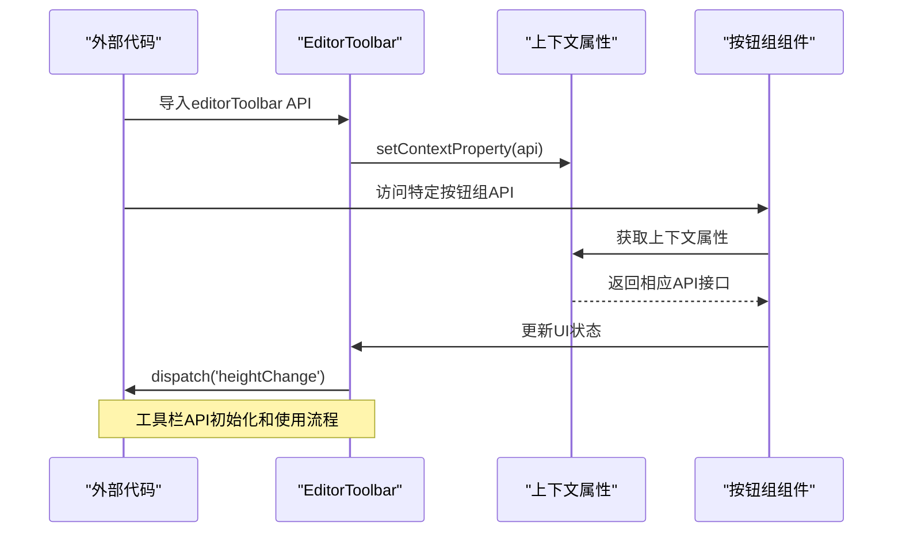
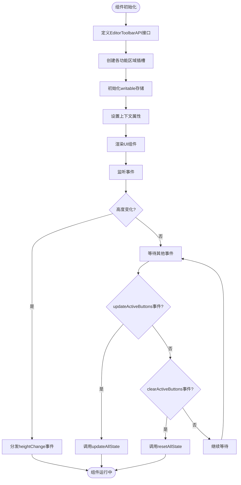
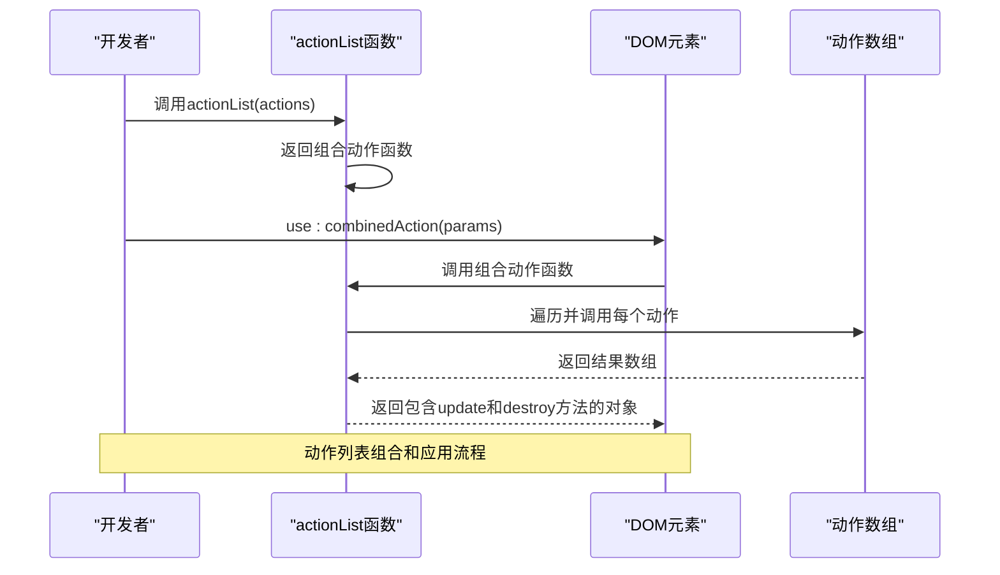
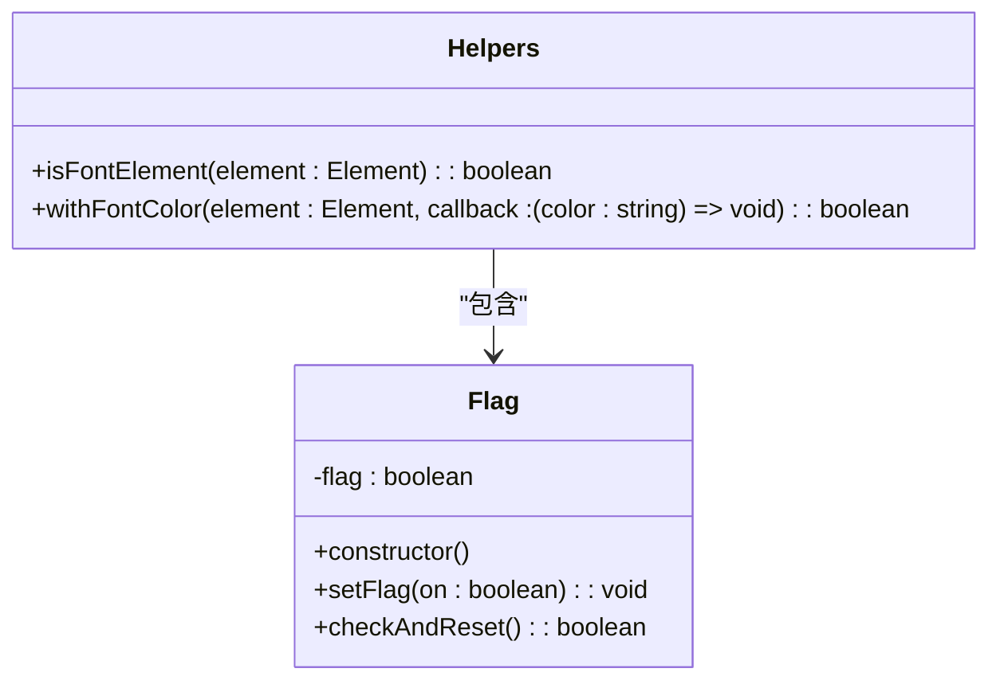
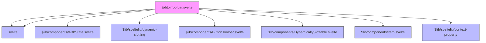

# 编辑器工具栏

<cite>
**本文档中引用的文件**
- [index.ts](file://ts/editor/editor-toolbar/index.ts)
- [EditorToolbar.svelte](file://ts/editor/editor-toolbar/EditorToolbar.svelte)
- [icons.ts](file://ts/lib/components/icons.ts)
- [action-list.ts](file://ts/lib/sveltelib/action-list.ts)
- [helpers.ts](file://ts/editor/helpers.ts)
</cite>

## 目录
1. [简介](#简介)
2. [项目结构](#项目结构)
3. [核心组件](#核心组件)
4. [架构概述](#架构概述)
5. [详细组件分析](#详细组件分析)
6. [依赖分析](#依赖分析)
7. [性能考虑](#性能考虑)
8. [故障排除指南](#故障排除指南)
9. [结论](#结论)
10. [附录](#附录)（如有必要）

## 简介
本文档详细介绍了Anki编辑器工具栏的技术实现。重点分析了工具栏的架构设计、按钮注册机制、事件处理流程以及与核心编辑器的集成方式。文档涵盖了工具栏功能的动态配置方法，包括图标资源管理、操作列表管理和辅助函数的使用。为开发者提供了扩展工具栏功能的完整指南，包括添加自定义按钮和集成第三方服务的最佳实践。

## 项目结构
编辑器工具栏功能主要分布在ts/editor/editor-toolbar目录下，与其他编辑器组件和共享库协同工作。工具栏实现采用了Svelte组件架构，通过模块化设计实现了功能分离和可扩展性。



**Diagram sources**
- [index.ts](file://ts/editor/editor-toolbar/index.ts)
- [EditorToolbar.svelte](file://ts/editor/editor-toolbar/EditorToolbar.svelte)

**Section sources**
- [index.ts](file://ts/editor/editor-toolbar/index.ts)
- [EditorToolbar.svelte](file://ts/editor/editor-toolbar/EditorToolbar.svelte)

## 核心组件
编辑器工具栏的核心组件包括主工具栏容器、各种功能按钮组和相关的API接口。工具栏采用Svelte框架实现，通过上下文属性(context property)机制与编辑器其他部分进行通信。`EditorToolbarAPI`接口定义了工具栏各部分的插槽(slot)接口，实现了灵活的组件组合和扩展能力。

**Section sources**
- [EditorToolbar.svelte](file://ts/editor/editor-toolbar/EditorToolbar.svelte#L30-L50)
- [index.ts](file://ts/editor/editor-toolbar/index.ts#L1-L5)

## 架构概述
编辑器工具栏采用分层架构设计，将UI组件、状态管理和功能逻辑分离。主工具栏组件通过DynamicallySlottable机制组合各种功能按钮，实现了高度的可配置性和扩展性。工具栏与编辑器的集成通过事件分发机制实现，能够响应编辑器状态变化并相应地更新UI。



**Diagram sources**
- [EditorToolbar.svelte](file://ts/editor/editor-toolbar/EditorToolbar.svelte#L1-L138)

## 详细组件分析
### 工具栏主组件分析
工具栏主组件`EditorToolbar.svelte`是整个工具栏功能的核心，负责协调各个功能按钮组的显示和交互。组件通过Svelte的上下文属性机制暴露API，允许外部代码访问和操作工具栏的各个部分。

#### 对象导向组件


**Diagram sources**
- [EditorToolbar.svelte](file://ts/editor/editor-toolbar/EditorToolbar.svelte#L30-L50)

#### API服务组件


**Diagram sources**
- [EditorToolbar.svelte](file://ts/editor/editor-toolbar/EditorToolbar.svelte#L1-L138)

#### 复杂逻辑组件


**Diagram sources**
- [EditorToolbar.svelte](file://ts/editor/editor-toolbar/EditorToolbar.svelte#L1-L138)

**Section sources**
- [EditorToolbar.svelte](file://ts/editor/editor-toolbar/EditorToolbar.svelte#L1-L138)

### 图标资源管理
图标资源管理通过`icons.ts`文件实现，该文件集中管理了所有工具栏使用的SVG图标。系统采用模块化导入方式，将每个图标作为独立的组件和URL导入，然后通过统一的导出结构提供访问接口。

```mermaid
classDiagram
class Icons {
+checkCircle : {url, component}
+chevronDown : {url, component}
+chevronUp : {url, component}
+closeBox : {url, component}
+dotsIcon : {url, component}
+horizontalHandle : {url, component}
+verticalHandle : {url, component}
+infoCircle : {url, component}
+magnifyIcon : {url, component}
+newBox : {url, component}
+tagIcon : {url, component}
+addTagIcon : {url, component}
+updateIcon : {url, component}
+revertIcon : {url, component}
+arrowLeftIcon : {url, component}
+arrowRightIcon : {url, component}
+minusIcon : {url, component}
+exclamationIcon : {url, component}
+plusIcon : {url, component}
+alertIcon : {url, component}
+plainTextIcon : {url, component}
+clozeIcon : {url, component}
+richTextIcon : {url, component}
+stickyIconHollow : {url, component}
+stickyIconSolid : {url, component}
+mathIcon : {url, component}
+floatLeftIcon : {url, component}
+floatNoneIcon : {url, component}
+floatRightIcon : {url, component}
+sizeClear : {url, component}
+sizeActual : {url, component}
+sizeMinimized : {url, component}
+cogIcon : {url, component}
+colorHelperIcon : {url, component}
+highlightColorIcon : {url, component}
+textColorIcon : {url, component}
+subscriptIcon : {url, component}
+superscriptIcon : {url, component}
+functionIcon : {url, component}
+paperclipIcon : {url, component}
+mdiRefresh : {url, component}
+mdiTableRefresh : {url, component}
+mdiViewDashboard : {url, component}
+eraserIcon : {url, component}
+justifyFullIcon : {url, component}
+olIcon : {url, component}
+ulIcon : {url, component}
+micIcon : {url, component}
+justifyCenterIcon : {url, component}
+indentIcon : {url, component}
+outdentIcon : {url, component}
+justifyLeftIcon : {url, component}
+listOptionsIcon : {url, component}
+justifyRightIcon : {url, component}
+boldIcon : {url, component}
+italicIcon : {url, component}
+underlineIcon : {url, component}
+deleteIcon : {url, component}
+inlineIcon : {url, component}
+blockIcon : {url, component}
+mdiAlignHorizontalCenter : {url, component}
+mdiAlignHorizontalLeft : {url, component}
+mdiAlignHorizontalRight : {url, component}
+mdiAlignVerticalBottom : {url, component}
+mdiAlignVerticalCenter : {url, component}
+mdiAlignVerticalTop : {url, component}
+mdiClose : {url, component}
+mdiCodeTags : {url, component}
+mdiCopy : {url, component}
+mdiCursorDefaultOutline : {url, component}
+mdiDeleteOutline : {url, component}
+mdiEllipseOutline : {url, component}
+mdiEye : {url, component}
+mdiFormatAlignCenter : {url, component}
+mdiFormatBold : {url, component}
+mdiFormatColorFill : {url, component}
+mdiFormatItalic : {url, component}
+mdiFormatUnderline : {url, component}
+mdiGroup : {url, component}
+mdiZoomReset : {url, component}
+mdiZoomOut : {url, component}
+mdiZoomIn : {url, component}
+mdiMagnifyScan : {url, component}
+mdiRectangleOutline : {url, component}
+mdiRedo : {url, component}
+mdiSelectAll : {url, component}
+mdiSquare : {url, component}
+mdiTextBox : {url, component}
+mdiUndo : {url, component}
+mdiUnfoldMoreHorizontal : {url, component}
+mdiUngroup : {url, component}
+mdiVectorPolygonVariant : {url, component}
+incrementClozeIcon : {url, component}
+mdiEarth : {url, component}
}
class IconResource {
+url : string
+component : SvelteComponent
}
Icons --> IconResource : "包含"
```

**Diagram sources**
- [icons.ts](file://ts/lib/components/icons.ts#L1-L287)

**Section sources**
- [icons.ts](file://ts/lib/components/icons.ts#L1-L287)

### 操作列表管理
操作列表管理通过`action-list.ts`文件实现，提供了一个实用函数`actionList`，用于将多个Svelte动作组合成单个动作。这种设计模式允许开发者通过单一的`use:`指令应用多个动作，简化了代码并提高了可读性。



**Diagram sources**
- [action-list.ts](file://ts/lib/sveltelib/action-list.ts#L19-L36)

**Section sources**
- [action-list.ts](file://ts/lib/sveltelib/action-list.ts#L1-L39)

### 辅助函数实现
辅助函数通过`helpers.ts`文件提供，包含了一些实用工具函数和类，用于处理特定的编辑器功能需求。其中`Flag`类提供了一种简单的标志管理机制，用于跟踪和重置状态。



**Diagram sources**
- [helpers.ts](file://ts/editor/helpers.ts#L22-L39)

**Section sources**
- [helpers.ts](file://ts/editor/helpers.ts#L1-L40)

## 依赖分析
编辑器工具栏组件依赖于多个共享库和框架组件，形成了清晰的依赖关系网络。工具栏主要依赖Svelte框架的核心功能、共享的UI组件库以及图标资源。



**Diagram sources**
- [EditorToolbar.svelte](file://ts/editor/editor-toolbar/EditorToolbar.svelte#L1-L138)

**Section sources**
- [EditorToolbar.svelte](file://ts/editor/editor-toolbar/EditorToolbar.svelte#L1-L138)

## 性能考虑
工具栏的性能设计考虑了以下几个方面：通过writable存储实现高效的状态管理，使用上下文属性避免了深层prop传递，采用惰性加载模式减少初始加载时间。事件处理机制经过优化，避免了不必要的重渲染。图标资源采用按需导入策略，减少了打包体积。

## 故障排除指南
当遇到工具栏功能异常时，可以按照以下步骤进行排查：首先检查上下文属性是否正确设置，确认`setContextProperty(api)`是否被正确调用；其次验证事件监听器是否正常工作，确保`updateActiveButtons`和`clearActiveButtons`函数能够正确响应事件；最后检查插槽(slot)的使用是否正确，确保各个功能按钮组能够正确渲染。

**Section sources**
- [EditorToolbar.svelte](file://ts/editor/editor-toolbar/EditorToolbar.svelte#L1-L138)
- [helpers.ts](file://ts/editor/helpers.ts#L1-L40)

## 结论
Anki编辑器工具栏采用现代化的Svelte框架实现，通过模块化设计和清晰的架构分层，提供了高度可扩展和可维护的工具栏系统。工具栏的API设计充分考虑了灵活性和易用性，使得开发者能够轻松地定制和扩展功能。通过合理的依赖管理和性能优化，确保了工具栏在各种使用场景下的稳定性和响应速度。

## 附录
### 工具栏扩展开发指南
开发者可以通过以下步骤添加自定义工具栏按钮：
1. 创建新的Svelte组件作为按钮
2. 将组件添加到相应的按钮组中
3. 通过插槽机制集成到主工具栏
4. 实现相应的事件处理逻辑
5. 在需要时更新工具栏状态

通过遵循这些模式，可以确保新功能与现有系统无缝集成，同时保持代码的可维护性。