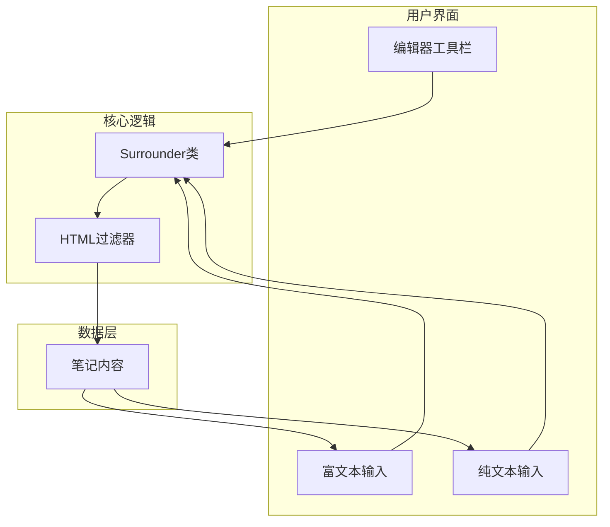
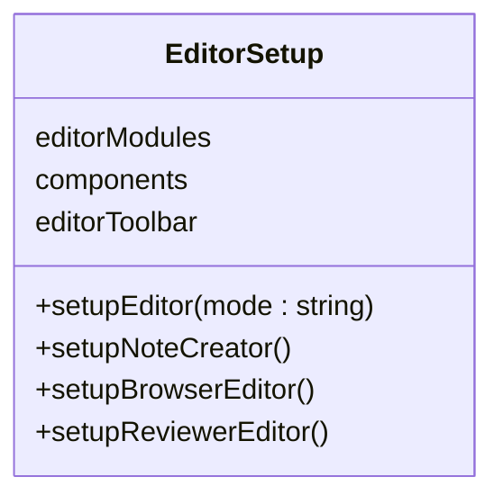
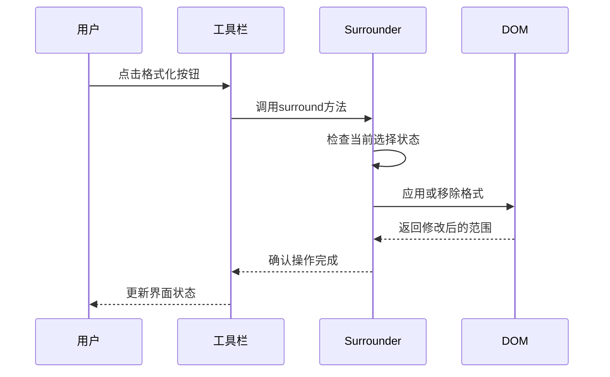
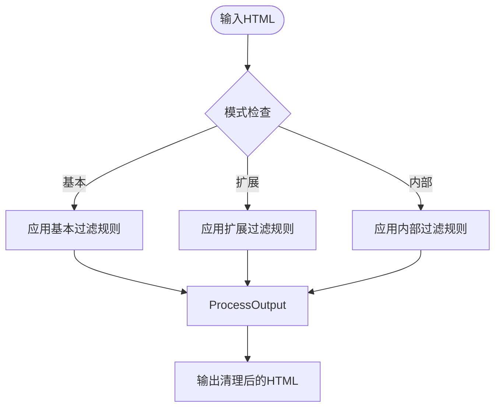
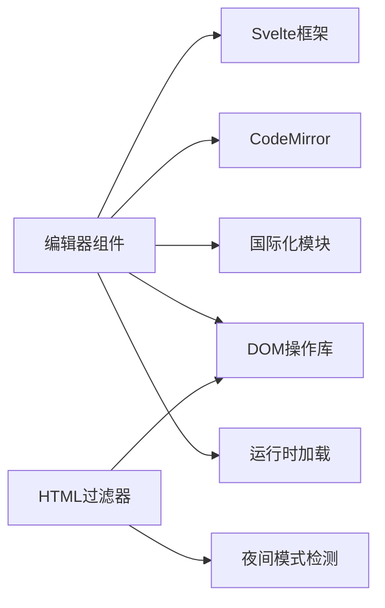

# 编辑器组件

<cite>
**本文档中引用的文件**  
- [base.ts](file://ts/editor/base.ts)
- [surround.ts](file://ts/editor/surround.ts)
- [index.ts](file://ts/html-filter/index.ts)
- [element.ts](file://ts/html-filter/element.ts)
- [editor-toolbar/index.ts](file://ts/editor/editor-toolbar/index.ts)
- [PlainTextInput.svelte](file://ts/editor/plain-text-input/PlainTextInput.svelte)
- [RichTextInput.svelte](file://ts/editor/rich-text-input/RichTextInput.svelte)
</cite>

## 目录
1. [简介](#简介)
2. [项目结构](#项目结构)
3. [核心组件](#核心组件)
4. [架构概述](#架构概述)
5. [详细组件分析](#详细组件分析)
6. [依赖分析](#依赖分析)
7. [性能考虑](#性能考虑)
8. [故障排除指南](#故障排除指南)
9. [结论](#结论)

## 简介
Anki 编辑器组件为笔记创建和编辑提供了强大的富文本和纯文本输入功能。该系统设计用于支持多种编辑模式，包括浏览、添加和复习场景。核心功能包括文本格式化、HTML 内容过滤、工具栏集成以及可扩展的 API，使开发者能够自定义编辑行为。本文档深入分析了编辑器的架构和实现机制，重点介绍其输入模式、文本环绕逻辑、安全过滤策略和工具栏集成方式。

## 项目结构
Anki 编辑器组件位于 `ts/editor` 目录下，采用模块化设计，分离关注点并促进可维护性。主要子模块包括 `rich-text-input` 和 `plain-text-input`，分别处理富文本和纯文本输入场景。`html-filter` 模块负责清理和验证用户输入的 HTML 内容，确保安全性。`editor-toolbar` 组件提供可视化操作界面，集成各种格式化功能。`base.ts` 定义了编辑器的核心类和初始化逻辑，而 `surround.ts` 实现了文本环绕和格式化的核心算法。

**Diagram sources**
- [base.ts](file://ts/editor/base.ts#L1-L87)

**Section sources**
- [base.ts](file://ts/editor/base.ts#L1-L87)

## 核心组件
Anki 编辑器的核心由多个协同工作的组件构成。`base.ts` 中定义的 `setupEditor` 函数是编辑器的入口点，根据使用场景（添加、浏览或复习）初始化相应的编辑器实例。`surround.ts` 提供了文本格式化的底层机制，通过 `Surrounder` 类管理格式注册、应用和移除。`html-filter` 模块确保所有用户输入的 HTML 内容都经过严格过滤，防止 XSS 攻击。`editor-toolbar` 组件将这些功能暴露给用户，提供直观的界面进行文本格式化操作。

**Section sources**
- [base.ts](file://ts/editor/base.ts#L47-L86)
- [surround.ts](file://ts/editor/surround.ts#L0-L397)
- [index.ts](file://ts/html-filter/index.ts#L0-L56)

## 架构概述
Anki 编辑器采用分层架构，将用户界面、业务逻辑和数据处理分离。用户通过 `editor-toolbar` 触发操作，这些操作被转换为对 `Surrounder` 类的调用，该类管理文本格式化状态。输入内容通过 `html-filter` 模块进行清理，确保只有安全的 HTML 标签和属性被保留。`PlainTextInput` 和 `RichTextInput` 组件分别处理纯文本和富文本输入模式，它们共享相同的底层 API 但提供不同的用户体验。

**Diagram sources**
- [base.ts](file://ts/editor/base.ts#L1-L87)
- [surround.ts](file://ts/editor/surround.ts#L0-L397)
- [index.ts](file://ts/html-filter/index.ts#L0-L56)

## 详细组件分析

### 富文本与纯文本输入模式
Anki 编辑器支持两种输入模式：富文本和纯文本。`RichTextInput` 组件提供所见即所得的编辑体验，允许用户直接在页面上格式化文本。`PlainTextInput` 组件则提供基于 CodeMirror 的代码编辑器界面，适合需要精确控制 HTML 结构的高级用户。两种模式共享相同的底层 API，确保功能一致性。

**Section sources**
- [RichTextInput.svelte](file://ts/editor/rich-text-input/RichTextInput.svelte#L0-L150)
- [PlainTextInput.svelte](file://ts/editor/plain-text-input/PlainTextInput.svelte#L0-L189)

### Base.ts 核心编辑器类
`base.ts` 文件定义了编辑器的核心功能和初始化逻辑。它负责设置国际化支持、挂载 Svelte 组件，并根据不同的使用场景（添加、浏览、复习）初始化相应的编辑器实例。该文件还导出了 `editorToolbar`，使其他模块能够访问工具栏功能。

**Diagram sources**
- [base.ts](file://ts/editor/base.ts#L0-L87)

### Surround.ts 文本环绕功能
`surround.ts` 实现了文本格式化的核心逻辑。`Surrounder` 类管理格式注册、应用和移除。它使用触发器机制来处理插入文本时的格式化，并支持排他性格式（例如，粗体和斜体不能同时应用）。该模块还提供了 `isSurrounded` 方法来检查当前选择是否已被特定格式包围。

**Diagram sources**
- [surround.ts](file://ts/editor/surround.ts#L0-L397)

### HTML过滤与清理机制
`html-filter` 模块提供多层次的 HTML 内容过滤。它定义了三种过滤模式：基本、扩展和内部。基本模式只允许最基本的 HTML 标签，扩展模式允许更多格式化标签，内部模式用于 Anki 内部数据处理。过滤器会移除不安全的属性（如 `onload` 事件处理器），并规范化样式属性。

**Diagram sources**
- [index.ts](file://ts/html-filter/index.ts#L0-L56)
- [element.ts](file://ts/html-filter/element.ts#L0-L108)

### Editor-toolbar 组件
`editor-toolbar` 组件提供用户友好的界面来访问编辑器功能。它使用 Svelte 的上下文 API 将功能暴露给子组件，并支持动态插槽以允许自定义布局。工具栏包含多个功能区域，如内联格式化、块级格式化和模板操作。

**Section sources**
- [editor-toolbar/index.ts](file://ts/editor/editor-toolbar/index.ts#L0-L8)
- [EditorToolbar.svelte](file://ts/editor/editor-toolbar/EditorToolbar.svelte#L0-L138)

## 依赖分析
编辑器组件依赖于多个外部模块和库。它使用 Svelte 作为 UI 框架，CodeMirror 作为纯文本编辑器，以及 Anki 自有的国际化和工具库。`html-filter` 模块依赖于 DOM 操作函数来遍历和修改 HTML 结构。`surround.ts` 依赖于 `domlib/surround` 提供的底层 DOM 操作函数。

**Diagram sources**
- [base.ts](file://ts/editor/base.ts#L1-L87)
- [index.ts](file://ts/html-filter/index.ts#L0-L56)

## 性能考虑
Anki 编辑器在设计时考虑了性能因素。它使用 Svelte 的响应式系统来最小化 DOM 更新，并通过 `lifecycleHooks` 管理组件生命周期。`html-filter` 模块使用高效的 DOM 遍历算法，避免不必要的节点访问。`Surrounder` 类使用映射（Map）来快速查找格式定义，确保格式化操作的时间复杂度为 O(1)。

## 故障排除指南
当编辑器功能异常时，应首先检查控制台是否有 JavaScript 错误。如果工具栏按钮无响应，确认 `editorToolbar` 上下文是否正确设置。如果 HTML 过滤行为不符合预期，检查 `filterHTML` 函数的调用参数。对于文本格式化问题，验证 `Surrounder` 实例是否已正确初始化并设置了 API。

**Section sources**
- [base.ts](file://ts/editor/base.ts#L47-L86)
- [surround.ts](file://ts/editor/surround.ts#L0-L397)
- [index.ts](file://ts/html-filter/index.ts#L0-L56)

## 结论
Anki 编辑器组件提供了一个功能丰富且安全的笔记编辑系统。其模块化设计使得功能扩展和维护变得容易。通过深入理解 `base.ts` 的核心类、`surround.ts` 的文本环绕机制、`html-filter` 的安全过滤策略以及 `editor-toolbar` 的集成方式，开发者可以有效地定制和扩展编辑器功能，满足特定的使用需求。