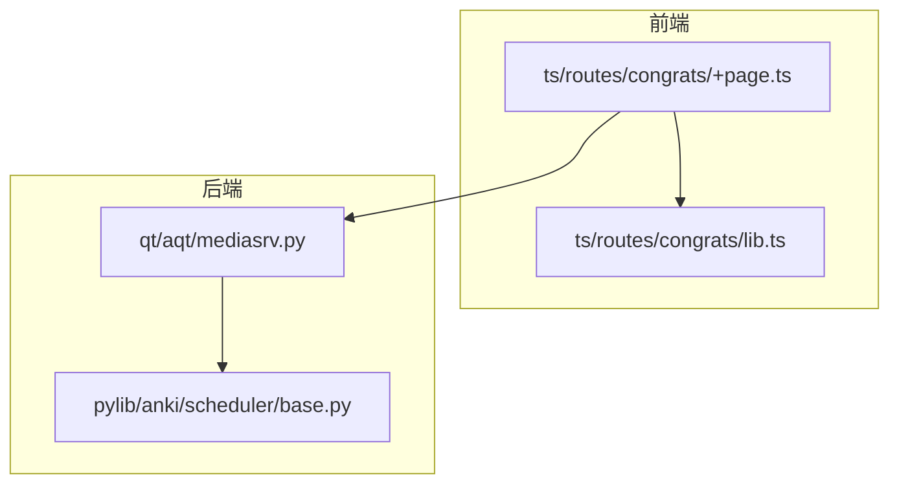
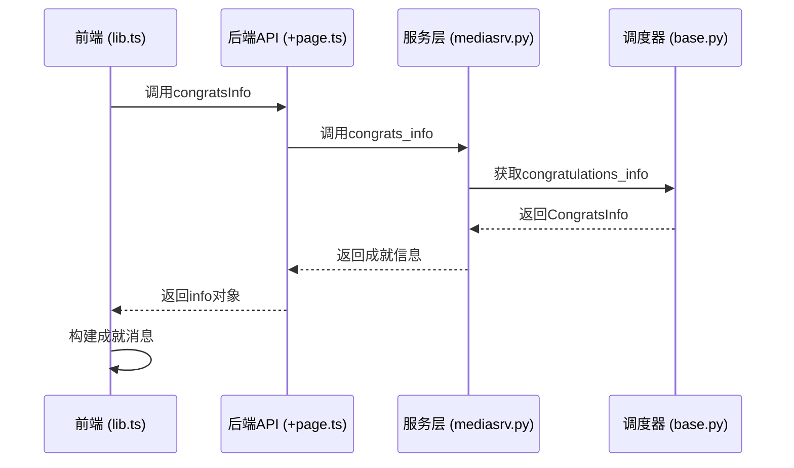
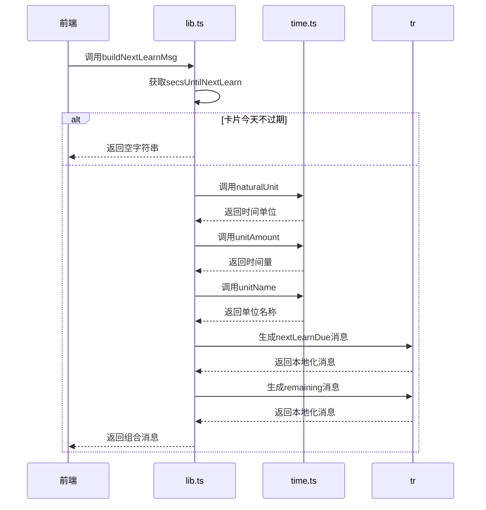
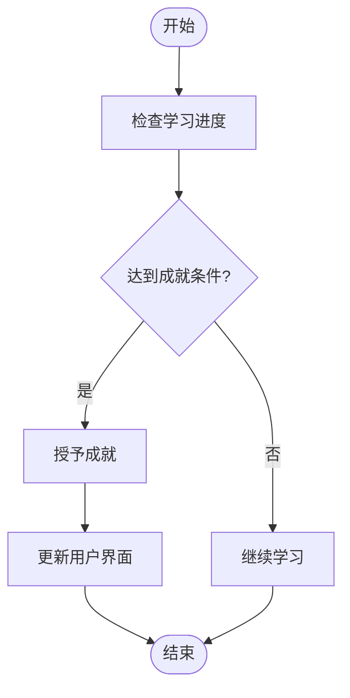
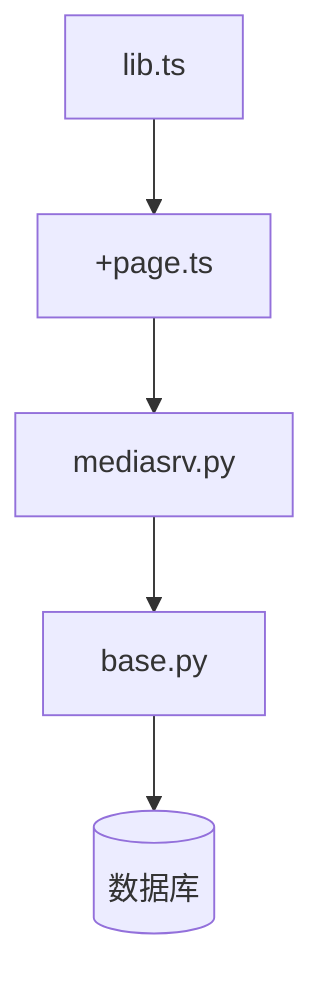

# 业务计算

<cite>
**本文档中引用的文件**
- [lib.ts](file://ts/routes/congrats/lib.ts)
- [+page.ts](file://ts/routes/congrats/+page.ts)
- [mediasrv.py](file://qt/aqt/mediasrv.py)
- [base.py](file://pylib/anki/scheduler/base.py)
</cite>

## 目录
1. [简介](#简介)
2. [项目结构](#项目结构)
3. [核心组件](#核心组件)
4. [架构概述](#架构概述)
5. [详细组件分析](#详细组件分析)
6. [依赖分析](#依赖分析)
7. [性能考虑](#性能考虑)
8. [故障排除指南](#故障排除指南)
9. [结论](#结论)
10. [附录](#附录)（如有必要）

## 简介
本文档旨在深入分析Anki成就界面的业务计算逻辑，重点研究成就计算算法的实现。文档将详细说明学习天数统计、卡片复习数量计算和成就条件判断逻辑，涵盖各种成就类型（如连续学习天数、总复习数等）的判定规则和阈值设置。通过分析辅助函数如何处理日期计算、数据聚合和成就状态更新，为开发者提供扩展成就系统的指导。

## 项目结构
Anki项目的结构包含多个关键目录，包括用于前端逻辑的`ts`目录、用于后端逻辑的`rslib`和`pylib`目录，以及用于用户界面的`qt`目录。成就系统的实现主要分布在`ts/routes/congrats`目录下的TypeScript文件和`pylib/anki/scheduler`目录下的Python文件中。

**Diagram sources**
- [lib.ts](file://ts/routes/congrats/lib.ts)
- [+page.ts](file://ts/routes/congrats/+page.ts)
- [mediasrv.py](file://qt/aqt/mediasrv.py)
- [base.py](file://pylib/anki/scheduler/base.py)

**Section sources**
- [lib.ts](file://ts/routes/congrats/lib.ts)
- [+page.ts](file://ts/routes/congrats/+page.ts)

## 核心组件
成就系统的核心组件包括前端的`lib.ts`文件，该文件包含构建成就信息的函数，以及后端的`scheduler`模块，负责提供成就所需的数据。`congratsInfo`函数是获取成就信息的主要入口点，它从后端获取数据并将其传递给前端进行显示。

**Section sources**
- [lib.ts](file://ts/routes/congrats/lib.ts)
- [base.py](file://pylib/anki/scheduler/base.py)

## 架构概述
Anki成就系统的架构分为前端和后端两部分。前端负责展示成就信息，而后端负责计算和提供这些信息。前端通过调用后端的API获取成就数据，然后使用这些数据构建用户界面。

**Diagram sources**
- [lib.ts](file://ts/routes/congrats/lib.ts)
- [+page.ts](file://ts/routes/congrats/+page.ts)
- [mediasrv.py](file://qt/aqt/mediasrv.py)
- [base.py](file://pylib/anki/scheduler/base.py)

## 详细组件分析

### 成就计算分析
成就计算逻辑主要在`lib.ts`文件中实现，特别是`buildNextLearnMsg`函数。该函数根据用户的学习进度计算下一个学习卡片的预计时间，并生成相应的消息。

#### 对于API/服务组件：

**Diagram sources**
- [lib.ts](file://ts/routes/congrats/lib.ts)

**Section sources**
- [lib.ts](file://ts/routes/congrats/lib.ts)

### 概念概述
成就系统的设计旨在激励用户持续学习。通过设置不同的成就类型和阈值，系统能够识别用户的进步并给予相应的奖励。这种机制不仅增加了学习的趣味性，还帮助用户保持学习的动力。

[无来源，因为此图表显示的是概念工作流，而非实际代码结构]

[无来源，因为此部分不分析特定文件]

## 依赖分析
成就系统依赖于多个组件，包括前端的TypeScript文件、后端的Python文件和Rust文件。这些组件通过API调用和数据传递相互协作，共同实现成就功能。

**Diagram sources**
- [lib.ts](file://ts/routes/congrats/lib.ts)
- [+page.ts](file://ts/routes/congrats/+page.ts)
- [mediasrv.py](file://qt/aqt/mediasrv.py)
- [base.py](file://pylib/anki/scheduler/base.py)

**Section sources**
- [lib.ts](file://ts/routes/congrats/lib.ts)
- [+page.ts](file://ts/routes/congrats/+page.ts)
- [mediasrv.py](file://qt/aqt/mediasrv.py)
- [base.py](file://pylib/anki/scheduler/base.py)

## 性能考虑
成就系统的性能主要受数据查询和计算的影响。为了优化性能，系统采用了缓存机制和异步处理。此外，通过减少不必要的计算和优化数据库查询，可以进一步提高系统的响应速度。

[无来源，因为此部分提供一般性指导]

## 故障排除指南
当成就系统出现问题时，首先应检查前端和后端的日志文件。常见的问题包括API调用失败、数据不一致和计算错误。通过分析日志文件，可以快速定位问题并采取相应的解决措施。

**Section sources**
- [mediasrv.py](file://qt/aqt/mediasrv.py)
- [base.py](file://pylib/anki/scheduler/base.py)

## 结论
Anki成就系统的业务计算逻辑设计精巧，能够有效激励用户持续学习。通过深入分析其架构和实现，开发者可以更好地理解和扩展这一功能。未来的工作可以集中在优化性能和增加新的成就类型上，以进一步提升用户体验。

[无来源，因为此部分总结而不分析特定文件]