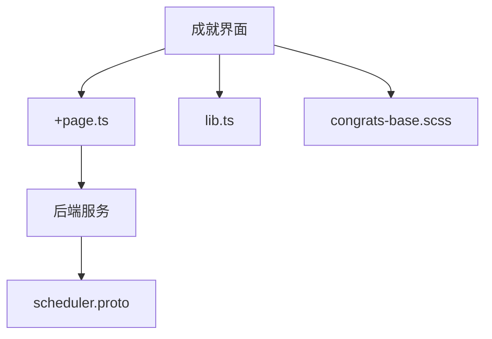
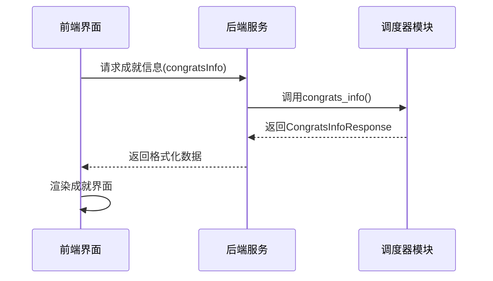
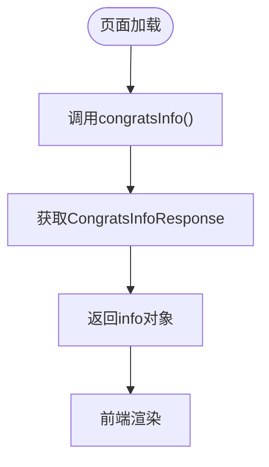
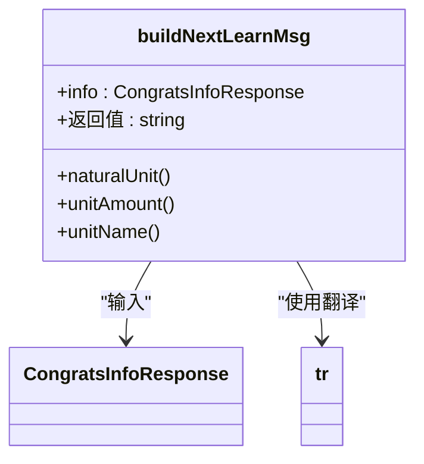
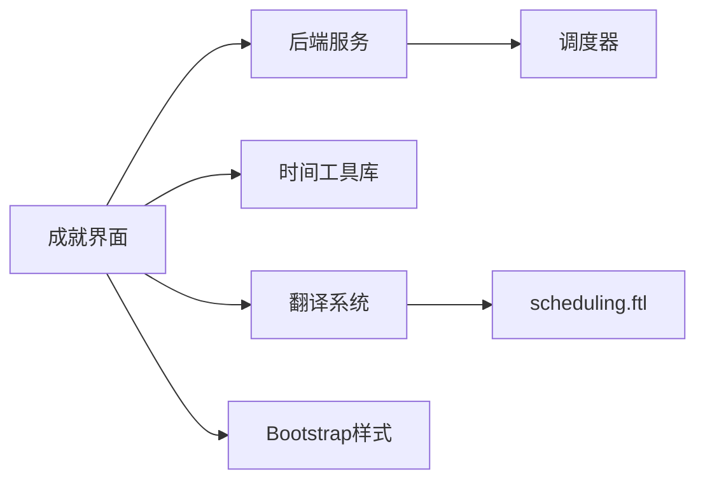

# 成就界面

<cite>
**本文档中引用的文件**  
- [congrats/+page.ts](file://ts/routes/congrats/+page.ts)
- [congrats/lib.ts](file://ts/routes/congrats/lib.ts)
- [congrats/congrats-base.scss](file://ts/routes/congrats/congrats-base.scss)
- [scheduler.proto](file://proto/anki/scheduler.proto)
- [scheduling.ftl](file://ftl/core/scheduling.ftl)
</cite>

## 目录
1. [简介](#简介)
2. [项目结构](#项目结构)
3. [核心组件](#核心组件)
4. [架构概述](#架构概述)
5. [详细组件分析](#详细组件分析)
6. [依赖分析](#依赖分析)
7. [性能考虑](#性能考虑)
8. [故障排除指南](#故障排除指南)
9. [结论](#结论)

## 简介
本文档详细介绍了 Anki 中成就界面的实现机制。重点分析了 `congrats/+page.ts` 中的页面逻辑、`lib.ts` 中的辅助函数以及 `congrats-base.scss` 中的样式规则。文档还说明了如何添加新成就类型、自定义界面外观，并描述了成就系统与评审和统计系统的集成方式。

## 项目结构
成就界面相关代码位于 `ts/routes/congrats/` 目录下，包含页面逻辑、业务函数和样式文件。该界面通过前端路由与后端调度器服务进行数据交互。

**图示来源**  
- [congrats/+page.ts](file://ts/routes/congrats/+page.ts)
- [scheduler.proto](file://proto/anki/scheduler.proto)

**本节来源**  
- [ts/routes/congrats/+page.ts](file://ts/routes/congrats/+page.ts)
- [proto/anki/scheduler.proto](file://proto/anki/scheduler.proto)

## 核心组件
成就界面的核心功能包括学习进度计算、成就条件判断和用户反馈展示。这些功能通过 TypeScript 模块和样式表协同实现，利用 Protobuf 定义的数据结构与后端通信。

**本节来源**  
- [congrats/+page.ts](file://ts/routes/congrats/+page.ts)
- [congrats/lib.ts](file://ts/routes/congrats/lib.ts)

## 架构概述
成就界面采用前后端分离架构，前端通过异步调用获取调度信息，后端提供 Protobuf 接口返回用户学习状态。界面根据返回数据动态生成祝贺消息和后续学习建议。

**图示来源**  
- [congrats/+page.ts](file://ts/routes/congrats/+page.ts)
- [scheduler.proto](file://proto/anki/scheduler.proto)

## 详细组件分析

### 页面逻辑分析
`+page.ts` 文件实现了成就页面的加载逻辑，通过异步函数调用后端服务获取用户学习状态信息，并将数据传递给前端模板进行渲染。

**图示来源**  
- [congrats/+page.ts](file://ts/routes/congrats/+page.ts)

**本节来源**  
- [congrats/+page.ts](file://ts/routes/congrats/+page.ts)

### 业务逻辑分析
`lib.ts` 文件包含构建学习提示消息的辅助函数，根据剩余学习卡片数和下次学习时间生成本地化提示信息。

**图示来源**  
- [congrats/lib.ts](file://ts/routes/congrats/lib.ts)
- [scheduler.proto](file://proto/anki/scheduler.proto)

**本节来源**  
- [congrats/lib.ts](file://ts/routes/congrats/lib.ts)

### 样式规则分析
`congrats-base.scss` 定义了成就界面的基础样式，导入了 Bootstrap 容器类并设置了页面边距，确保界面在不同设备上具有良好的显示效果。

**本节来源**  
- [congrats/congrats-base.scss](file://ts/routes/congrats/congrats-base.scss)

## 依赖分析
成就界面依赖多个系统组件，包括后端调度服务、国际化翻译系统和样式库。这些依赖通过模块导入和 Protobuf 接口实现。

**图示来源**  
- [congrats/+page.ts](file://ts/routes/congrats/+page.ts)
- [congrats/lib.ts](file://ts/routes/congrats/lib.ts)
- [scheduling.ftl](file://ftl/core/scheduling.ftl)

**本节来源**  
- [congrats/+page.ts](file://ts/routes/congrats/+page.ts)
- [congrats/lib.ts](file://ts/routes/congrats/lib.ts)
- [scheduling.ftl](file://ftl/core/scheduling.ftl)

## 性能考虑
成就界面采用异步加载机制，避免阻塞主线程。数据请求仅在页面加载时执行一次，减少网络开销。样式文件通过 SCSS 预处理优化，确保渲染效率。

## 故障排除指南
当成就界面显示异常时，应检查以下方面：
- 确认后端服务正常运行
- 验证 Protobuf 消息格式是否匹配
- 检查翻译文件是否存在对应键值
- 确保网络请求未被拦截

**本节来源**  
- [congrats/+page.ts](file://ts/routes/congrats/+page.ts)
- [scheduler.proto](file://proto/anki/scheduler.proto)

## 结论
Anki 的成就界面通过模块化设计实现了学习进度的可视化反馈。系统结合前端交互、后端计算和样式呈现，为用户提供清晰的学习状态概览。开发者可基于现有架构扩展更多成就类型和自定义功能。