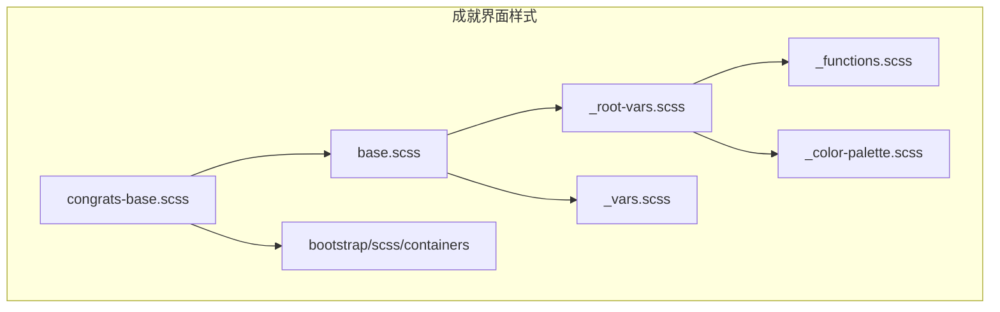
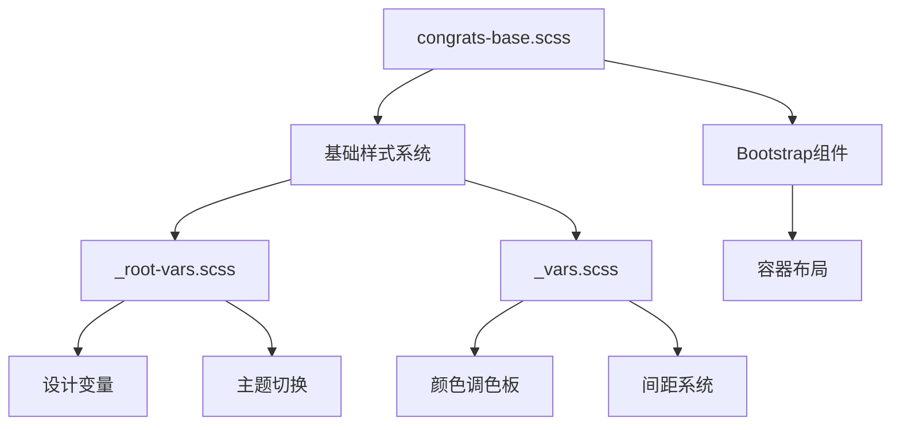
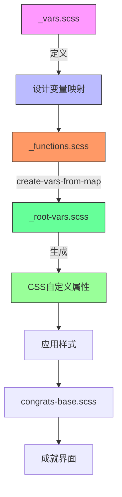
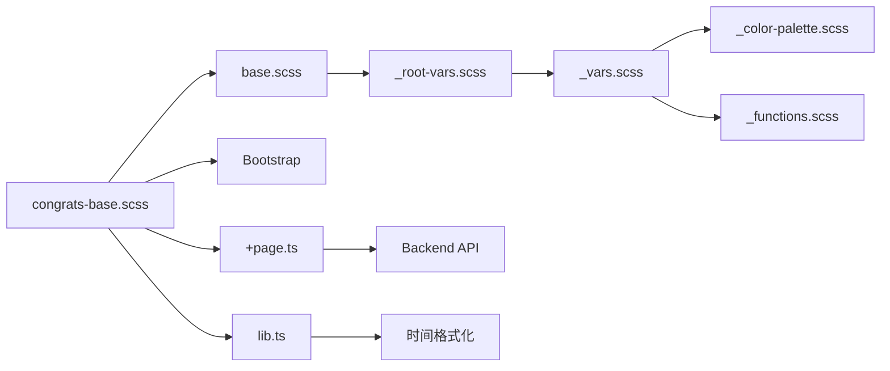

# 样式设计

<cite>
**本文档中引用的文件**  
- [congrats-base.scss](file://ts/routes/congrats/congrats-base.scss)
- [base.scss](file://ts/lib/sass/base.scss)
- [_root-vars.scss](file://ts/lib/sass/_root-vars.scss)
- [_vars.scss](file://ts/lib/sass/_vars.scss)
- [_functions.scss](file://ts/lib/sass/_functions.scss)
- [lib.ts](file://ts/routes/congrats/lib.ts)
- [+page.ts](file://ts/routes/congrats/+page.ts)
</cite>

## 目录
1. [项目结构](#项目结构)
2. [核心组件](#核心组件)
3. [架构概述](#架构概述)
4. [详细组件分析](#详细组件分析)
5. [依赖分析](#依赖分析)

## 项目结构

Anki成就界面的样式设计主要集中在`ts/routes/congrats/`目录下，该目录包含实现祝贺页面视觉表现的核心SCSS和TypeScript文件。样式系统基于Sass预处理器构建，采用模块化设计，通过变量、混合宏和嵌套规则实现一致的视觉语言。基础样式变量和函数在`ts/lib/sass/`目录中定义，为整个应用提供统一的设计系统。



**Diagram sources**
- [congrats-base.scss](file://ts/routes/congrats/congrats-base.scss#L1-L9)
- [base.scss](file://ts/lib/sass/base.scss#L1-L90)
- [_root-vars.scss](file://ts/lib/sass/_root-vars.scss#L1-L65)

**Section sources**
- [congrats-base.scss](file://ts/routes/congrats/congrats-base.scss#L1-L9)
- [base.scss](file://ts/lib/sass/base.scss#L1-L90)

## 核心组件

成就界面的核心样式由`congrats-base.scss`文件定义，该文件通过Sass的`@use`和`@import`机制引入基础样式系统和Bootstrap容器组件。样式设计遵循模块化原则，通过继承和扩展基础变量来确保与应用整体视觉风格的一致性。文件中定义的全局`body`样式设置了页面的边距，为内容区域提供了适当的呼吸空间。

**Section sources**
- [congrats-base.scss](file://ts/routes/congrats/congrats-base.scss#L1-L9)
- [base.scss](file://ts/lib/sass/base.scss#L1-L90)

## 架构概述

成就界面的样式架构采用分层设计模式，上层为具体页面样式，下层为全局设计系统。`congrats-base.scss`作为顶层样式表，依赖于`ts/lib/sass/`目录提供的基础样式库。该架构通过Sass模块系统实现变量和函数的封装，确保样式的可维护性和可扩展性。设计系统包含颜色调色板、间距、边框半径等核心设计令牌，支持深色和浅色两种主题模式。



**Diagram sources**
- [congrats-base.scss](file://ts/routes/congrats/congrats-base.scss#L1-L9)
- [_root-vars.scss](file://ts/lib/sass/_root-vars.scss#L1-L65)
- [_vars.scss](file://ts/lib/sass/_vars.scss#L1-L473)

## 详细组件分析

### 成就界面样式分析

`congrats-base.scss`文件通过导入`_root-vars.scss`和`base.scss`建立样式基础，继承了应用的全局设计系统。文件中的`body`选择器设置了左右0.5em的边距，确保内容在不同屏幕尺寸下都有适当的留白。这种设计既保持了与应用其他部分的一致性，又为成就卡片等内容提供了清晰的视觉边界。

#### 样式依赖关系
```mermaid
classDiagram
class congrats-base.scss {
+@use "../../lib/sass/root-vars"
+@import "../../lib/sass/base"
+@import "bootstrap/scss/containers"
+body { margin-left/right : 0.5em }
}
class base.scss {
+@use "vars"
+@use "root-vars"
+@use "button-mixins"
+基础元素样式
+表单控件样式
}
class _root-vars.scss {
+ : root { 颜色变量 }
+ : root.night-mode { 深色主题 }
+html { 字体大小 }
}
class _vars.scss {
+$vars( props, colors )
+prop() 函数
+color() 函数
}
congrats-base.scss --> base.scss : "导入"
base.scss --> _root-vars.scss : "使用"
base.scss --> _vars.scss : "使用"
_root-vars.scss --> _vars.scss : "获取变量"
```

**Diagram sources**
- [congrats-base.scss](file://ts/routes/congrats/congrats-base.scss#L1-L9)
- [base.scss](file://ts/lib/sass/base.scss#L1-L90)
- [_root-vars.scss](file://ts/lib/sass/_root-vars.scss#L1-L65)
- [_vars.scss](file://ts/lib/sass/_vars.scss#L1-L473)

**Section sources**
- [congrats-base.scss](file://ts/routes/congrats/congrats-base.scss#L1-L9)
- [base.scss](file://ts/lib/sass/base.scss#L1-L90)
- [_root-vars.scss](file://ts/lib/sass/_root-vars.scss#L1-L65)

### 设计系统分析

Anki的样式设计系统基于Sass模块化架构，通过`_vars.scss`定义设计令牌，`_root-vars.scss`将这些令牌转换为CSS自定义属性。系统采用语义化命名约定，如`--fg`表示前景色，`--canvas`表示画布背景色，`--border`表示边框色。颜色系统基于`_color-palette.scss`中的调色板，包含lightgray、darkgray等基础色系和red、blue等强调色系。

#### 设计变量处理流程


**Diagram sources**
- [_vars.scss](file://ts/lib/sass/_vars.scss#L1-L473)
- [_functions.scss](file://ts/lib/sass/_functions.scss#L1-L87)
- [_root-vars.scss](file://ts/lib/sass/_root-vars.scss#L1-L65)
- [congrats-base.scss](file://ts/routes/congrats/congrats-base.scss#L1-L9)

**Section sources**
- [_vars.scss](file://ts/lib/sass/_vars.scss#L1-L473)
- [_functions.scss](file://ts/lib/sass/_functions.scss#L1-L87)
- [_root-vars.scss](file://ts/lib/sass/_root-vars.scss#L1-L65)

## 依赖分析

成就界面样式系统与Anki前端架构紧密集成，依赖于多个核心样式模块。`congrats-base.scss`直接依赖`base.scss`和Bootstrap容器组件，间接依赖整个Sass设计系统。这种依赖关系确保了成就界面与应用其他部分在视觉上的一致性。样式系统还与TypeScript逻辑层交互，`+page.ts`文件通过`congratsInfo` API获取数据，`lib.ts`提供辅助函数，共同构建完整的用户界面。



**Diagram sources**
- [congrats-base.scss](file://ts/routes/congrats/congrats-base.scss#L1-L9)
- [base.scss](file://ts/lib/sass/base.scss#L1-L90)
- [_root-vars.scss](file://ts/lib/sass/_root-vars.scss#L1-L65)
- [+page.ts](file://ts/routes/congrats/+page.ts#L1-L10)
- [lib.ts](file://ts/routes/congrats/lib.ts#L1-L26)

**Section sources**
- [congrats-base.scss](file://ts/routes/congrats/congrats-base.scss#L1-L9)
- [base.scss](file://ts/lib/sass/base.scss#L1-L90)
- [+page.ts](file://ts/routes/congrats/+page.ts#L1-L10)
- [lib.ts](file://ts/routes/congrats/lib.ts#L1-L26)