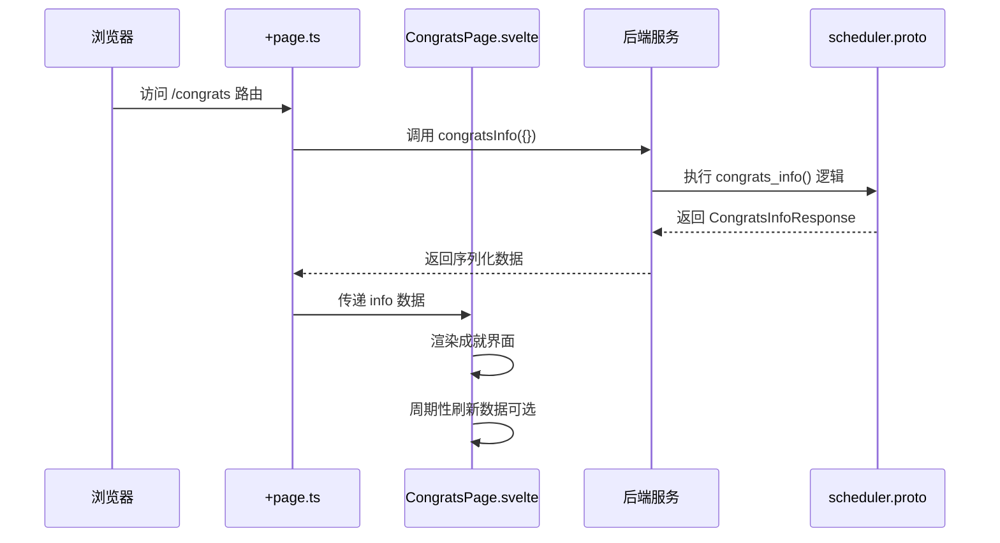
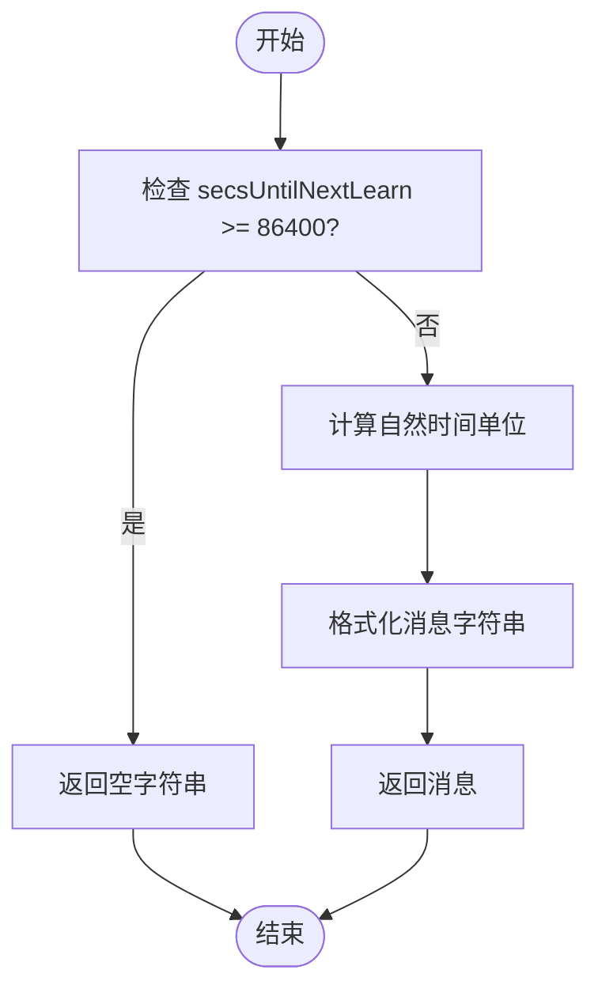
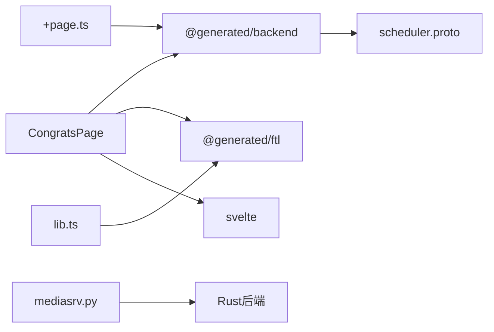

# 页面逻辑

<cite>
**本文档引用的文件**  
- [ts/routes/congrats/+page.ts](file://ts/routes/congrats/+page.ts)
- [ts/routes/congrats/CongratsPage.svelte](file://ts/routes/congrats/CongratsPage.svelte)
- [ts/routes/congrats/lib.ts](file://ts/routes/congrats/lib.ts)
- [ts/routes/congrats/index.ts](file://ts/routes/congrats/index.ts)
- [proto/anki/scheduler.proto](file://proto/anki/scheduler.proto)
- [qt/aqt/mediasrv.py](file://qt/aqt/mediasrv.py#L438-L441)
- [pylib/anki/scheduler/base.py](file://pylib/anki/scheduler/base.py#L86-L87)
</cite>

## 目录
1. [简介](#简介)
2. [项目结构](#项目结构)
3. [核心组件](#核心组件)
4. [架构概览](#架构概览)
5. [详细组件分析](#详细组件分析)
6. [依赖分析](#依赖分析)
7. [性能考虑](#性能考虑)
8. [故障排除指南](#故障排除指南)
9. [结论](#结论)

## 简介
本文档详细分析了Anki应用中成就界面（Congrats Page）的页面逻辑实现。该页面在用户完成每日学习任务后显示，提供学习统计、下一步建议和用户交互选项。文档深入探讨了Svelte组件结构、响应式声明、状态管理、数据加载机制和用户交互事件处理。通过分析前端TypeScript代码与后端Rust/Python服务的集成，揭示了学习数据的获取与渲染流程，并为开发者提供修改行为和扩展功能的指导。

## 项目结构
成就界面位于`ts/routes/congrats/`目录下，是SvelteKit应用的一个路由页面。该模块包含前端组件、逻辑处理和与后端通信的接口。

```mermaid
graph TB
subgraph "成就界面模块"
page["+page.ts<br/>页面加载逻辑"]
svelte["CongratsPage.svelte<br/>Svelte组件"]
lib["lib.ts<br/>辅助函数"]
index["index.ts<br/>传统入口"]
end
page --> svelte : "传递 info 数据"
lib --> svelte : "构建消息"
index --> svelte : "挂载组件"
```

**Diagram sources**
- [ts/routes/congrats/+page.ts](file://ts/routes/congrats/+page.ts)
- [ts/routes/congrats/CongratsPage.svelte](file://ts/routes/congrats/CongratsPage.svelte)
- [ts/routes/congrats/lib.ts](file://ts/routes/congrats/lib.ts)
- [ts/routes/congrats/index.ts](file://ts/routes/congrats/index.ts)

**Section sources**
- [ts/routes/congrats/+page.ts](file://ts/routes/congrats/+page.ts)
- [ts/routes/congrats/CongratsPage.svelte](file://ts/routes/congrats/CongratsPage.svelte)

## 核心组件
成就界面的核心是一个Svelte组件（`CongratsPage.svelte`），它接收来自页面加载函数的数据，并根据用户的当前学习状态动态渲染内容。组件使用响应式声明来处理数据更新，并通过`onMount`生命周期钩子实现周期性数据刷新。页面逻辑通过`congratsInfo` API从后端获取`CongratsInfoResponse`数据结构，该结构包含了完成学习任务所需的所有信息，如剩余学习卡片数、下次学习时间、是否埋藏卡片等。

**Section sources**
- [ts/routes/congrats/CongratsPage.svelte](file://ts/routes/congrats/CongratsPage.svelte#L1-L100)
- [ts/routes/congrats/+page.ts](file://ts/routes/congrats/+page.ts#L1-L10)

## 架构概览
成就界面的架构遵循典型的前后端分离模式。前端使用SvelteKit框架处理路由和组件渲染，后端通过gRPC服务提供数据。数据流从用户访问`/congrats`路由开始，触发`+page.ts`中的`load`函数，该函数调用`congratsInfo`后端API。后端服务（Python/Rust）处理请求并返回`CongratsInfoResponse`协议缓冲区消息，前端接收到数据后将其传递给Svelte组件进行渲染。



**Diagram sources**
- [ts/routes/congrats/+page.ts](file://ts/routes/congrats/+page.ts)
- [ts/routes/congrats/CongratsPage.svelte](file://ts/routes/congrats/CongratsPage.svelte)
- [proto/anki/scheduler.proto](file://proto/anki/scheduler.proto)

## 详细组件分析

### CongratsPage.svelte 组件分析
`CongratsPage.svelte`是成就界面的主要UI组件，使用Svelte框架的响应式特性来管理状态和渲染逻辑。

#### 组件生命周期与响应式声明
组件使用Svelte的`onMount`钩子在挂载后启动一个定时器，每60秒调用一次`congratsInfo` API以刷新数据（当`refreshPeriodically`为true时）。组件中的`nextLearnMsg`变量使用Svelte的响应式声明语法`$:`定义，这意味着每当其依赖的`info`变量发生变化时，该表达式会自动重新计算。

```mermaid
classDiagram
class CongratsPage {
+info : CongratsInfoResponse
+refreshPeriodically : boolean
-congrats : string
-nextLearnMsg : string
-today_reviews : string
-today_new : string
-unburyThem : string
-buriedMsg : string
-customStudy : string
-customStudyMsg : string
+onMount() : void
}
note right of CongratsPage
响应式变量 :
$ : nextLearnMsg = buildNextLearnMsg(info)
end
```

**Diagram sources**
- [ts/routes/congrats/CongratsPage.svelte](file://ts/routes/congrats/CongratsPage.svelte#L1-L100)

#### 数据加载与用户交互
数据加载通过`congratsInfo`函数实现，该函数是后端API的TypeScript封装。页面通过`bridgeLink`生成可点击的链接，这些链接触发Anki桌面应用的原生功能，如“取消埋藏”和“自定义学习”。组件根据`info`对象中的布尔值（如`reviewRemaining`, `newRemaining`）使用Svelte的`{#if}`块条件渲染不同的消息。

**Section sources**
- [ts/routes/congrats/CongratsPage.svelte](file://ts/routes/congrats/CongratsPage.svelte#L1-L100)
- [ts/routes/congrats/lib.ts](file://ts/routes/congrats/lib.ts#L1-L26)

### 辅助函数分析
`lib.ts`文件包含`buildNextLearnMsg`函数，该函数负责根据`CongratsInfoResponse`中的`secsUntilNextLearn`字段构建下一次学习的提示消息。

#### 算法逻辑
该函数首先检查距离下次学习的时间（秒）是否超过86400秒（一天）。如果超过，则返回空字符串，表示没有即将到期的学习卡片。否则，它使用`naturalUnit`和`unitAmount`函数将秒数转换为更人性化的时间单位（如“分钟”或“小时”），然后通过国际化（i18n）函数`tr.schedulingNextLearnDue`和`tr.schedulingLearnRemaining`生成本地化的消息字符串。



**Diagram sources**
- [ts/routes/congrats/lib.ts](file://ts/routes/congrats/lib.ts#L1-L26)

## 依赖分析
成就界面模块依赖于多个外部系统和库。前端依赖Svelte框架进行UI渲染，依赖`@generated/backend`进行类型安全的后端API调用，依赖`@generated/ftl`进行国际化文本处理。后端依赖`proto/anki/scheduler.proto`中定义的`CongratsInfoResponse`消息结构和`CongratsInfo` RPC服务。Python层的`mediasrv.py`文件中的`congrats_info`函数作为HTTP请求的处理入口，调用底层Rust后端。



**Diagram sources**
- [ts/routes/congrats/CongratsPage.svelte](file://ts/routes/congrats/CongratsPage.svelte)
- [ts/routes/congrats/+page.ts](file://ts/routes/congrats/+page.ts)
- [ts/routes/congrats/lib.ts](file://ts/routes/congrats/lib.ts)
- [proto/anki/scheduler.proto](file://proto/anki/scheduler.proto)
- [qt/aqt/mediasrv.py](file://qt/aqt/mediasrv.py#L438-L441)

**Section sources**
- [ts/routes/congrats/CongratsPage.svelte](file://ts/routes/congrats/CongratsPage.svelte)
- [proto/anki/scheduler.proto](file://proto/anki/scheduler.proto)
- [qt/aqt/mediasrv.py](file://qt/aqt/mediasrv.py#L438-L441)

## 性能考虑
成就界面的性能主要体现在数据获取和渲染效率上。通过Svelte的响应式系统，组件仅在`info`数据变化时重新渲染相关部分，避免了不必要的DOM操作。周期性刷新（每60秒）的设计平衡了数据实时性与网络请求开销。后端`congrats_info`函数的实现（在`mediasrv.py`中）确保了在学习未完成时自动跳转回概览页面，优化了用户体验流程。

## 故障排除指南
开发者在修改成就界面时可能遇到以下问题：
1.  **消息未更新**：检查`onMount`中的`setInterval`是否正确执行，确认`congratsInfo` API调用是否成功（查看浏览器开发者工具的网络标签页）。
2.  **国际化文本缺失**：确保`tr`对象已正确导入，并且`ftl`文件中存在对应的键（如`schedulingCongratulationsFinished`）。
3.  **链接无响应**：`bridgeLink`生成的链接依赖于Anki桌面应用的桥接功能，在独立浏览器中可能无法工作。测试时应使用Anki桌面环境。
4.  **类型错误**：`info`对象的类型为`CongratsInfoResponse`，确保访问的字段名与`proto`文件定义一致。

**Section sources**
- [ts/routes/congrats/CongratsPage.svelte](file://ts/routes/congrats/CongratsPage.svelte)
- [ts/routes/congrats/lib.ts](file://ts/routes/congrats/lib.ts)
- [proto/anki/scheduler.proto](file://proto/anki/scheduler.proto)

## 结论
Anki的成就界面通过清晰的分层架构实现了高效的数据展示和用户交互。前端Svelte组件负责响应式UI渲染，后端服务提供稳定的数据支持。`+page.ts`的加载函数和`lib.ts`的辅助函数共同构成了页面逻辑的核心。开发者可以通过修改`CongratsPage.svelte`的模板或扩展`lib.ts`中的函数来定制界面行为，例如添加新的成就动画或用户反馈机制。理解`CongratsInfoResponse`数据结构是进行任何功能扩展的基础。