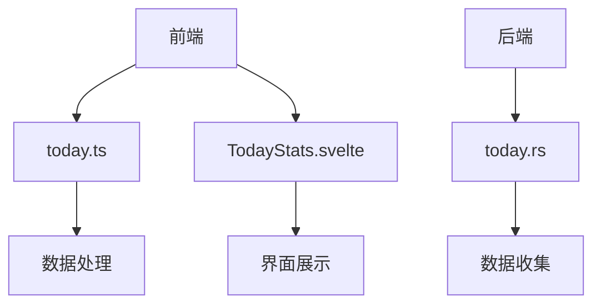
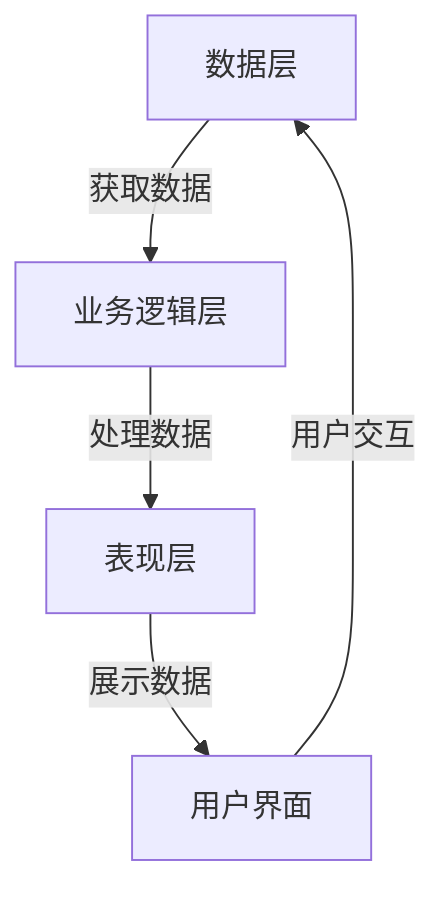
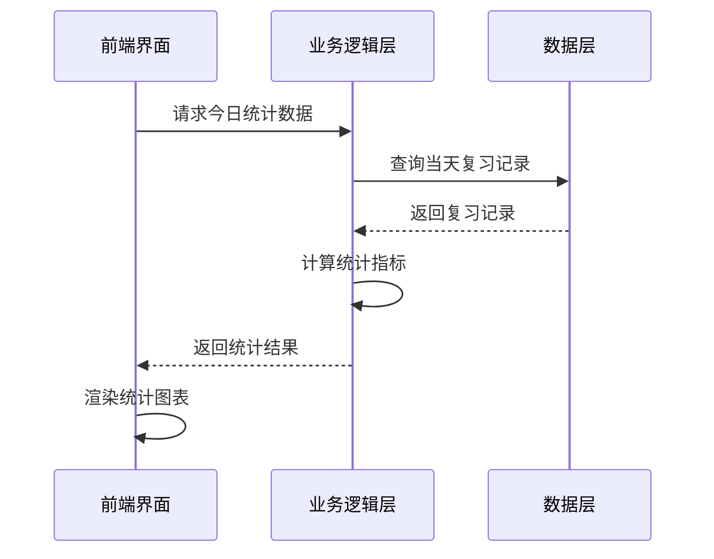
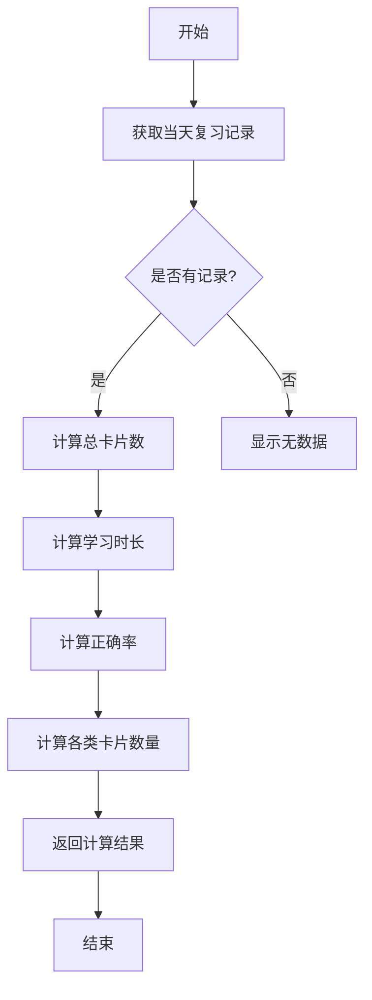
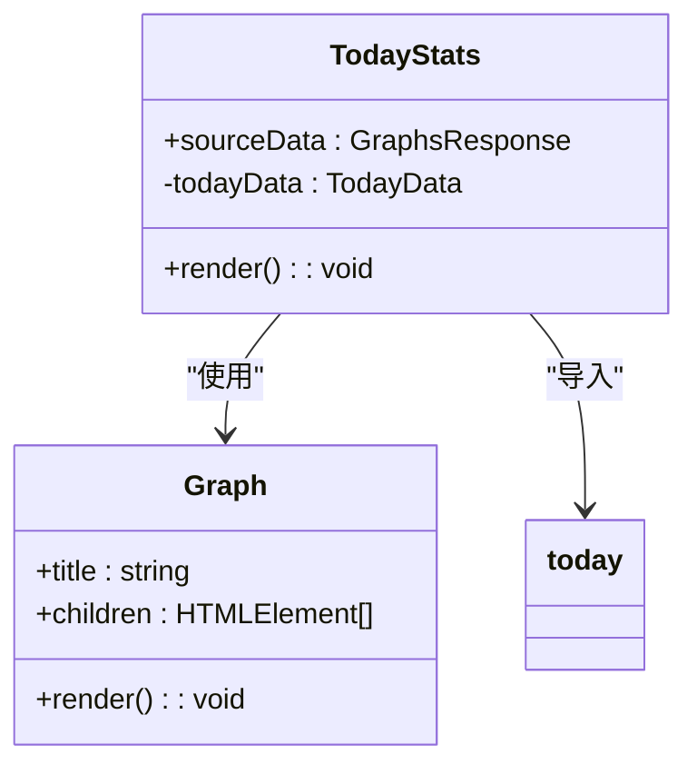
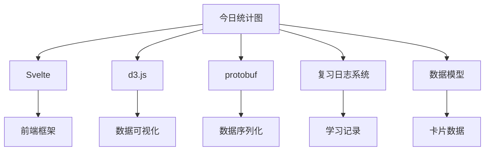

# 今日统计图

<cite>
**本文档引用的文件**
- [today.ts](file://ts/routes/graphs/today.ts)
- [TodayStats.svelte](file://ts/routes/graphs/TodayStats.svelte)
- [today.rs](file://rslib/src/stats/graphs/today.rs)
- [time.ts](file://ts/lib/tslib/time.ts)
</cite>

## 目录
1. [简介](#简介)
2. [项目结构](#项目结构)
3. [核心组件](#核心组件)
4. [架构概述](#架构概述)
5. [详细组件分析](#详细组件分析)
6. [依赖分析](#依赖分析)
7. [性能考虑](#性能考虑)
8. [故障排除指南](#故障排除指南)
9. [结论](#结论)

## 简介
今日统计图是Anki应用中的一个重要功能，用于展示用户当天的学习活动统计数据。该功能通过收集和分析用户的复习记录，提供关于学习卡片数量、学习时长和新卡片数等关键指标的实时可视化展示。本文档深入分析了today.ts文件中的实现，解释了数据收集、实时更新机制和可视化展示的详细过程。

## 项目结构
今日统计图功能主要分布在前端TypeScript代码和后端Rust代码中。前端代码位于ts/routes/graphs/目录下，包含today.ts和TodayStats.svelte文件。后端数据处理逻辑位于rslib/src/stats/graphs/目录下的today.rs文件中。这种前后端分离的架构设计使得数据处理和界面展示能够独立演进。

**文件结构图**

**Diagram sources**
- [today.ts](file://ts/routes/graphs/today.ts)
- [TodayStats.svelte](file://ts/routes/graphs/TodayStats.svelte)
- [today.rs](file://rslib/src/stats/graphs/today.rs)

## 核心组件
今日统计图的核心组件包括数据收集、指标计算和界面展示三个部分。数据收集组件负责从用户的复习日志中提取当天的活动数据；指标计算组件对原始数据进行处理，计算出各种统计指标；界面展示组件则将计算结果以用户友好的方式呈现出来。

**Section sources**
- [today.ts](file://ts/routes/graphs/today.ts)
- [today.rs](file://rslib/src/stats/graphs/today.rs)

## 架构概述
今日统计图采用分层架构设计，分为数据层、业务逻辑层和表现层。数据层负责从数据库中获取原始的复习记录；业务逻辑层对数据进行处理和计算；表现层负责将计算结果可视化。这种分层设计提高了代码的可维护性和可测试性。

**Diagram sources**
- [today.ts](file://ts/routes/graphs/today.ts)
- [today.rs](file://rslib/src/stats/graphs/today.rs)

## 详细组件分析

### 数据收集与处理分析
今日统计图的数据收集过程从用户的复习日志中提取当天的活动记录。系统通过遍历复习日志，筛选出属于当天的记录，并根据不同的复习类型进行分类统计。

**Diagram sources**
- [today.rs](file://rslib/src/stats/graphs/today.rs)
- [today.ts](file://ts/routes/graphs/today.ts)

### 指标计算逻辑分析
今日统计图的指标计算主要包括复习卡片数、学习时长和新卡片数等。系统通过分析复习日志中的记录，计算出各种类型的卡片数量和总学习时间。对于正确率的计算，系统会统计用户选择正确按钮的次数。

**Diagram sources**
- [today.ts](file://ts/routes/graphs/today.ts)
- [time.ts](file://ts/lib/tslib/time.ts)

### 界面展示组件分析
今日统计图的界面展示采用Svelte框架实现，通过TodayStats.svelte组件将计算结果以文本形式展示给用户。组件接收来自业务逻辑层的数据，动态生成相应的统计信息行。

**Diagram sources**
- [TodayStats.svelte](file://ts/routes/graphs/TodayStats.svelte)
- [today.ts](file://ts/routes/graphs/today.ts)

## 依赖分析
今日统计图功能依赖于多个其他组件和库。前端依赖于Svelte框架和d3.js库进行数据可视化，后端依赖于Rust的protobuf库进行数据序列化。此外，该功能还依赖于Anki的核心数据模型和复习日志系统。

**Diagram sources**
- [today.ts](file://ts/routes/graphs/today.ts)
- [today.rs](file://rslib/src/stats/graphs/today.rs)

## 性能考虑
今日统计图在性能方面进行了多项优化。数据查询采用倒序遍历的方式，一旦超出当天的时间范围就立即停止，避免了不必要的计算。前端采用响应式编程模式，只有当数据发生变化时才重新渲染界面，减少了DOM操作的开销。

## 故障排除指南
当今日统计图功能出现问题时，可以按照以下步骤进行排查：首先检查数据层是否能正确获取复习记录，然后验证业务逻辑层的计算是否正确，最后确认表现层的数据绑定是否正常。常见的问题包括数据查询范围错误、时间计算偏差和界面渲染异常。

**Section sources**
- [today.ts](file://ts/routes/graphs/today.ts)
- [today.rs](file://rslib/src/stats/graphs/today.rs)

## 结论
今日统计图为Anki用户提供了一个直观了解当天学习情况的工具。通过前后端的协同工作，系统能够高效地收集、处理和展示学习数据。该功能的设计体现了良好的分层架构和关注点分离原则，为未来的功能扩展和性能优化奠定了基础。