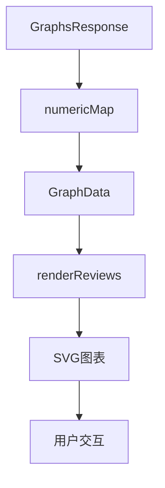
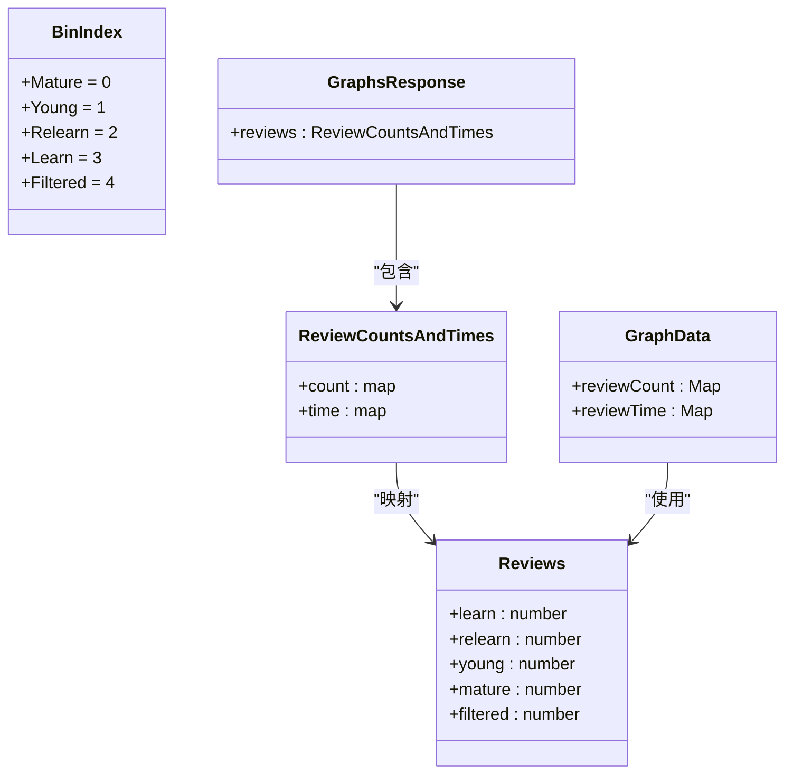
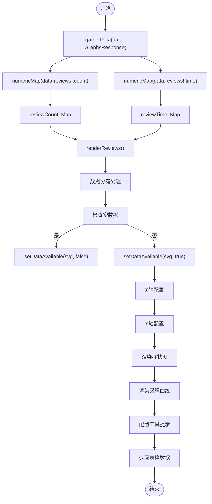
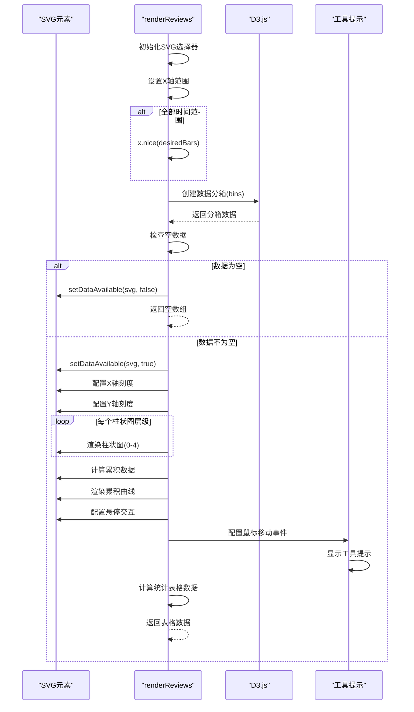
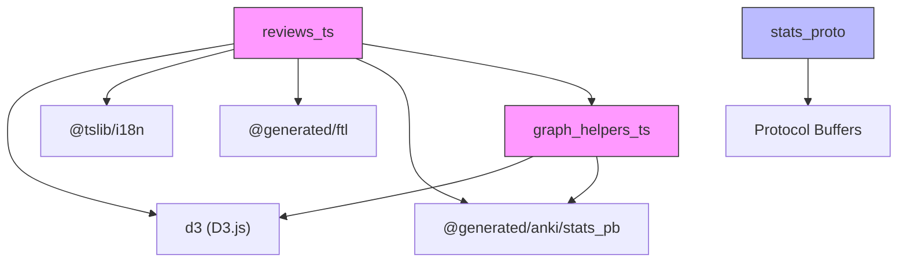

# 复习统计图

<cite>
**本文档引用的文件**  
- [reviews.ts](file://ts/routes/graphs/reviews.ts)
- [graph-helpers.ts](file://ts/routes/graphs/graph-helpers.ts)
- [stats.proto](file://proto/anki/stats.proto)
</cite>

## 目录
1. [简介](#简介)
2. [项目结构](#项目结构)
3. [核心组件](#核心组件)
4. [架构概述](#架构概述)
5. [详细组件分析](#详细组件分析)
6. [依赖分析](#依赖分析)
7. [性能考虑](#性能考虑)
8. [故障排除指南](#故障排除指南)
9. [结论](#结论)
10. [附录](#附录)（如有必要）

## 简介
本文档深入分析了Anki复习统计图的实现细节，重点关注`reviews.ts`文件中的数据聚合逻辑、图表渲染方法和用户交互功能。文档详细解释了如何计算复习次数、正确率和记忆保持率等关键指标，提供了代码示例展示数据处理流程和可视化配置，并描述了图表的响应式设计和性能优化策略。为开发者提供了自定义复习统计指标和视觉样式的指导。

## 项目结构
Anki项目的复习统计图功能主要分布在TypeScript前端代码和Protocol Buffer定义文件中。核心实现位于`ts/routes/graphs/`目录下的`reviews.ts`文件，该文件负责处理复习数据的可视化渲染。辅助功能分布在`graph-helpers.ts`等文件中，而数据结构定义则在`proto/anki/stats.proto`文件中。

```mermaid
graph TB
subgraph "前端"
reviews_ts[reviews.ts]
graph_helpers_ts[graph-helpers.ts]
end
subgraph "协议定义"
stats_proto[stats.proto]
end
reviews_ts --> graph_helpers_ts : "依赖"
reviews_ts --> stats_proto : "使用数据结构"
```

**图表来源**  
- [reviews.ts](file://ts/routes/graphs/reviews.ts#L1-L417)
- [graph-helpers.ts](file://ts/routes/graphs/graph-helpers.ts#L1-L107)
- [stats.proto](file://proto/anki/stats.proto#L75-L242)

**章节来源**  
- [reviews.ts](file://ts/routes/graphs/reviews.ts#L1-L417)
- [graph-helpers.ts](file://ts/routes/graphs/graph-helpers.ts#L1-L107)
- [stats.proto](file://proto/anki/stats.proto#L75-L242)

## 核心组件
复习统计图的核心组件包括数据聚合逻辑、图表渲染引擎和用户交互系统。`reviews.ts`文件中的`renderReviews`函数是主要的渲染入口点，负责将后端返回的原始数据转换为可视化的柱状图和累积曲线。`gatherData`函数则负责从`GraphsResponse`对象中提取并格式化复习数据。

**章节来源**  
- [reviews.ts](file://ts/routes/graphs/reviews.ts#L53-L416)
- [graph-helpers.ts](file://ts/routes/graphs/graph-helpers.ts#L100-L102)

## 架构概述
复习统计图采用分层架构设计，分为数据层、处理层和展示层。数据层由Protocol Buffer定义的`GraphsResponse`消息构成，包含复习计数和时间数据。处理层通过`numericMap`函数将protobuf的字符串键映射转换为数字键的Map对象。展示层使用D3.js库进行可视化渲染，包括柱状图、坐标轴和交互式工具提示。



**图表来源**  
- [reviews.ts](file://ts/routes/graphs/reviews.ts#L53-L416)
- [graph-helpers.ts](file://ts/routes/graphs/graph-helpers.ts#L100-L102)
- [stats.proto](file://proto/anki/stats.proto#L119-L183)

## 详细组件分析

### 复习数据聚合分析
`reviews.ts`文件中的数据聚合逻辑通过`BinIndex`枚举和相关函数实现，将复习记录分类为成熟、年轻、重新学习、学习和过滤五种类型。

#### 数据结构定义


**图表来源**  
- [reviews.ts](file://ts/routes/graphs/reviews.ts#L8-L25)
- [stats.proto](file://proto/anki/stats.proto#L119-L183)

#### 数据处理流程


**图表来源**  
- [reviews.ts](file://ts/routes/graphs/reviews.ts#L53-L416)
- [graph-helpers.ts](file://ts/routes/graphs/graph-helpers.ts#L100-L102)

### 图表渲染方法分析
`renderReviews`函数实现了复杂的图表渲染逻辑，包括动态坐标轴、彩色柱状图和累积面积图。

#### 渲染流程序列图


**图表来源**  
- [reviews.ts](file://ts/routes/graphs/reviews.ts#L112-L416)

### 用户交互功能分析
复习统计图提供了丰富的用户交互功能，包括工具提示、悬停效果和动态过渡动画。

#### 交互功能流程图
```mermaid
flowchart TD
HoverStart([鼠标悬停开始]) --> GetPointer["pointer(event, document.body)"]
GetPointer --> ExtractData["提取bin和area数据"]
ExtractData --> FormatTooltip["tooltipText(bin, area)"]
FormatTooltip --> CreateTable["创建HTML表格"]
CreateTable --> AddDay["添加日期行"]
CreateTable --> AddTotals["添加总计行"]
loop 每个复习类型
CreateTable --> AddLine["添加类型行"]
end
AddLine --> FormatValues["valueLabel(n)"]
FormatValues --> ShowTooltip["showTooltip(html, x, y)"]
ShowTooltip --> Display["显示工具提示"]
MouseOut([鼠标离开]) --> HideTooltip["hideTooltip()"]
HideTooltip --> Remove["移除工具提示"]
```

**图表来源**  
- [reviews.ts](file://ts/routes/graphs/reviews.ts#L320-L349)

## 依赖分析
复习统计图功能依赖于多个核心模块和外部库，形成了复杂的依赖关系网络。



**图表来源**  
- [reviews.ts](file://ts/routes/graphs/reviews.ts#L1-L20)
- [graph-helpers.ts](file://ts/routes/graphs/graph-helpers.ts#L1-L10)
- [stats.proto](file://proto/anki/stats.proto#L1-L10)

**章节来源**  
- [reviews.ts](file://ts/routes/graphs/reviews.ts#L1-L417)
- [graph-helpers.ts](file://ts/routes/graphs/graph-helpers.ts#L1-L107)
- [stats.proto](file://proto/anki/stats.proto#L1-L242)

## 性能考虑
复习统计图在设计时考虑了多项性能优化策略，确保在大量数据下的流畅渲染。

1. **数据分箱优化**：通过`bin()`函数将连续的复习数据分组到离散的时间桶中，减少渲染的图形元素数量。
2. **动态条形数量**：根据时间范围自动调整条形图的数量，最大限制为70个条形，避免过度渲染。
3. **过渡动画**：使用D3的过渡功能实现平滑的动画效果，提升用户体验而不影响性能。
4. **空数据处理**：快速检测空数据集并相应地禁用图表，避免不必要的渲染计算。
5. **坐标轴优化**：使用`nice()`方法优化坐标轴刻度，提高可读性同时减少刻度线数量。

这些优化策略确保了即使在处理多年复习数据时，图表也能快速加载和流畅交互。

## 故障排除指南
当复习统计图出现问题时，可以按照以下步骤进行排查：

1. **检查数据源**：确认`GraphsResponse`对象是否包含有效的复习数据，特别是`reviews.count`和`reviews.time`字段。
2. **验证时间范围**：检查`GraphRange`参数是否正确设置，确保`xMin`和`xMax`值符合预期。
3. **调试分箱过程**：验证`bin()`函数生成的分箱数据是否合理，检查`totalDays`计算是否正确。
4. **检查SVG元素**：确认传入的`svgElem`参数是否有效，确保SVG容器已正确初始化。
5. **查看控制台错误**：检查浏览器控制台是否有D3.js相关的JavaScript错误或警告。

**章节来源**  
- [reviews.ts](file://ts/routes/graphs/reviews.ts#L150-L155)
- [graph-helpers.ts](file://ts/routes/graphs/graph-helpers.ts#L55-L60)

## 结论
Anki的复习统计图通过精心设计的架构和高效的实现，为用户提供了直观的复习数据分析功能。`reviews.ts`文件中的`renderReviews`函数作为核心渲染引擎，结合D3.js的强大可视化能力，实现了动态、交互式的统计图表。数据聚合逻辑通过`numericMap`函数和`Bin`结构有效处理原始复习数据，而丰富的用户交互功能则提升了用户体验。该实现展示了前端可视化组件的最佳实践，为类似功能的开发提供了有价值的参考。

## 附录

### 关键指标计算方法
- **复习次数**：通过`cumulativeBinValue`函数计算各类型复习的累计总数
- **正确率**：在`tooltipText`函数中通过`totals[idx]`计算各类型的复习数量
- **记忆保持率**：通过累积曲线的斜率变化趋势间接反映记忆保持情况
- **平均复习时间**：在`renderReviews`函数中通过总时间除以总复习次数计算

### 自定义开发指导
开发者可以通过以下方式自定义复习统计图：
1. 修改`binColor`函数以改变各类复习的显示颜色
2. 调整`desiredBars`值以改变时间分箱的粒度
3. 扩展`tooltipText`函数以添加更多统计信息
4. 修改`yTickFormat`函数以改变Y轴数值的显示格式
5. 调整过渡动画的持续时间以改变视觉效果