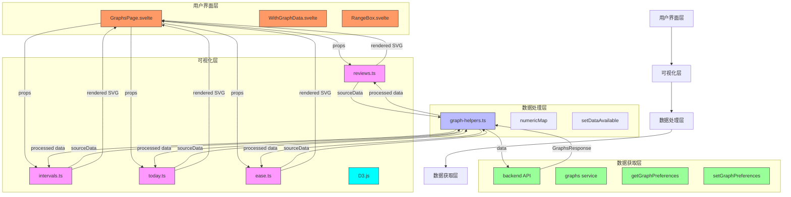
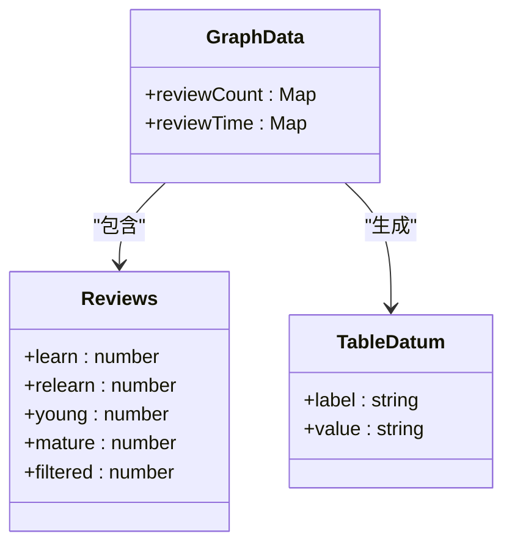
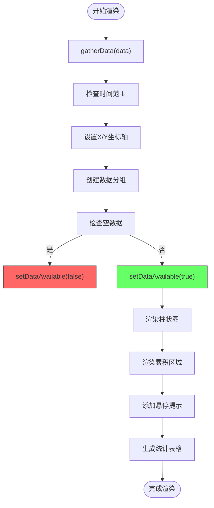
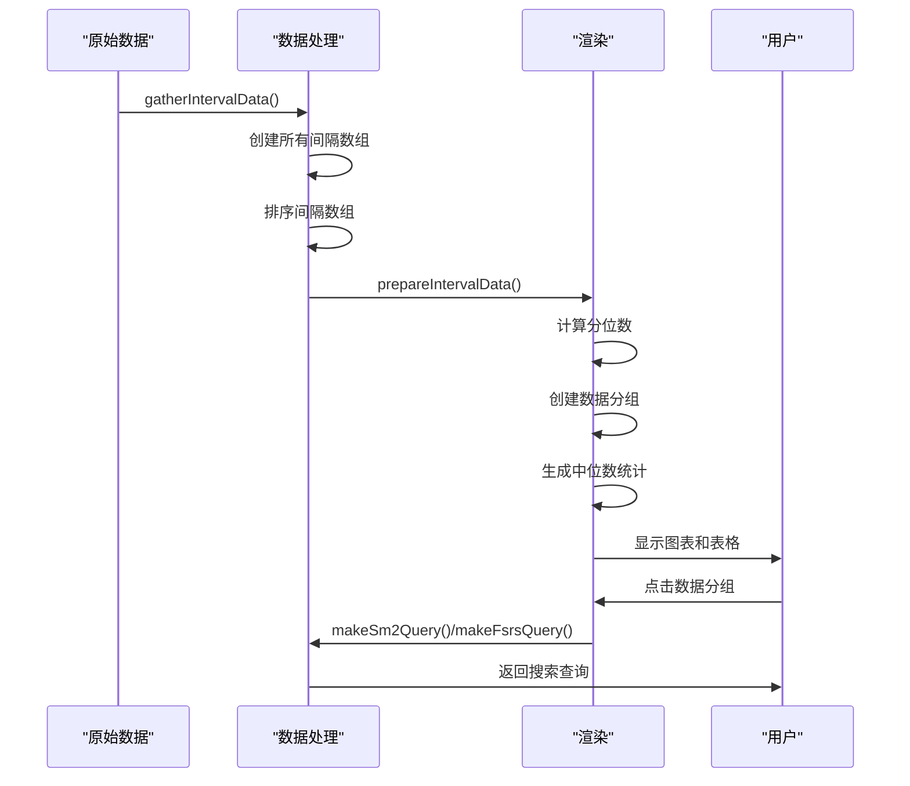
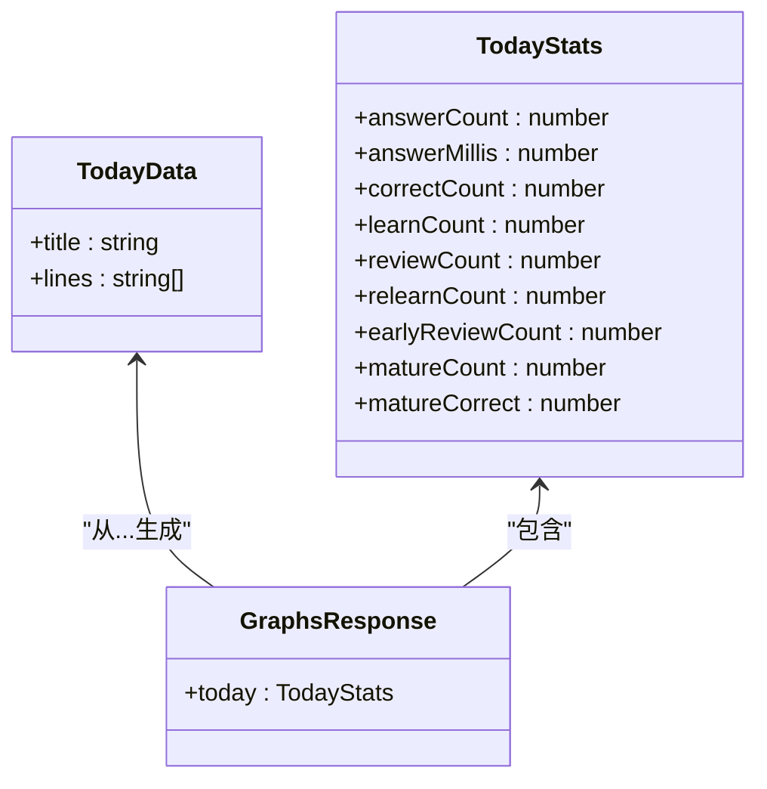
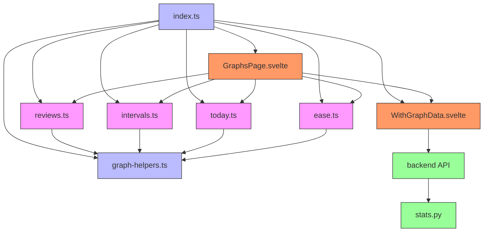

# 统计图表

<cite>
**本文档中引用的文件**   
- [reviews.ts](file://ts/routes/graphs/reviews.ts)
- [intervals.ts](file://ts/routes/graphs/intervals.ts)
- [today.ts](file://ts/routes/graphs/today.ts)
- [ease.ts](file://ts/routes/graphs/ease.ts)
- [index.ts](file://ts/routes/graphs/index.ts)
- [graph-helpers.ts](file://ts/routes/graphs/graph-helpers.ts)
- [GraphsPage.svelte](file://ts/routes/graphs/GraphsPage.svelte)
- [WithGraphData.svelte](file://ts/routes/graphs/WithGraphData.svelte)
- [stats.py](file://pylib/anki/stats.py)
</cite>

## 目录
1. [介绍](#介绍)
2. [项目结构](#项目结构)
3. [核心组件](#核心组件)
4. [架构概述](#架构概述)
5. [详细组件分析](#详细组件分析)
6. [依赖分析](#依赖分析)
7. [性能考虑](#性能考虑)
8. [故障排除指南](#故障排除指南)
9. [结论](#结论)

## 介绍
Anki的统计图表系统为用户提供了一套全面的数据可视化工具，用于分析学习进度和复习效果。该系统通过多种图表类型展示用户的学习数据，包括复习统计、间隔分布、今日统计和难度分布等。本文档将深入分析Anki统计图表系统的实现机制，重点关注`routes/graphs`目录下的各种图表组件，以及它们与后端数据服务的交互模式。

## 项目结构
Anki的统计图表系统主要位于`ts/routes/graphs`目录下，包含多个专门的TypeScript文件和Svelte组件。该系统采用模块化设计，每个图表类型都有独立的实现文件，同时共享通用的辅助函数和样式。

```mermaid
graph TB
subgraph "图表组件"
reviews[reviews.ts]
intervals[intervals.ts]
today[today.ts]
ease[ease.ts]
added[added.ts]
calendar[calendar.ts]
card-counts[card-counts.ts]
difficulty[difficulty.ts]
future-due[future-due.ts]
hours[hours.ts]
retrievability[retrievability.ts]
simulator[simulator.ts]
true-retention[true-retention.ts]
end
subgraph "核心文件"
index[index.ts]
graph-helpers[graph-helpers.ts]
graph-styles[graph-styles.ts]
end
subgraph "Svelte组件"
GraphsPage[GraphsPage.svelte]
WithGraphData[WithGraphData.svelte]
RangeBox[RangeBox.svelte]
end
index --> graph-helpers
index --> GraphsPage
index --> WithGraphData
GraphsPage --> WithGraphData
reviews --> graph-helpers
intervals --> graph-helpers
today --> graph-helpers
ease --> graph-helpers
style reviews fill:#f9f,stroke:#333
style intervals fill:#f9f,stroke:#333
style today fill:#f9f,stroke:#333
style ease fill:#f9f,stroke:#333
style index fill:#bbf,stroke:#333
style graph-helpers fill:#bbf,stroke:#333
style GraphsPage fill:#f96,stroke:#333
style WithGraphData fill:#f96,stroke:#333
```

**图表来源**
- [reviews.ts](file://ts/routes/graphs/reviews.ts)
- [intervals.ts](file://ts/routes/graphs/intervals.ts)
- [today.ts](file://ts/routes/graphs/today.ts)
- [ease.ts](file://ts/routes/graphs/ease.ts)
- [index.ts](file://ts/routes/graphs/index.ts)
- [graph-helpers.ts](file://ts/routes/graphs/graph-helpers.ts)
- [GraphsPage.svelte](file://ts/routes/graphs/GraphsPage.svelte)
- [WithGraphData.svelte](file://ts/routes/graphs/WithGraphData.svelte)

**节来源**
- [ts/routes/graphs](file://ts/routes/graphs)

## 核心组件
Anki统计图表系统的核心组件包括各种图表实现文件、数据处理工具和Svelte界面组件。系统通过`index.ts`文件导出的`setupGraphs`函数初始化图表页面，使用D3.js进行数据可视化，并通过Svelte框架构建响应式用户界面。

**节来源**
- [index.ts](file://ts/routes/graphs/index.ts#L17-L37)
- [graph-helpers.ts](file://ts/routes/graphs/graph-helpers.ts)
- [GraphsPage.svelte](file://ts/routes/graphs/GraphsPage.svelte)

## 架构概述
Anki统计图表系统的架构采用分层设计，分为数据获取层、数据处理层、可视化层和用户界面层。系统通过清晰的职责分离，实现了高内聚低耦合的设计原则。



**图表来源**
- [index.ts](file://ts/routes/graphs/index.ts)
- [GraphsPage.svelte](file://ts/routes/graphs/GraphsPage.svelte)
- [WithGraphData.svelte](file://ts/routes/graphs/WithGraphData.svelte)
- [graph-helpers.ts](file://ts/routes/graphs/graph-helpers.ts)

## 详细组件分析
### 复习统计图分析
复习统计图（reviews.ts）是Anki统计系统中最复杂的图表之一，它展示了用户在不同时间范围内的复习活动。该图表不仅显示了复习次数，还提供了复习时间的可视化。

#### 数据结构


**图表来源**
- [reviews.ts](file://ts/routes/graphs/reviews.ts#L45-L55)

#### 渲染流程


**图表来源**
- [reviews.ts](file://ts/routes/graphs/reviews.ts#L75-L417)

### 间隔分布图分析
间隔分布图（intervals.ts）展示了用户卡片复习间隔的分布情况，帮助用户了解学习材料的记忆持久性。

#### 数据处理


**图表来源**
- [intervals.ts](file://ts/routes/graphs/intervals.ts)

### 今日统计图分析
今日统计图（today.ts）提供了用户当天学习活动的概览，是最简单的统计图表之一。



**图表来源**
- [today.ts](file://ts/routes/graphs/today.ts)

### 难度分布图分析
难度分布图（ease.ts）展示了用户卡片难度因子的分布情况，帮助用户评估学习材料的难度。

#### 数据流
```mermaid
flowchart LR
A[后端数据] --> B[gatherData()]
B --> C[numericMap()]
C --> D[prepareData()]
D --> E[getAdjustedScaleAndTicks()]
E --> F[bin()]
F --> G[生成图表数据]
G --> H[生成统计表格]
H --> I[返回结果]
style A fill:#9f9,stroke:#333
style B fill:#bbf,stroke:#333
style C fill:#bbf,stroke:#333
style D fill:#bbf,stroke:#333
style E fill:#bbf,stroke:#333
style F fill:#bbf,stroke:#333
style G fill:#f9f,stroke:#333
style H fill:#f9f,stroke:#333
style I fill:#f96,stroke:#333
```

**图表来源**
- [ease.ts](file://ts/routes/graphs/ease.ts)

## 依赖分析
Anki统计图表系统具有清晰的依赖关系，各组件之间通过明确的接口进行通信。



**图表来源**
- [index.ts](file://ts/routes/graphs/index.ts)
- [graph-helpers.ts](file://ts/routes/graphs/graph-helpers.ts)
- [GraphsPage.svelte](file://ts/routes/graphs/GraphsPage.svelte)
- [WithGraphData.svelte](file://ts/routes/graphs/WithGraphData.svelte)
- [reviews.ts](file://ts/routes/graphs/reviews.ts)
- [intervals.ts](file://ts/routes/graphs/intervals.ts)
- [today.ts](file://ts/routes/graphs/today.ts)
- [ease.ts](file://ts/routes/graphs/ease.ts)
- [stats.py](file://pylib/anki/stats.py)

## 性能考虑
Anki统计图表系统在性能方面进行了多项优化，以确保在处理大量学习数据时仍能保持流畅的用户体验。

1. **数据分页**: 系统通过`RevlogRange`枚举区分年度数据和全时数据，避免一次性加载过多历史记录
2. **缓存策略**: 使用`autoSavingPrefs`函数实现图表偏好的自动保存和缓存
3. **按需加载**: `WithGraphData.svelte`组件采用异步加载模式，先显示界面再填充数据
4. **数据聚合**: 在后端进行数据聚合，减少传输的数据量
5. **视觉优化**: 对于大数据集，限制图表的最大柱状数量（70个），避免渲染性能下降

**节来源**
- [graph-helpers.ts](file://ts/routes/graphs/graph-helpers.ts#L15-L25)
- [WithGraphData.svelte](file://ts/routes/graphs/WithGraphData.svelte#L15-L25)

## 故障排除指南
### 常见问题及解决方案
1. **图表不显示数据**
   - 检查搜索条件是否匹配任何卡片
   - 确认时间范围内有复习记录
   - 验证后端服务是否正常运行

2. **图表加载缓慢**
   - 减少时间范围（如从"全时"改为"年度"）
   - 优化搜索条件以减少数据量
   - 检查网络连接状况

3. **数据不准确**
   - 确认卡片状态和标签设置正确
   - 检查调度算法配置
   - 验证数据同步状态

4. **样式显示异常**
   - 清除浏览器缓存
   - 检查CSS文件加载情况
   - 验证主题设置

**节来源**
- [graph-helpers.ts](file://ts/routes/graphs/graph-helpers.ts#L45-L55)
- [reviews.ts](file://ts/routes/graphs/reviews.ts#L200-L210)

## 结论
Anki的统计图表系统是一个功能强大且设计精良的数据可视化解决方案。通过模块化的架构设计，系统实现了高可维护性和可扩展性。各图表组件遵循一致的设计模式，使用共享的辅助函数处理通用任务，同时保持各自独特的可视化特性。

系统的关键优势包括：
- 清晰的分层架构，分离数据获取、处理和可视化逻辑
- 响应式设计，适应不同屏幕尺寸
- 高效的数据处理，支持大量学习记录的可视化
- 可扩展的架构，便于添加新的图表类型
- 与后端服务的良好集成，实现实时数据更新

对于开发者而言，该系统提供了良好的扩展点，可以通过添加新的`.ts`文件和Svelte组件来实现自定义图表类型，同时利用现有的数据处理和渲染基础设施。