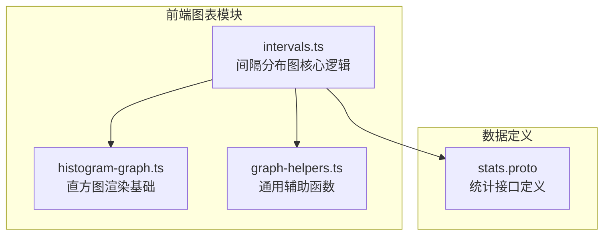
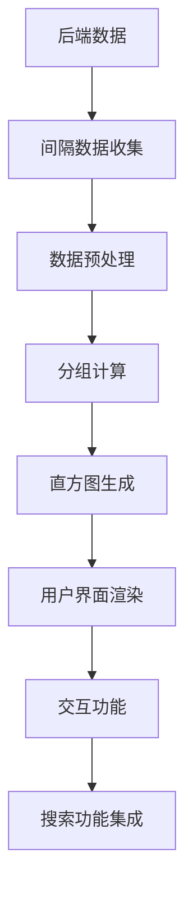
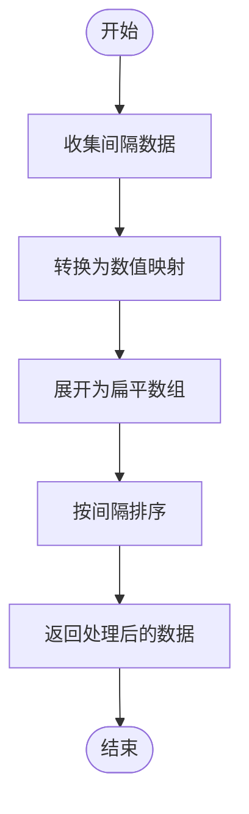
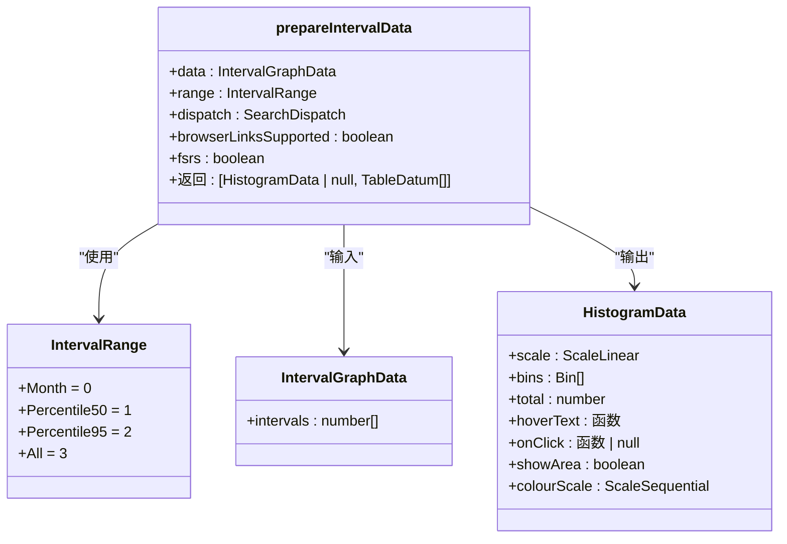
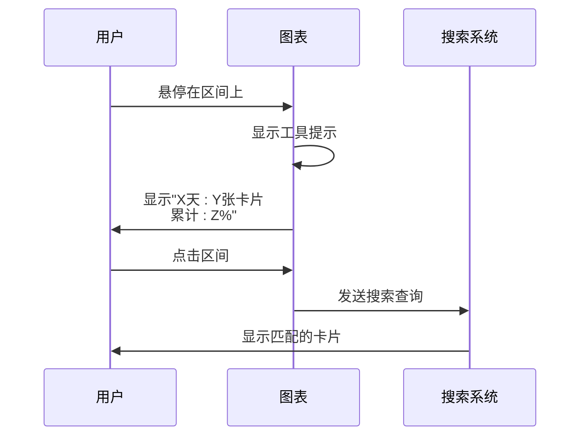
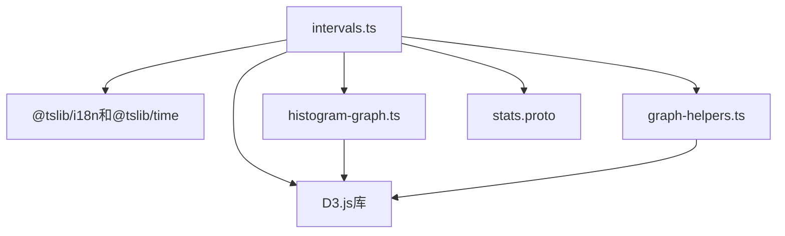

# 间隔分布图

<cite>
**本文档中引用的文件**   
- [intervals.ts](file://ts/routes/graphs/intervals.ts)
- [histogram-graph.ts](file://ts/routes/graphs/histogram-graph.ts)
- [graph-helpers.ts](file://ts/routes/graphs/graph-helpers.ts)
- [stats.proto](file://proto/anki/stats.proto)
</cite>

## 目录
1. [简介](#简介)
2. [项目结构](#项目结构)
3. [核心组件](#核心组件)
4. [架构概述](#架构概述)
5. [详细组件分析](#详细组件分析)
6. [依赖分析](#依赖分析)
7. [性能考虑](#性能考虑)
8. [故障排除指南](#故障排除指南)
9. [结论](#结论)

## 简介
间隔分布图是Anki复习系统中的关键统计功能，用于可视化卡片复习间隔的分布情况。该功能通过直方图展示用户卡片的间隔数据，帮助用户理解其学习进度和记忆保持模式。系统支持多种间隔范围选项，包括月度、50%分位数、95%分位数和全部数据，并提供交互式功能，允许用户点击图表中的特定区间来搜索相关卡片。

## 项目结构
间隔分布图功能主要位于前端TypeScript代码库中，涉及统计图表相关的模块。核心实现位于ts/routes/graphs目录下，与其他统计图表共享通用的可视化基础设施。

**Diagram sources**
- [intervals.ts](file://ts/routes/graphs/intervals.ts)
- [histogram-graph.ts](file://ts/routes/graphs/histogram-graph.ts)
- [graph-helpers.ts](file://ts/routes/graphs/graph-helpers.ts)
- [stats.proto](file://proto/anki/stats.proto)

**Section sources**
- [intervals.ts](file://ts/routes/graphs/intervals.ts)
- [histogram-graph.ts](file://ts/routes/graphs/histogram-graph.ts)

## 核心组件
间隔分布图的核心组件包括数据收集、处理和可视化三个主要部分。系统首先从后端获取间隔数据，然后在前端进行分组和统计分析，最后生成可交互的直方图。关键组件包括IntervalGraphData接口定义数据结构，IntervalRange枚举定义可选的显示范围，以及prepareIntervalData函数负责主要的数据处理逻辑。

**Section sources**
- [intervals.ts](file://ts/routes/graphs/intervals.ts#L18-L27)
- [intervals.ts](file://ts/routes/graphs/intervals.ts#L29-L191)

## 架构概述
间隔分布图采用分层架构设计，将数据获取、处理和可视化分离。系统通过gRPC接口从后端获取原始间隔数据，使用D3.js库进行数据分组和可视化处理，并通过Svelte框架实现交互式用户界面。架构设计注重性能优化，特别是在处理大量卡片数据时的效率问题。

**Diagram sources**
- [intervals.ts](file://ts/routes/graphs/intervals.ts#L29-L43)
- [intervals.ts](file://ts/routes/graphs/intervals.ts#L88-L191)

## 详细组件分析

### 间隔数据收集与处理
间隔分布图的数据处理流程从gatherIntervalData函数开始，该函数接收来自后端的间隔数据并将其转换为适合可视化的格式。处理过程包括将映射数据展开为扁平数组、排序以及准备用于分组计算的结构。

**Diagram sources**
- [intervals.ts](file://ts/routes/graphs/intervals.ts#L29-L43)

**Section sources**
- [intervals.ts](file://ts/routes/graphs/intervals.ts#L29-L43)

### 间隔范围配置与分组
系统提供多种间隔范围选项，允许用户根据需要查看不同范围的数据分布。prepareIntervalData函数根据用户选择的IntervalRange枚举值来确定数据显示范围，并使用D3.js的bin函数将连续的间隔数据分组为离散的区间。

**Diagram sources**
- [intervals.ts](file://ts/routes/graphs/intervals.ts#L22-L27)
- [intervals.ts](file://ts/routes/graphs/intervals.ts#L88-L191)
- [histogram-graph.ts](file://ts/routes/graphs/histogram-graph.ts#L16-L30)

**Section sources**
- [intervals.ts](file://ts/routes/graphs/intervals.ts#L88-L191)

### 可视化与交互功能
间隔分布图的可视化基于D3.js库实现，使用蓝色渐变色系表示不同间隔区间的卡片数量。图表支持鼠标悬停显示详细信息，包括特定区间的卡片数量和累计百分比。点击功能允许用户直接搜索属于特定间隔范围的卡片，增强了数据的可操作性。

**Diagram sources**
- [intervals.ts](file://ts/routes/graphs/intervals.ts#L145-L158)
- [intervals.ts](file://ts/routes/graphs/intervals.ts#L159-L168)

**Section sources**
- [intervals.ts](file://ts/routes/graphs/intervals.ts#L123-L161)

## 依赖分析
间隔分布图功能依赖于多个核心模块和外部库。系统使用D3.js进行数据可视化和统计计算，依赖@tslib/i18n进行国际化支持，以及@tslib/time处理时间相关的格式化。此外，功能还依赖于Anki的通用图表基础设施，包括histogram-graph和graph-helpers模块。

**Diagram sources**
- [intervals.ts](file://ts/routes/graphs/intervals.ts#L0-L27)
- [histogram-graph.ts](file://ts/routes/graphs/histogram-graph.ts#L0-L178)
- [graph-helpers.ts](file://ts/routes/graphs/graph-helpers.ts#L0-L107)

**Section sources**
- [intervals.ts](file://ts/routes/graphs/intervals.ts#L0-L27)
- [histogram-graph.ts](file://ts/routes/graphs/histogram-graph.ts#L0-L178)

## 性能考虑
间隔分布图在处理大量卡片数据时需要考虑性能优化。当前实现将映射数据展开为扁平数组进行分组计算，这种方法在卡片数量较多时可能导致性能问题。建议在后端直接计算分组数据，减少前端的计算负担。此外，系统限制了最大显示的柱状图数量（70个），以确保图表的可读性和渲染性能。

## 故障排除指南
当间隔分布图无法正常显示时，应首先检查后端是否返回了有效的间隔数据。如果数据为空，图表将显示为空状态。确保用户有足够的复习卡片数据用于统计分析。对于交互功能问题，需要验证SearchDispatch回调是否正确配置，以及浏览器是否支持链接功能。

**Section sources**
- [intervals.ts](file://ts/routes/graphs/intervals.ts#L100-L105)
- [intervals.ts](file://ts/routes/graphs/intervals.ts#L135-L140)

## 结论
间隔分布图为Anki用户提供了一个强大的工具来分析其复习间隔的分布情况。通过直观的直方图和交互功能，用户可以深入了解其学习模式并优化复习策略。系统的模块化设计使得功能扩展和定制化成为可能，开发者可以根据需要调整颜色方案、数据精度和显示范围等配置选项。