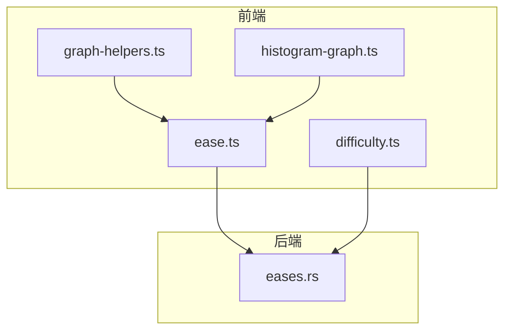
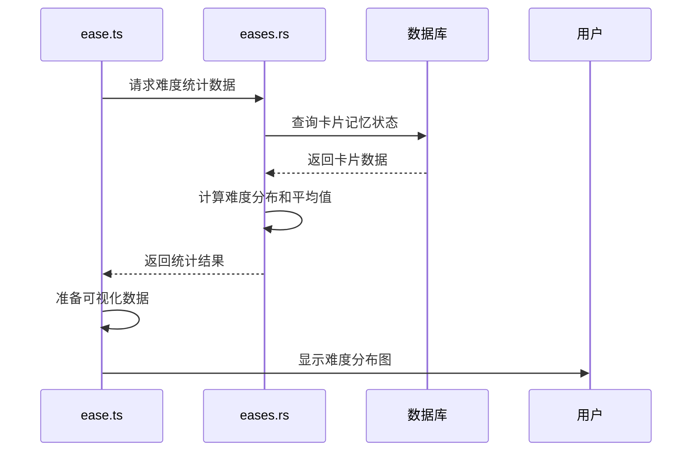
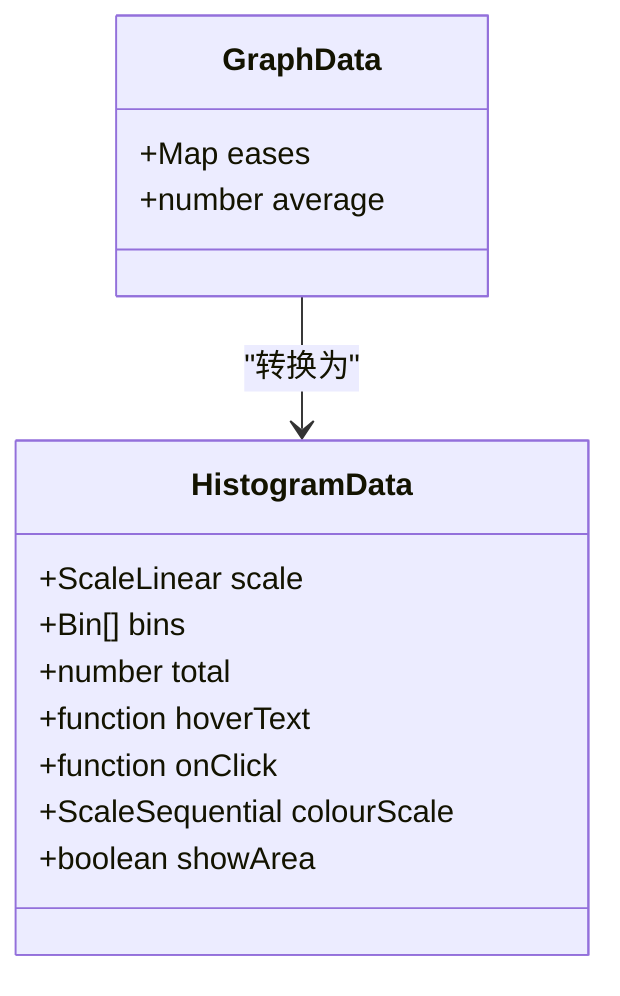
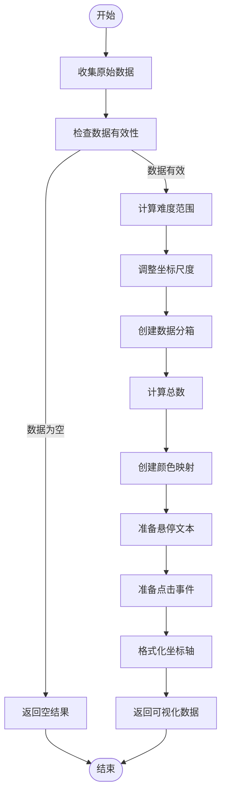
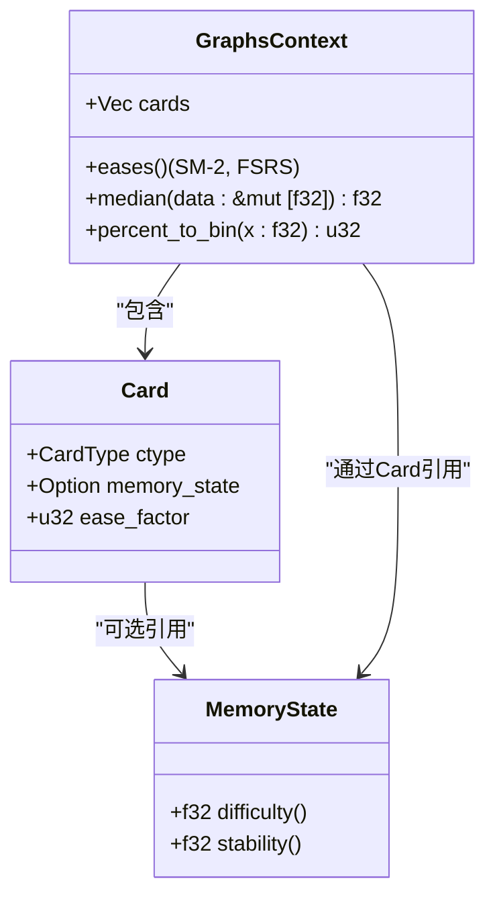
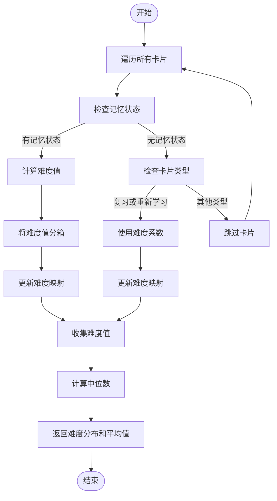
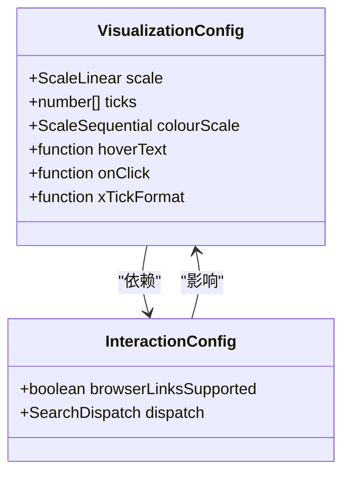
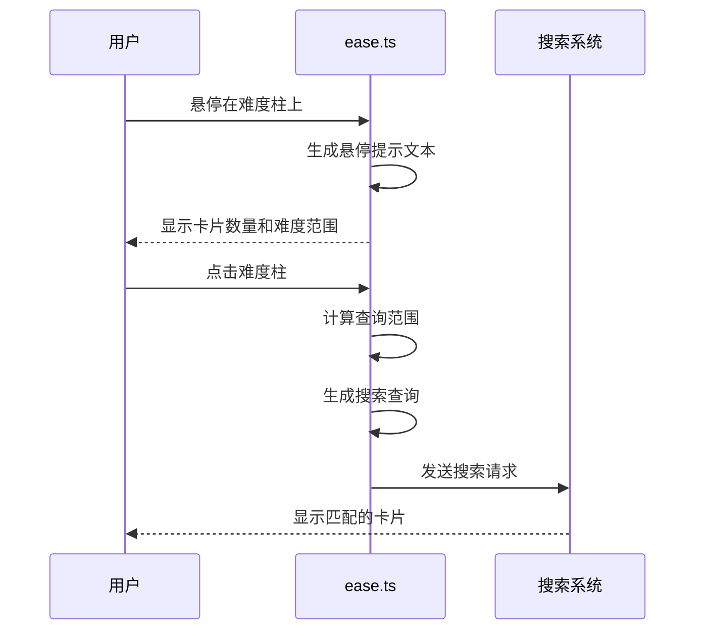
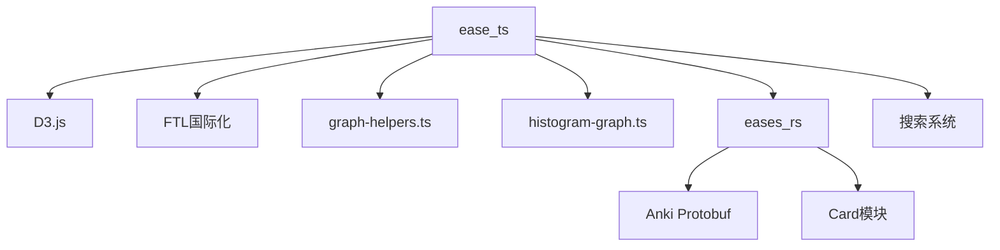

# 难度分布图

<cite>
**本文档引用的文件**  
- [ease.ts](file://ts/routes/graphs/ease.ts)
- [difficulty.ts](file://ts/routes/graphs/difficulty.ts)
- [eases.rs](file://rslib/src/stats/graphs/eases.rs)
- [graph-helpers.ts](file://ts/routes/graphs/graph-helpers.ts)
- [histogram-graph.ts](file://ts/routes/graphs/histogram-graph.ts)
</cite>

## 目录
1. [简介](#简介)
2. [项目结构](#项目结构)
3. [核心组件](#核心组件)
4. [架构概述](#架构概述)
5. [详细组件分析](#详细组件分析)
6. [依赖分析](#依赖分析)
7. [性能考虑](#性能考虑)
8. [故障排除指南](#故障排除指南)
9. [结论](#结论)
10. [附录](#附录)（如有必要）

## 简介
难度分布图是Anki学习系统中用于可视化卡片难度系数统计分析的重要工具。该文档详细分析了`ease.ts`文件中的实现，重点描述了卡片难度系数的统计分析和可视化方法。文档解释了如何计算和分类不同难度级别的卡片分布，提供了配置选项说明，包括难度阈值设置、颜色映射和交互功能，并为开发者提供扩展难度分析维度和自定义视觉效果的指导。

## 项目结构
难度分布图功能主要分布在Anki代码库的多个模块中，涉及前端TypeScript实现和后端Rust逻辑。核心文件位于`ts/routes/graphs/`目录下，其中`ease.ts`文件负责前端可视化逻辑，而`rslib/src/stats/graphs/eases.rs`文件处理后端数据统计。这种前后端分离的架构设计使得难度分析既高效又灵活。

**图表来源**  
- [ease.ts](file://ts/routes/graphs/ease.ts#L1-L128)
- [eases.rs](file://rslib/src/stats/graphs/eases.rs#L1-L76)

**章节来源**  
- [ease.ts](file://ts/routes/graphs/ease.ts#L1-L128)
- [eases.rs](file://rslib/src/stats/graphs/eases.rs#L1-L76)

## 核心组件
难度分布图的核心组件包括数据收集、统计分析和可视化渲染三个主要部分。`ease.ts`文件中的`gatherData`函数负责从后端响应中提取难度数据，`prepareData`函数则处理数据准备和格式化，为前端可视化做准备。这些组件共同工作，实现了对卡片难度系数的全面分析和直观展示。

**章节来源**  
- [ease.ts](file://ts/routes/graphs/ease.ts#L17-L127)
- [eases.rs](file://rslib/src/stats/graphs/eases.rs#L1-L76)

## 架构概述
难度分布图采用分层架构设计，从前端到后端形成了清晰的数据流。前端通过`ease.ts`文件中的函数调用获取数据，后端在`eases.rs`文件中执行复杂的统计计算。这种架构确保了数据处理的高效性和可视化结果的准确性。

**图表来源**  
- [ease.ts](file://ts/routes/graphs/ease.ts#L1-L128)
- [eases.rs](file://rslib/src/stats/graphs/eases.rs#L1-L76)

## 详细组件分析

### 数据收集与处理分析
难度分布图的数据收集和处理过程涉及多个关键函数和数据结构。`GraphData`接口定义了难度数据的基本结构，包含难度映射和平均值两个属性。`gatherData`函数负责从后端响应中提取并转换数据，为后续分析做准备。

#### 数据结构定义

**图表来源**  
- [ease.ts](file://ts/routes/graphs/ease.ts#L17-L24)
- [histogram-graph.ts](file://ts/routes/graphs/histogram-graph.ts#L16-L30)

#### 数据处理流程

**图表来源**  
- [ease.ts](file://ts/routes/graphs/ease.ts#L61-L127)
- [graph-helpers.ts](file://ts/routes/graphs/graph-helpers.ts#L1-L107)

**章节来源**  
- [ease.ts](file://ts/routes/graphs/ease.ts#L61-L127)
- [graph-helpers.ts](file://ts/routes/graphs/graph-helpers.ts#L1-L107)

### 难度计算与分类分析
难度分布图的计算逻辑在后端Rust代码中实现，通过精确的算法对卡片难度进行分类和统计。`eases.rs`文件中的`eases`函数是核心计算逻辑，它遍历所有卡片并根据记忆状态计算难度分布。

#### 难度计算算法

**图表来源**  
- [eases.rs](file://rslib/src/stats/graphs/eases.rs#L1-L76)
- [ease.ts](file://ts/routes/graphs/ease.ts#L1-L128)

#### 难度分类流程

**图表来源**  
- [eases.rs](file://rslib/src/stats/graphs/eases.rs#L1-L76)
- [ease.ts](file://ts/routes/graphs/ease.ts#L1-L128)

**章节来源**  
- [eases.rs](file://rslib/src/stats/graphs/eases.rs#L1-L76)
- [ease.ts](file://ts/routes/graphs/ease.ts#L1-L128)

### 可视化与交互分析
难度分布图的可视化部分通过D3.js库实现，提供了丰富的交互功能。`prepareData`函数不仅准备了可视化所需的数据，还定义了悬停提示和点击事件等交互行为。

#### 可视化配置

**图表来源**  
- [ease.ts](file://ts/routes/graphs/ease.ts#L61-L127)
- [graph-helpers.ts](file://ts/routes/graphs/graph-helpers.ts#L1-L107)

#### 交互流程

**图表来源**  
- [ease.ts](file://ts/routes/graphs/ease.ts#L61-L127)
- [graph-helpers.ts](file://ts/routes/graphs/graph-helpers.ts#L1-L107)

**章节来源**  
- [ease.ts](file://ts/routes/graphs/ease.ts#L61-L127)
- [graph-helpers.ts](file://ts/routes/graphs/graph-helpers.ts#L1-L107)

## 依赖分析
难度分布图功能依赖于多个前后端组件的协同工作。前端依赖D3.js库进行数据可视化，后端依赖Rust实现高效的数据统计。此外，系统还依赖于Anki的国际化框架和搜索系统，以提供多语言支持和交互功能。

**图表来源**  
- [ease.ts](file://ts/routes/graphs/ease.ts#L1-L128)
- [eases.rs](file://rslib/src/stats/graphs/eases.rs#L1-L76)

**章节来源**  
- [ease.ts](file://ts/routes/graphs/ease.ts#L1-L128)
- [eases.rs](file://rslib/src/stats/graphs/eases.rs#L1-L76)

## 性能考虑
难度分布图在设计时充分考虑了性能因素。后端使用Rust语言实现，确保了数据统计的高效性。前端通过合理的数据分箱和坐标尺度调整，优化了可视化渲染性能。此外，系统还实现了数据可用性检查，避免在无数据时进行不必要的渲染操作。

## 故障排除指南
在使用难度分布图时，可能会遇到一些常见问题。如果图表显示为空，可能是由于没有符合条件的卡片数据。如果交互功能失效，需要检查浏览器链接支持设置。对于性能问题，可以考虑减少数据范围或优化查询条件。

**章节来源**  
- [ease.ts](file://ts/routes/graphs/ease.ts#L61-L127)
- [eases.rs](file://rslib/src/stats/graphs/eases.rs#L1-L76)

## 结论
难度分布图为Anki用户提供了一个强大的工具，用于分析和理解卡片难度的分布情况。通过前后端的紧密协作，系统实现了高效的数据统计和直观的可视化展示。文档详细分析了实现细节，为开发者提供了扩展和定制的指导，有助于进一步提升系统的功能和用户体验。

## 附录

### 配置选项说明
| 配置项 | 描述 | 默认值 |
|--------|------|--------|
| 难度阈值 | 定义难度分类的边界值 | 130-300 |
| 颜色映射 | 难度值到颜色的映射函数 | interpolateRdYlGn |
| 数据分箱数 | 直方图的柱子数量 | 20 |
| 交互支持 | 是否启用点击交互 | 由browserLinksSupported决定 |

### 扩展开发指南
开发者可以通过以下方式扩展难度分析功能：
1. 添加新的难度计算维度
2. 自定义颜色映射方案
3. 增加新的交互功能
4. 集成其他统计指标

**章节来源**  
- [ease.ts](file://ts/routes/graphs/ease.ts#L1-L128)
- [eases.rs](file://rslib/src/stats/graphs/eases.rs#L1-L76)