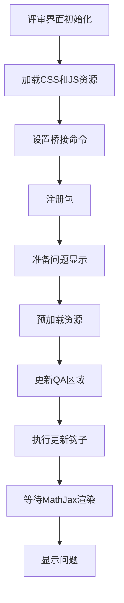
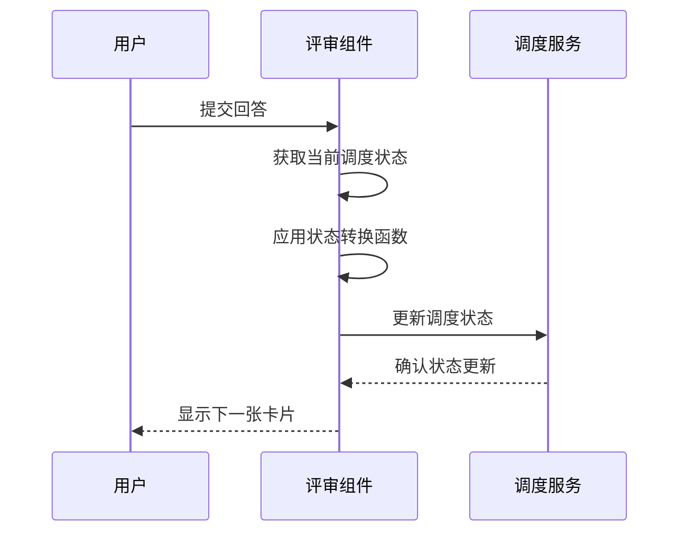
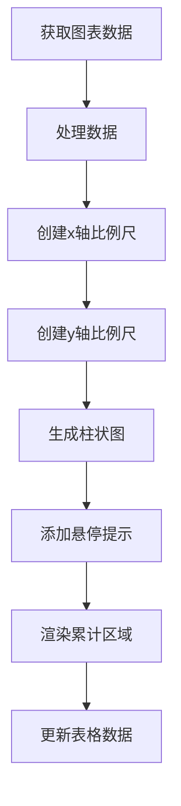
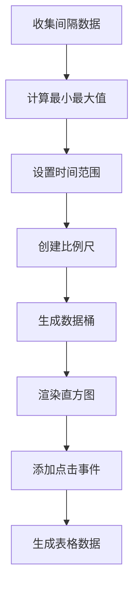
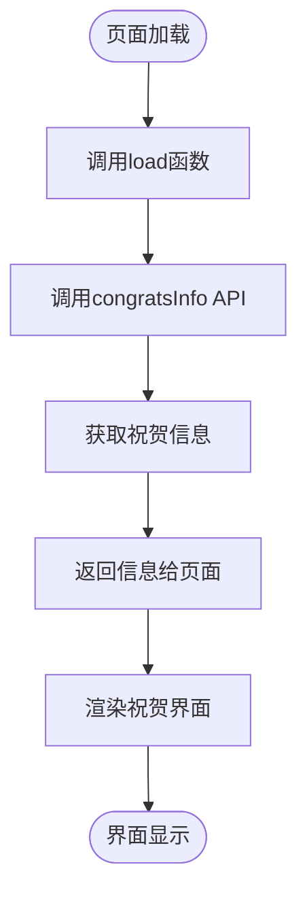
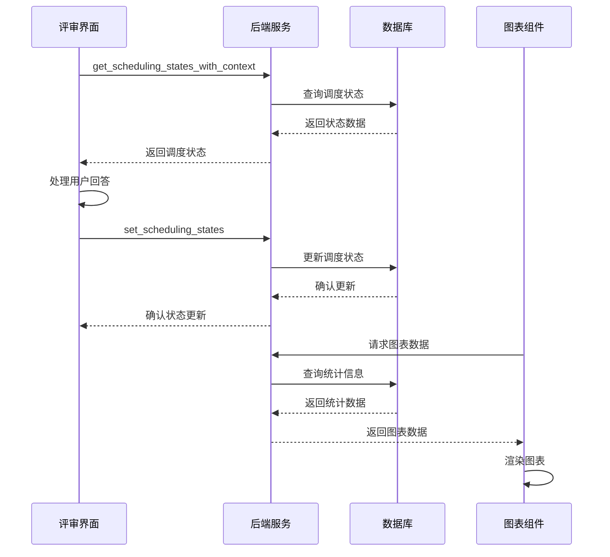
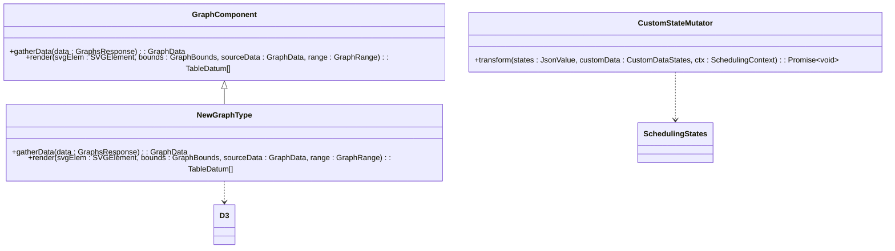
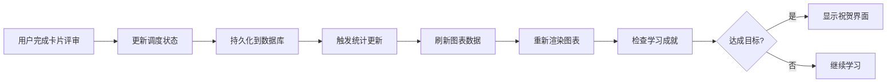

# 评审与图表组件

<cite>
**本文档中引用的文件**  
- [index.ts](file://ts/reviewer/index.ts)
- [answering.ts](file://ts/reviewer/answering.ts)
- [reviews.ts](file://ts/routes/graphs/reviews.ts)
- [intervals.ts](file://ts/routes/graphs/intervals.ts)
- [+page.ts](file://ts/routes/congrats/+page.ts)
- [lib.ts](file://ts/routes/congrats/lib.ts)
</cite>

## 目录
1. [简介](#简介)
2. [评审界面架构](#评审界面架构)
3. [用户回答逻辑](#用户回答逻辑)
4. [统计图表实现](#统计图表实现)
5. [学习成就界面](#学习成就界面)
6. [数据流与状态同步](#数据流与状态同步)
7. [自定义与扩展](#自定义与扩展)
8. [集成示例](#集成示例)

## 简介
Anki的评审与图表组件构成了其核心学习体验。评审界面负责展示卡片并处理用户交互，而图表组件则提供学习进度的可视化分析。学习成就界面在用户完成学习目标时显示祝贺信息。这些组件通过精确的数据流和状态同步机制紧密集成，确保用户操作能实时反映在统计图表中。

## 评审界面架构
评审界面的实现主要位于`ts/reviewer/index.ts`文件中，采用基于jQuery的前端架构。该界面通过`_showQuestion`和`_showAnswer`函数分别管理问题和答案的显示流程。界面初始化时加载必要的CSS和JavaScript资源，并通过`_updateQA`函数更新卡片内容。

**Diagram sources**
- [index.ts](file://ts/reviewer/index.ts#L1-L277)

**Section sources**
- [index.ts](file://ts/reviewer/index.ts#L1-L277)

## 用户回答逻辑
用户回答逻辑主要在`ts/reviewer/answering.ts`文件中实现，通过`mutateNextCardStates`函数处理用户对卡片的评价。该函数接收一个状态转换函数作为参数，允许开发者自定义调度逻辑。系统使用protobuf消息格式来表示调度状态，确保类型安全和序列化效率。

**Diagram sources**
- [answering.ts](file://ts/reviewer/answering.ts#L1-L74)

**Section sources**
- [answering.ts](file://ts/reviewer/answering.ts#L1-L74)

## 统计图表实现
统计图表的实现位于`ts/routes/graphs`目录下，包含多种图表类型，如复习统计和间隔分布图。`reviews.ts`文件实现了复习统计图表，使用D3.js库进行数据可视化。该图表显示不同学习阶段的复习次数和时间分布。

**Diagram sources**
- [reviews.ts](file://ts/routes/graphs/reviews.ts#L1-L418)

`intervals.ts`文件实现了间隔分布图，显示卡片复习间隔的分布情况。该图表支持多种时间范围选择，包括一个月、50%分位数、95%分位数和全部时间。

**Diagram sources**
- [intervals.ts](file://ts/routes/graphs/intervals.ts#L1-L193)

**Section sources**
- [reviews.ts](file://ts/routes/graphs/reviews.ts#L1-L418)
- [intervals.ts](file://ts/routes/graphs/intervals.ts#L1-L193)

## 学习成就界面
学习成就界面在`ts/routes/congrats/+page.ts`中实现，通过`load`函数获取祝贺信息。该界面使用Svelte框架的页面加载机制，在组件初始化时调用后端API获取用户的学习进度数据。

`ts/routes/congrats/lib.ts`文件包含构建祝贺消息的辅助函数，如`buildNextLearnMsg`，用于生成下一张学习卡片的预计时间信息。

**Diagram sources**
- [+page.ts](file://ts/routes/congrats/+page.ts#L1-L11)
- [lib.ts](file://ts/routes/congrats/lib.ts#L1-L27)

**Section sources**
- [+page.ts](file://ts/routes/congrats/+page.ts#L1-L11)
- [lib.ts](file://ts/routes/congrats/lib.ts#L1-L27)

## 数据流与状态同步
评审组件与图表组件之间的数据流通过后端服务进行同步。当用户完成卡片评审时，调度状态的变更会通过`setSchedulingStates`函数持久化到数据库中。图表组件在需要时通过`getSchedulingStatesWithContext`函数获取最新的调度状态。

**Section sources**
- [index.ts](file://ts/reviewer/index.ts#L1-L277)
- [answering.ts](file://ts/reviewer/answering.ts#L1-L74)

## 自定义与扩展
开发者可以通过多种方式自定义评审流程和扩展图表类型。对于评审流程，可以使用`mutateNextCardStates`函数注册自定义的状态转换逻辑。对于图表类型，可以在`ts/routes/graphs`目录下创建新的图表实现文件，并遵循现有的数据处理和渲染模式。

**Section sources**
- [answering.ts](file://ts/reviewer/answering.ts#L1-L74)
- [reviews.ts](file://ts/routes/graphs/reviews.ts#L1-L418)

## 集成示例
将评审逻辑与统计数据显示集成的关键在于确保数据的一致性和实时性。当用户完成卡片评审时，系统会立即更新调度状态，并在下一次图表刷新时反映这些变更。开发者可以通过监听相关事件来实现更复杂的集成，如在特定学习目标达成时显示自定义祝贺信息。

**Section sources**
- [index.ts](file://ts/reviewer/index.ts#L1-L277)
- [answering.ts](file://ts/reviewer/answering.ts#L1-L74)
- [reviews.ts](file://ts/routes/graphs/reviews.ts#L1-L418)