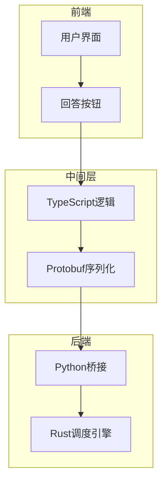
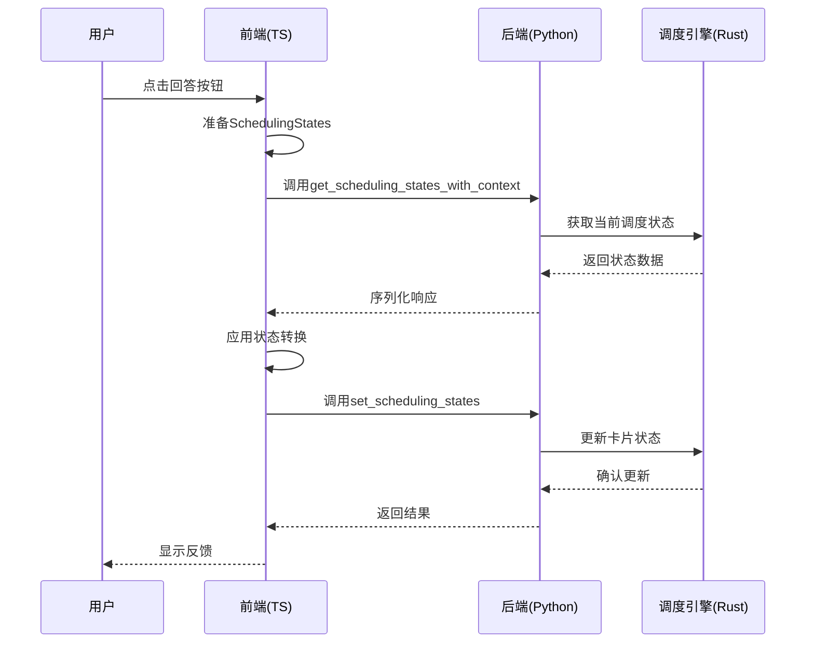
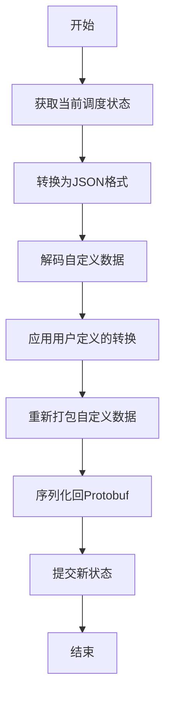
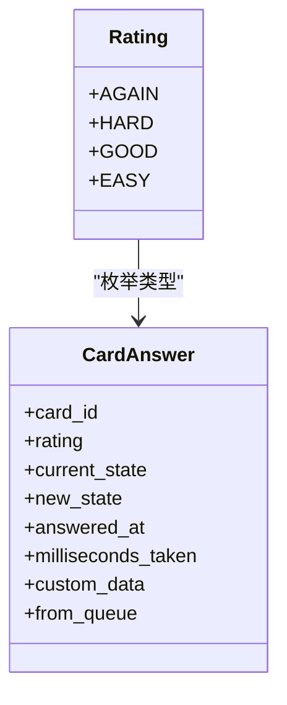
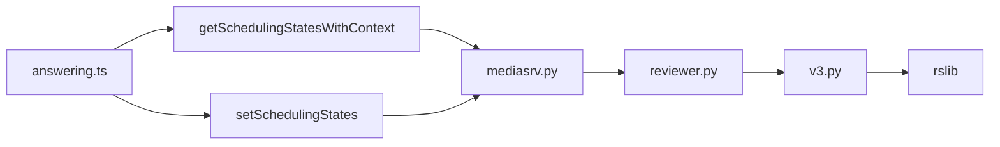

# 回答逻辑处理

<cite>
**本文档中引用的文件**  
- [answering.ts](file://ts/reviewer/answering.ts)
- [answering.rs](file://rslib/src/scheduler/service/answering.rs)
- [reviewer.py](file://qt/aqt/reviewer.py)
- [v3.py](file://pylib/anki/scheduler/v3.py)
- [mediasrv.py](file://qt/aqt/mediasrv.py)
</cite>

## 目录
1. [介绍](#介绍)
2. [项目结构](#项目结构)
3. [核心组件](#核心组件)
4. [架构概述](#架构概述)
5. [详细组件分析](#详细组件分析)
6. [依赖分析](#依赖分析)
7. [性能考虑](#性能考虑)
8. [故障排除指南](#故障排除指南)
9. [结论](#结论)

## 介绍
本文档深入分析Anki中用户回答处理流程的实现机制，重点研究前端与后端调度算法的交互方式。文档详细说明了从用户提交答案到系统更新调度状态的完整处理链路，涵盖答案解析、响应反馈和数据一致性保障等关键环节。通过分析ts/reviewer/answering.ts和rslib/src/scheduler/answering.rs中的核心代码，揭示了不同回答类型（正确、困难、容易等）的处理差异和对应的调度决策逻辑。

## 项目结构
Anki的回答逻辑处理涉及多个层级的组件协同工作，从前端用户界面到后端调度引擎。系统采用分层架构，将用户交互、状态管理和核心算法分离，确保代码的可维护性和扩展性。

**图示来源**  
- [answering.ts](file://ts/reviewer/answering.ts#L1-L73)
- [reviewer.py](file://qt/aqt/reviewer.py#L1-L300)
- [answering.rs](file://rslib/src/scheduler/service/answering.rs#L1-L70)

**本节来源**  
- [ts/reviewer/answering.ts](file://ts/reviewer/answering.ts#L1-L73)
- [rslib/src/scheduler/service/answering.rs](file://rslib/src/scheduler/service/answering.rs#L1-L70)

## 核心组件
回答逻辑处理的核心组件包括前端状态管理、序列化接口和后端调度服务。TypeScript模块负责处理用户输入并准备调度状态，Rust实现的核心算法则根据回答质量计算新的复习间隔。Python层作为桥梁，协调前后端的数据交换。

**本节来源**  
- [answering.ts](file://ts/reviewer/answering.ts#L1-L73)
- [answering.rs](file://rslib/src/scheduler/service/answering.rs#L1-L70)

## 架构概述
Anki的回答处理系统采用客户端-服务器架构，其中前端负责用户交互，后端执行复杂的调度计算。系统通过Protobuf协议在各组件间传递结构化数据，确保类型安全和序列化效率。

**图示来源**  
- [answering.ts](file://ts/reviewer/answering.ts#L44-L72)
- [mediasrv.py](file://qt/aqt/mediasrv.py#L497-L508)
- [reviewer.py](file://qt/aqt/reviewer.py#L279-L283)

## 详细组件分析
### 前端回答处理分析
前端回答逻辑主要在answering.ts中实现，通过mutateNextCardStates函数协调状态变更。该函数采用函数式编程模式，接受一个转换函数作为参数，确保状态变更的可预测性和可测试性。

#### 状态转换机制

**图示来源**  
- [answering.ts](file://ts/reviewer/answering.ts#L44-L72)

#### 回答类型处理
系统定义了四种回答类型：Again（再次）、Hard（困难）、Good（良好）和Easy（简单）。每种类型对应不同的调度策略，影响卡片的复习间隔和难度调整。

**图示来源**  
- [answering.rs](file://rslib/src/scheduler/service/answering.rs#L1-L70)
- [v3.py](file://pylib/anki/scheduler/v3.py#L35-L35)

**本节来源**  
- [answering.ts](file://ts/reviewer/answering.ts#L1-L73)
- [answering.rs](file://rslib/src/scheduler/service/answering.rs#L1-L70)

## 依赖分析
回答处理系统涉及多个组件间的依赖关系，从前端TypeScript代码到后端Rust实现，通过Python桥接层进行协调。

**图示来源**  
- [answering.ts](file://ts/reviewer/answering.ts#L1-L73)
- [mediasrv.py](file://qt/aqt/mediasrv.py#L497-L508)
- [reviewer.py](file://qt/aqt/reviewer.py#L279-L283)

**本节来源**  
- [answering.ts](file://ts/reviewer/answering.ts#L1-L73)
- [mediasrv.py](file://qt/aqt/mediasrv.py#L497-L508)
- [reviewer.py](file://qt/aqt/reviewer.py#L279-L283)

## 性能考虑
回答处理流程经过优化以确保快速响应。系统采用预取机制，在用户回答前就准备好下一张卡片的状态，减少等待时间。序列化操作使用高效的Protobuf格式，最小化数据传输开销。

## 故障排除指南
当回答逻辑出现问题时，应首先检查状态密钥的一致性。reviewer.py中的set_scheduling_states方法会验证密钥，防止未经授权的状态修改。此外，应确保Protobuf消息格式正确，避免序列化错误。

**本节来源**  
- [reviewer.py](file://qt/aqt/reviewer.py#L279-L283)
- [mediasrv.py](file://qt/aqt/mediasrv.py#L504-L508)

## 结论
Anki的回答逻辑处理系统通过清晰的分层架构和标准化的数据交换协议，实现了高效可靠的用户交互处理。前端TypeScript代码与后端Rust调度引擎的协同工作，确保了复杂的复习算法能够快速响应用户操作。系统的模块化设计也为未来扩展提供了良好的基础。