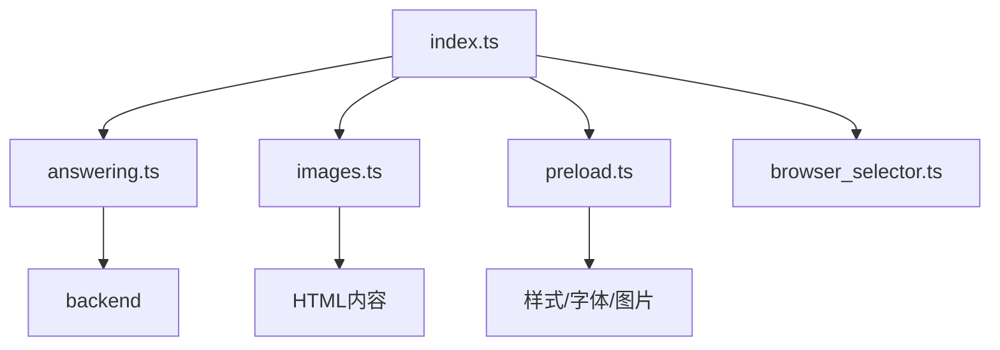
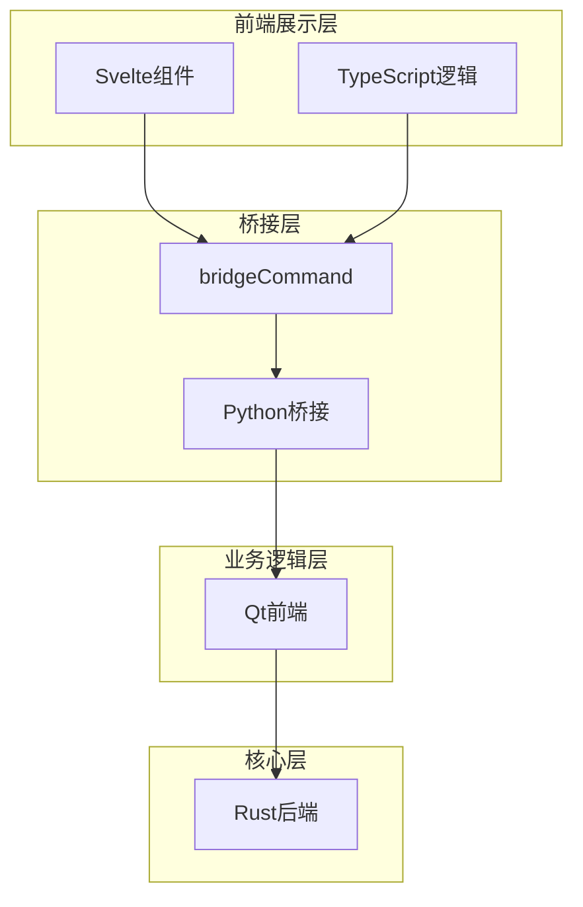
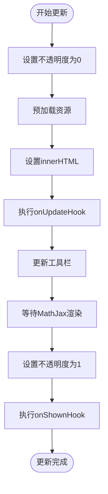
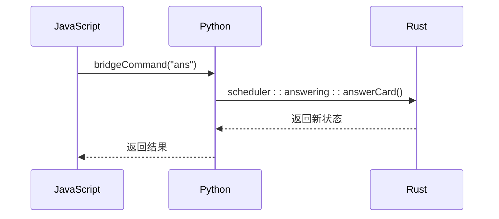
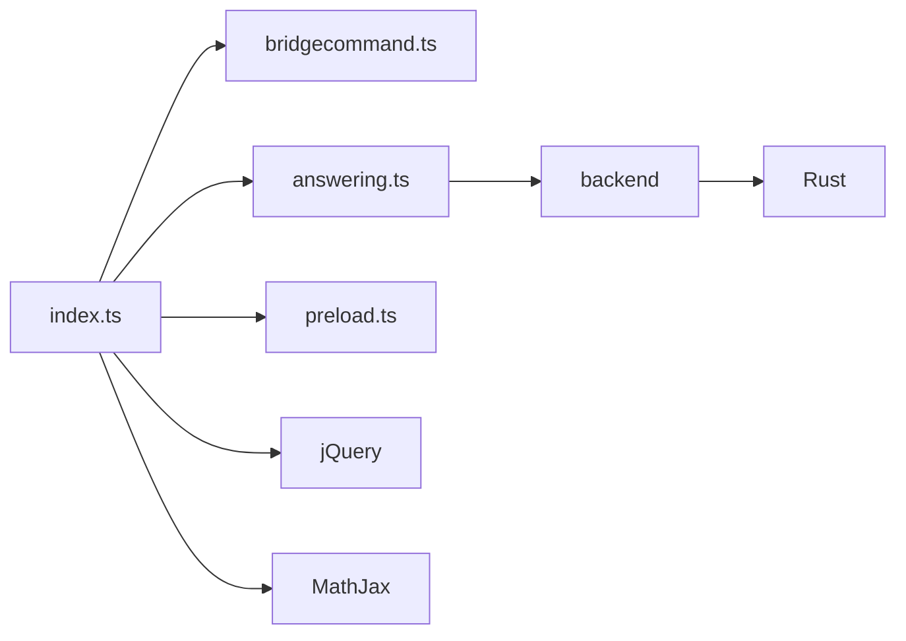

# 评审界面架构

<cite>
**本文档中引用的文件**  
- [index.ts](file://ts/reviewer/index.ts)
- [answering.ts](file://ts/reviewer/answering.ts)
- [review.ts](file://ts/routes/image-occlusion/review.ts)
- [from-cloze.ts](file://ts/routes/image-occlusion/shapes/from-cloze.ts)
- [bridgecommand.ts](file://ts/lib/tslib/bridgecommand.ts)
- [preload.ts](file://ts/reviewer/preload.ts)
</cite>

## 目录
1. [简介](#简介)
2. [项目结构](#项目结构)
3. [核心组件](#核心组件)
4. [架构概述](#架构概述)
5. [详细组件分析](#详细组件分析)
6. [依赖分析](#依赖分析)
7. [性能考虑](#性能考虑)
8. [故障排除指南](#故障排除指南)
9. [结论](#结论)

## 简介
Anki评审界面是学习流程的核心交互界面，负责展示卡片内容、处理用户输入并驱动学习调度。该界面基于Svelte框架构建，通过TypeScript实现动态内容渲染和状态管理，并与Qt前端及Rust后端深度集成。评审界面支持丰富的交互功能，包括数学公式渲染、图像遮挡、输入验证和自定义样式，为用户提供高效、直观的学习体验。

## 项目结构
评审界面的代码主要位于`ts/reviewer/`目录下，采用模块化设计，各文件职责明确。核心逻辑由`index.ts`统一调度，`answering.ts`处理学习状态变更，`images.ts`和`preload.ts`负责资源预加载，`browser_selector.ts`适配不同浏览器环境。

**图源**  
- [index.ts](file://ts/reviewer/index.ts#L1-L276)
- [answering.ts](file://ts/reviewer/answering.ts#L1-L72)

**本节来源**  
- [index.ts](file://ts/reviewer/index.ts#L1-L276)
- [answering.ts](file://ts/reviewer/answering.ts#L1-L72)

## 核心组件
评审界面的核心是Svelte组件与状态管理机制的结合。`_updateQA`函数是内容更新的中枢，它通过队列机制确保DOM更新的有序性，避免竞态条件。全局钩子`onUpdateHook`和`onShownHook`允许在内容更新前后插入自定义逻辑，实现了高度的可扩展性。`bridgeCommand`函数作为与Qt前端通信的桥梁，实现了JavaScript与Python之间的双向调用。

**本节来源**  
- [index.ts](file://ts/reviewer/index.ts#L100-L150)
- [bridgecommand.ts](file://ts/lib/tslib/bridgecommand.ts#L20-L22)

## 架构概述
评审界面采用分层架构，前端展示层（Svelte/TypeScript）通过桥接层（bridgeCommand）与业务逻辑层（Python）通信，后者再调用高性能核心层（Rust）执行数据操作。这种架构分离了关注点，既保证了界面的灵活性，又确保了核心算法的效率。

**图源**  
- [index.ts](file://ts/reviewer/index.ts#L100-L150)
- [bridgecommand.ts](file://ts/lib/tslib/bridgecommand.ts#L20-L22)

## 详细组件分析

### Svelte组件生命周期与状态更新
评审界面的状态更新由`_queueAction`函数管理，它将更新操作加入Promise队列，确保异步操作的顺序执行。`_updateQA`函数是核心更新流程，它首先设置内容不透明度为0以隐藏旧内容，然后安全地设置新的HTML内容（包括处理脚本标签），触发预加载，执行更新钩子，等待MathJax渲染完成，最后将不透明度恢复为1，实现平滑的视觉过渡。

**图源**  
- [index.ts](file://ts/reviewer/index.ts#L100-L150)

**本节来源**  
- [index.ts](file://ts/reviewer/index.ts#L100-L150)

### 事件处理流程
事件处理分为用户交互事件和系统事件。用户事件如`_typeAnsPress`监听回车键提交答案，通过`bridgeCommand("ans")`通知后端。系统事件如`_blockDefaultDragDropBehavior`阻止了Qt默认的拖放行为，避免干扰。`_emulateMobile`函数通过切换CSS类来模拟移动设备视图。此外，还通过监听`focusout`事件并插入一个隐藏按钮来解决Qt6的IME输入法焦点丢失问题。

**本节来源**  
- [index.ts](file://ts/reviewer/index.ts#L200-L250)

### 与Qt前端的集成
评审界面通过`window.bridgeCommand`全局函数与Qt前端集成。Qt的WebEngineView会拦截所有`window.bridgeCommand`的调用，并将其转发给Python层的相应处理函数。例如，当用户点击“显示答案”按钮时，JavaScript调用`bridgeCommand("ans")`，Qt捕获此调用并执行Python中的`Reviewer.onEnter()`方法，从而驱动学习流程。

**本节来源**  
- [index.ts](file://ts/reviewer/index.ts#L200-L250)
- [bridgecommand.ts](file://ts/lib/tslib/bridgecommand.ts#L20-L22)

### 调用Rust核心功能
从评审界面到Rust核心的调用链为：JavaScript -> Python -> Rust。`bridgeCommand`在Python层被处理，Python代码通过`pylib/rsbridge`调用Rust编译的库（`.so`或`.dll`）。例如，`getSchedulingStatesWithContext`和`setSchedulingStates`这两个函数是Protobuf生成的绑定，它们最终会调用`rslib`中`scheduler`模块的Rust函数来获取和更新卡片的学习状态。

**图源**  
- [answering.ts](file://ts/reviewer/answering.ts#L44-L51)
- [bridgecommand.ts](file://ts/lib/tslib/bridgecommand.ts#L20-L22)

### 界面布局与CSS样式
评审界面的布局由`body`元素的`className`控制，`_showQuestion`和`_showAnswer`函数会根据上下文设置不同的CSS类。样式主要通过Sass（`.scss`文件）定义，位于`ts/reviewer/reviewer.scss`和`ts/lib/sass/`目录下。主题支持通过CSS变量（如`--flag-1`, `--active-shape-color`）实现，允许用户通过修改变量值来自定义颜色和外观。

**本节来源**  
- [index.ts](file://ts/reviewer/index.ts#L160-L190)
- [review.ts](file://ts/routes/image-occlusion/review.ts#L398-L482)

### 响应式设计实现
响应式设计通过`addBrowserClasses`函数实现。该函数解析`navigator.userAgent`，并根据设备类型（iOS, Android, iPad, iPhone）和操作系统（Win, Mac, Linux）向`<html>`元素添加相应的CSS类（如`mobile`, `ios`, `win`）。开发者可以利用这些类编写针对性的CSS规则，例如为移动设备隐藏某些按钮或调整字体大小。

**本节来源**  
- [browser_selector.ts](file://ts/reviewer/browser_selector.ts#L3-L43)

### 订阅后端状态变化
评审界面通过“钩子”（Hook）机制响应后端状态变化。`onUpdateHook`和`onShownHook`数组允许其他模块注册回调函数。当`_updateQA`执行时，它会依次调用这些钩子。例如，图像遮挡功能在`review.ts`中向`onUpdateHook`注册了一个函数，确保每次卡片更新时都能重新绘制遮罩。

**本节来源**  
- [index.ts](file://ts/reviewer/index.ts#L20-L30)
- [review.ts](file://ts/routes/image-occlusion/review.ts#L44-L50)

### 自定义外观与行为
开发者可以通过多种方式自定义评审界面。一是通过CSS变量修改主题颜色；二是通过向`onUpdateHook`和`onShownHook`添加函数来扩展功能；三是通过`mutateNextCardStates` API修改学习算法的决策逻辑。例如，可以编写一个插件，在`onShownHook`中分析卡片内容并高亮关键词。

**本节来源**  
- [index.ts](file://ts/reviewer/index.ts#L20-L30)
- [answering.ts](file://ts/reviewer/answering.ts#L44-L51)

### 性能优化与内存管理
性能优化策略包括：1) 资源预加载（`preloadResources`），在显示问题前预加载答案所需的图片、字体和样式，减少等待时间；2) MathJax渲染优化，使用`MathJax.typesetClear()`清除缓存并仅对`#qa`元素进行渲染；3) DOM更新队列化，防止并发更新导致的界面闪烁。内存管理方面，通过`replaceScript`函数正确替换`<script>`标签，避免内存泄漏，并在视频元素更新时调用`pause()`和`load()`以释放资源。

**本节来源**  
- [index.ts](file://ts/reviewer/index.ts#L60-L90)
- [preload.ts](file://ts/reviewer/preload.ts#L93-L115)

## 依赖分析
评审界面依赖于多个内部和外部模块。内部依赖包括`@tslib/bridgecommand`用于通信，`@generated/backend`用于调用Rust后端，`@generated/anki/frontend_pb`用于类型定义。外部依赖主要是jQuery和MathJax。构建系统通过`registerPackage`将评审模块注册为可动态加载的包。

**图源**  
- [index.ts](file://ts/reviewer/index.ts#L1-L276)
- [answering.ts](file://ts/reviewer/answering.ts#L1-L72)

**本节来源**  
- [index.ts](file://ts/reviewer/index.ts#L1-L276)
- [answering.ts](file://ts/reviewer/answering.ts#L1-L72)

## 性能考虑
如上文所述，评审界面通过预加载、队列化更新和选择性渲染等策略优化性能。关键的`_updateQA`函数通过将不透明度设为0来隐藏DOM操作，实现了视觉上的无缝切换。对于包含大量资源的卡片，预加载机制能显著提升用户体验。

## 故障排除指南
常见问题包括MathJax渲染失败和图像遮挡不显示。对于MathJax问题，检查`MathJax.startup.promise`是否被正确处理，`_updateQA`函数已包含错误处理。对于图像遮挡，确保`#image-occlusion-container`中的图片已加载，`waitForImage`函数会处理此情况。若出现脚本不执行，检查`replaceScript`函数是否成功替换了`<script>`标签。

**本节来源**  
- [index.ts](file://ts/reviewer/index.ts#L100-L150)
- [review.ts](file://ts/routes/image-occlusion/review.ts#L54-L76)

## 结论
Anki评审界面架构设计精良，通过清晰的分层、模块化的代码和强大的扩展机制，实现了功能丰富且性能优良的学习体验。其核心在于Svelte组件、状态队列、桥接通信和预加载策略的有机结合。开发者可以利用提供的钩子和API，安全地扩展和定制界面，而无需修改核心代码。