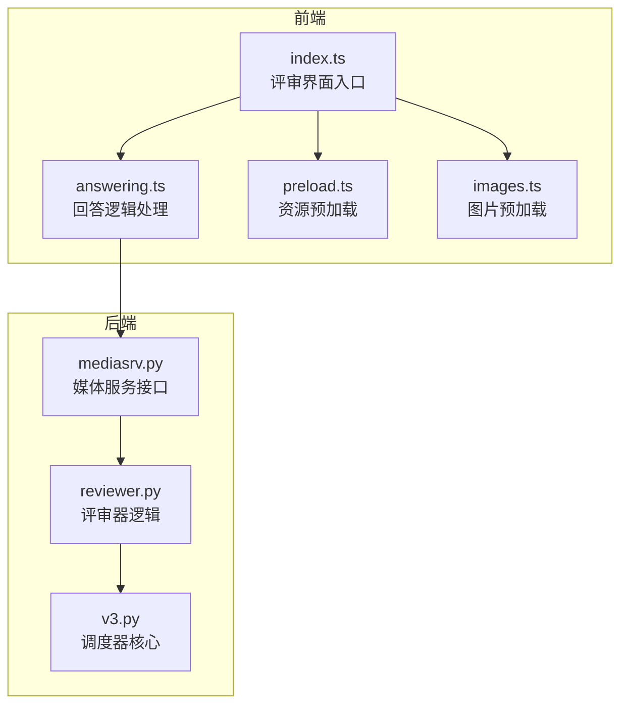
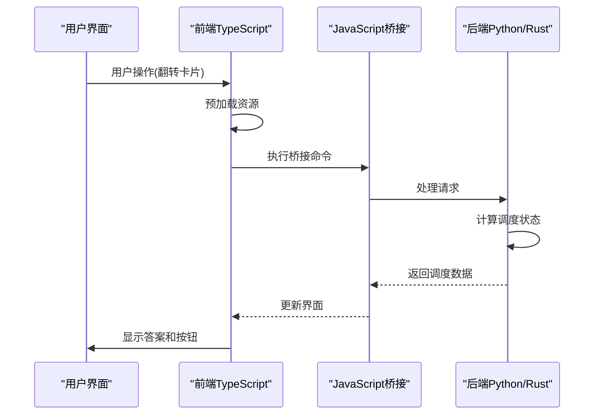
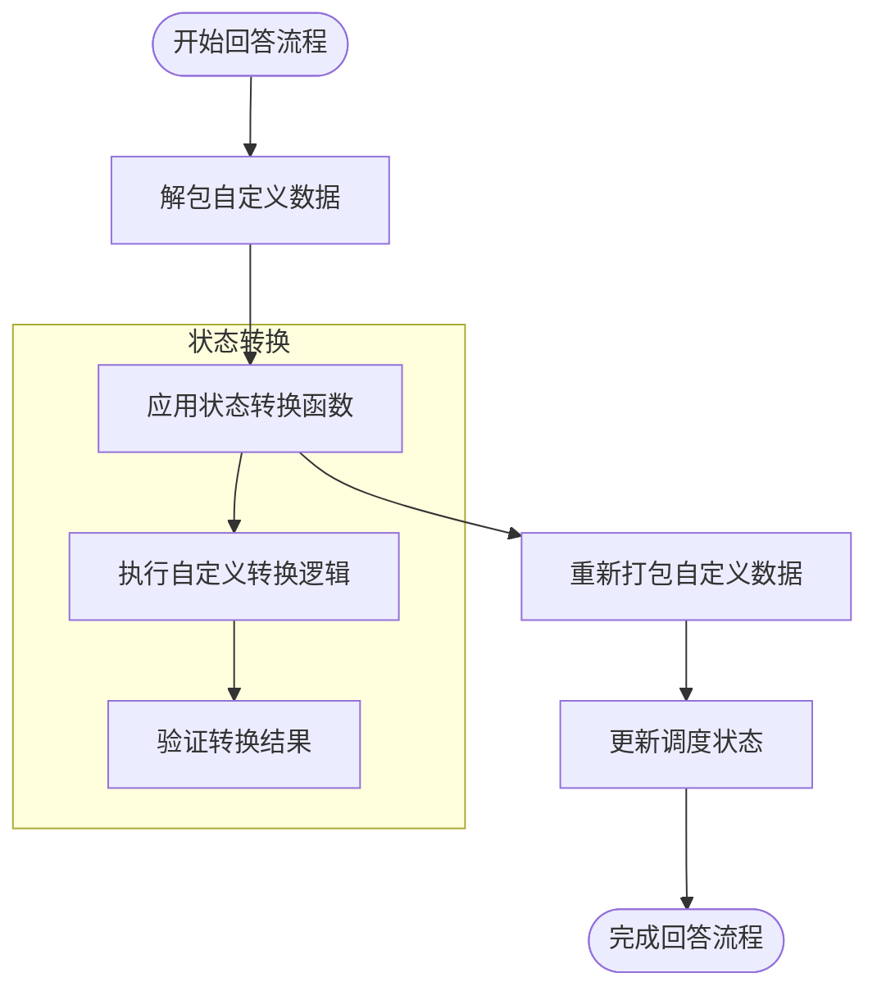
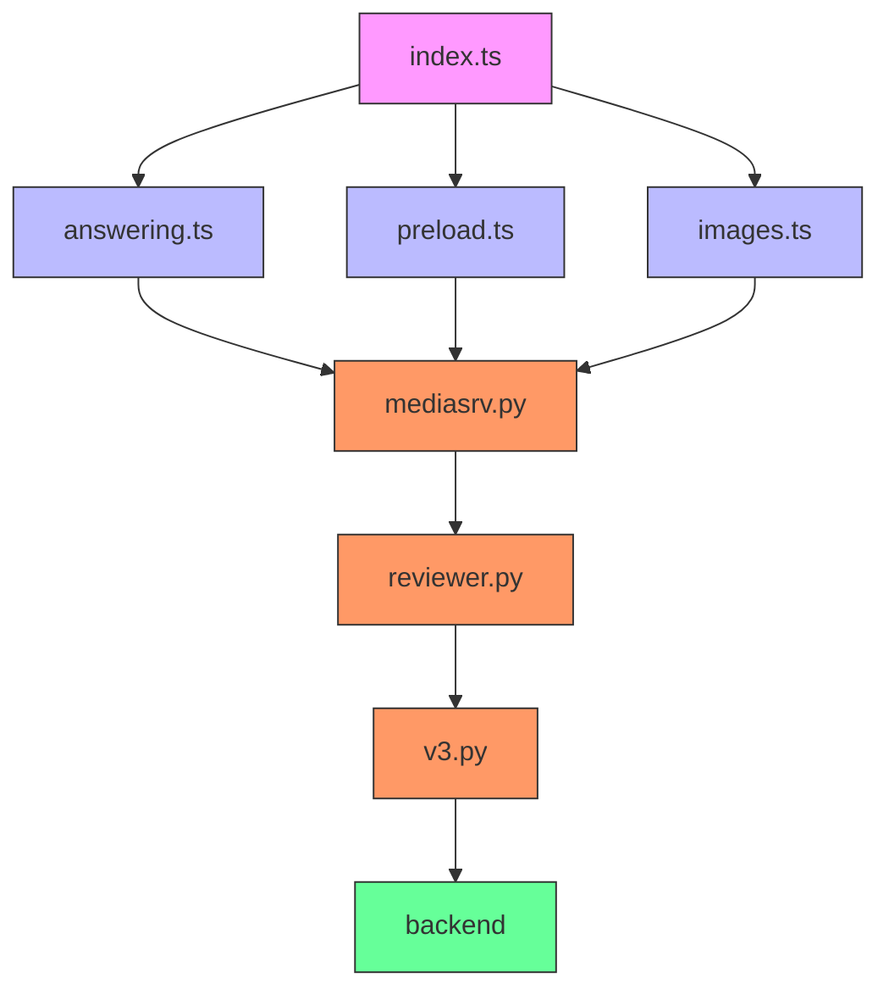

# 评审系统

<cite>
**本文档中引用的文件**  
- [index.ts](file://ts/reviewer/index.ts)
- [answering.ts](file://ts/reviewer/answering.ts)
- [preload.ts](file://ts/reviewer/preload.ts)
- [mediasrv.py](file://qt/aqt/mediasrv.py)
- [reviewer.py](file://qt/aqt/reviewer.py)
- [v3.py](file://pylib/anki/scheduler/v3.py)
</cite>

## 目录
1. [介绍](#介绍)
2. [项目结构](#项目结构)
3. [核心组件](#核心组件)
4. [架构概述](#架构概述)
5. [详细组件分析](#详细组件分析)
6. [依赖分析](#依赖分析)
7. [性能考虑](#性能考虑)
8. [故障排除指南](#故障排除指南)
9. [结论](#结论)

## 介绍
Anki评审系统是Anki学习软件的核心功能模块，负责管理用户与学习卡片的交互流程。该系统实现了完整的评审界面展示、用户回答处理、状态管理和性能优化机制。本文档深入分析评审系统的实现细节，重点关注前端TypeScript代码与后端Python/Rust代码的协同工作模式，为开发者提供定制和扩展评审功能的指导。

## 项目结构
Anki评审系统分布在多个代码库中，主要包括前端TypeScript组件和后端Python/Rust服务。前端代码位于`ts/reviewer/`目录下，包含评审界面的主要逻辑；后端代码分布在`qt/aqt/reviewer.py`和`pylib/anki/scheduler/v3.py`中，处理核心调度逻辑。



**图示来源**
- [index.ts](file://ts/reviewer/index.ts#L1-L277)
- [answering.ts](file://ts/reviewer/answering.ts#L1-L74)
- [preload.ts](file://ts/reviewer/preload.ts#L1-L117)
- [mediasrv.py](file://qt/aqt/mediasrv.py#L497-L696)
- [reviewer.py](file://qt/aqt/reviewer.py#L279-L478)
- [v3.py](file://pylib/anki/scheduler/v3.py#L34-L233)

**章节来源**
- [index.ts](file://ts/reviewer/index.ts#L1-L277)
- [answering.ts](file://ts/reviewer/answering.ts#L1-L74)
- [preload.ts](file://ts/reviewer/preload.ts#L1-L117)

## 核心组件
评审系统的核心组件包括评审界面控制器、回答逻辑处理器和资源预加载器。这些组件协同工作，确保评审流程的流畅性和响应性。系统采用前后端分离架构，前端负责用户界面展示和交互，后端处理核心调度算法和数据持久化。

**章节来源**
- [index.ts](file://ts/reviewer/index.ts#L1-L277)
- [answering.ts](file://ts/reviewer/answering.ts#L1-L74)
- [preload.ts](file://ts/reviewer/preload.ts#L1-L117)

## 架构概述
Anki评审系统采用分层架构设计，从前端到后端形成清晰的数据流和控制流。系统通过Webview组件展示评审界面，利用JavaScript桥接与原生代码通信，实现跨平台功能。



**图示来源**
- [index.ts](file://ts/reviewer/index.ts#L1-L277)
- [answering.ts](file://ts/reviewer/answering.ts#L1-L74)
- [mediasrv.py](file://qt/aqt/mediasrv.py#L497-L696)
- [reviewer.py](file://qt/aqt/reviewer.py#L279-L478)

## 详细组件分析

### 评审界面架构分析
评审界面由`index.ts`文件中的核心函数管理，采用事件驱动架构处理用户交互。系统通过`_showQuestion`和`_showAnswer`函数控制界面状态转换，确保平滑的用户体验。

```mermaid
classDiagram
class ReviewerInterface {
+onUpdateHook : Array<Callback>
+onShownHook : Array<Callback>
+_updateQA(html, onupdate, onshown)
+_showQuestion(q, a, bodyclass)
+_showAnswer(a, bodyclass)
+_drawFlag(flag)
+_drawMark(mark)
+_typeAnsPress()
}
class ResourcePreloader {
+preloadResources(html)
+preloadStyleSheets(fragment)
+preloadFonts(fragment)
+loadResource(element)
}
class AnswerProcessor {
+mutateNextCardStates(key, transform)
+applyStateTransform(states, transform)
+unpackCustomData(states)
+packCustomData(states, customData)
}
ReviewerInterface --> ResourcePreloader : "使用"
ReviewerInterface --> AnswerProcessor : "使用"
AnswerProcessor --> "mediasrv.py" : "调用"
```

**图示来源**
- [index.ts](file://ts/reviewer/index.ts#L1-L277)
- [preload.ts](file://ts/reviewer/preload.ts#L1-L117)
- [answering.ts](file://ts/reviewer/answering.ts#L1-L74)

**章节来源**
- [index.ts](file://ts/reviewer/index.ts#L1-L277)
- [preload.ts](file://ts/reviewer/preload.ts#L1-L117)

### 用户回答逻辑分析
用户回答逻辑由`answering.ts`文件实现，采用函数式编程模式处理调度状态转换。系统通过`mutateNextCardStates`函数提供扩展点，允许插件修改默认的调度行为。



**图示来源**
- [answering.ts](file://ts/reviewer/answering.ts#L1-L74)
- [mediasrv.py](file://qt/aqt/mediasrv.py#L504-L508)
- [reviewer.py](file://qt/aqt/reviewer.py#L279-L283)

**章节来源**
- [answering.ts](file://ts/reviewer/answering.ts#L1-L74)
- [mediasrv.py](file://qt/aqt/mediasrv.py#L504-L508)
- [reviewer.py](file://qt/aqt/reviewer.py#L279-L283)

### 预加载机制分析
预加载机制由`preload.ts`文件实现，采用并行加载策略优化评审性能。系统通过分析HTML内容，提前加载样式表、字体和图片资源，减少用户等待时间。

```mermaid
flowchart TD
A[接收HTML内容] --> B[解析文档片段]
B --> C{包含外部资源?}
C --> |是| D[预加载样式表]
C --> |是| E[预加载字体]
C --> |是| F[预加载图片]
D --> G[设置媒体类型为print]
E --> H[提取@font-face规则]
F --> I[创建预加载链接]
G --> J[并行加载资源]
H --> J
I --> J
J --> K[设置超时机制]
K --> L[完成预加载]
```

**图示来源**
- [preload.ts](file://ts/reviewer/preload.ts#L1-L117)
- [index.ts](file://ts/reviewer/index.ts#L1-L277)

**章节来源**
- [preload.ts](file://ts/reviewer/preload.ts#L1-L117)

## 依赖分析
评审系统涉及多个组件间的复杂依赖关系，从前端到后端形成完整的调用链。系统通过明确定义的接口确保各组件的松耦合。



**图示来源**
- [index.ts](file://ts/reviewer/index.ts#L1-L277)
- [answering.ts](file://ts/reviewer/answering.ts#L1-L74)
- [preload.ts](file://ts/reviewer/preload.ts#L1-L117)
- [mediasrv.py](file://qt/aqt/mediasrv.py#L497-L696)
- [reviewer.py](file://qt/aqt/reviewer.py#L279-L478)
- [v3.py](file://pylib/anki/scheduler/v3.py#L34-L233)

**章节来源**
- [index.ts](file://ts/reviewer/index.ts#L1-L277)
- [answering.ts](file://ts/reviewer/answering.ts#L1-L74)
- [preload.ts](file://ts/reviewer/preload.ts#L1-L117)
- [mediasrv.py](file://qt/aqt/mediasrv.py#L497-L696)

## 性能考虑
评审系统的性能优化主要体现在资源预加载、异步处理和内存管理三个方面。系统通过`preloadResources`函数实现智能预加载，根据资源类型设置不同的超时策略，平衡加载速度和用户体验。

前端采用`_queueAction`机制确保界面更新的顺序性和一致性，避免并发操作导致的状态混乱。后端通过Rust实现的核心调度算法保证了大规模数据处理的高效性。

**章节来源**
- [preload.ts](file://ts/reviewer/preload.ts#L1-L117)
- [index.ts](file://ts/reviewer/index.ts#L1-L277)

## 故障排除指南
评审系统中的常见问题主要涉及资源加载失败、状态同步异常和界面渲染错误。系统提供了完善的错误处理机制，包括：

1. 资源加载错误通过`loadResource`函数的事件监听器捕获
2. HTML渲染错误通过`renderError`函数处理
3. MathJax渲染异常通过Promise的catch方法捕获

开发者可以通过检查JavaScript控制台日志和后端日志来诊断问题。对于状态同步问题，应确保`_state_mutation_key`的一致性。

**章节来源**
- [index.ts](file://ts/reviewer/index.ts#L1-L277)
- [preload.ts](file://ts/reviewer/preload.ts#L1-L117)
- [mediasrv.py](file://qt/aqt/mediasrv.py#L504-L508)

## 结论
Anki评审系统通过精心设计的前后端架构，实现了高效、可扩展的学习卡片评审功能。系统采用现代化的TypeScript前端和高性能的Rust后端，结合智能预加载和异步处理机制，为用户提供流畅的学习体验。开发者可以通过提供的扩展点定制评审流程，满足个性化学习需求。