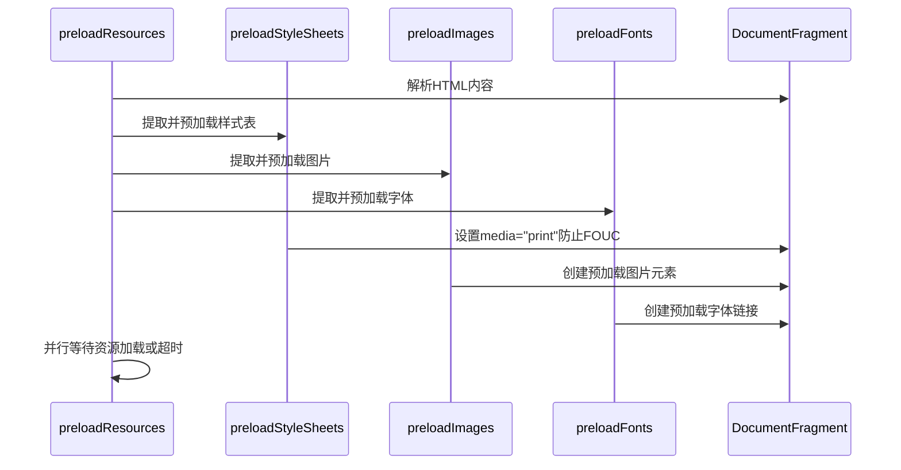
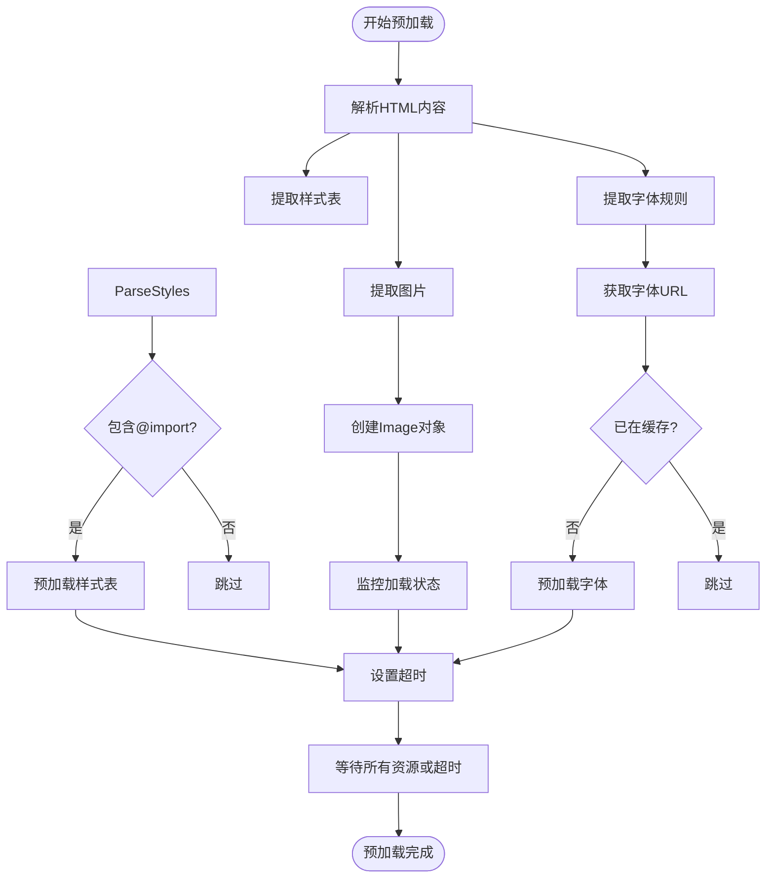
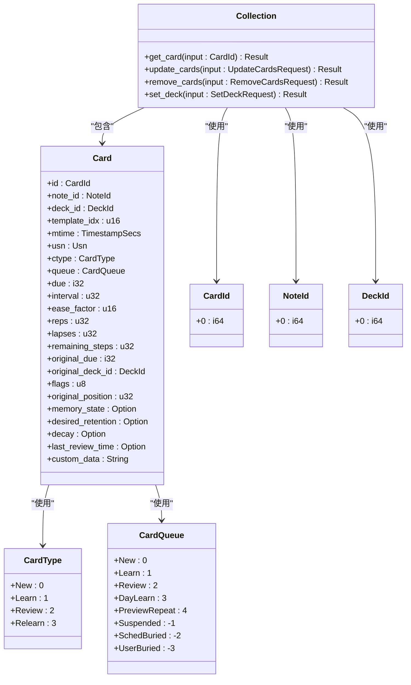
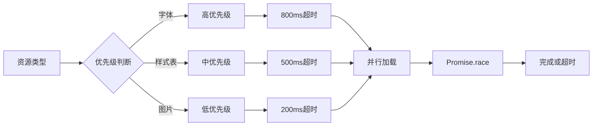
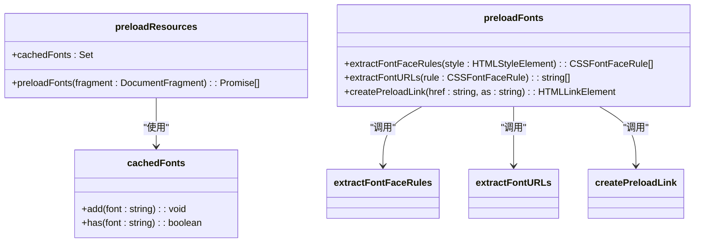
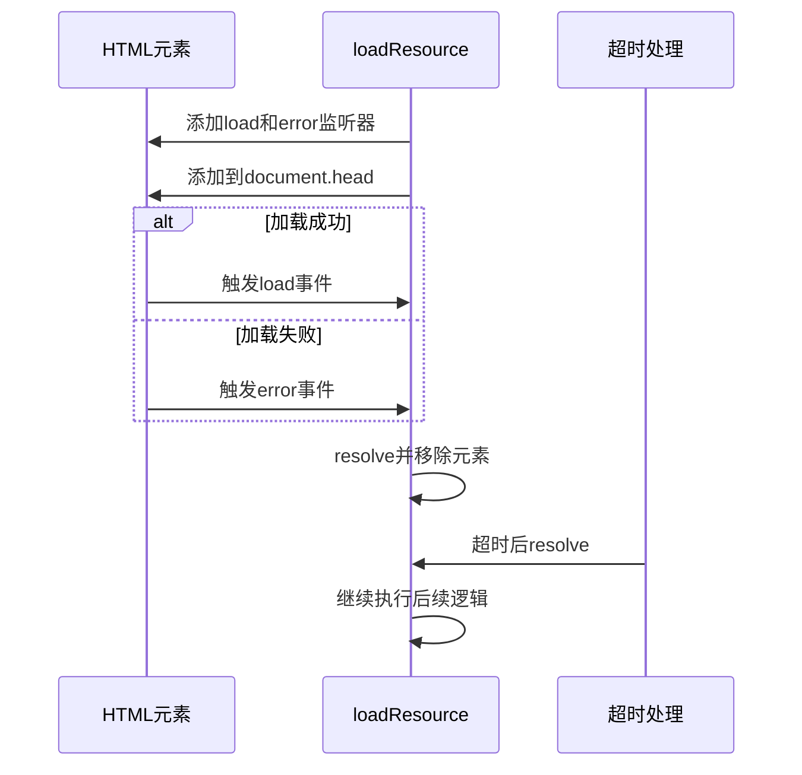

# 预加载与性能优化

<cite>
**本文档中引用的文件**  
- [preload.ts](file://ts/reviewer/preload.ts)
- [service.rs](file://rslib/src/card/service.rs)
- [images.ts](file://ts/reviewer/images.ts)
- [cards.py](file://pylib/anki/cards.py)
- [collection.py](file://pylib/anki/collection.py)
</cite>

## 目录
1. [简介](#简介)
2. [预加载机制分析](#预加载机制分析)
3. [Rust核心协同工作](#rust核心协同工作)
4. [预加载队列与内存缓存](#预加载队列与内存缓存)
5. [错误处理与网络恢复](#错误处理与网络恢复)
6. [配置与优化](#配置与优化)
7. [性能监控与调优](#性能监控与调优)
8. [结论](#结论)

## 简介
Anki评审系统通过预加载机制显著提升了用户体验，特别是在卡片浏览和复习过程中。本文档深入分析了`ts/reviewer/preload.ts`中实现的资源预加载策略，以及其与Rust核心`rslib/src/card/service.rs`的协同工作机制。文档详细阐述了预加载队列管理、优先级调度和内存缓存机制，并提供了开发者配置和优化预加载行为的方法。

## 预加载机制分析

Anki的预加载机制主要在`ts/reviewer/preload.ts`文件中实现，负责预取卡片数据、媒体文件和样式表等资源。该机制通过`preloadResources`函数协调各种资源的预加载过程。

**Diagram sources**
- [preload.ts](file://ts/reviewer/preload.ts#L93-L115)
- [images.ts](file://ts/reviewer/images.ts#L42-L44)

**本节来源**
- [preload.ts](file://ts/reviewer/preload.ts#L1-L116)
- [images.ts](file://ts/reviewer/images.ts#L0-L45)

### 资源预加载策略

预加载机制采用多种策略来优化资源加载：

1. **样式表预加载**：通过`preloadStyleSheets`函数提取外部样式表和包含`@import`的`<style>`元素，将其`media`属性设置为`print`以防止FOUC（Flash of Unstyled Content），然后异步加载。

2. **图片预加载**：利用`preloadImages`函数提取所有``标签的`src`属性，创建新的`Image`对象并监听其加载状态，确保图片在显示前已加载完成。

3. **字体预加载**：通过`preloadFonts`函数解析`@font-face`规则，提取字体URL并进行预加载，避免字体闪烁问题。

**Diagram sources**
- [preload.ts](file://ts/reviewer/preload.ts#L54-L68)
- [preload.ts](file://ts/reviewer/preload.ts#L35-L41)

## Rust核心协同工作

Anki的预加载机制与Rust核心的`rslib/src/card/service.rs`文件紧密协作，通过高效的后端服务优化数据检索性能。

**Diagram sources**
- [service.rs](file://rslib/src/card/service.rs#L0-L172)

**本节来源**
- [service.rs](file://rslib/src/card/service.rs#L0-L172)
- [collection.py](file://pylib/anki/collection.py#L133-L1297)

### 数据检索性能优化

Rust核心通过以下方式优化数据检索性能：

1. **高效的存储访问**：`Collection`类的`get_card`方法直接调用存储层的`get_card`函数，通过`and_then`和`or_not_found`方法链式处理可能的空值情况，确保数据检索的高效性。

2. **批量操作支持**：`update_cards`方法支持批量更新卡片，将多个卡片更新请求合并为一个操作，减少数据库交互次数，提高性能。

3. **事务处理**：`remove_cards`方法在事务中执行删除操作，确保数据一致性，同时通过`transact`方法管理操作的原子性。

## 预加载队列与内存缓存

预加载系统实现了智能的队列管理和内存缓存机制，以优化资源加载顺序和减少重复加载。

### 队列管理

预加载队列根据资源类型和重要性进行优先级调度：

**Diagram sources**
- [preload.ts](file://ts/reviewer/preload.ts#L93-L115)

### 内存缓存机制

系统实现了字体资源的内存缓存，避免重复加载相同的字体文件：

**Diagram sources**
- [preload.ts](file://ts/reviewer/preload.ts#L68-L88)

**本节来源**
- [preload.ts](file://ts/reviewer/preload.ts#L12-L88)

## 错误处理与网络恢复

预加载系统实现了健壮的错误处理和网络异常恢复机制，确保在各种异常情况下仍能提供良好的用户体验。

### 错误处理策略

系统通过以下方式处理预加载过程中的错误：

1. **资源加载错误监听**：`loadResource`函数为每个预加载元素添加`load`和`error`事件监听器，无论加载成功或失败都会解析Promise，确保预加载流程不会因单个资源失败而中断。

2. **超时机制**：系统根据预加载的资源类型设置不同的超时时间（字体800ms、样式表500ms、图片200ms），使用`Promise.race`在资源加载完成或超时后继续执行，避免长时间等待。

**Diagram sources**
- [preload.ts](file://ts/reviewer/preload.ts#L12-L22)

**本节来源**
- [preload.ts](file://ts/reviewer/preload.ts#L12-L33)

## 配置与优化

开发者可以通过多种方式配置和优化预加载行为，以适应不同的使用场景和性能需求。

### 预加载数量调整

虽然当前实现没有直接的配置选项来调整预加载数量，但开发者可以通过修改相关参数来优化预加载行为：

1. **超时时间调整**：可以根据网络状况和设备性能调整不同资源类型的超时时间，平衡加载速度和用户体验。

2. **预加载范围控制**：通过修改预加载的HTML片段范围，控制预加载的资源数量和类型。

### 优先级调度优化

开发者可以优化预加载的优先级调度策略：

1. **动态优先级**：根据用户行为和上下文动态调整资源预加载的优先级。

2. **条件预加载**：根据设备类型、网络状况等条件决定是否预加载某些资源。

## 性能监控与调优

### 性能监控指标

建议监控以下性能指标以评估预加载效果：

1. **资源加载时间**：监控各类资源（图片、字体、样式表）的平均加载时间。
2. **预加载成功率**：统计预加载过程中成功加载的资源比例。
3. **内存使用情况**：监控预加载过程中内存使用峰值，避免内存泄漏。
4. **CPU占用率**：监控预加载对CPU资源的占用情况。

### 调优建议

1. **合理设置超时时间**：根据目标用户的网络状况设置合理的超时时间，避免过长等待或过早放弃。
2. **分批预加载**：对于大量资源，考虑分批预加载，避免一次性占用过多系统资源。
3. **缓存策略优化**：完善内存缓存机制，避免重复加载相同资源。
4. **错误恢复机制**：增强错误处理能力，确保在资源加载失败时能优雅降级。

### 不同设备上的性能表现

预加载机制在不同设备上可能表现出不同的性能特征