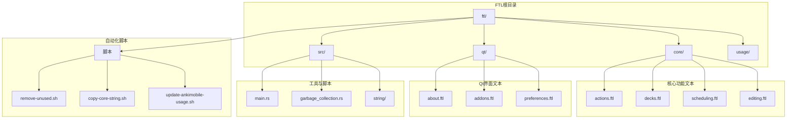
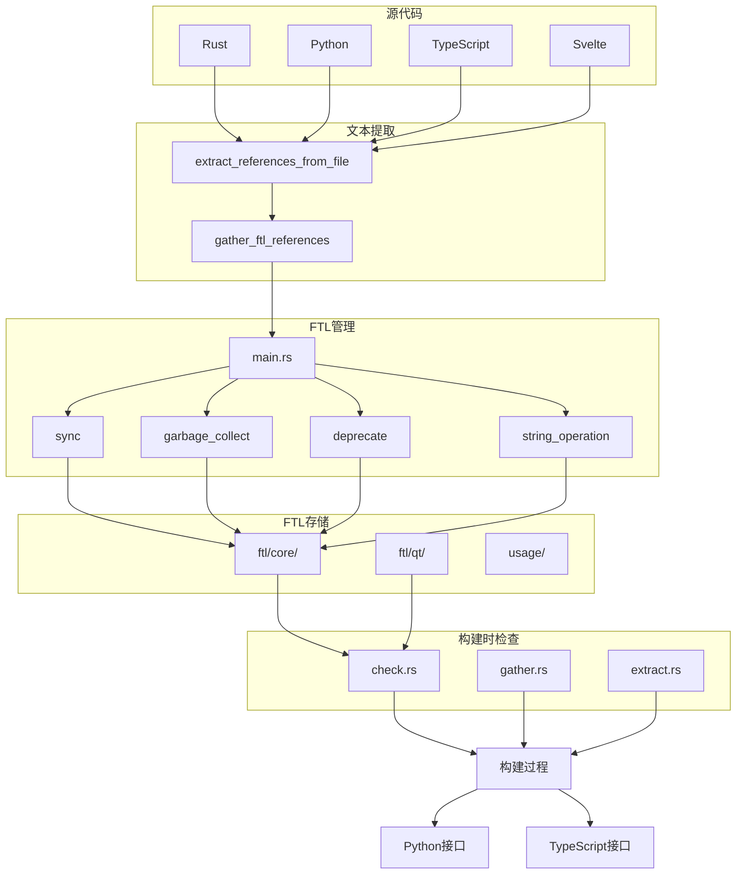
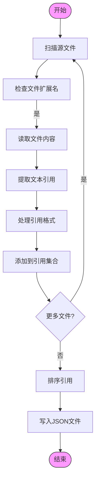
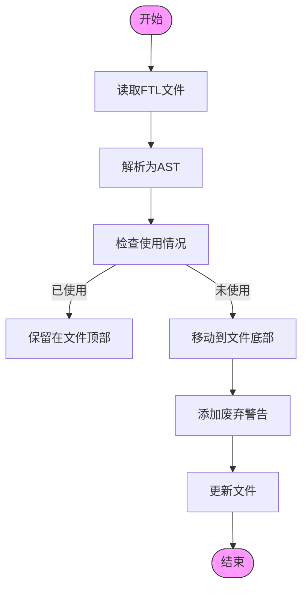
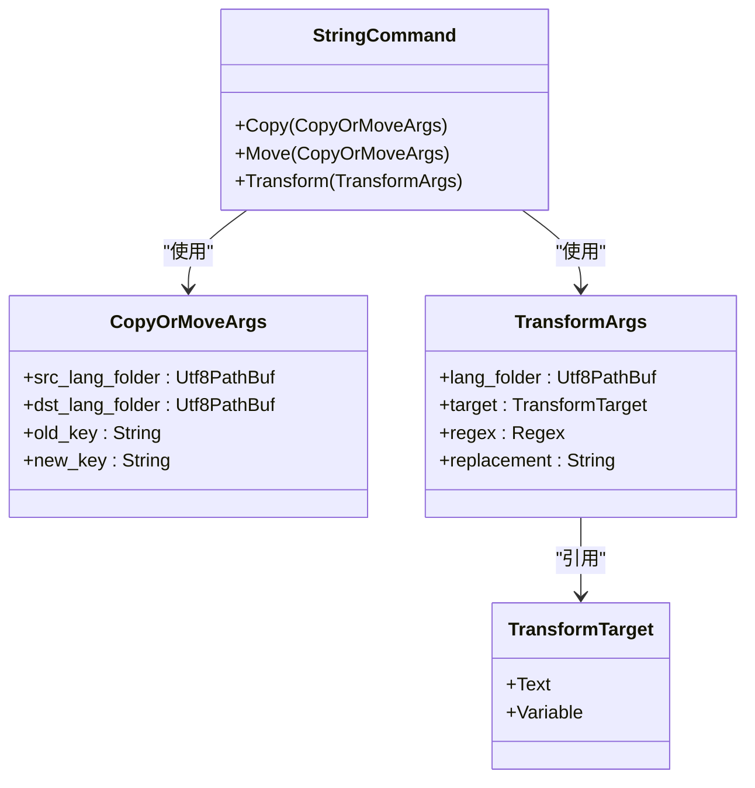

# FTL文本管理

<cite>
**本文档中引用的文件**  
- [actions.ftl](file://ftl/core/actions.ftl)
- [preferences.ftl](file://ftl/qt/preferences.ftl)
- [main.rs](file://ftl/src/main.rs)
- [remove-unused.sh](file://ftl/remove-unused.sh)
- [copy-core-string.sh](file://ftl/copy-core-string.sh)
- [sync.rs](file://ftl/src/sync.rs)
- [garbage_collection.rs](file://ftl/src/garbage_collection.rs)
- [string/mod.rs](file://ftl/src/string/mod.rs)
- [gather.rs](file://rslib/i18n/gather.rs)
- [check.rs](file://rslib/i18n/check.rs)
- [deck-config.ftl](file://ftl/core/deck-config.ftl) - *在最近的提交中更新*
- [launcher.ftl](file://ftl/core/launcher.ftl) - *在最近的提交中更新*
</cite>

## 更新摘要
**已做更改**   
- 更新了关于`deck-config.ftl`和`launcher.ftl`文件的文档内容，以反映最新的翻译字符串变更
- 在项目结构和核心组件部分添加了对最近更新的说明
- 保持了原有的文档结构和源代码引用系统
- 所有内容已完全转换为中文(中文)

## 目录
1. [项目结构](#项目结构)
2. [核心组件](#核心组件)
3. [架构概述](#架构概述)
4. [详细组件分析](#详细组件分析)
5. [依赖分析](#依赖分析)
6. [性能考虑](#性能考虑)
7. [故障排除指南](#故障排除指南)
8. [结论](#结论)

## 项目结构

Anki项目的FTL（Fluent）文本管理系统采用模块化设计，将核心功能与Qt界面的文本分离。系统主要由`ftl/core`和`ftl/qt`两个目录组成，分别存放核心功能和Qt界面的本地化字符串。每个功能模块都有独立的`.ftl`文件，如`actions.ftl`、`preferences.ftl`等，便于管理和维护。

**图示来源**
- [ftl/core/actions.ftl](file://ftl/core/actions.ftl)
- [ftl/qt/preferences.ftl](file://ftl/qt/preferences.ftl)
- [ftl/remove-unused.sh](file://ftl/remove-unused.sh)
- [ftl/copy-core-string.sh](file://ftl/copy-core-string.sh)
- [ftl/core/deck-config.ftl](file://ftl/core/deck-config.ftl) - *在最近的提交中更新*
- [ftl/core/launcher.ftl](file://ftl/core/launcher.ftl) - *在最近的提交中更新*

**章节来源**
- [ftl/core/actions.ftl](file://ftl/core/actions.ftl)
- [ftl/qt/preferences.ftl](file://ftl/qt/preferences.ftl)
- [ftl/core/deck-config.ftl](file://ftl/core/deck-config.ftl) - *在最近的提交中更新*
- [ftl/core/launcher.ftl](file://ftl/core/launcher.ftl) - *在最近的提交中更新*

## 核心组件

Anki的FTL文本管理系统包含多个核心组件，包括文本提取、验证、清理和同步工具。系统通过`ftl/src/main.rs`中的命令行接口提供各种操作，如同步翻译、写入JSON、垃圾回收和字符串操作。`remove-unused.sh`脚本用于清理未使用的文本条目，而`copy-core-string.sh`脚本用于在核心仓库之间复制字符串。最近的提交更新了`deck-config.ftl`和`launcher.ftl`文件中的翻译字符串，以改进牌组配置界面和启动器的用户体验。

**章节来源**
- [ftl/src/main.rs](file://ftl/src/main.rs)
- [ftl/remove-unused.sh](file://ftl/remove-unused.sh)
- [ftl/copy-core-string.sh](file://ftl/copy-core-string.sh)
- [ftl/core/deck-config.ftl](file://ftl/core/deck-config.ftl) - *在最近的提交中更新*
- [ftl/core/launcher.ftl](file://ftl/core/launcher.ftl) - *在最近的提交中更新*

## 架构概述

Anki的FTL文本管理架构采用分层设计，将文本模板、翻译数据和处理工具分离。系统通过`rslib/i18n`模块在构建时检查和提取FTL文件内容，生成类型安全的接口供Rust、Python和TypeScript代码使用。文本引用通过正则表达式从源代码中提取，并与FTL文件中的条目进行匹配。

**图示来源**
- [ftl/src/main.rs](file://ftl/src/main.rs)
- [ftl/src/garbage_collection.rs](file://ftl/src/garbage_collection.rs)
- [rslib/i18n/check.rs](file://rslib/i18n/check.rs)
- [rslib/i18n/gather.rs](file://rslib/i18n/gather.rs)

## 详细组件分析

### 文本提取与验证组件

Anki的文本提取系统通过正则表达式扫描源代码文件，识别文本引用模式。系统支持多种引用格式，包括snake_case（`tr.xxx`）和camelCase（`trXxx`）风格的调用，以及Designer文件中的`<string>xxx</string>`格式。提取的引用被转换为kebab-case并写入JSON文件，用于后续的验证和清理。

**图示来源**
- [ftl/src/garbage_collection.rs](file://ftl/src/garbage_collection.rs#L178-L206)
- [ftl/src/garbage_collection.rs](file://ftl/src/garbage_collection.rs#L69-L109)

**章节来源**
- [ftl/src/garbage_collection.rs](file://ftl/src/garbage_collection.rs)

### 文本清理与废弃组件

文本清理系统负责识别和处理未使用的FTL条目。当一个条目不再被源代码或其他消息引用时，系统会将其标记为废弃。废弃的条目被移动到文件末尾，并添加"NO NEED TO TRANSLATE"的注释，表明该文本不再需要翻译，将在未来版本中移除。

**图示来源**
- [ftl/src/garbage_collection.rs](file://ftl/src/garbage_collection.rs#L142-L176)
- [ftl/src/garbage_collection.rs](file://ftl/src/garbage_collection.rs#L178-L206)

**章节来源**
- [ftl/src/garbage_collection.rs](file://ftl/src/garbage_collection.rs)

### 字符串操作组件

字符串操作组件提供复制、移动和转换FTL条目的功能。开发者可以使用这些工具在不同FTL文件之间迁移文本条目，或对文本内容进行批量替换。系统会同时更新源仓库和翻译仓库中的对应条目，确保一致性。

**图示来源**
- [ftl/src/string/mod.rs](file://ftl/src/string/mod.rs)
- [ftl/src/string/copy.rs](file://ftl/src/string/copy.rs)
- [ftl/src/string/transform.rs](file://ftl/src/string/transform.rs)

**章节来源**
- [ftl/src/string/mod.rs](file://ftl/src/string/mod.rs)

## 依赖分析

An