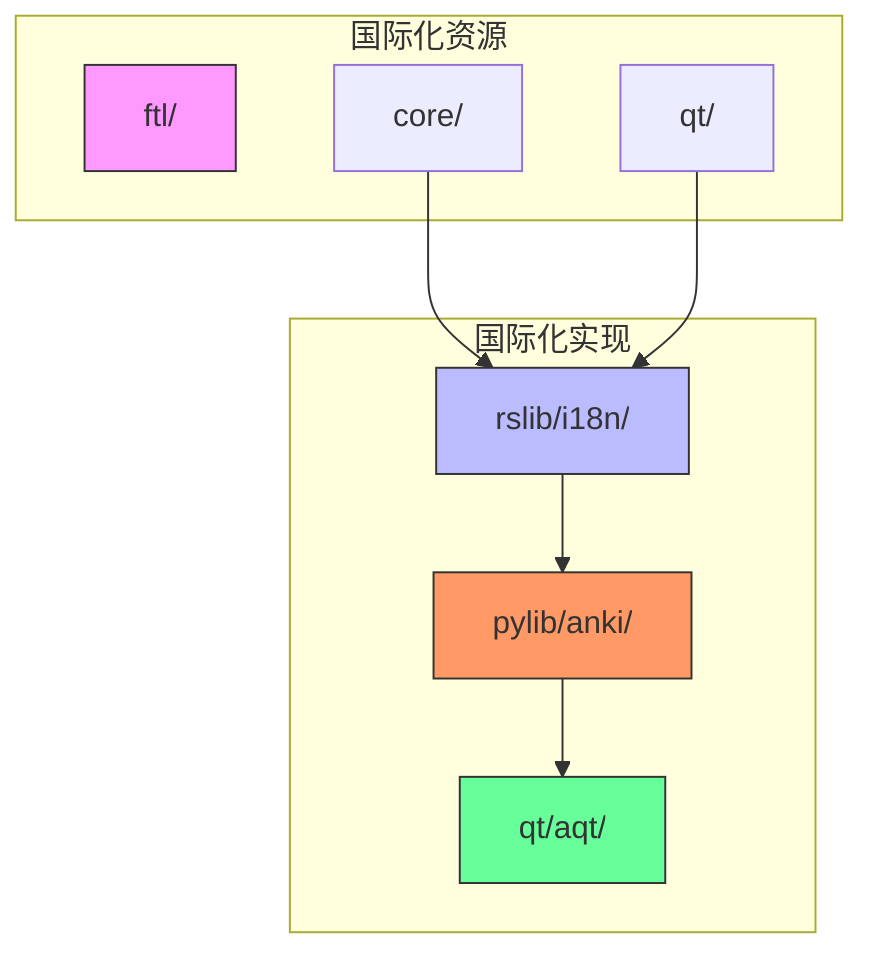
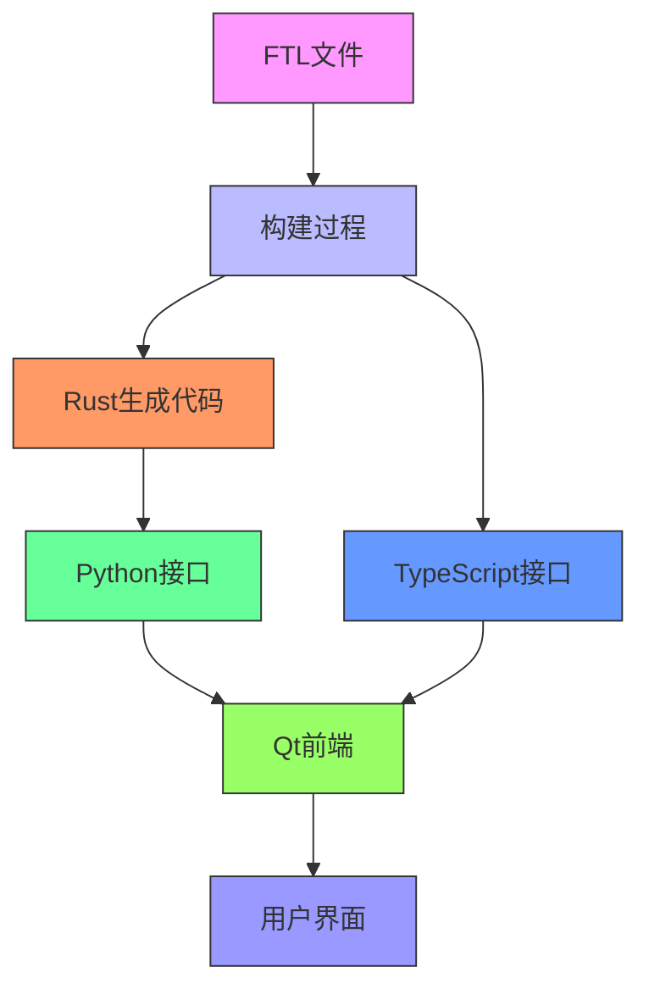
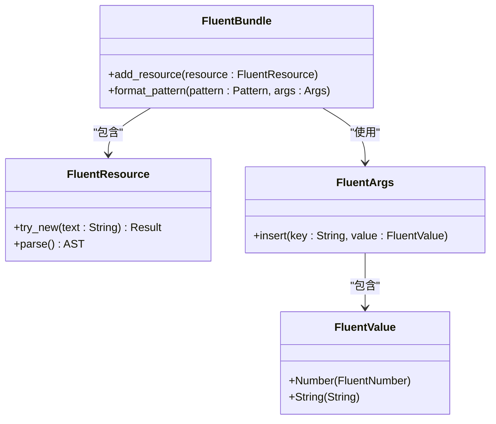
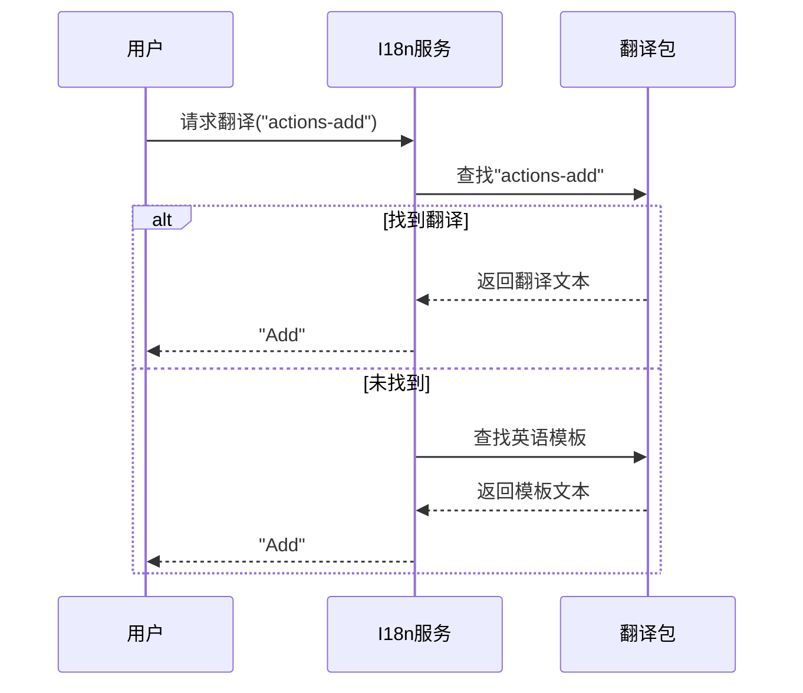
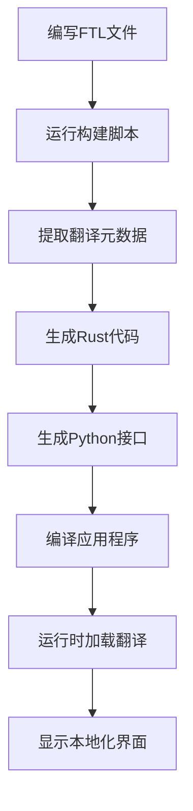
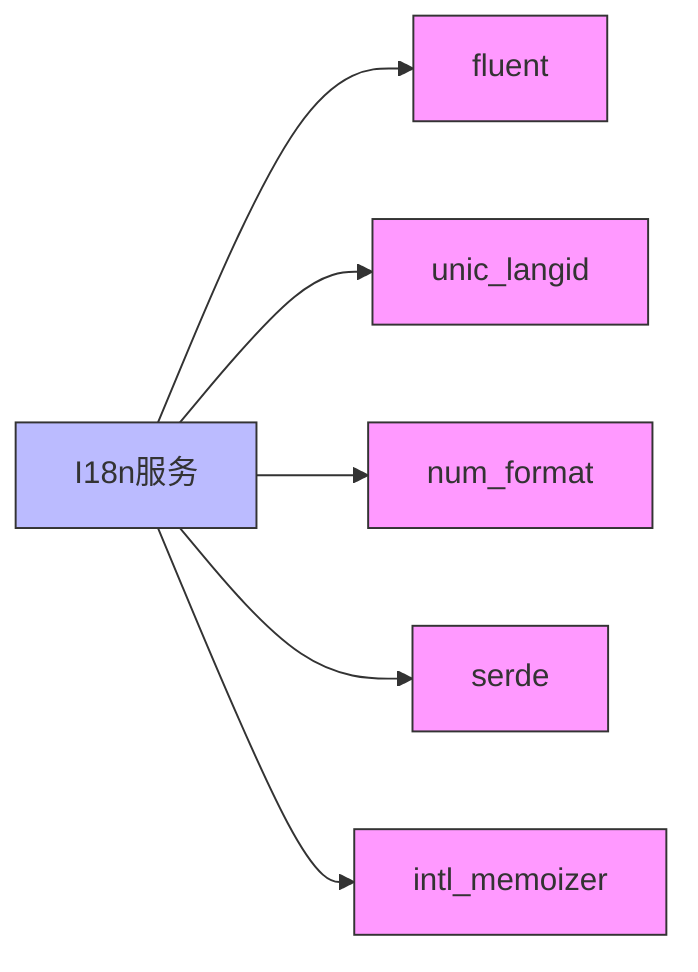

# 国际化系统

<cite>
**本文档中引用的文件**   
- [actions.ftl](file://ftl/core/actions.ftl)
- [preferences.ftl](file://ftl/qt/preferences.ftl)
- [lib.rs](file://rslib/i18n/src/lib.rs)
- [generated.rs](file://rslib/i18n/src/generated.rs)
- [build.rs](file://rslib/i18n/build.rs)
- [extract.rs](file://rslib/i18n/extract.rs)
- [lang.py](file://pylib/anki/lang.py)
- [main.py](file://qt/aqt/main.py)
- [utils.py](file://qt/aqt/utils.py)
</cite>

## 目录
1. [简介](#简介)
2. [项目结构](#项目结构)
3. [核心组件](#核心组件)
4. [架构概述](#架构概述)
5. [详细组件分析](#详细组件分析)
6. [依赖分析](#依赖分析)
7. [性能考虑](#性能考虑)
8. [故障排除指南](#故障排除指南)
9. [结论](#结论)

## 简介
Anki的国际化系统基于Fluent文本管理机制，为多语言支持提供了一套完整的解决方案。该系统通过FTL（Fluent Translation List）文件管理所有用户界面文本，实现了高效的文本提取、翻译和集成流程。本系统不仅支持前端和后端组件的无缝集成，还为开发者提供了清晰的本地化工作流程。

## 项目结构
Anki的国际化系统分布在多个目录中，每个目录都有特定的职责。核心翻译文件位于`ftl`目录下，而Rust实现的国际化逻辑位于`rslib/i18n`目录中。Python层的国际化支持则在`pylib/anki`目录中实现，Qt前端的集成在`qt/aqt`目录中完成。

**图示来源**
- [ftl/core/actions.ftl](file://ftl/core/actions.ftl)
- [rslib/i18n/src/lib.rs](file://rslib/i18n/src/lib.rs)
- [pylib/anki/lang.py](file://pylib/anki/lang.py)
- [qt/aqt/main.py](file://qt/aqt/main.py)

**章节来源**
- [ftl/core/actions.ftl](file://ftl/core/actions.ftl)
- [rslib/i18n/src/lib.rs](file://rslib/i18n/src/lib.rs)
- [pylib/anki/lang.py](file://pylib/anki/lang.py)
- [qt/aqt/main.py](file://qt/aqt/main.py)

## 核心组件
Anki的国际化系统由几个核心组件构成：FTL文本管理器、Rust后端国际化服务、Python层接口和Qt前端集成。FTL文件按功能模块组织，如核心功能、Qt界面等，每个模块包含特定领域的翻译字符串。Rust实现的国际化服务负责解析FTL文件、管理语言包和提供翻译API。

**章节来源**
- [ftl/core/actions.ftl](file://ftl/core/actions.ftl)
- [rslib/i18n/src/lib.rs](file://rslib/i18n/src/lib.rs)
- [pylib/anki/lang.py](file://pylib/anki/lang.py)

## 架构概述
Anki的国际化架构采用分层设计，从底层的FTL文件到上层的用户界面，形成了清晰的数据流。系统首先通过构建脚本提取和处理FTL文件，生成Rust和Python接口，然后在运行时根据用户选择的语言加载相应的翻译资源。

**图示来源**
- [rslib/i18n/build.rs](file://rslib/i18n/build.rs)
- [rslib/i18n/extract.rs](file://rslib/i18n/extract.rs)
- [rslib/i18n/src/generated.rs](file://rslib/i18n/src/generated.rs)
- [pylib/anki/lang.py](file://pylib/anki/lang.py)

## 详细组件分析

### FTL文本管理机制
Anki使用Fluent Translation List（FTL）格式管理所有用户界面文本。这种格式支持复杂的语言特性，如变量插值、复数形式和选择表达式。FTL文件按功能模块组织，便于维护和翻译。

**图示来源**
- [rslib/i18n/src/lib.rs](file://rslib/i18n/src/lib.rs)
- [ftl/core/actions.ftl](file://ftl/core/actions.ftl)

**章节来源**
- [rslib/i18n/src/lib.rs](file://rslib/i18n/src/lib.rs)
- [ftl/core/actions.ftl](file://ftl/core/actions.ftl)

### 多语言支持实现
Anki的多语言支持通过I18n结构体实现，该结构体管理多个语言环境的翻译包。系统优先尝试加载用户指定的语言，如果找不到则回退到英语模板。这种设计确保了即使某些翻译缺失，用户界面仍然可用。

**图示来源**
- [rslib/i18n/src/lib.rs](file://rslib/i18n/src/lib.rs)
- [pylib/anki/lang.py](file://pylib/anki/lang.py)

**章节来源**
- [rslib/i18n/src/lib.rs](file://rslib/i18n/src/lib.rs)
- [pylib/anki/lang.py](file://pylib/anki/lang.py)

### 本地化流程
Anki的本地化流程包括文本提取、翻译和集成三个主要阶段。构建系统自动从FTL文件中提取文本，生成相应的代码接口，然后在运行时集成到应用程序中。

**图示来源**
- [rslib/i18n/build.rs](file://rslib/i18n/build.rs)
- [rslib/i18n/extract.rs](file://rslib/i18n/extract.rs)
- [rslib/i18n/src/generated.rs](file://rslib/i18n/src/generated.rs)

**章节来源**
- [rslib/i18n/build.rs](file://rslib/i18n/build.rs)
- [rslib/i18n/extract.rs](file://rslib/i18n/extract.rs)

## 依赖分析
Anki的国际化系统依赖于多个外部库和内部组件。主要依赖包括fluent库用于解析FTL文件，unic_langid用于处理语言标识符，以及num_format用于数字格式化。

**图示来源**
- [rslib/i18n/src/lib.rs](file://rslib/i18n/src/lib.rs)
- [Cargo.toml](file://Cargo.toml)

## 性能考虑
Anki的国际化系统在设计时考虑了性能因素。翻译包在启动时一次性加载并缓存，避免了运行时的重复解析。数字格式化等操作也进行了优化，确保在频繁调用时仍能保持良好的性能。

## 故障排除指南
当遇到国际化相关问题时，可以检查以下几个方面：确保FTL文件语法正确，验证语言代码是否支持，检查构建过程是否成功生成了代码文件。对于翻译缺失的问题，系统会自动回退到英语模板，确保基本功能可用。

**章节来源**
- [rslib/i18n/check.rs](file://rslib/i18n/check.rs)
- [rslib/i18n/src/lib.rs](file://rslib/i18n/src/lib.rs)

## 结论
Anki的国际化系统通过FTL文本管理和分层架构，为多语言支持提供了强大而灵活的解决方案。该系统不仅实现了高效的本地化流程，还确保了良好的性能和可维护性。对于初学者，系统提供了清晰的文档和示例；对于经验丰富的开发者，则提供了深入的定制选项和高级功能。