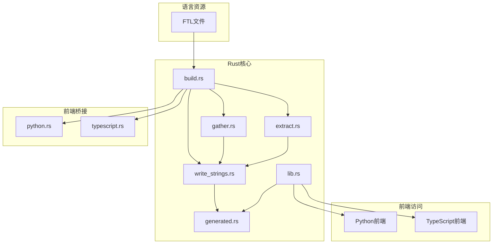
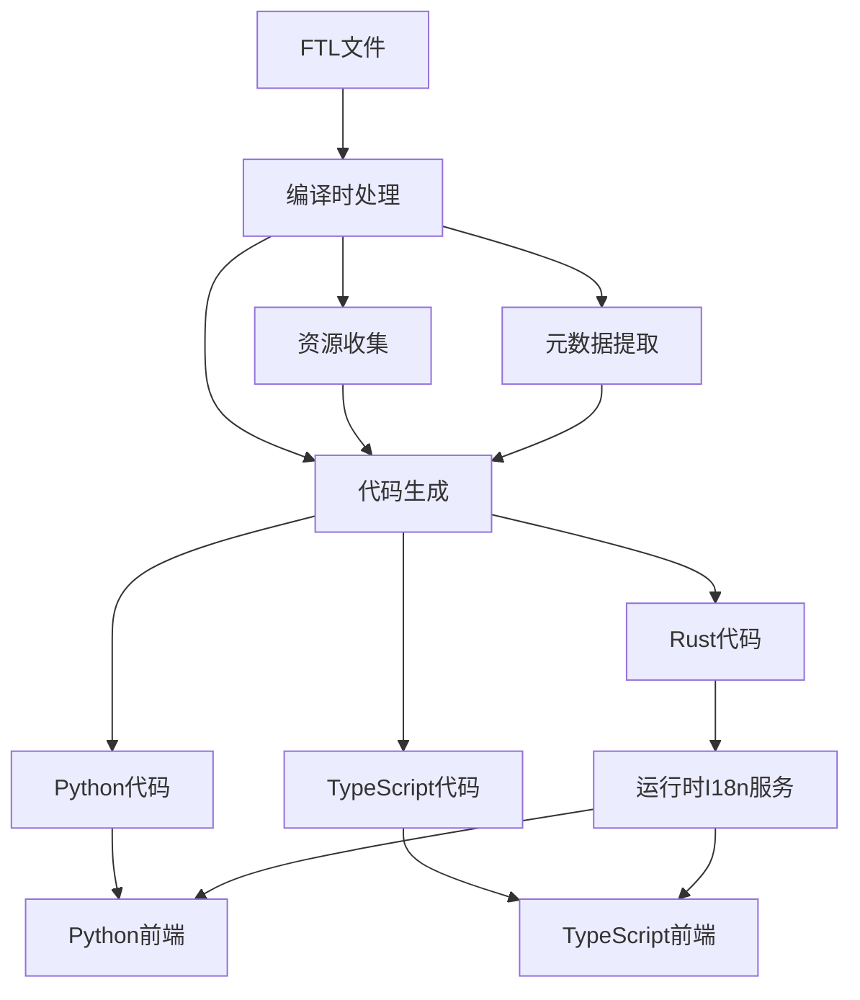
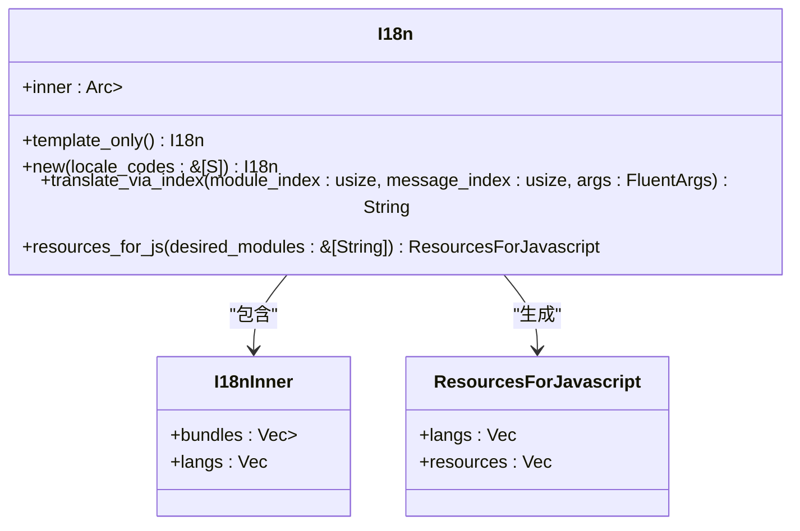
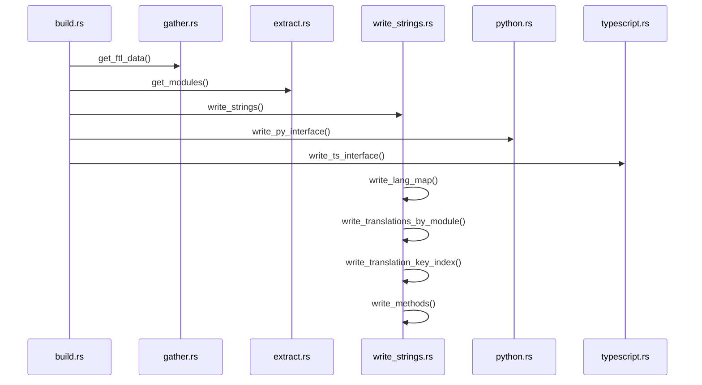
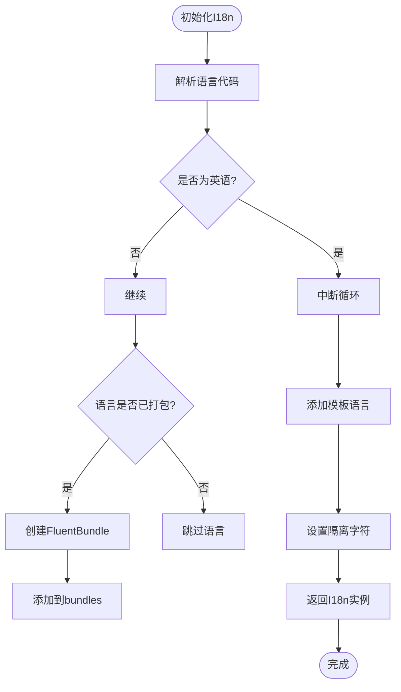

# 多语言支持实现

<cite>
**本文档引用的文件**
- [lib.rs](file://rslib/i18n/src/lib.rs)
- [build.rs](file://rslib/i18n/build.rs)
- [generated.rs](file://rslib/i18n/src/generated.rs)
- [gather.rs](file://rslib/i18n/gather.rs)
- [extract.rs](file://rslib/i18n/extract.rs)
- [write_strings.rs](file://rslib/i18n/write_strings.rs)
- [python.rs](file://rslib/i18n/python.rs)
- [typescript.rs](file://rslib/i18n/typescript.rs)
- [_backend.py](file://pylib/anki/_backend.py)
- [i18n.py](file://pylib/anki/lang.py)
</cite>

## 目录
1. [简介](#简介)
2. [项目结构](#项目结构)
3. [核心组件](#核心组件)
4. [架构概述](#架构概述)
5. [详细组件分析](#详细组件分析)
6. [依赖分析](#依赖分析)
7. [性能考虑](#性能考虑)
8. [故障排除指南](#故障排除指南)
9. [结论](#结论)

## 简介
Anki的多语言支持系统通过一套完整的国际化(i18n)架构实现，该架构基于Fluent本地化框架。系统设计旨在为Rust核心、Python前端和TypeScript前端提供统一的本地化文本访问接口。本系统通过编译时生成和运行时加载相结合的策略，确保了高效的本地化文本管理和访问。

## 项目结构
Anki的多语言支持系统主要由rslib/i18n模块、ftl资源文件和前端桥接层组成。系统采用分层架构，将语言资源的定义、处理和访问分离。



**图示来源**
- [build.rs](file://rslib/i18n/build.rs#L1-L45)
- [gather.rs](file://rslib/i18n/gather.rs#L1-L78)
- [extract.rs](file://rslib/i18n/extract.rs#L1-L191)
- [write_strings.rs](file://rslib/i18n/write_strings.rs#L1-L228)

**章节来源**
- [rslib/i18n](file://rslib/i18n)

## 核心组件
多语言支持系统的核心组件包括语言资源管理、编译时代码生成和运行时本地化服务。系统通过I18n结构体提供统一的翻译接口，支持按模块和消息索引进行翻译。

**章节来源**
- [lib.rs](file://rslib/i18n/src/lib.rs#L1-L540)
- [generated.rs](file://rslib/i18n/src/generated.rs#L1-L8)

## 架构概述
Anki的多语言支持架构采用编译时生成和运行时加载相结合的策略。系统在编译时从FTL文件提取翻译字符串，生成Rust、Python和TypeScript代码，然后在运行时通过I18n服务提供翻译功能。



**图示来源**
- [build.rs](file://rslib/i18n/build.rs#L1-L45)
- [gather.rs](file://rslib/i18n/gather.rs#L1-L78)
- [extract.rs](file://rslib/i18n/extract.rs#L1-L191)
- [write_strings.rs](file://rslib/i18n/write_strings.rs#L1-L228)

## 详细组件分析

### rslib/i18n模块分析
rslib/i18n模块是Anki多语言支持的核心，负责管理所有本地化文本的生成和访问。

#### 架构设计


**图示来源**
- [lib.rs](file://rslib/i18n/src/lib.rs#L1-L540)

#### 编译时生成机制


**图示来源**
- [build.rs](file://rslib/i18n/build.rs#L1-L45)
- [gather.rs](file://rslib/i18n/gather.rs#L1-L78)
- [extract.rs](file://rslib/i18n/extract.rs#L1-L191)
- [write_strings.rs](file://rslib/i18n/write_strings.rs#L1-L228)

#### 运行时加载策略


**图示来源**
- [lib.rs](file://rslib/i18n/src/lib.rs#L1-L540)

**章节来源**
- [lib.rs](file://rslib/i18n/src/lib.rs#L1-L540)
- [build.rs](file://rslib/i18n/build.rs#L1-L45)
- [gather.rs](file://rslib/i18n/gather.rs#L1-L78)
- [extract.rs](file://rslib/i18n/extract.rs#L1-L191)
- [write_strings.rs](file://rslib/i18n/write_strings.rs#L1-L228)

### 前端桥接层分析
前端桥接层负责将Rust核心的本地化功能暴露给Python和TypeScript前端。

#### Python桥接实现
```mermaid
classDiagram
    class GeneratedTranslations {
        +_translate(module: int, translation: int, args: dict) str
    }
    
    class LegacyTranslationEnum {
        +TRANSLATION_KEY = (module_index, translation_index)
    }
    
    class RustBackend {
        +translate(module_index: int, message_index: int, **kwargs) str
    }
    
    GeneratedTranslations